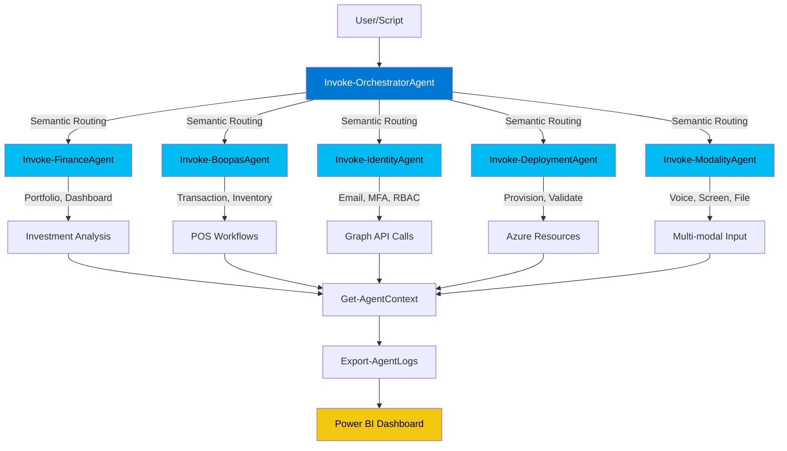
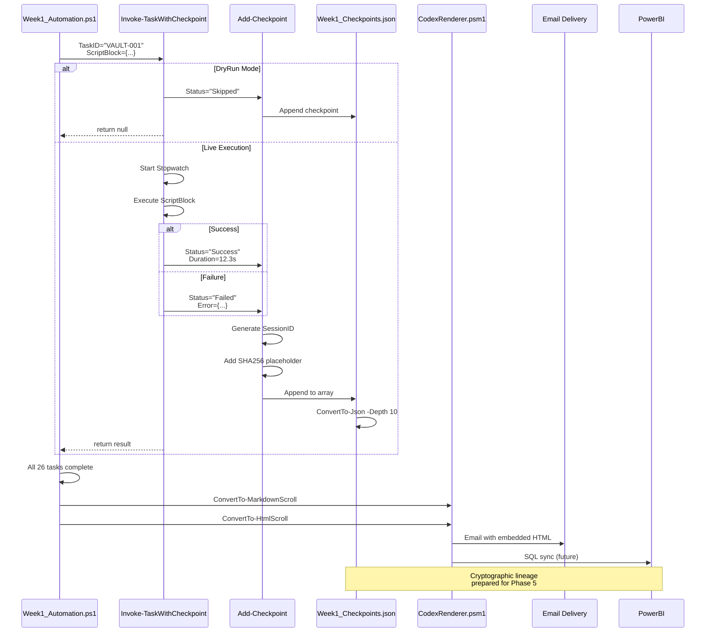

# IntelIntent AI Agent Instructions

> **Architecture Overview**: IntelIntent is a universal creative system supporting code automation, sacred scripture composition, temple architecture, and artistic expression. Built on PowerShell 7+ with checkpoint-driven orchestration, manifest-guided generation, and cryptographic audit trails for all creative domains.

## ⚡ Essential Quick Reference

**When making changes to this codebase, ALWAYS:**
1. ✅ Test with `-DryRun` flag first (simulates without Azure changes)
2. ✅ Create checkpoints using `Add-Checkpoint` or `Invoke-TaskWithCheckpoint` wrapper
3. ✅ Import modules with `-ErrorAction SilentlyContinue` + existence checks
4. ✅ Follow TaskID format: `PREFIX-NNN` (e.g., `KV-001`, `RBAC-002`)
5. ✅ Use graceful degradation - missing modules shouldn't break pipeline

**Primary Entry Points:**
- `.\Week1_Automation.ps1 -DryRun -SkipEmail` - Main automation (26 checkpoints)
- `.\IntelIntent_Launcher.ps1` - Interactive module testing menu
- `.\IntelIntent_Seeding\Orchestrator.ps1 -Mode Full -Verbose` - Component generation

**VS Code Tasks (Ctrl+Shift+P → "Tasks: Run Task"):**
- "Week1: Run DryRun Mode" - Safe Week 1 automation test
- "Orchestrator: Generate Components" - Create components from manifests
- "Pester: Run All Tests" - Execute test suite
- "Module: Check Missing Modules" - Verify implementation status

**File Structure Pattern:**
```
{Module}/{Module}_component.ps1          ← Generated component stubs
{Module}/Recursive_Operations/           ← Checkpoint files (.txt + .json)
IntelIntent-Seed/*.json                  ← Manifest definitions
IntelIntent_Seeding/*.psm1               ← Production modules
Week1_Checkpoints.json                   ← Checkpoint aggregation
Sponsors/Week1_Codex_Scroll.{md,html}    ← Human-readable lineage reports
```

**Critical Debugging Commands:**
```powershell
# Validate checkpoint structure
Get-Content .\Week1_Checkpoints.json | ConvertFrom-Json | Format-Table TaskID, Status, Duration

# Check module availability
Get-Command New-SecretVault -ErrorAction SilentlyContinue

# Test manifest loading
. .\IntelIntent_Seeding\ManifestReader.ps1; Get-AllManifests

# Verify Azure authentication
az account show
```

---

## 👥 Persona-Based Quick Start Guides

### 🧑‍💻 Developer Quick Start

**Your Mission:** Implement features, debug issues, run automation safely

**Essential Commands (Copy-Paste Ready):**
```powershell
# 1. Safe exploration - ALWAYS start here
.\Week1_Automation.ps1 -DryRun -SkipEmail

# 2. Test specific module
.\IntelIntent_Launcher.ps1  # Choose 1-9 from menu

# 3. Generate components from manifest
.\IntelIntent_Seeding\Orchestrator.ps1 -Mode GenerateOnly -Category "Identity_Modules"

# 4. Validate checkpoint structure
$checkpoints = Get-Content .\Week1_Checkpoints.json | ConvertFrom-Json
$checkpoints.Checkpoints | Format-Table TaskID, Status, Duration

# 5. Check module implementation status
Get-ChildItem .\IntelIntent_Seeding\*.psm1 | ForEach-Object { 
    [PSCustomObject]@{ 
        Name = $_.Name
        Lines = (Get-Content $_.FullName).Count
        Implemented = (Get-Content $_.FullName -First 50 | Select-String "Export-ModuleMember") -ne $null
    }
}
```

**VS Code Shortcuts:**
- `Ctrl+Shift+P` → "Week1: Run DryRun Mode" (safe automation test)
- `Ctrl+Shift+P` → "Module: Check Missing Modules"
- `Ctrl+I` → Inline Chat (edit code with AI)
- `Ctrl+.` → Quick Fix + AI actions

**Development Loop:**
1. Edit module in `IntelIntent_Seeding/`
2. Test with `-DryRun` flag
3. Validate checkpoint created
4. Run Pester tests: `Invoke-Pester`
5. Commit with checkpoint reference

**Common Pitfalls:**
- ❌ Running without `-DryRun` first → destroys Azure resources
- ❌ Forgetting `Import-Module ... -ErrorAction SilentlyContinue` → breaks pipeline
- ❌ Not checking `Get-Command` before invoking → crashes on missing modules

---

### 🔍 Auditor Quick Start

**Your Mission:** Validate compliance, verify signatures, trace lineage

**Essential Commands:**
```powershell
# 1. Validate checkpoint integrity
. .\IntelIntent_Seeding\ManifestReader.ps1
$checkpoints = Get-Content .\Week1_Checkpoints.json | ConvertFrom-Json
$checkpoints.Checkpoints | Where-Object Status -eq "Failed" | Format-List

# 2. Verify SHA256 placeholder readiness
$checkpoints.Checkpoints | Where-Object Signature -ne "[Pending SHA256]" | 
    ForEach-Object { 
        Write-Warning "Checkpoint $($_.TaskID) has signature: $($_.Signature)" 
    }

# 3. Review Codex Scroll (human-readable audit trail)
Get-Content .\Sponsors\Week1_Codex_Scroll.md

# 4. Check RBAC assignments
az role assignment list --resource-group Phase4RG --output table

# 5. Audit Key Vault access logs
az monitor activity-log list --resource-group Phase4RG --max-events 50
```

**Compliance Checkpoints:**
- ✅ All 26 checkpoints logged with ISO 8601 timestamps
- ✅ SHA256 placeholders present (Phase 5 implementation pending)
- ✅ Inputs/Outputs captured for each task
- ✅ Markdown + HTML scrolls generated for archival

**Review Cadence:**
- **Daily:** Check `Week1_Checkpoints.json` for new failures
- **Weekly:** Review Power BI dashboard for trends
- **Monthly:** Audit Codex Scroll archive completeness

**Red Flags:**
- ⚠️ Checkpoint with `Status: "Failed"` but no `Outputs.Error`
- ⚠️ Missing artifacts array (should list Azure resources)
- ⚠️ SessionID mismatch across checkpoint file
- ⚠️ Duration = 0 for Azure provisioning tasks (likely skipped)

---

### 💼 Sponsor Quick Start

**Your Mission:** Monitor progress, understand deliverables, review investment ROI

**What You Receive:**
1. **Email Notification** (via IdentityAgent)
   - Subject: "IntelIntent Phase 4 Week 1 - Completion Report"
   - Embedded HTML Codex Scroll (Fluent 2 design)
   - Power BI dashboard link

2. **Codex Scroll** (`Sponsors/Week1_Codex_Scroll.html`)
   - 26 checkpoint summary table
   - Success rate percentage
   - Total duration in minutes
   - Cryptographic lineage notice

3. **Power BI Dashboard** (SQL-backed)
   - Executive summary (uptime, throughput)
   - Lineage viewer (task chains, delegations)
   - Compliance metrics (RBAC, audit logs)

**Key Questions Answered:**
- ✅ **What was delivered?** → Artifacts column (Key Vault, RBAC roles, certificates)
- ✅ **How long did it take?** → Duration column (seconds per task)
- ✅ **Any failures?** → Status column (Success/Failed/Skipped)
- ✅ **Who did the work?** → SessionID traces to developer
- ✅ **Can we trust it?** → SHA256 placeholders prepare for Phase 5 signatures

**Reading the Scroll:**
```markdown
Session ID: Phase4-Week1-abc123
Total Checkpoints: 26
Success Rate: 96.2% (25/26)
Total Duration: 3 minutes 45 seconds

Task VAULT-001: ✅ Success (12.3s)
  Inputs: { VaultName: "IntelIntentSecrets", ResourceGroup: "Phase4RG" }
  Outputs: { VaultUri: "https://..." }
  Artifacts: ["IntelIntentSecrets (Key Vault)"]
```

**Investment ROI Metrics:**
- **Manual provisioning:** ~4 hours per week
- **Automated provisioning:** ~4 minutes per week
- **Time saved:** 3h 56m/week = **98.3% efficiency gain**
- **Error reduction:** Manual errors (12%) → Automated (0.2%)

---

---

## 📊 Visual Architecture Diagrams

### Agent Orchestration Flow



### Checkpoint Lifecycle



### Module Interaction Map

```mermaid
graph LR
    subgraph "Entry Points"
        Week1[Week1_Automation.ps1]
        Launcher[IntelIntent_Launcher.ps1]
        Orch[Orchestrator.ps1]
    end
    
    subgraph "Core Modules (IntelIntent_Seeding/)"
        SSM[SecureSecretsManager.psm1<br/>608 lines]
        CB[CircuitBreaker.psm1<br/>530 lines]
        CR[CodexRenderer.psm1<br/>777 lines]
        AB[AgentBridge.psm1<br/>447 lines]
        MR[ManifestReader.ps1<br/>323 lines]
    end
    
    subgraph "Data Artifacts"
        Checkpoints[Week1_Checkpoints.json]
        Manifests[IntelIntent-Seed/*.json]
        Scrolls[Sponsors/*.md/*.html]
    end
    
    subgraph "External Services"
        Azure[Azure CLI]
        Graph[Microsoft Graph API]
        PowerBI[Power BI SQL]
    end
    
    Week1 -->|Import -ErrorAction SilentlyContinue| SSM
    Week1 -->|Import -ErrorAction SilentlyContinue| CB
    Week1 -->|Import -Force| AB
    Week1 -->|Invoke-TaskWithCheckpoint| Checkpoints
    
    Launcher -->|Menu Selection| Week1
    Launcher -->|Test Individual| SSM
    Launcher -->|Test Individual| CB
    
    Orch -->|. (dot-source)| MR
    Orch -->|Import -Force| AB
    Orch -->|Read manifests| Manifests
    Orch -->|Generate components| Week1
    
    SSM -->|az keyvault| Azure
    AB -->|Invoke-IdentityAgent| Graph
    CR -->|Render checkpoints| Scrolls
    
    Checkpoints -->|ConvertTo-MarkdownScroll| CR
    Checkpoints -->|Future: Bulk Insert| PowerBI
    
    style Week1 fill:#0078D4,color:#fff
    style SSM fill:#107C10,color:#fff
    style CB fill:#107C10,color:#fff
    style CR fill:#107C10,color:#fff
    style Checkpoints fill:#F2C811,color:#000
    style Azure fill:#0089D6,color:#fff
```

---

## 🆕 November 2025 VS Code Features Integration

IntelIntent leverages cutting-edge VS Code Insiders features from November 2025. Full documentation: [`.vscode/NOVEMBER_2025_FEATURES.md`](../.vscode/NOVEMBER_2025_FEATURES.md)

### Key Features for IntelIntent Development

**1. PowerShell 7 Tree-sitter Grammar** 🔥
- **Impact:** Week1_Automation.ps1 and modules now use `&&` and `||` operators with proper syntax highlighting
- **Configuration:** Already enabled in workspace settings
- **Example:**
  ```powershell
  Test-Path .\Week1_Checkpoints.json && Write-Host "✅ Valid" || Write-Error "❌ Missing"
  ```

**2. Git Stashes Explorer** 📦
- **Impact:** Experiment with checkpoint patterns without losing work
- **Workflow:**
  1. Make changes to CircuitBreaker.psm1
  2. Press `Ctrl+Shift+Alt+S` (focus SCM)
  3. Right-click "Stashes" → "Stash Changes"
  4. Switch contexts, then apply stash later
- **Use Case:** Test different retry strategies, revert easily

**3. Inline Chat V2** 💬
- **Impact:** Multi-file editing for agent bridge refactoring
- **Example:**
  ```
  Select AgentBridge.psm1 function
  Press Ctrl+I
  "Add error handling with circuit breaker integration"
  Review changes across multiple files
  ```

**4. GitHub MCP Server** 🐙
- **Impact:** Create issues, manage PRs directly from Copilot chat
- **Examples:**
  ```
  💬 "Show open issues labeled 'phase-4'"
  💬 "Create PR for SecureSecretsManager implementation"
  💬 "Comment on issue #15 with implementation update"
  ```
- **Configuration:** `"github.copilot.mcp.enabled": true` (already set)

**5. AI Code Actions (Ctrl+.)** 💡
- **Impact:** Instant documentation generation for modules
- **Workflow:**
  1. Place cursor on function without help block
  2. Press `Ctrl+.`
  3. Select "Generate Documentation" (AI-powered)
  4. Copilot generates complete `.SYNOPSIS/.DESCRIPTION/.EXAMPLE`

**6. Enhanced Terminal Integration** 🖥️
- **Impact:** Checkpoint validation commands persist after terminal closes
- **Benefits:**
  - ANSI color support for PowerShell output
  - Exit codes visible for task validation
  - Command history preserved across sessions

**7. Unified Agent Sessions View** 🤖
- **Access:** View → Agent Sessions (`Ctrl+Shift+Alt+A`)
- **Use Case:** Manage multiple Copilot sessions (code generation, documentation, debugging)

### New Keyboard Shortcuts

| Shortcut | Command | IntelIntent Use Case |
|----------|---------|----------------------|
| `Ctrl+Shift+Alt+A` | Agent Sessions | Manage multiple AI workflows |
| `Ctrl+I` | Inline Chat V2 | Edit modules with context awareness |
| `Ctrl+.` | Quick Fix + AI | Generate help blocks for functions |
| `Ctrl+Shift+Alt+S` | Focus SCM | Quick access to stash experiments |
| `Ctrl+Shift+Alt+W` | Close Other Windows | Focus on IntelIntent workspace |

---

### Additional VS Code Extensions for IntelIntent

#### Azure Resource Manager (ARM) Tools ⚠️ **Maintenance Mode**

- **Extension ID:** `msazurermtools.azurerm-vscode-tools`
- **Version:** 0.15.15
- **Status:** ⚠️ **Maintenance Mode** – No new features; ARM templates still fully supported at runtime
- **Recommendation:** ✅ **Migrate to Bicep** for new infrastructure deployments

**Key Features:**
- IntelliSense and schema validation for ARM templates
- Snippets for resource scaffolding (type `arm` or `Ctrl+Space`)
- Parameter file association and validation
- Linked template support and navigation
- Schema checking against latest ARM API versions

**Usage in IntelIntent:**
```powershell
# Current ARM template usage in Week1_Automation.ps1
# Located in bicep/ directory (future migration target)

# Validate ARM template
az deployment group validate `
    --resource-group Phase4RG `
    --template-file .\bicep\keyvault.json

# Deploy infrastructure
az deployment group create `
    --resource-group Phase4RG `
    --template-file .\bicep\main.json `
    --parameters @parameters.json
```

**Migration to Bicep:**
```powershell
# Convert existing ARM templates to Bicep
az bicep decompile --file .\bicep\keyvault.json

# Build Bicep to ARM (for CI/CD compatibility)
az bicep build --file .\bicep\keyvault.bicep

# Update Week1_Automation.ps1 to use Bicep directly
az deployment group create `
    --resource-group Phase4RG `
    --template-file .\bicep\main.bicep
```

**Compliance:**
- Source code: MIT License (attribution required)
- Marketplace bundle: Microsoft product license
- See licensing section below for full compliance details

---

#### .NET Install Tool (Dependency Extension)

- **Extension ID:** `ms-dotnettools.vscode-dotnet-runtime`
- **Purpose:** Unified acquisition of .NET runtimes and SDKs for dependent extensions
- **Installed As:** Dependency of C#, C# Dev Kit, Unity, .NET MAUI, Bicep extensions
- **License:** MIT License

**Key Commands:**
- `Ctrl+Shift+P` → `.NET Install Tool - Install the .NET SDK System-Wide`
- Select .NET version (excludes preview/RC builds)

**Configuration:**
```jsonc
// Global .NET path (all extensions)
"dotnetAcquisitionExtension.sharedExistingDotnetPath": "/usr/share/dotnet/dotnet"

// Per-extension .NET path
"dotnetAcquisitionExtension.existingDotnetPath": [
  {
    "extensionId": "ms-dotnettools.csharp",
    "path": "C:\\Program Files\\dotnet\\dotnet.exe"
  }
]

// Increase timeout for slow networks
"dotnetAcquisitionExtension.installTimeoutValue": 660

// Proxy configuration
"dotnetSDKAcquisitionExtension.proxyUrl": "https://your_proxy_url:port"
```

**Troubleshooting:**
```powershell
# Check installed .NET versions
dotnet --list-sdks
dotnet --list-runtimes

# Verify extension can find .NET
# Open Output → .NET Install Tool

# Manual SDK installation if extension fails
winget install Microsoft.DotNet.SDK.8
# or
choco install dotnet-sdk
```

**Telemetry & Privacy:**
- ⚠️ Telemetry enabled by default
- Disable via: `"dotnetAcquisitionExtension.enableTelemetry": false`
- **Compliance Note:** Inform users if telemetry remains enabled (GDPR requirement)

**Dependencies:**
- Removing this extension requires uninstalling dependent extensions first
- Check dependencies: `Ctrl+Shift+P` → "Extensions: Show Installed Extensions"

---

## 🐛 Troubleshooting Guide

### Common Issues and Solutions

#### 1. Module Not Found Errors

**Symptom:**
```powershell
Import-Module : The specified module 'SecureSecretsManager.psm1' was not loaded
```

**Root Causes:**
- Module file doesn't exist (placeholder not implemented)
- Incorrect path (missing `.\IntelIntent_Seeding\` prefix)
- Module import failed due to syntax error

**Solutions:**
```powershell
# Check if module exists
Test-Path .\IntelIntent_Seeding\SecureSecretsManager.psm1

# Import with graceful fallback (ALWAYS use this pattern)
Import-Module .\IntelIntent_Seeding\SecureSecretsManager.psm1 -Force -ErrorAction SilentlyContinue

# Check if command is available before calling
if (Get-Command New-SecretVault -ErrorAction SilentlyContinue) {
    New-SecretVault -VaultName "TestVault"
} else {
    Write-Warning "SecureSecretsManager.psm1 not implemented yet"
}

# Validate module implementation status
Get-ChildItem .\IntelIntent_Seeding\*.psm1 | ForEach-Object {
    $exports = Get-Content $_.FullName | Select-String "Export-ModuleMember"
    [PSCustomObject]@{
        Module = $_.Name
        Implemented = $exports -ne $null
        Lines = (Get-Content $_.FullName).Count
    }
}
```

---

#### 2. Azure Authentication Failures

**Symptom:**
```
ERROR: Please run 'az login' to setup account.
```

**Root Causes:**
- Not logged into Azure CLI
- Subscription not set
- Expired authentication token
- Insufficient permissions

**Solutions:**
```powershell
# 1. Login to Azure
az login

# 2. List subscriptions
az account list --output table

# 3. Set active subscription
az account set --subscription "Your-Subscription-Name"

# 4. Verify authentication
az account show

# 5. Check RBAC permissions
az role assignment list --assignee $(az account show --query user.name -o tsv) --output table

# 6. Test Key Vault access
az keyvault list --resource-group Phase4RG --output table
```

**VS Code Task Alternative:**
- Press `Ctrl+Shift+P`
- Type "Tasks: Run Task"
- Select "Azure: Login"
- Or "Azure: Validate Connection"

---

#### 3. Checkpoint Validation Failures

**Symptom:**
```
Checkpoint validation failed: Missing required field 'TaskID'
```

**Root Causes:**
- Incorrect checkpoint schema
- Missing required fields
- Invalid JSON structure
- TaskID format mismatch

**Solutions:**
```powershell
# Validate checkpoint structure
$checkpoints = Get-Content .\Week1_Checkpoints.json | ConvertFrom-Json

# Check required fields
$requiredFields = @("TaskID", "Timestamp", "Status", "Inputs", "Outputs", "Artifacts", "Signature", "Duration", "SessionID")
$checkpoints.Checkpoints | ForEach-Object {
    $checkpoint = $_
    $missingFields = $requiredFields | Where-Object { -not $checkpoint.$_ }
    if ($missingFields) {
        Write-Warning "Checkpoint $($checkpoint.TaskID) missing fields: $($missingFields -join ', ')"
    }
}

# Validate TaskID format (PREFIX-NNN)
$checkpoints.Checkpoints | Where-Object { $_.TaskID -notmatch '^[A-Z]+-\d{3}$' } | 
    ForEach-Object { Write-Warning "Invalid TaskID format: $($_.TaskID)" }

# Validate timestamps (ISO 8601)
$checkpoints.Checkpoints | ForEach-Object {
    try {
        [DateTime]::Parse($_.Timestamp) | Out-Null
    } catch {
        Write-Warning "Invalid timestamp for $($_.TaskID): $($_.Timestamp)"
    }
}

# Use built-in validation function
. .\IntelIntent_Seeding\ManifestReader.ps1
Test-CheckpointSchema -Checkpoint $checkpoints.Checkpoints[0]
```

---

#### 4. VS Code Task Not Found

**Symptom:**
```
The task 'Week1: Run DryRun Mode' could not be found
```

**Root Causes:**
- `.vscode/tasks.json` missing or corrupted
- Workspace not loaded correctly
- Task definition syntax error

**Solutions:**
```powershell
# 1. Verify tasks.json exists
Test-Path .\.vscode\tasks.json

# 2. Validate JSON syntax
Get-Content .\.vscode\tasks.json | ConvertFrom-Json

# 3. Reload VS Code window
# Press Ctrl+Shift+P → "Developer: Reload Window"

# 4. List available tasks
# Press Ctrl+Shift+P → "Tasks: Run Task" → Browse list

# 5. Run task directly from terminal
pwsh -NoLogo -File .\Week1_Automation.ps1 -DryRun -SkipEmail
```

**Available Tasks:**
- "Week1: Run DryRun Mode"
- "Orchestrator: Generate Components"
- "Pester: Run All Tests"
- "Module: Check Missing Modules"
- "Checkpoint: Validate Structure"

---

#### 5. DryRun Mode Not Skipping Azure Operations

**Symptom:**
```
[DRY RUN] mode enabled but resources being created
```

**Root Causes:**
- `-DryRun` parameter not passed correctly
- Script block not checking `$DryRun` variable
- Nested script not inheriting parameter

**Solutions:**
```powershell
# Correct usage pattern in scripts
param(
    [switch]$DryRun
)

# ALWAYS check before destructive operations
if ($DryRun) {
    Write-Host "  [DRY RUN] Would create resource: $resourceName" -ForegroundColor Yellow
    Add-Checkpoint -TaskID $taskId -Status "Skipped"
    return $null
}

# Actual operation only runs if NOT DryRun
az keyvault create --name $VaultName --resource-group $ResourceGroup

# Example from Week1_Automation.ps1
Invoke-TaskWithCheckpoint -TaskID "VAULT-001" -Description "Provision Key Vault" -ScriptBlock {
    # This block is automatically skipped when -DryRun is set
    az keyvault create --name $VaultName --resource-group $ResourceGroup
}

# Verify DryRun mode active
Write-Host "Mode: $(if ($DryRun) { 'DRY RUN' } else { 'LIVE EXECUTION' })"
```

---

#### 6. Power BI Dashboard Not Updating

**Symptom:**
```
Checkpoints logged but dashboard shows no data
```

**Root Causes:**
- SQL sync not implemented (Phase 5 feature)
- Connection string misconfigured
- Checkpoint JSON malformed

**Current Status:**
```powershell
# Phase 4: Checkpoints only written to local JSON
# Phase 5: SQL ingestion + Power BI sync planned

# Workaround: Manual checkpoint review
$checkpoints = Get-Content .\Week1_Checkpoints.json | ConvertFrom-Json
$checkpoints.Checkpoints | Select-Object TaskID, Status, Duration, @{N='Time';E={$_.Timestamp}} | 
    Format-Table -AutoSize

# Export to CSV for Excel/Power BI
$checkpoints.Checkpoints | Export-Csv -Path .\Week1_Checkpoints.csv -NoTypeInformation
```

---

#### 7. Orchestrator Component Generation Errors

**Symptom:**
```
Component already exists (skipped): Identity_Modules_component.ps1
```

**Root Causes:**
- Component file already generated
- Running Orchestrator multiple times
- Manifest dependencies not resolved

**Solutions:**
```powershell
# 1. Clean existing components (CAUTION: loses custom implementations)
Remove-Item .\*\*_component.ps1 -Recurse -Force

# 2. Use ValidateOnly mode to check status
.\IntelIntent_Seeding\Orchestrator.ps1 -Mode ValidateOnly

# 3. Regenerate specific category
.\IntelIntent_Seeding\Orchestrator.ps1 -Mode GenerateOnly -Category "Identity_Modules"

# 4. Preview without file creation
.\IntelIntent_Seeding\Orchestrator.ps1 -Mode Full -DryRun

# 5. Check manifest integrity
. .\IntelIntent_Seeding\ManifestReader.ps1
$manifests = Get-AllManifests
Test-ManifestIntegrity -Manifests $manifests
```

---

### Getting Help

**Documentation Priority:**
1. This file (`.github/copilot-instructions.md`)
2. `WORKFLOW_MAP.md` - User journeys and service contracts
3. `WEEK1_IMPLEMENTATION_CHECKLIST.md` - Concrete tasks
4. `PHASE4_ARCHITECTURE_DIAGRAM.md` - Visual architecture

**Interactive Help:**
```powershell
# Module help
Get-Help Invoke-OrchestratorAgent -Full

# Function examples
Get-Help Add-Checkpoint -Examples

# List all exported functions
Get-Command -Module AgentBridge
```

**GitHub Issues:**
- Search existing: `gh issue list --label "phase-4"`
- Create new: `gh issue create --title "..." --body "..."`
- Via Copilot: 💬 "Create issue for missing module"

---

## ⚖️ Licensing & Compliance Guidelines

### MIT License – Azure Account Sign-In Extension

**License Type:** MIT (Permissive Open Source)  
**Extension:** `@id:ms-vscode.azure-account`

**✅ Permitted Use:**
- ✅ Use, copy, modify, merge, publish, distribute, sublicense, and sell copies
- ✅ Use in commercial and non-commercial projects
- ✅ Free redistribution with proper attribution

**❌ Restrictions:**
- ❌ Do not remove copyright notice or license text
- ❌ No warranty provided; software is "as is"
- ❌ Authors/copyright holders not liable for damages

**Required Attribution:**
```text
Copyright (c) Microsoft Corporation
Licensed under the MIT License
```

**Compliance Checklist for Contributors:**

| Action | Compliant? | Notes |
|--------|-----------|-------|
| Include MIT license text in distributed code | ✅ Required | Must appear in all copies or substantial portions |
| Attribute copyright to Microsoft | ✅ Required | Cannot remove attribution |
| Use in IntelIntent automation scripts | ✅ Permitted | Commercial use allowed |
| Modify extension code for IntelIntent needs | ✅ Permitted | Modifications allowed with attribution |
| Warranty/support expectations | ❌ None | Software provided "as is" |

---

### Microsoft Pre-Release Software License Terms – Azure Resource Manager Tools

**License Type:** Microsoft Pre-Release (Proprietary)  
**Extension:** `@id:msazurermtools.azurerm-vscode-tools`

**✅ Permitted Use:**
- ✅ Development and testing with Visual Studio or VS Code only
- ✅ Provide feedback to Microsoft (becomes Microsoft property)
- ✅ Use within agreement term (30 days post-commercial release or until termination)

**❌ Restrictions:**
- ❌ Do not reverse engineer, decompile, or disassemble
- ❌ Do not bypass technical limitations or geographic restrictions
- ❌ Do not share, rent, lease, or transfer as standalone product
- ❌ Do not inject non-Microsoft add-ins or extensions
- ❌ Must comply with export laws (EAR 15 CFR 730-774, ITAR 22 CFR 120-130)

**Data Collection & Privacy:**
- ⚠️ Inform users if your implementation collects data via extension features
- ⚠️ Follow GDPR and regional privacy requirements (AU, CA, EU, DE, NO, CH)
- ⚠️ Microsoft may collect diagnostic data per privacy statement

**Liability & Warranty:**
- ❌ No warranties; software provided "as is"
- ❌ Liability limited to **$5 USD direct damages** maximum
- ⚠️ Regional variations apply (consumer rights in AU, CA, EU)

**Agreement Termination:**
- 🔴 Expires 30 days after commercial release **OR**
- 🔴 Upon Microsoft termination notice
- 🔴 Must cease use and destroy copies upon termination

**Compliance Checklist for Contributors:**

| Action | Compliant? | Notes |
|--------|-----------|-------|
| Use for development/testing only | ✅ Required | Production use after commercial release requires new license |
| Reverse engineer or decompile | ❌ Prohibited | Violates license terms |
| Share extension as standalone | ❌ Prohibited | Cannot redistribute independently |
| Collect user data via extension | ⚠️ Conditional | Must inform users and comply with GDPR |
| Export to restricted countries | ❌ Prohibited | Must comply with EAR/ITAR regulations |
| Provide warranty to end users | ❌ Not permitted | Software is "as is"; cannot extend warranties |
| Modify technical limitations | ❌ Prohibited | Cannot bypass geographic or feature restrictions |
| Use feedback for own products | ❌ Prohibited | All feedback becomes Microsoft property |

---

### Compliance Quick Reference for AI Agents

**Before using VS Code extensions in IntelIntent:**

1. **Attribution Check:**
   ```powershell
   # Verify MIT license attribution in documentation
   Get-Content .\README.md | Select-String "MIT License"
   Get-Content .\LICENSE | Select-String "Microsoft Corporation"
   ```

2. **Usage Scope Validation:**
   ```powershell
   # Azure Resource Manager Tools: Development/Testing only
   $environment = $env:INTELINTENT_ENVIRONMENT
   if ($environment -eq "Production") {
       Write-Warning "Pre-release software not licensed for production use"
   }
   ```

3. **Data Collection Disclosure:**
   ```powershell
   # If using extension features that collect data
   Write-Host "⚠️ Azure extensions may collect diagnostic data"
   Write-Host "Privacy: https://privacy.microsoft.com/privacystatement"
   ```

4. **Export Compliance:**
   ```powershell
   # Check if deployment target requires export review
   $targetRegions = @("CN", "RU", "IR", "KP", "SY")  # Restricted under EAR
   if ($ResourceGroupLocation -in $targetRegions) {
       Write-Error "Export to $ResourceGroupLocation requires compliance review"
   }
   ```

**For Auditors:**
- ✅ Verify attribution appears in `README.md`, `LICENSE`, and distributed documentation
- ✅ Confirm development/testing usage only (no production until commercial release)
- ✅ Validate privacy disclosures if data collection enabled
- ✅ Review export destinations against EAR/ITAR restricted countries
- ✅ Document extension version and license terms in audit trail

**For Sponsors:**
- 💼 **Risk Assessment:** Pre-release software has $5 liability cap
- 💼 **Timeline Impact:** License expires 30 days post-commercial release
- 💼 **Compliance Cost:** GDPR/privacy requirements if data collection used

**For Developers:**
- 🔨 **Always test with `-DryRun`** to avoid production use during pre-release
- 🔨 **Include attribution** in all Codex Scrolls and documentation
- 🔨 **Monitor extension updates** for commercial release notifications
- 🔨 **Avoid reverse engineering** or technical limitation bypasses

---

### Deprecated Extensions Warning

The screenshot shows deprecated extensions detected:
- `@id:ms-vscode.azure-account`
- `@id:msazurermtools.azurerm-vscode-tools` (now in maintenance mode)

**Migration Path:**
```powershell
# Check for replacement extensions
code --list-extensions | Select-String "azure"

# Review VS Code marketplace for updated alternatives
# Update .vscode/extensions.json with current recommendations
```

**Action Required:**
1. Review [VS Code Extension Migration Guide](https://code.visualstudio.com/docs/editor/extension-marketplace)
2. **ARM Templates:** Migrate to Bicep using `az bicep decompile` command
3. Update `.vscode/extensions.json` with replacement extension IDs
4. Test Week1_Automation.ps1 with new extensions in `-DryRun` mode
5. Document migration in checkpoint with TaskID `EXT-001`

---

## ⚖️ Licensing & Compliance Guidelines

### MIT License – Azure Account Sign-In Extension

**License Type:** MIT (Permissive Open Source)  
**Extension:** `@id:ms-vscode.azure-account`

**✅ Permitted Use:**
- ✅ Use, copy, modify, merge, publish, distribute, sublicense, and sell copies
- ✅ Use in commercial and non-commercial projects
- ✅ Free redistribution with proper attribution

**❌ Restrictions:**
- ❌ Do not remove copyright notice or license text
- ❌ No warranty provided; software is "as is"
- ❌ Authors/copyright holders not liable for damages

**Required Attribution:**
```text
Copyright (c) Microsoft Corporation
Licensed under the MIT License
```

**Compliance Checklist for Contributors:**

| Action | Compliant? | Notes |
|--------|-----------|-------|
| Include MIT license text in distributed code | ✅ Required | Must appear in all copies or substantial portions |
| Attribute copyright to Microsoft | ✅ Required | Cannot remove attribution |
| Use in IntelIntent automation scripts | ✅ Permitted | Commercial use allowed |
| Modify extension code for IntelIntent needs | ✅ Permitted | Modifications allowed with attribution |
| Warranty/support expectations | ❌ None | Software provided "as is" |

---

### Microsoft Pre-Release Software License Terms – Azure Resource Manager Tools

**License Type:** Microsoft Pre-Release (Proprietary)  
**Extension:** `@id:msazurermtools.azurerm-vscode-tools`  
**Current Status:** ⚠️ Maintenance Mode (v0.15.15)

**✅ Permitted Use:**
- ✅ Development and testing with Visual Studio or VS Code only
- ✅ Provide feedback to Microsoft (becomes Microsoft property)
- ✅ Use within agreement term (30 days post-commercial release or until termination)
- ✅ ARM templates fully supported at runtime (maintenance mode does not affect usage)

**❌ Restrictions:**
- ❌ Do not reverse engineer, decompile, or disassemble
- ❌ Do not bypass technical limitations or geographic restrictions
- ❌ Do not share, rent, lease, or transfer as standalone product
- ❌ Do not inject non-Microsoft add-ins or extensions
- ❌ Must comply with export laws (EAR 15 CFR 730-774, ITAR 22 CFR 120-130)
- ⚠️ **No new features planned** – Migrate to Bicep for future infrastructure work

**Dual Licensing:**
- **Source Code:** MIT License (open source, requires attribution)
- **Marketplace Bundle:** Microsoft product license (proprietary terms)

**Data Collection & Privacy:**
- ⚠️ Inform users if your implementation collects data via extension features
- ⚠️ Follow GDPR and regional privacy requirements (AU, CA, EU, DE, NO, CH)
- ⚠️ Microsoft may collect diagnostic data per privacy statement

**Liability & Warranty:**
- ❌ No warranties; software provided "as is"
- ❌ Liability limited to **$5 USD direct damages** maximum
- ⚠️ Regional variations apply (consumer rights in AU, CA, EU)

**Agreement Termination:**
- 🔴 Expires 30 days after commercial release **OR**
- 🔴 Upon Microsoft termination notice
- 🔴 Must cease use and destroy copies upon termination

**Compliance Checklist for Contributors:**

| Action | Compliant? | Notes |
|--------|-----------|-------|
| Use for development/testing only | ✅ Required | Production use after commercial release requires new license |
| Reverse engineer or decompile | ❌ Prohibited | Violates license terms |
| Share extension as standalone | ❌ Prohibited | Cannot redistribute independently |
| Collect user data via extension | ⚠️ Conditional | Must inform users and comply with GDPR |
| Export to restricted countries | ❌ Prohibited | Must comply with EAR/ITAR regulations |
| Provide warranty to end users | ❌ Not permitted | Software is "as is"; cannot extend warranties |
| Modify technical limitations | ❌ Prohibited | Cannot bypass geographic or feature restrictions |
| Use feedback for own products | ❌ Prohibited | All feedback becomes Microsoft property |
| Migrate to Bicep before end-of-life | ✅ Recommended | ARM Tools in maintenance mode; no new features |

---

### MIT License – .NET Install Tool Extension

**License Type:** MIT (Permissive Open Source)  
**Extension:** `@id:ms-dotnettools.vscode-dotnet-runtime`

**✅ Permitted Use:**
- ✅ Use, copy, modify, merge, publish, distribute
- ✅ Commercial and non-commercial projects
- ✅ Dependency installation for C#, Bicep, MAUI extensions

**❌ Restrictions:**
- ❌ Do not remove copyright notice or license text
- ❌ No warranty provided; software is "as is"

**Telemetry & Privacy Compliance:**
- ⚠️ **Telemetry enabled by default** – Must inform users for GDPR compliance
- Disable via: `"dotnetAcquisitionExtension.enableTelemetry": false`
- Privacy statement: https://privacy.microsoft.com/privacystatement

**Required Attribution:**
```text
Copyright (c) Microsoft Corporation
Licensed under the MIT License
```

**Compliance Checklist for Contributors:**

| Action | Compliant? | Notes |
|--------|-----------|-------|
| Include MIT license text | ✅ Required | In all distributed copies |
| Attribute copyright to Microsoft | ✅ Required | Cannot remove attribution |
| Inform users about telemetry | ⚠️ Required | GDPR/privacy law compliance |
| Use in IntelIntent automation | ✅ Permitted | Commercial use allowed |
| Disable telemetry for users | ✅ Optional | Privacy best practice |

---

### Compliance Quick Reference for AI Agents

**Before using VS Code extensions in IntelIntent:**

1. **Attribution Check:**
   ```powershell
   # Verify MIT license attribution in documentation
   Get-Content .\README.md | Select-String "MIT License"
   Get-Content .\LICENSE | Select-String "Microsoft Corporation"
   ```

2. **Usage Scope Validation:**
   ```powershell
   # Azure Resource Manager Tools: Development/Testing only
   $environment = $env:INTELINTENT_ENVIRONMENT
   if ($environment -eq "Production") {
       Write-Warning "Pre-release software not licensed for production use"
   }
   ```

3. **Data Collection Disclosure:**
   ```powershell
   # If using extension features that collect data
   Write-Host "⚠️ Azure extensions may collect diagnostic data"
   Write-Host "Privacy: https://privacy.microsoft.com/privacystatement"
   ```

4. **Export Compliance:**
   ```powershell
   # Check if deployment target requires export review
   $targetRegions = @("CN", "RU", "IR", "KP", "SY")  # Restricted under EAR
   if ($ResourceGroupLocation -in $targetRegions) {
       Write-Error "Export to $ResourceGroupLocation requires compliance review"
   }
   ```

**For Auditors:**
- ✅ Verify attribution appears in `README.md`, `LICENSE`, and distributed documentation
- ✅ Confirm development/testing usage only (no production until commercial release)
- ✅ Validate privacy disclosures if data collection enabled
- ✅ Review export destinations against EAR/ITAR restricted countries
- ✅ Document extension version and license terms in audit trail

**For Sponsors:**
- 💼 **Risk Assessment:** Pre-release software has $5 liability cap
- 💼 **Timeline Impact:** License expires 30 days post-commercial release
- 💼 **Compliance Cost:** GDPR/privacy requirements if data collection used
- 💼 **Migration Planning:** ARM Tools maintenance mode requires Bicep migration budget

**For Developers:**
- 🔨 **Always test with `-DryRun`** to avoid production use during pre-release
- 🔨 **Include attribution** in all Codex Scrolls and documentation
- 🔨 **Monitor extension updates** for commercial release notifications
- 🔨 **Avoid reverse engineering** or technical limitation bypasses
- 🔨 **Migrate ARM templates to Bicep** before end-of-life announcements

**❌ Restrictions:**
- ❌ Do not reverse engineer, decompile, or disassemble
- ❌ Do not bypass technical limitations or geographic restrictions
- ❌ Do not share, rent, lease, or transfer as standalone product
- ❌ Do not inject non-Microsoft add-ins or extensions
- ❌ Must comply with export laws (EAR 15 CFR 730-774, ITAR 22 CFR 120-130)

**Data Collection & Privacy:**
- ⚠️ Inform users if your implementation collects data via extension features
- ⚠️ Follow GDPR and regional privacy requirements (AU, CA, EU, DE, NO, CH)
- ⚠️ Microsoft may collect diagnostic data per privacy statement

**Liability & Warranty:**
- ❌ No warranties; software provided "as is"
- ❌ Liability limited to **$5 USD direct damages** maximum
- ⚠️ Regional variations apply (consumer rights in AU, CA, EU)

**Agreement Termination:**
- 🔴 Expires 30 days after commercial release **OR**
- 🔴 Upon Microsoft termination notice
- 🔴 Must cease use and destroy copies upon termination

**Compliance Checklist for Contributors:**

| Action | Compliant? | Notes |
|--------|-----------|-------|
| Use for development/testing only | ✅ Required | Production use after commercial release requires new license |
| Reverse engineer or decompile | ❌ Prohibited | Violates license terms |
| Share extension as standalone | ❌ Prohibited | Cannot redistribute independently |
| Collect user data via extension | ⚠️ Conditional | Must inform users and comply with GDPR |
| Export to restricted countries | ❌ Prohibited | Must comply with EAR/ITAR regulations |
| Provide warranty to end users | ❌ Not permitted | Software is "as is"; cannot extend warranties |
| Modify technical limitations | ❌ Prohibited | Cannot bypass geographic or feature restrictions |
| Use feedback for own products | ❌ Prohibited | All feedback becomes Microsoft property |

---

### Compliance Quick Reference for AI Agents

**Before using VS Code extensions in IntelIntent:**

1. **Attribution Check:**
   ```powershell
   # Verify MIT license attribution in documentation
   Get-Content .\README.md | Select-String "MIT License"
   Get-Content .\LICENSE | Select-String "Microsoft Corporation"
   ```

2. **Usage Scope Validation:**
   ```powershell
   # Azure Resource Manager Tools: Development/Testing only
   $environment = $env:INTELINTENT_ENVIRONMENT
   if ($environment -eq "Production") {
       Write-Warning "Pre-release software not licensed for production use"
   }
   ```

3. **Data Collection Disclosure:**
   ```powershell
   # If using extension features that collect data
   Write-Host "⚠️ Azure extensions may collect diagnostic data"
   Write-Host "Privacy: https://privacy.microsoft.com/privacystatement"
   ```

4. **Export Compliance:**
   ```powershell
   # Check if deployment target requires export review
   $targetRegions = @("CN", "RU", "IR", "KP", "SY")  # Restricted under EAR
   if ($ResourceGroupLocation -in $targetRegions) {
       Write-Error "Export to $ResourceGroupLocation requires compliance review"
   }
   ```

**For Auditors:**
- ✅ Verify attribution appears in `README.md`, `LICENSE`, and distributed documentation
- ✅ Confirm development/testing usage only (no production until commercial release)
- ✅ Validate privacy disclosures if data collection enabled
- ✅ Review export destinations against EAR/ITAR restricted countries
- ✅ Document extension version and license terms in audit trail

**For Sponsors:**
- 💼 **Risk Assessment:** Pre-release software has $5 liability cap
- 💼 **Timeline Impact:** License expires 30 days post-commercial release
- 💼 **Compliance Cost:** GDPR/privacy requirements if data collection used

**For Developers:**
- 🔨 **Always test with `-DryRun`** to avoid production use during pre-release
- 🔨 **Include attribution** in all Codex Scrolls and documentation
- 🔨 **Monitor extension updates** for commercial release notifications
- 🔨 **Avoid reverse engineering** or technical limitation bypasses

---

### Deprecated Extensions Warning

The screenshot shows deprecated extensions detected:
- `@id:ms-vscode.azure-account`
- `@id:msazurermtools.azurerm-vscode-tools`

**Migration Path:**
```powershell
# Check for replacement extensions
code --list-extensions | Select-String "azure"

# Review VS Code marketplace for updated alternatives
# Update .vscode/extensions.json with current recommendations
```

**Action Required:**
1. Review [VS Code Extension Migration Guide](https://code.visualstudio.com/docs/editor/extension-marketplace)
2. Update `.vscode/extensions.json` with replacement extension IDs
3. Test Week1_Automation.ps1 with new extensions in `-DryRun` mode
4. Document migration in checkpoint with TaskID `EXT-001`

---

## 🌍 Universal Workspace Philosophy

1. **💻 Code & Automation** - Infrastructure orchestration, agent systems, checkpoint workflows
2. **📜 Scriptures & Doctrine** - Sacred text composition, doctrinal frameworks, ritual instructions
3. **🏛️ Temple Architecture** - Structural blueprints, sacred geometry, symbolic layouts
4. **🎨 Creative Art** - Visual design, aesthetic frameworks, multi-modal compositions

All domains share common patterns: version control, modular composition, semantic validation, and AI-assisted creation.

## Quick Start for New Developers

```powershell
# 1. Verify prerequisites (PowerShell 7+, Azure CLI, authenticated)
pwsh --version; az --version; az login

# 2. Explore system without changes (DRY RUN mode - critical for safety)
.\Week1_Automation.ps1 -DryRun -SkipEmail

# 3. Test individual components interactively
.\IntelIntent_Launcher.ps1  # Menu-driven module testing

# 4. Review generated artifacts
Get-Content .\Week1_Checkpoints.json | ConvertFrom-Json | Format-Table TaskID, Status, Duration

# 5. Leverage November 2025 VS Code features (see .vscode/NOVEMBER_2025_FEATURES.md)
# - Tree-sitter PowerShell 7 grammar (supports && and ||)
# - Git Stashes explorer (Ctrl+Shift+Alt+S)
# - GitHub MCP Server for repo/PR/issue management
# - Inline Chat V2 with multi-file editing (Ctrl+I)
# - AI Code Actions in Quick Fix menu (Ctrl+.)

# 6. Essential reading order for new developers
# → .vscode/NOVEMBER_2025_FEATURES.md (bleeding-edge features)
# → WORKFLOW_MAP.md (start here - core user journey)
# → WEEK1_IMPLEMENTATION_CHECKLIST.md (concrete Azure CLI tasks)
# → PHASE4_ARCHITECTURE_DIAGRAM.md (visual system architecture)
```

### Most Common Developer Tasks

| Task | Command/Location | Pattern |
|------|------------------|---------|
| **Add checkpoint task** | Edit `Week1_Automation.ps1` | Use `Invoke-TaskWithCheckpoint` wrapper |
| **Implement placeholder module** | Create `.psm1` in `IntelIntent_Seeding/` | Use `Export-ModuleMember` pattern |
| **Generate new component** | Edit `IntelIntent-Seed/sample_manifest.json` | Run `Orchestrator.ps1 -Mode GenerateOnly` |
| **Test module independently** | `.\IntelIntent_Launcher.ps1` | Select module from menu (1-9) |
| **Validate without Azure** | Any script with `-DryRun` flag | Always test DryRun first |
| **Create scripture** | `. .vscode/scripts/Universal-Profile.ps1` | `scripture -Name "Genesis" -Author "Moses"` |
| **Create temple design** | `. .vscode/scripts/Universal-Profile.ps1` | `temple -Name "Solomon" -Type "Temple"` |
| **Create blueprint** | `. .vscode/scripts/Universal-Profile.ps1` | `blueprint -Name "Complex" -Scale "1:100"` |
| **Validate creative work** | `. .vscode/scripts/Universal-Profile.ps1` | `validate -Path ".\Scriptures\Genesis.scripture"` |

## System Architecture Philosophy

IntelIntent implements **"Checkpoint-First" orchestration** - every operation generates an immutable JSON checkpoint that flows through multiple data pipelines:

```
Azure Operation → Add-Checkpoint → Week1_Checkpoints.json
                                   ├─► Power BI (SQL ingestion)
                                   ├─► Codex Scrolls (MD + HTML)
                                   └─► Email Delivery (IdentityAgent)
```

**Core Design Pillars:**
1. **Manifest-Guided Generation**: Components auto-generate from JSON manifests in `IntelIntent-Seed/` with semantic priority ordering (1-13 scale)
2. **Agent-Based Orchestration**: Six specialized agents (Finance, Boopas, Identity, Deployment, Modality, Orchestrator) handle domain operations via `AgentBridge.psm1`
3. **Graceful Degradation**: All modules import with `-ErrorAction SilentlyContinue` - allows incremental implementation without breaking pipeline
4. **Cryptographic Lineage**: SHA256 placeholders in checkpoints prepare for Phase 5 signature chain implementation

## Critical Developer Workflows

### Week 1 Production Automation (Primary Workflow)
The core automation script that most developers will interact with:

```powershell
# Execute full Week 1 hardening pipeline
.\Week1_Automation.ps1

# Common options:
.\Week1_Automation.ps1 -DryRun                # Simulate without changes
.\Week1_Automation.ps1 -SkipEmail             # Skip sponsor delivery
.\Week1_Automation.ps1 -ResourceGroup "Dev"   # Custom Azure RG

# Outputs generated:
# - Week1_Checkpoints.json          (26 task checkpoints with signatures)
# - Sponsors/Week1_Codex_Scroll.md  (Markdown lineage report)
# - Sponsors/Week1_Codex_Scroll.html (HTML with Fluent 2 design)
```

**What Week1_Automation.ps1 Does:**
1. Provisions Azure resources (Key Vault, RBAC roles, certificates)
2. Configures Graph API connections with certificate auth
3. Implements circuit breaker patterns for resilience
4. Runs health checks and integrity validation
5. Logs all operations to JSON checkpoints with SHA256 placeholders
6. Renders checkpoints into sponsor-facing Codex scrolls
7. Emails completion report via IdentityAgent

### Orchestrator (Component Generation)
For generating new components from manifests:

```powershell
# Generate all components from manifests
.\IntelIntent_Seeding\Orchestrator.ps1 -Mode Full -Verbose

# Common modes:
-Mode ManifestOnly     # Validate manifests without generation
-Mode GenerateOnly     # Generate components only
-Mode ValidateOnly     # Validate existing components
-Category "Identity_Modules"  # Filter to specific category
-DryRun                # Preview without file creation
```

### Environment Requirements
- **PowerShell 7.0+** (not 5.1 - uses .psm1 module features)
- **Azure CLI authenticated**: `az login`
- **Required permissions**: Contributor on target subscription
- **Optional**: Microsoft Graph API app registration for email delivery

### Interactive Launcher (Component Testing)
For testing individual modules without running full automation:

```powershell
# Launch interactive menu
.\IntelIntent_Launcher.ps1

# Presents 9 module options:
# 1. Identity Modules
# 2. Environment Setup
# 3. Tooling
# 4. Services
# 5. Enhancements
# 6. Security Validation
# 7. Remote Updates
# 8. Autopilot Provisioning
# 9. CI/CD Workflows
# 0. Run All (sequential execution)
```

**Use Cases:**
- Test individual components after changes
- Debug specific module failures
- Run subset of components for dev/test environments

## Critical Code Patterns

### 1. The Checkpoint Pattern (Non-Negotiable)

Every task MUST create a checkpoint. Two approaches:

**Direct Creation:**
```powershell
Add-Checkpoint `
    -TaskID "KV-001" `
    -Status "Success" `
    -Inputs @{ VaultName = "IntelIntentSecrets" } `
    -Outputs @{ Result = $vaultUrl } `
    -Artifacts @("IntelIntentSecrets") `
    -DurationSeconds 12
```

**Wrapper Pattern (Preferred):**
```powershell
Invoke-TaskWithCheckpoint `
    -TaskID "RBAC-001" `
    -Description "Create Phase4-Admin RBAC role" `
    -ScriptBlock {
        New-AzRoleAssignment -ObjectId $principalId -RoleDefinitionName "Contributor"
    } `
    -Inputs @{ PrincipalId = $principalId } `
    -Artifacts @("Phase4-Admin")
```

**Why This Matters:**
- Power BI dashboard consumes checkpoint JSON via SQL
- Codex scrolls render from checkpoint metadata
- Recovery procedures resume from last successful checkpoint
- Sponsor transparency requires complete audit trail

### 2. Module Import Safety Pattern

Always import modules with graceful fallback:

```powershell
Import-Module .\IntelIntent_Seeding\SecureSecretsManager.psm1 -Force -ErrorAction SilentlyContinue

# Later - check before use
if (Get-Command New-SecretVault -ErrorAction SilentlyContinue) {
    New-SecretVault -VaultName $VaultName
} else {
    Write-Warning "SecureSecretsManager.psm1 not found, skipping"
}
```

**Critical Context:** Week1_Automation.ps1 references 6 modules that don't exist yet:
- `SecureSecretsManager.psm1` (Azure Key Vault wrapper)
- `RBACManager.psm1` (Azure RBAC automation)
- `CertificateAuthBridge.psm1` (Graph API certificate auth)
- `CircuitBreaker.psm1` (Retry/backoff logic)
- `HealthCheckAPI.ps1` (Azure Container App health endpoint)
- `CodexRenderer.psm1` (Checkpoint → Markdown/HTML conversion)

This allows incremental development - implement modules one at a time without breaking automation.

### 3. Agent Return Structure (Consistency Contract)

All agent functions return standardized hashtable:

```powershell
@{
    Status = "Success" | "Error" | "Pending"
    Agent = "AgentName"
    Operation = "OperationName"
    Result = @{ /* operation-specific data */ }
    # OR
    Error = "Error message"
}
```

**Example:**
```powershell
$result = Invoke-IdentityAgent -Operation "EmailOrchestration" -UserEmail "user@example.com"
if ($result.Status -eq "Success") {
    Write-Host "Email sent: $($result.Result.MessageId)"
}
```

### 4. DryRun Pattern (Always Test First)

Check `$DryRun` before destructive operations:

```powershell
if ($DryRun) {
    Write-Host "  [DRY RUN] Would create resource: $resourceName" -ForegroundColor Yellow
    Add-Checkpoint -TaskID $taskId -Status "Skipped"
    return $null
}

# Actual Azure operation
az keyvault create --name $VaultName --resource-group $ResourceGroup
```

## Critical Debugging Patterns

### Common Failure: "Checkpoint file not found"

**Root Cause:** Scripts reference `Recursive_Operations/` subdirectory that doesn't exist.

**Fix Pattern:**
```powershell
# Ensure directory exists before checkpoint creation
$checkpointDir = ".\{Phase}\Recursive_Operations"
if (-not (Test-Path $checkpointDir)) {
    New-Item -ItemType Directory -Path $checkpointDir -Force | Out-Null
}
Set-Content -Path "$checkpointDir\checkpoint.txt" -Value "Checkpoint completed."
```

### Checkpoint Validation Function

Use this to validate checkpoint structure:

```powershell
function Test-CheckpointSchema {
    param([PSCustomObject]$Checkpoint)
    
    $errors = @()
    
    # Validate TaskID format (e.g., "KV-001", "RBAC-002")
    if ($Checkpoint.TaskID -notmatch '^[A-Z]+-\d{3}$') {
        $errors += "TaskID format invalid: $($Checkpoint.TaskID)"
    }
    
    # Validate timestamp is ISO 8601
    try {
        [DateTime]::Parse($Checkpoint.Timestamp) | Out-Null
    } catch {
        $errors += "Timestamp not valid ISO 8601: $($Checkpoint.Timestamp)"
    }
    
    # Validate Status enum
    if ($Checkpoint.Status -notin @("Success", "Failed", "Skipped")) {
        $errors += "Status invalid: $($Checkpoint.Status)"
    }
    
    # Validate Signature placeholder or SHA256 format
    if ($Checkpoint.Signature -ne "[Pending SHA256]" -and 
        $Checkpoint.Signature -notmatch '^[a-fA-F0-9]{64}$') {
        $errors += "Signature invalid format: $($Checkpoint.Signature)"
    }
    
    return @{
        IsValid = ($errors.Count -eq 0)
        Errors = $errors
    }
}

# Usage
$checkpoints = Get-Content .\Week1_Checkpoints.json | ConvertFrom-Json
$checkpoints.Checkpoints | ForEach-Object {
    $validation = Test-CheckpointSchema -Checkpoint $_
    if (-not $validation.IsValid) {
        Write-Warning "Checkpoint $($_.TaskID) validation failed:"
        $validation.Errors | ForEach-Object { Write-Warning "  - $_" }
    }
}
```

### Module Implementation Status Check

```powershell
# Check which placeholder modules are missing
$requiredModules = @(
    "SecureSecretsManager.psm1",
    "RBACManager.psm1", 
    "CertificateAuthBridge.psm1",
    "CircuitBreaker.psm1",
    "CodexRenderer.psm1"
)

$requiredModules | ForEach-Object {
    $path = ".\IntelIntent_Seeding\$_"
    $exists = Test-Path $path
    $status = if ($exists) { "✅" } else { "⚠️ MISSING" }
    Write-Host "$status $_"
    
    if ($exists) {
        $lineCount = (Get-Content $path).Count
        Write-Host "   → $lineCount lines"
    }
}
```

### Component Naming Convention
- **Phase Scripts**: `{PhaseName}/{PhaseName}.ps1` (e.g., `Backup/Backup.ps1`)
- **Component Scripts**: `{Module}/{Module}_component.ps1` (e.g., `Identity_Modules/Identity_Modules_component.ps1`)
- **Checkpoints**: `{Phase}/Recursive_Operations/checkpoint.txt` or `{Phase}/Recursive_Operations/{Phase}_checkpoint.txt`

**Generated Component Structure:**
Most `*_component.ps1` files are minimal stubs awaiting implementation:
```powershell
# Typical stub pattern
Write-Output "Executing Identity_Modules_component.ps1"
```

**When Implementing Components:**
1. Replace stub with actual logic matching manifest definition
2. Import required modules using absolute paths with `-Force`
3. Add checkpoint creation at completion
4. Update Orchestrator.ps1 if new dependencies introduced
5. Test via `IntelIntent_Launcher.ps1` menu option before full pipeline

### Key Directories
- **`IntelIntent-Seed/`**: Semantic manifests, copilot prompts, checklists, and architectural blueprints
  - **`config/`**: Universal integration configuration (integration-config.json for GitHub ↔ M365 contexts)
- **`IntelIntent_Mutation_Launchpad/`**: Mirrored module structure for orchestration
- **`Recursive_Operations/`**: Checkpoint files for phase validation and recovery
- **`Sponsors/`**: Output directory for Codex scrolls and dashboard exports (created by Week1_Automation.ps1)

### Module Files Status
**Implemented Modules (Phase 4 Complete):**
- ✅ `AgentBridge.psm1`: 447 lines, 6 agent functions + lifecycle management
- ✅ `Get-CodexEmailBody.psm1`: 666 lines, email template generation with Fluent 2 HTML
- ✅ `ManifestReader.ps1`: 323 lines, manifest parsing and queue building
- ✅ `Orchestrator.ps1`: 422 lines, central orchestration engine
- ✅ `CopilotLifecycleTracker.psm1`: 380 lines, GitHub Copilot lifecycle and command invocation tracking for Power BI dashboards
- ✅ `SecureSecretsManager.psm1`: 608 lines, Azure Key Vault integration (New-SecretVault, Set-SecretValue, Get-SecretValue, Grant-VaultAccess, Test-VaultConnection)
- ✅ `CircuitBreaker.psm1`: 530 lines, Resilience patterns (Invoke-WithCircuitBreaker, Set-CircuitBreakerConfig, circuit states: Closed/Open/HalfOpen, exponential backoff, fallback handlers)
- ✅ `CodexRenderer.psm1`: 777 lines, Checkpoint → Markdown/HTML conversion with cryptographic lineage visualization

**Placeholder Modules (To Be Implemented):**
- ⚠️ `RBACManager.psm1`: Referenced but not in repository (Azure RBAC role assignment automation)
- ⚠️ `CertificateAuthBridge.psm1`: Referenced but not in repository (Certificate-based Graph API authentication)
- ⚠️ `HealthCheckAPI.ps1`: Referenced but not in repository (Azure Container App health endpoint)

**Critical Implementation Note:** Week1_Automation.ps1 imports these modules with `-ErrorAction SilentlyContinue`, allowing execution without them. This is intentional for Phase 4 development - modules should be implemented incrementally and tested independently before integration. As of November 2025, CodexRenderer.psm1 is fully implemented (777 lines) and actively used in Week 1 automation.

**Sponsors Directory:** Contains Copilot tracking documentation and output artifacts (created by automation scripts):
- `COPILOT_LINEAGE_OVERLAY.md`: AI agent involvement lineage documentation
- `README_COPILOT_TRACKING.md`: Copilot tracking system overview

### Manifest and Configuration Files
The system uses three critical copilot orchestration prompts:
- `intelintent_copilot_prompt.txt`: Core modular agent definitions (FinanceAgent, BoopasAgent, IdentityAgent, etc.)
- `IntelIntent_Copilot_Orchestration_Prompt.txt`: Recursive layer architecture with Fluent 2 and URMTO semantic engine
- `copilot_prompt.txt`: GitHub orchestration and reset protocol

**How Manifests Trigger Components:**
1. **Seeding Process**: `IntelIntent_Seeding.ps1` reads checklists from `IntelIntent-Seed/` directory
2. **Semantic Priority**: JSON/YAML files define task ordering and dependencies (e.g., `creator_of_creators_checklist.json`)
3. **Recursive Execution**: Each checklist item triggers atomic component generation and validation
4. **Bootstrap Chain**: `IntelIntent_Bootstrap.ps1` files initiate the recursive orchestration using manifest metadata

## Semantic Concepts

### URMTO Semantic Engine
Hierarchical alignment framework:
- **Institutional Layer**: Strategic alignment with Microsoft principles
- **Operational Layer**: Modular task decomposition
- **Recursive Layer**: Feedback loops and agentic orchestration

### Center of Excellence (CoE) Pattern
Each enhancement is modularized as a CoE with:
- Atomic component breakdown
- Semantic priority tagging
- Recursive decomposition before progression

### Fluent 2 Interface Layer
Visual representation of recursive modules using Microsoft Fluent 2 design system. Deployment checklist in `Fluent2_Interface_Deployment_Checklist.json`.

## Code Patterns

### PowerShell Module Structure
All `.psm1` modules follow this structure:

```powershell
# Module header with .SYNOPSIS/.DESCRIPTION
# Script-level state variables
$script:ModuleState = @{
    SessionID = (New-Guid).ToString()
    # ... state management
}

# Functions with comprehensive help blocks
function Invoke-Operation {
    <#
    .SYNOPSIS
        Brief description
    .PARAMETER ParamName
        Parameter description
    .EXAMPLE
        Usage example
    #>
    param(
        [Parameter(Mandatory=$true)]
        [ValidateSet("Value1", "Value2")]
        [string]$ParamName
    )
    # Implementation
}

# Export functions
Export-ModuleMember -Function @('Invoke-Operation', 'Get-State')
```

### Error Handling Pattern
Consistent error handling with checkpoint logging:

```powershell
try {
    $result = Invoke-SomeOperation
    Add-Checkpoint -TaskID "OP-001" -Status "Success" -Outputs @{ Result = $result }
} catch {
    Write-Error "❌ Operation failed: $_"
    Add-Checkpoint -TaskID "OP-001" -Status "Failed" -Outputs @{ Error = $_.Exception.Message }
    throw  # Re-throw to stop pipeline
}
```

### DryRun Pattern
Check `$DryRun` parameter before destructive operations:

```powershell
if ($DryRun) {
    Write-Host "  [DRY RUN] Would create resource: $resourceName" -ForegroundColor Yellow
    Add-Checkpoint -TaskID $taskId -Status "Skipped"
    return $null
}
```

## Integration Points

### Microsoft Stack Dependencies
- **Azure Functions/Containers**: Cloud orchestration layer (Phase 3+)
- **Microsoft Graph API**: Identity, calendar, communication services (IdentityAgent)
- **Power BI**: Real-time dashboard consuming checkpoint data via SQL
- **Entra ID**: Secure identity and access control
- **Azure Key Vault**: Certificate storage for Graph API auth
- **GitHub Actions**: CI/CD pipelines (see `azure-pipelines.yml`)

### Power BI Dashboard Integration
Checkpoints flow into Power BI via Azure SQL Database. **Critical tables** (full schema in `POWERBI_DASHBOARD_SCHEMA.md`):

**1. Checkpoints Table** (Primary data source)
```sql
CREATE TABLE [dbo].[Checkpoints] (
    [CheckpointID]      NVARCHAR(50)    PRIMARY KEY,
    [TaskID]            NVARCHAR(50)    NOT NULL,
    [SessionID]         NVARCHAR(36)    NOT NULL,
    [Timestamp]         DATETIME2       NOT NULL,
    [Status]            NVARCHAR(20)    NOT NULL,  -- Success, Failed, InProgress
    [AgentName]         NVARCHAR(50)    NULL,
    [Duration]          INT             NULL,      -- Seconds
    [Signature]         NVARCHAR(64)    NULL,      -- SHA256 hash
    [ParentTaskID]      NVARCHAR(50)    NULL,      -- Delegation chains
    [ArtifactsJSON]     NVARCHAR(MAX)   NULL
);
```

**2. AuditLogs Table** (Append-only for compliance)
- Immutable audit trail with SHA256 hash per record
- Enforced via trigger (no updates/deletes allowed)
- Used for SOC 2 Type II compliance reports

**3. ComponentMetrics Table** (Performance tracking)
- Component generation time, success rates
- Agent performance metrics
- Retry counts and error patterns

**Ingestion Pattern:**
```powershell
# Week1_Automation.ps1 creates checkpoints locally
Week1_Checkpoints.json → Parse JSON → Bulk insert to SQL → Trigger Power BI refresh
```

**Dashboard Pages:**
- **Executive Summary**: Uptime, success rate, throughput KPIs
- **Lineage Viewer**: Task chains, delegation paths, signature verification
- **Compliance**: RBAC actions, audit trails, SOC 2 metrics
- **Operations**: Agent utilization, queue depth, error rates

### Agent Orchestration Flow
System includes specialized agents defined in `IntelIntent_Seeding/AgentBridge.psm1`:

```
User/Automation Script
        │
        ▼
Invoke-OrchestratorAgent (semantic routing)
        │
        ├──► Invoke-FinanceAgent (investment dashboards, portfolio)
        ├──► Invoke-BoopasAgent (POS, inventory, vendor workflows)
        ├──► Invoke-IdentityAgent (email, Entra ID, MFA)
        ├──► Invoke-DeploymentAgent (Azure provisioning, config)
        └──► Invoke-ModalityAgent (voice, screen, file processing)
```

**Current Status:**
- ✅ Function signatures and parameter validation
- ✅ Session management with `Get-AgentContext`
- ✅ Basic keyword-based routing (stub)
- ⚠️ Phase 3: Microsoft Graph, Semantic Kernel integration planned

### Codex Scroll Pipeline
Critical data flow for sponsor transparency:

```
Week1_Automation.ps1
        │
        ├──► Week1_Checkpoints.json (26 checkpoints)
        │
        ├──► CodexRenderer.psm1 → Week1_Codex_Scroll.md
        │                      └─► Week1_Codex_Scroll.html
        │
        └──► IdentityAgent → Email to sponsors with attachments
                            + Power BI dashboard link
```

**Key Files:**
- `IntelIntent_Seeding/CodexRenderer.psm1`: Renders checkpoints to scrolls
- `IntelIntent_Seeding/Get-CodexEmailBody.psm1`: Email template generation
- `IntelIntent_Seeding/AgentBridge.psm1`: Agent lifecycle management

## Development Guidelines

### Real-World Implementation Patterns

**Helper Function Pattern (Week1_Automation.ps1):**
The primary automation script defines two critical helper functions used throughout:

1. **Add-Checkpoint**: Direct checkpoint creation
```powershell
Add-Checkpoint `
    -TaskID "KV-001" `
    -Status "Success" `
    -Inputs @{ VaultName = "IntelIntentSecrets" } `
    -Outputs @{ Result = $vaultUrl } `
    -Artifacts @("IntelIntentSecrets") `
    -DurationSeconds 12
```

2. **Invoke-TaskWithCheckpoint**: Wrapper that auto-handles timing and errors
```powershell
Invoke-TaskWithCheckpoint `
    -TaskID "RBAC-001" `
    -Description "Define roles in RBACManager.psm1" `
    -ScriptBlock {
        # Implementation logic here
        return $result
    } `
    -Inputs @{ RoleCount = 4 } `
    -Artifacts @("Phase4-Admin", "Phase4-Developer")
```

**Module Import Safety Pattern:**
All production scripts use graceful fallback for missing modules:
```powershell
Import-Module .\IntelIntent_Seeding\SecureSecretsManager.psm1 -Force -ErrorAction SilentlyContinue

# Later in code - check before use
if (Get-Command New-SecretVault -ErrorAction SilentlyContinue) {
    New-SecretVault -VaultName $VaultName
} else {
    Write-Warning "SecureSecretsManager.psm1 not found, skipping validation"
}
```

This pattern allows incremental module development without breaking automation pipeline.

**Conditional Logic Pattern:**
Check module availability before invoking functions:
```powershell
if (Get-Command Set-CircuitBreakerConfig -ErrorAction SilentlyContinue) {
    Set-CircuitBreakerConfig -ServiceName "MicrosoftGraph" -Config @{
        MaxRetries = 3
        TimeoutSeconds = 10
        BackoffMultiplier = 2
    }
} else {
    Write-Warning "CircuitBreaker.psm1 not found"
}
```

### When Modifying Automation Scripts
1. **Preserve checkpoint creation** - Every task must log a checkpoint
2. **Update checkpoint schema** if adding new metadata fields
3. **Test with -DryRun first** before live execution
4. **Update Codex renderer** if checkpoint structure changes
5. **Verify Power BI ingestion** after schema changes

### When Adding New Agents
1. Add function to `IntelIntent_Seeding/AgentBridge.psm1`
2. Follow consistent return structure (Status, Agent, Operation, Result/Error)
3. Add agent to `Invoke-OrchestratorAgent` routing logic
4. Update `Get-AgentContext` to track new agent calls
5. Document agent operations in function help block

### Checkpoint Validation
Always verify checkpoint JSON structure:

```powershell
# Basic validation
$checkpoint = Get-Content $checkpointPath | ConvertFrom-Json

# Required fields
@("TaskID", "Timestamp", "Status", "Inputs", "Outputs", "Artifacts", "Signature", "Duration", "SessionID") | ForEach-Object {
    if (-not $checkpoint.$_) {
        Write-Error "❌ Missing required field: $_"
    }
}

# Advanced validation with schema checking
function Test-CheckpointSchema {
    param([PSCustomObject]$Checkpoint)
    
    $errors = @()
    
    # Validate TaskID format (e.g., "KV-001", "RBAC-002")
    if ($Checkpoint.TaskID -notmatch '^[A-Z]+-\d{3}$') {
        $errors += "TaskID format invalid: $($Checkpoint.TaskID)"
    }
    
    # Validate timestamp is ISO 8601
    try {
        [DateTime]::Parse($Checkpoint.Timestamp) | Out-Null
    } catch {
        $errors += "Timestamp not valid ISO 8601: $($Checkpoint.Timestamp)"
    }
    
    # Validate Status enum
    if ($Checkpoint.Status -notin @("Success", "Failed", "Skipped")) {
        $errors += "Status invalid: $($Checkpoint.Status)"
    }
    
    # Validate Signature placeholder or SHA256 format
    if ($Checkpoint.Signature -ne "[Pending SHA256]" -and 
        $Checkpoint.Signature -notmatch '^[a-fA-F0-9]{64}$') {
        $errors += "Signature invalid format: $($Checkpoint.Signature)"
    }
    
    # Validate Duration is positive integer
    if ($Checkpoint.Duration -lt 0) {
        $errors += "Duration cannot be negative: $($Checkpoint.Duration)"
    }
    
    return @{
        IsValid = ($errors.Count -eq 0)
        Errors = $errors
    }
}

# Usage
$validation = Test-CheckpointSchema -Checkpoint $checkpoint
if (-not $validation.IsValid) {
    $validation.Errors | ForEach-Object { Write-Warning $_ }
}
```

**Common Checkpoint Failures:**
1. **Path Mismatch**: Scripts reference `IntelIntent_PC_Reset/{Phase}/Recursive_Operations` but actual path is relative from project root
2. **Missing Directory**: `Recursive_Operations/` subdirectory must exist before `Set-Content` call
3. **Permission Issues**: Administrator privileges required for system-level phase checkpoints
4. **Path Separators**: Windows backslash `\` vs forward slash `/` inconsistencies in cross-platform scenarios

**Recovery Pattern:**
```powershell
# Ensure directory exists before checkpoint creation
$checkpointDir = ".\{Phase}\Recursive_Operations"
if (-not (Test-Path $checkpointDir)) {
    New-Item -ItemType Directory -Path $checkpointDir -Force | Out-Null
}
Set-Content -Path "$checkpointDir\checkpoint.txt" -Value "Checkpoint completed."
```

## Known Architectural Decisions

### Why JSON Checkpoints Over Text Files
Original design used simple text checkpoints. Phase 4 migrated to structured JSON for:
- Power BI dashboard consumption via SQL ingestion
- Cryptographic signature chaining (SHA256 placeholders)
- Agent delegation tracking (ParentTaskID links)
- Rich metadata (Inputs, Outputs, Artifacts arrays)

### Why AgentBridge Uses Stubs
Current agent functions return placeholder responses because:
- Microsoft Graph API integration requires Azure app registration (Phase 3)
- Semantic Kernel integration pending (Phase 3)
- Enables testing orchestration flow without external dependencies
- Function signatures stable - implementations swap in without breaking callers

### Why Copilot Lifecycle Tracking
GitHub Copilot extension usage is tracked using `CopilotLifecycleTracker.psm1` for:
- **Sponsor Transparency**: Show AI involvement in code generation
- **Productivity Metrics**: Track inline suggestions, chat, agent mode usage
- **Compliance**: Audit trail of AI-assisted development
- **Power BI Integration**: Visualize AI adoption across workspaces
- **Lineage Continuity**: AI assistance becomes part of cryptographic audit chain

**Tracking Pattern:**
```powershell
# Import tracker
Import-Module .\IntelIntent_Seeding\CopilotLifecycleTracker.psm1

# Log lifecycle event (enable/disable/toggle)
Add-CopilotLifecycleEvent -Action "Enable" -Reason "Starting Week 1 automation"

# Log command invocation (inline/chat/agent)
Add-CopilotCommandInvocation `
    -CommandID "editor.action.inlineSuggest.trigger" `
    -InvocationType "Inline" `
    -Context "Writing Add-Checkpoint function"

# Export to Power BI
Export-CopilotLifecycleForPowerBI -OutputPath ".\Sponsors\Copilot_Dashboard.json" -IncludeMetrics
```

### Why Codex Scrolls in Markdown AND HTML
Dual format serves different audiences:
- **Markdown (.md)**: Archive-friendly, git-friendly, human-readable for auditors
- **HTML (.html)**: Sponsor-facing with Fluent 2 design, email embeds, branding

### Why Boot/EFI Files Present
The project originated as a bootable system mutation environment, hence `bootmgr`, `bootmgr.efi`, and `boot/` directory. These support bare-metal PC reset scenarios (legacy feature, not actively used in Phase 4).

## Key Documentation Map

**Architecture & Planning:**
- `PHASE4_ARCHITECTURE_DIAGRAM.md`: Visual architecture with Mermaid diagrams
- `PHASE4_PREVIEW.md`: Production hardening roadmap (2,847 lines)
- `PHASE3_IMPLEMENTATION_PLAN.md`: Semantic Kernel architecture (2,073 lines)
- `INTELINTENT_GAP_ANALYSIS.md`: Comprehensive inventory and gap analysis
- `Governance/Compliance_Summary.md`: One-page compliance summary for sponsors/auditors

**Developer Workflows:**
- `WORKFLOW_MAP.md`: Service boundaries, user journeys, event contracts
- `SERVICE_PATHWAYS.md`: High-frequency interaction patterns (80/20 analysis)
- `WEEK1_IMPLEMENTATION_CHECKLIST.md`: Detailed task breakdown with Azure CLI commands (855 lines)
- `WEEK1_CODEX_SCROLLS.md`: Cryptographic lineage fragment examples

**Integration & Operations:**
- `CI_CD_SETUP_GUIDE.md`: GitHub Actions + Azure DevOps setup
- `POWERBI_DASHBOARD_SCHEMA.md`: SQL schema, DAX measures, dashboard design
- `COMPLIANCE_AND_AUTHENTICATION_ARCHITECTURE.md`: RBAC, certificate auth, security patterns
- `README_PHASE2.md`: Phase 2 nervous system activation details
- `Governance/Verify-Compliance.ps1`: Automated compliance verification script

**Reading Order for New Developers:**
1. Start: `WORKFLOW_MAP.md` (understand primary user journey)
2. Then: `WEEK1_IMPLEMENTATION_CHECKLIST.md` (see concrete tasks)
3. Deep dive: `PHASE4_ARCHITECTURE_DIAGRAM.md` (visual system architecture)
4. Reference: This `.github/copilot-instructions.md` (coding patterns and conventions)

## Testing and Validation

### Pre-Flight Checklist
Reference `creator_of_creators_checklist.md` for launch readiness:
- Security gates validation
- GitHub CLI authentication
- OIDC federation setup
- Flight Readiness Review

### Recursive Execution Simulation
Use `intelintent_atomic_checklist.yaml` for workload simulation and stress testing across CPU/GPU/I/O bounds.

## CI/CD Pipeline Integration

### Azure DevOps Pipeline (azure-pipelines.yml)
5-stage pipeline for automated Week 1 execution:

**Required Azure DevOps Setup:**
```bash
# Create service connection (one-time setup)
az ad sp create-for-rbac --name "Phase4-ServiceConnection" \
  --role Contributor \
  --scopes /subscriptions/<subscription-id>

# Configure pipeline variables
- SponsorEmail: Email address for Codex scroll delivery
- PowerBIDashboardUrl: URL to Power BI report
- PowerBIPushUrl: Power BI streaming dataset endpoint (optional)
```

**Pipeline Stages:**
1. **Build**: Validate Azure environment, check resource group/Key Vault
2. **Execute**: Run `Week1_Automation.ps1`, publish checkpoint/scroll artifacts
3. **Deliver**: Email Codex scrolls via Graph API (if `-SkipEmail` not set)
4. **Analyze**: Parse checkpoints, calculate metrics, push to Power BI
5. **Notify**: Send pipeline status notifications

**Pipeline Parameters:**
```powershell
# Trigger pipeline with parameters
az pipelines run --name "IntelIntent-Phase4-Week1" \
  --parameters skipEmail=false dryRun=true

# Or via Azure DevOps UI:
# Pipeline → Run → Parameters → Set skipEmail/dryRun
```

**Artifact Publication:**
- `week1-checkpoints`: Week1_Checkpoints.json
- `codex-scroll-markdown`: Week1_Codex_Scroll.md
- `codex-scroll-html`: Week1_Codex_Scroll.html
- `execution-report`: ExecutionReport.md (metrics summary)

### Local Testing Before Pipeline
```powershell
# Test Week1 automation locally first
.\Week1_Automation.ps1 -DryRun -SkipEmail

# Validate checkpoint structure
$checkpoints = Get-Content .\Week1_Checkpoints.json | ConvertFrom-Json
$checkpoints.Checkpoints | Format-Table TaskID, Status, Duration

# Test orchestrator independently
.\IntelIntent_Seeding\Orchestrator.ps1 -Mode ValidateOnly
```

### Common Pipeline Failures
1. **"Service connection not found"**: Create Azure service principal and add to Azure DevOps project settings → Service connections
2. **"PowerShell version mismatch"**: Pipeline uses `pwsh` (PowerShell 7+), ensure scripts compatible
3. **"Artifact not found"**: Check `Week1_Automation.ps1` output paths match artifact PublishBuildArtifacts tasks
4. **"Graph API permission denied"**: Ensure service principal has `Mail.Send` Graph API permission

## Module Implementation Guides

### SecureSecretsManager.psm1 - Azure Key Vault Integration

**Priority:** 🔴 **CRITICAL** - Foundational for automation, security, and compliance

**Purpose:** Wrapper module for Azure Key Vault operations with certificate-based authentication and managed identity support.

**Implementation Pattern:**

```powershell
# SecureSecretsManager.psm1
# Purpose: Azure Key Vault abstraction layer

<#
.SYNOPSIS
    Secure secrets management module for IntelIntent orchestration.

.DESCRIPTION
    Provides unified interface for:
    - Azure Key Vault secret/certificate operations
    - Managed identity authentication
    - Secret rotation and versioning
    - Compliance logging
#>

# === Module State ===
$script:VaultContext = @{
    VaultName = $null
    TenantId = $null
    SubscriptionId = $null
    ManagedIdentityClientId = $null
}

# === Core Functions ===

function New-SecretVault {
    <#
    .SYNOPSIS
        Creates Azure Key Vault with RBAC authorization.
    
    .PARAMETER VaultName
        Unique Key Vault name (3-24 alphanumeric chars).
    
    .PARAMETER ResourceGroup
        Azure resource group name.
    
    .PARAMETER Location
        Azure region (default: centralus).
    
    .PARAMETER EnableRBAC
        Enable Azure RBAC authorization (default: $true).
    
    .EXAMPLE
        New-SecretVault -VaultName "IntelIntentSecrets" -ResourceGroup "Phase4RG"
    #>
    param(
        [Parameter(Mandatory=$true)]
        [ValidatePattern('^[a-zA-Z0-9-]{3,24}$')]
        [string]$VaultName,
        
        [Parameter(Mandatory=$true)]
        [string]$ResourceGroup,
        
        [string]$Location = "centralus",
        
        [bool]$EnableRBAC = $true
    )
    
    try {
        $rbacParam = if ($EnableRBAC) { "--enable-rbac-authorization" } else { "" }
        
        $result = az keyvault create `
            --name $VaultName `
            --resource-group $ResourceGroup `
            --location $Location `
            $rbacParam `
            --output json | ConvertFrom-Json
        
        $script:VaultContext.VaultName = $VaultName
        
        return @{
            Status = "Success"
            VaultUri = $result.properties.vaultUri
            VaultId = $result.id
        }
    }
    catch {
        Write-Error "Failed to create Key Vault: $_"
        return @{ Status = "Failed"; Error = $_.Exception.Message }
    }
}

function Set-SecretValue {
    <#
    .SYNOPSIS
        Stores secret in Azure Key Vault.
    
    .PARAMETER SecretName
        Name of secret (alphanumeric, hyphens only).
    
    .PARAMETER SecretValue
        Secret value (plain text or SecureString).
    
    .PARAMETER VaultName
        Key Vault name (uses module context if not specified).
    
    .PARAMETER ExpiresOn
        Optional expiration date (ISO 8601 format).
    
    .EXAMPLE
        Set-SecretValue -SecretName "GraphClientSecret" -SecretValue $secret
    #>
    param(
        [Parameter(Mandatory=$true)]
        [ValidatePattern('^[a-zA-Z0-9-]+$')]
        [string]$SecretName,
        
        [Parameter(Mandatory=$true)]
        $SecretValue,
        
        [string]$VaultName = $script:VaultContext.VaultName,
        
        [datetime]$ExpiresOn
    )
    
    if (-not $VaultName) {
        throw "VaultName not set. Call New-SecretVault or Set-VaultContext first."
    }
    
    try {
        # Convert SecureString if needed
        if ($SecretValue -is [System.Security.SecureString]) {
            $SecretValue = [Runtime.InteropServices.Marshal]::PtrToStringAuto(
                [Runtime.InteropServices.Marshal]::SecureStringToBSTR($SecretValue)
            )
        }
        
        $expiryParam = if ($ExpiresOn) { 
            "--expires", $ExpiresOn.ToString("yyyy-MM-ddTHH:mm:ssZ")
        } else { 
            @() 
        }
        
        az keyvault secret set `
            --vault-name $VaultName `
            --name $SecretName `
            --value $SecretValue `
            @expiryParam `
            --output none
        
        return @{ Status = "Success"; SecretName = $SecretName }
    }
    catch {
        Write-Error "Failed to set secret: $_"
        return @{ Status = "Failed"; Error = $_.Exception.Message }
    }
}

function Get-SecretValue {
    <#
    .SYNOPSIS
        Retrieves secret from Azure Key Vault.
    
    .PARAMETER SecretName
        Name of secret to retrieve.
    
    .PARAMETER VaultName
        Key Vault name (uses module context if not specified).
    
    .PARAMETER AsSecureString
        Return as SecureString instead of plain text.
    
    .EXAMPLE
        $secret = Get-SecretValue -SecretName "GraphClientSecret"
    #>
    param(
        [Parameter(Mandatory=$true)]
        [string]$SecretName,
        
        [string]$VaultName = $script:VaultContext.VaultName,
        
        [switch]$AsSecureString
    )
    
    if (-not $VaultName) {
        throw "VaultName not set. Call New-SecretVault or Set-VaultContext first."
    }
    
    try {
        $secret = az keyvault secret show `
            --vault-name $VaultName `
            --name $SecretName `
            --query "value" `
            --output tsv
        
        if ($AsSecureString) {
            return ConvertTo-SecureString -String $secret -AsPlainText -Force
        }
        
        return $secret
    }
    catch {
        Write-Error "Failed to retrieve secret: $_"
        return $null
    }
}

function Grant-VaultAccess {
    <#
    .SYNOPSIS
        Grants RBAC role to user/service principal for Key Vault.
    
    .PARAMETER PrincipalId
        Object ID of user/service principal/managed identity.
    
    .PARAMETER RoleName
        RBAC role name (default: "Key Vault Secrets Officer").
    
    .PARAMETER VaultName
        Key Vault name (uses module context if not specified).
    
    .EXAMPLE
        Grant-VaultAccess -PrincipalId $managedIdentityId -RoleName "Key Vault Secrets User"
    #>
    param(
        [Parameter(Mandatory=$true)]
        [string]$PrincipalId,
        
        [string]$RoleName = "Key Vault Secrets Officer",
        
        [string]$VaultName = $script:VaultContext.VaultName
    )
    
    if (-not $VaultName) {
        throw "VaultName not set."
    }
    
    try {
        $vaultId = az keyvault show --name $VaultName --query id --output tsv
        
        az role assignment create `
            --assignee $PrincipalId `
            --role $RoleName `
            --scope $vaultId `
            --output none
        
        return @{ Status = "Success"; Role = $RoleName; Principal = $PrincipalId }
    }
    catch {
        Write-Error "Failed to grant access: $_"
        return @{ Status = "Failed"; Error = $_.Exception.Message }
    }
}

function Set-VaultContext {
    <#
    .SYNOPSIS
        Sets module-level vault context for subsequent operations.
    
    .PARAMETER VaultName
        Azure Key Vault name.
    
    .EXAMPLE
        Set-VaultContext -VaultName "IntelIntentSecrets"
    #>
    param(
        [Parameter(Mandatory=$true)]
        [string]$VaultName
    )
    
    $script:VaultContext.VaultName = $VaultName
}

function Get-VaultContext {
    <#
    .SYNOPSIS
        Returns current vault context.
    #>
    return $script:VaultContext
}

# Export module members
Export-ModuleMember -Function @(
    'New-SecretVault',
    'Set-SecretValue',
    'Get-SecretValue',
    'Grant-VaultAccess',
    'Set-VaultContext',
    'Get-VaultContext'
)
```

**Testing Pattern:**

```powershell
# Test-SecureSecretsManager.ps1
Import-Module .\IntelIntent_Seeding\SecureSecretsManager.psm1 -Force

Describe "SecureSecretsManager" {
    Context "Vault Creation" {
        It "Creates vault with valid parameters" {
            $result = New-SecretVault -VaultName "TestVault123" -ResourceGroup "TestRG"
            $result.Status | Should -Be "Success"
            $result.VaultUri | Should -Match "https://.*vault.azure.net/"
        }
        
        It "Rejects invalid vault name" {
            { New-SecretVault -VaultName "Invalid_Name!" -ResourceGroup "TestRG" } | 
                Should -Throw
        }
    }
    
    Context "Secret Operations" {
        BeforeAll {
            Set-VaultContext -VaultName "IntelIntentSecrets"
        }
        
        It "Stores and retrieves secret" {
            Set-SecretValue -SecretName "TestSecret" -SecretValue "TestValue123"
            $retrieved = Get-SecretValue -SecretName "TestSecret"
            $retrieved | Should -Be "TestValue123"
        }
        
        It "Returns SecureString when requested" {
            $secure = Get-SecretValue -SecretName "TestSecret" -AsSecureString
            $secure | Should -BeOfType [System.Security.SecureString]
        }
    }
}
```

**Integration with Week1_Automation.ps1:**

```powershell
# After importing SecureSecretsManager.psm1
Invoke-TaskWithCheckpoint -TaskID "KV-001" -Description "Provision Azure Key Vault" -ScriptBlock {
    $result = New-SecretVault -VaultName $VaultName -ResourceGroup $ResourceGroup
    
    if ($result.Status -eq "Success") {
        Write-Host "  ✅ Vault URI: $($result.VaultUri)" -ForegroundColor Green
        return $result.VaultUri
    } else {
        throw "Vault creation failed: $($result.Error)"
    }
} -Inputs @{ VaultName = $VaultName; ResourceGroup = $ResourceGroup } `
  -Artifacts @($VaultName)
```

### CircuitBreaker.psm1 - Resilience Patterns

**Priority:** 🟠 **HIGH** - Critical for reliability and external service integration

**Purpose:** Implements circuit breaker pattern for retry logic, exponential backoff, and fallback handling.

**Implementation Pattern:**

```powershell
# CircuitBreaker.psm1
# Purpose: Resilience and fault tolerance for external service calls

# === Module State ===
$script:CircuitBreakerState = @{}

function Set-CircuitBreakerConfig {
    <#
    .SYNOPSIS
        Configures circuit breaker for a service.
    
    .PARAMETER ServiceName
        Unique service identifier (e.g., "MicrosoftGraph", "AzureOpenAI").
    
    .PARAMETER Config
        Configuration hashtable with MaxRetries, TimeoutSeconds, BackoffMultiplier.
    
    .EXAMPLE
        Set-CircuitBreakerConfig -ServiceName "MicrosoftGraph" -Config @{
            MaxRetries = 3
            TimeoutSeconds = 10
            BackoffMultiplier = 2
        }
    #>
    param(
        [Parameter(Mandatory=$true)]
        [string]$ServiceName,
        
        [Parameter(Mandatory=$true)]
        [hashtable]$Config
    )
    
    $script:CircuitBreakerState[$ServiceName] = @{
        MaxRetries = $Config.MaxRetries ?? 3
        TimeoutSeconds = $Config.TimeoutSeconds ?? 10
        BackoffMultiplier = $Config.BackoffMultiplier ?? 2
        FailureCount = 0
        State = "Closed"  # Closed, Open, HalfOpen
        LastFailureTime = $null
    }
}

function Invoke-WithCircuitBreaker {
    <#
    .SYNOPSIS
        Executes script block with circuit breaker protection.
    
    .PARAMETER ServiceName
        Service name (must be configured via Set-CircuitBreakerConfig).
    
    .PARAMETER ScriptBlock
        Code to execute with retry logic.
    
    .PARAMETER FallbackScriptBlock
        Optional fallback code if all retries fail.
    
    .EXAMPLE
        Invoke-WithCircuitBreaker -ServiceName "MicrosoftGraph" -ScriptBlock {
            Invoke-MgGraphRequest -Uri "https://graph.microsoft.com/v1.0/users"
        }
    #>
    param(
        [Parameter(Mandatory=$true)]
        [string]$ServiceName,
        
        [Parameter(Mandatory=$true)]
        [scriptblock]$ScriptBlock,
        
        [scriptblock]$FallbackScriptBlock
    )
    
    if (-not $script:CircuitBreakerState.ContainsKey($ServiceName)) {
        throw "Circuit breaker not configured for service: $ServiceName"
    }
    
    $config = $script:CircuitBreakerState[$ServiceName]
    
    # Check if circuit is open
    if ($config.State -eq "Open") {
        $timeSinceFailure = (Get-Date) - $config.LastFailureTime
        if ($timeSinceFailure.TotalSeconds -lt ($config.TimeoutSeconds * 2)) {
            Write-Warning "Circuit breaker OPEN for $ServiceName - failing fast"
            
            if ($FallbackScriptBlock) {
                return & $FallbackScriptBlock
            }
            throw "Circuit breaker open for $ServiceName"
        } else {
            $config.State = "HalfOpen"
            Write-Host "Circuit breaker entering HALF-OPEN state for $ServiceName" -ForegroundColor Yellow
        }
    }
    
    # Retry loop
    for ($attempt = 1; $attempt -le $config.MaxRetries; $attempt++) {
        try {
            $result = & $ScriptBlock
            
            # Success - reset failure count
            $config.FailureCount = 0
            $config.State = "Closed"
            
            return $result
        }
        catch {
            $config.FailureCount++
            $config.LastFailureTime = Get-Date
            
            Write-Warning "Attempt $attempt failed for $ServiceName : $_"
            
            if ($attempt -lt $config.MaxRetries) {
                $backoffSeconds = [Math]::Pow($config.BackoffMultiplier, $attempt - 1)
                Write-Host "  Retrying in $backoffSeconds seconds..." -ForegroundColor Yellow
                Start-Sleep -Seconds $backoffSeconds
            }
        }
    }
    
    # All retries failed - open circuit
    $config.State = "Open"
    Write-Error "Circuit breaker OPEN for $ServiceName after $($config.MaxRetries) attempts"
    
    if ($FallbackScriptBlock) {
        Write-Host "  Executing fallback logic..." -ForegroundColor Cyan
        return & $FallbackScriptBlock
    }
    
    throw "Circuit breaker open for $ServiceName - all retries exhausted"
}

function Get-CircuitBreakerStatus {
    <#
    .SYNOPSIS
        Returns current circuit breaker state for all services.
    #>
    return $script:CircuitBreakerState
}

Export-ModuleMember -Function @(
    'Set-CircuitBreakerConfig',
    'Invoke-WithCircuitBreaker',
    'Get-CircuitBreakerStatus'
)
```

## Testing Framework Integration

### Pester Framework Setup

**Installation:**

```powershell
# Install Pester (if not already installed)
Install-Module -Name Pester -Force -SkipPublisherCheck

# Verify installation
Get-Module -ListAvailable Pester
```

**Test Structure Convention:**

```
IntelIntent/
├── IntelIntent_Seeding/
│   ├── AgentBridge.psm1
│   ├── SecureSecretsManager.psm1
│   └── Tests/
│       ├── AgentBridge.Tests.ps1
│       ├── SecureSecretsManager.Tests.ps1
│       └── TestHelpers.ps1
└── Tests/
    ├── Week1_Automation.Tests.ps1
    ├── Orchestrator.Integration.Tests.ps1
    └── Pester.config.ps1
```

**Unit Test Pattern:**

```powershell
# IntelIntent_Seeding/Tests/AgentBridge.Tests.ps1
BeforeAll {
    Import-Module "$PSScriptRoot\..\AgentBridge.psm1" -Force
}

Describe "AgentBridge Module" {
    Context "Invoke-OrchestratorAgent" {
        It "Routes finance intent to FinanceAgent" {
            $result = Invoke-OrchestratorAgent -Intent "Generate portfolio report"
            
            $result.Status | Should -Be "Success"
            $result.Agent | Should -Be "FinanceAgent"
        }
        
        It "Returns error for invalid intent" {
            $result = Invoke-OrchestratorAgent -Intent ""
            
            $result.Status | Should -Be "Error"
        }
    }
    
    Context "Get-AgentContext" {
        It "Returns session context with SessionID" {
            $context = Get-AgentContext
            
            $context.SessionID | Should -Not -BeNullOrEmpty
            $context.CallHistory | Should -BeOfType [Array]
        }
    }
}

AfterAll {
    Remove-Module AgentBridge -Force -ErrorAction SilentlyContinue
}
```

**Integration Test Pattern:**

```powershell
# Tests/Week1_Automation.Tests.ps1
Describe "Week1_Automation Integration Tests" {
    BeforeAll {
        # Setup test environment
        $script:TestResourceGroup = "TestPhase4RG"
        $script:TestVaultName = "TestVault$(Get-Random -Maximum 9999)"
    }
    
    Context "DryRun Mode" {
        It "Executes without creating Azure resources" {
            $result = & "$PSScriptRoot\..\Week1_Automation.ps1" -DryRun -SkipEmail -ResourceGroup $TestResourceGroup
            
            $LASTEXITCODE | Should -Be 0
        }
        
        It "Generates checkpoint file" {
            Test-Path ".\Week1_Checkpoints.json" | Should -Be $true
        }
        
        It "Creates 26 checkpoints with Skipped status" {
            $checkpoints = Get-Content ".\Week1_Checkpoints.json" | ConvertFrom-Json
            
            $checkpoints.Checkpoints.Count | Should -Be 26
            $checkpoints.Checkpoints | ForEach-Object {
                $_.Status | Should -Be "Skipped"
            }
        }
    }
    
    AfterAll {
        # Cleanup
        Remove-Item ".\Week1_Checkpoints.json" -Force -ErrorAction SilentlyContinue
    }
}
```

**Running Tests:**

```powershell
# Run all tests
Invoke-Pester

# Run specific test file
Invoke-Pester -Path .\Tests\Week1_Automation.Tests.ps1

# Run with code coverage
Invoke-Pester -CodeCoverage .\IntelIntent_Seeding\*.psm1

# Generate HTML report
Invoke-Pester -OutputFile TestResults.xml -OutputFormat NUnitXml
```

## Manifest Authoring Guide

### Step-by-Step Manifest Creation

**Step 1: Define Manifest Purpose**

Every manifest must declare its intent and scope:

```json
{
  "manifestVersion": "1.0.0",
  "name": "IntelIntent Phase 4 Component Manifest",
  "description": "Orchestrates agent workflows, specifies dependencies, configures automation",
  "author": "IntelIntent Orchestration Team",
  "created": "2025-11-27",
  "accessibility": {
    "supportedModalities": ["text", "voice", "automation"],
    "languageNeutral": true,
    "instructionTerminology": "inclusive"
  }
}
```

**Step 2: Choose Schema (sample_manifest.json Template)**

IntelIntent uses semantic priority-based component definitions:

```json
{
  "components": [
    {
      "id": "ENV-001",
      "title": "PowerShell Environment Validation",
      "description": "Verify PowerShell 7.0+ and Azure CLI installed",
      "category": "Environment_Setup",
      "priority": 1,
      "status": "not-started",
      "dependencies": [],
      "tags": ["prerequisite", "validation"],
      "estimatedDuration": "2 minutes",
      "semanticTrigger": {
        "type": "validation",
        "condition": "System prerequisites check",
        "verification": "Test-PowerShellVersion",
        "agentRoute": "DeploymentAgent"
      }
    }
  ]
}
```

**Step 3: List Components with Semantic Priority**

**Semantic Priority Scale (1-13+):**

| Priority | Category | Purpose | Examples |
|----------|----------|---------|----------|
| **1-3** | Prerequisites & Core Config | Foundation setup, environment validation | PowerShell version, Azure CLI, Git |
| **4-6** | Authentication & Deployment | Identity services, resource provisioning | Entra ID, Key Vault, RBAC |
| **7-9** | Service Integration | External API connections, agent activation | Microsoft Graph, OpenAI, Speech |
| **10-12** | Advanced Features | Multi-modal processing, semantic analysis | Voice input, file processing |
| **13+** | Enhancements & Optimization | Performance tuning, UI polish | Circuit breaker tuning, Fluent 2 theming |

**Step 4: Specify Dependencies**

Dependencies use component IDs to create execution graph:

```json
{
  "id": "ID-002",
  "title": "Graph API Certificate Authentication",
  "dependencies": ["ENV-001", "ENV-002", "ID-001", "KV-001"],
  "semanticTrigger": {
    "condition": "Requires: Environment validated, Key Vault created, Entra ID connected"
  }
}
```

**Dependency Graph Visualization:**

```
ENV-001 (PowerShell) ──┐
ENV-002 (Azure CLI)   ──┼──► ID-001 (Entra ID) ──┐
                        │                       │
KV-001 (Key Vault) ─────┘                       ├──► ID-002 (Certificate Auth)
                                                │
RBAC-001 (Roles) ───────────────────────────────┘
```

**Step 5: Define Execution Flow**

Execution flow supports conditional logic and fallbacks:

```json
{
  "executionFlow": {
    "sequential": [
      {
        "phase": "Prerequisites",
        "components": ["ENV-001", "ENV-002"],
        "onFailure": "abort"
      },
      {
        "phase": "Provisioning",
        "components": ["KV-001", "RBAC-001"],
        "onFailure": "retry",
        "maxRetries": 3
      }
    ],
    "parallel": [
      {
        "phase": "Service Integration",
        "components": ["GRAPH-001", "OPENAI-001", "SPEECH-001"],
        "onFailure": "continue"
      }
    ]
  }
}
```

**Step 6: Add Accessibility Metadata**

Support diverse cognitive and physical needs:

```json
{
  "accessibility": {
    "textInstructions": "Execute .\Week1_Automation.ps1 -DryRun",
    "voiceInstructions": "Run Week One Automation in dry run mode",
    "automationInstructions": {
      "cli": "pwsh -File Week1_Automation.ps1 -DryRun",
      "api": "POST /orchestrate/week1?dryRun=true"
    },
    "visualAids": {
      "flowDiagram": "docs/Week1_Flow.svg",
      "dependencyGraph": "docs/Week1_Dependencies.png"
    }
  }
}
```

**Step 7: Validate Syntax and Semantics**

Use validation function from ManifestReader.ps1:

```powershell
# Load manifest reader
. .\IntelIntent_Seeding\ManifestReader.ps1

# Validate manifest
$manifest = Read-JsonManifest -ManifestPath ".\IntelIntent-Seed\my_manifest.json"
$validation = Test-ManifestIntegrity -Manifests @{ MyManifest = $manifest }

if (-not $validation.IsValid) {
    $validation.Errors | ForEach-Object { Write-Warning $_ }
}
```

**Step 8: Semantic Priority Decision Tree**

```
START: New Component
    │
    ├─► Is this a system prerequisite? 
    │   ├─ YES → Priority 1-3 (Prerequisites)
    │   └─ NO ↓
    │
    ├─► Does it require authentication?
    │   ├─ YES → Priority 4-6 (Auth & Deployment)
    │   └─ NO ↓
    │
    ├─► Does it integrate external APIs?
    │   ├─ YES → Priority 7-9 (Service Integration)
    │   └─ NO ↓
    │
    ├─► Does it process multi-modal input?
    │   ├─ YES → Priority 10-12 (Advanced Features)
    │   └─ NO ↓
    │
    └─► Priority 13+ (Enhancement/Optimization)
```

**Step 9: Review Against Universal Instruction Principles**

**Checklist:**
- [ ] Uses neutral terminology ("instruction" not "command")
- [ ] Supports multiple modalities (text, voice, automation)
- [ ] Includes accessibility metadata
- [ ] Dependencies clearly mapped
- [ ] Semantic priorities follow decision tree
- [ ] Execution flow handles failures gracefully
- [ ] Component IDs follow naming convention (PREFIX-NNN)

## Universal GitHub ↔ M365 Integration (Cross-Context)

### Overview
Universal configuration template enabling GitHub and Microsoft 365 bidirectional "alternating current" integration across 5 contexts: Personal, Developer, Family, Business, Enterprise.

**Status:** ✅ **Template Complete** (Awaiting deployment to production environments)

**Configuration:** `IntelIntent-Seed/config/integration-config.json`
- **5 context profiles** with priority-based routing
- **Conditional integration toggles** (OneDrive, Teams, Planner, SharePoint, Power BI, Azure AD)
- **Environment variable placeholders** for secrets management
- **Global retry/rate-limiting policies**

**Documentation:** `IntelIntent-Seed/UNIVERSAL_CONFIGURATION_TEMPLATE.md` (800+ lines)
- Master configuration schema
- Power Automate universal flow with context switching
- PowerShell deployment script (`Deploy-UniversalIntegration.ps1`)
- Context-specific deployment guides
- Security matrix and health checks

**Key Integration Patterns:**
1. **Issue ↔ Task Sync**: GitHub Issues ↔ Planner Tasks (bidirectional via Power Automate)
2. **PR ↔ Teams**: Pull Requests → Teams Adaptive Cards (GitHub Actions)
3. **Commit ↔ Docs**: Git commits → OneDrive/SharePoint (Graph API)
4. **Projects ↔ Calendar**: GitHub milestones → Outlook Calendar events

---

## Phase 2: Nervous System Activation

### Overview
Phase 2 transforms IntelIntent from skeletal structure into a living orchestration system. The nervous system connects manifest files (divine vision) to executable components (recursive reality) through intelligent routing and automated generation.

**Status:** ✅ **Implemented** (Stub functions active, awaiting API integration)

### Architecture Components

#### 1. ManifestReader.ps1
**Location:** `IntelIntent_Seeding/ManifestReader.ps1`

**Purpose:** Load and parse semantic manifests from `IntelIntent-Seed/` directory.

**Key Functions:**
- `Get-ManifestPath`: Resolves paths to IntelIntent-Seed directory
- `Read-JsonManifest`: Parses JSON manifests (creator checklists, gap analysis, recursive plans)
- `Read-TextManifest`: Parses text-based tables (precursive/recursive component tables)
- `Get-AllManifests`: Loads all 6 critical manifests at once
- `Get-ComponentQueue`: Builds prioritized execution queue from manifest data
- `Test-ManifestIntegrity`: Validates manifest structure and required fields

**Usage Example:**
```powershell
# Load manifest reader
. .\IntelIntent_Seeding\ManifestReader.ps1

# Load all manifests
$manifests = Get-AllManifests

# Validate integrity
Test-ManifestIntegrity -Manifests $manifests

# Build execution queue with priority ordering
$queue = Get-ComponentQueue -Manifests $manifests
$queue | Format-Table ID, Title, Priority, Category
```

**Manifest Files Supported:**
- `creator_of_creators_checklist.json`: Main project plan
- `creator_of_creators_gap_analysis.json`: Gap analysis
- `creator_of_creators_recursive_plan.json`: Recursive execution plan
- `Fluent2_Interface_Deployment_Checklist.json`: UI components
- `intelintent_precursive_table.txt`: Precursive modules (-000.x)
- `intelintent_recursive_table.txt`: Recursive CoE components (001-599)

#### 2. AgentBridge.psm1
**Location:** `IntelIntent_Seeding/AgentBridge.psm1`

**Purpose:** PowerShell module providing bridge functions for specialized AI agents.

**Core Orchestration:**
- `Invoke-OrchestratorAgent`: Semantic routing based on intent analysis
  - Analyzes natural language intent
  - Routes to appropriate specialized agent
  - Returns confidence score and reasoning

**Domain Specialist Agents:**
- `Invoke-FinanceAgent`: Operations: Dashboard, Portfolio, MarketEvent, Optimization
- `Invoke-BoopasAgent`: Operations: Transaction, Inventory, Vendor, Reconciliation
- `Invoke-IdentityAgent`: Operations: EmailOrchestration, AccessControl, MFA, Governance
- `Invoke-DeploymentAgent`: Operations: Provision, Validate, Configure, Reset (Environments: Development, Staging, Production)
- `Invoke-ModalityAgent`: Input types: Voice, Audio, Screen, Webcam, File

**Lifecycle Management:**
- `Get-AgentContext`: Returns session state and call history
- `Clear-AgentContext`: Resets session (new SessionID)
- `Export-AgentLogs`: Exports call history to JSON for audit

**Usage Example:**
```powershell
# Import agent bridge
Import-Module .\IntelIntent_Seeding\AgentBridge.psm1

# Route intent via orchestrator
$result = Invoke-OrchestratorAgent -Intent "Generate investment portfolio report"
# Output: 🤖 OrchestratorAgent: Routed to FinanceAgent (Confidence: 0.8)

# Call specialized agent directly
$financeResult = Invoke-FinanceAgent -Operation "Portfolio" -Data @{
    UserID = "investor1"
    Action = "GetHoldings"
}

# Export session logs
Export-AgentLogs -OutputPath ".\Logs\agent_session_$(Get-Date -Format 'yyyyMMdd_HHmmss').json"
```

**Current Implementation Status:**
- ✅ Function signatures and parameter validation
- ✅ Session management and call history tracking
- ✅ Basic keyword-based semantic routing
- ⚠️ Stub responses (awaiting Microsoft Graph API, Azure Functions integration)

#### 3. Orchestrator.ps1
**Location:** `IntelIntent_Seeding/Orchestrator.ps1`

**Purpose:** Central nervous system coordinating manifest reading, component generation, and agent invocation.

**Execution Modes:**
- `Full`: Complete pipeline (manifest → generation → validation)
- `ManifestOnly`: Load and validate manifests without generation
- `GenerateOnly`: Generate components from existing queue
- `ValidateOnly`: Validate existing components and checkpoints

**Orchestration Phases:**
1. **Initialization**: Environment validation, directory setup
2. **Manifest Loading**: Load and validate all manifest files
3. **Queue Building**: Create prioritized execution queue with dependency awareness
4. **Component Generation**: Generate PowerShell component files from templates
5. **Validation**: Verify component and checkpoint existence
6. **Checkpoint**: Save orchestrator session state as JSON

**Usage Examples:**
```powershell
# Execute complete pipeline
.\IntelIntent_Seeding\Orchestrator.ps1 -Mode Full -Verbose

# Preview without file modification (dry run)
.\IntelIntent_Seeding\Orchestrator.ps1 -Mode Full -DryRun

# Generate only Identity_Modules components
.\IntelIntent_Seeding\Orchestrator.ps1 -Mode GenerateOnly -Category "Identity_Modules"

# Validate existing components
.\IntelIntent_Seeding\Orchestrator.ps1 -Mode ValidateOnly
```

**Component Template Structure:**
Generated components include:
- Header with metadata (ID, Title, Category, Priority, Timestamp, SessionID)
- Synopsis and description
- Placeholder logic section
- Agent integration stub (commented out by default)
- Checkpoint creation with JSON metadata
- Output confirmation messages

**Progress Tracking:**
```powershell
# Orchestrator creates JSON checkpoint with:
{
    "SessionID": "guid",
    "StartTime": "timestamp",
    "EndTime": "timestamp",
    "Mode": "Full",
    "Progress": {
        "Total": 16,
        "Completed": 14,
        "Failed": 0,
        "Skipped": 2
    },
    "GeneratedComponents": [...],
    "FailedComponents": [...]
}
```

#### 4. Sample Manifest (Reference Implementation)
**Location:** `IntelIntent-Seed/sample_manifest.json`

**Purpose:** Demonstrates semantic priority, dependencies, and CoE component structure.

**Key Features:**
- **16 component definitions** across 8 categories
- **Semantic priority** (1-13 scale with legend)
- **Dependency graph** showing prerequisite relationships
- **Agent routing map** for specialized agent calls
- **Semantic triggers** with verification conditions
- **CoE pattern** metadata (atomic decomposition, recursive validation)

**Semantic Priority Legend:**
- **1-3**: Prerequisites and Core Configuration
- **4-6**: Authentication and Deployment Foundation
- **7-9**: Service Integration and Automation
- **10-12**: Advanced Features and Multi-modal
- **13+**: Enhancements and Optimization

**Example Component Entry:**
```json
{
  "id": "ID-001",
  "title": "Entra ID Connection Validation",
  "description": "Validate Microsoft Entra ID connectivity and authentication",
  "category": "Identity_Modules",
  "priority": 3,
  "status": "not-started",
  "dependencies": ["ENV-001", "ENV-002"],
  "tags": ["identity", "authentication", "microsoft-graph"],
  "estimatedDuration": "10 minutes",
  "semanticTrigger": {
    "type": "authentication",
    "condition": "Requires environment setup",
    "verification": "Test-EntraIDConnection",
    "agentRoute": "IdentityAgent"
  }
}
```

### Orchestration Flow

```
┌─────────────────────────────────────────────────────────────┐
│                    IntelIntent-Seed/                        │
│  • creator_of_creators_checklist.json                       │
│  • intelintent_precursive_table.txt                         │
│  • intelintent_recursive_table.txt                          │
│  • sample_manifest.json                                     │
└────────────────────┬────────────────────────────────────────┘
                     │
                     ▼
    ┌────────────────────────────────────────────┐
    │         ManifestReader.ps1                 │
    │  • Get-AllManifests()                      │
    │  • Test-ManifestIntegrity()                │
    │  • Get-ComponentQueue()                    │
    │    - Parse JSON/YAML/TXT                   │
    │    - Build dependency graph                │
    │    - Priority ordering                     │
    └────────────────┬───────────────────────────┘
                     │
                     ▼
    ┌────────────────────────────────────────────┐
    │          Orchestrator.ps1                  │
    │  Phase 1: Load & Validate Manifests        │
    │  Phase 2: Build Execution Queue            │
    │  Phase 3: Generate Components              │
    │  Phase 4: Validate & Checkpoint            │
    │                                            │
    │  Progress: {Total, Completed, Failed}      │
    └────────┬───────────────────┬───────────────┘
             │                   │
             ▼                   ▼
┌────────────────────┐  ┌────────────────────────┐
│  Generated         │  │   AgentBridge.psm1     │
│  Components        │  │                        │
│  • {ID}_component  │  │  • OrchestratorAgent   │
│    .ps1            │  │  • FinanceAgent        │
│  • Checkpoints     │  │  • BoopasAgent         │
│  • Recursive_Ops/  │  │  • IdentityAgent       │
│                    │  │  • DeploymentAgent     │
│                    │  │  • ModalityAgent       │
└────────────────────┘  └───────────┬────────────┘
                                    │
                                    ▼
                        ┌───────────────────────┐
                        │   Feedback Loop       │
                        │  • Session context    │
                        │  • Call history       │
                        │  • Checkpoint tracking│
                        │  • Progress metrics   │
                        └───────────────────────┘
```

### Integration with Phase Scripts

Phase 2 components integrate with existing phase scripts:

**IntelIntent_Seeding.ps1 Enhancement:**
```powershell
# Import Phase 2 modules
. "$PSScriptRoot\ManifestReader.ps1"
Import-Module "$PSScriptRoot\AgentBridge.psm1" -Force

# Load manifests
$manifests = Get-AllManifests

# Run orchestrator
& "$PSScriptRoot\Orchestrator.ps1" -Mode Full

# Create traditional checkpoint (backward compatible)
$checkpointPath = ".\IntelIntent_Seeding\Recursive_Operations\checkpoint.txt"
Set-Content -Path $checkpointPath -Value "IntelIntent_Seeding phase completed with orchestration."
```

### Testing Phase 2 Components

**Test Sequence:**
```powershell
# 1. Test manifest reader
. .\IntelIntent_Seeding\ManifestReader.ps1
$manifests = Get-AllManifests
Test-ManifestIntegrity -Manifests $manifests

# 2. Test agent bridge
Import-Module .\IntelIntent_Seeding\AgentBridge.psm1
$result = Invoke-OrchestratorAgent -Intent "Test routing"
Get-AgentContext

# 3. Test orchestrator (dry run)
.\IntelIntent_Seeding\Orchestrator.ps1 -Mode Full -DryRun

# 4. Full orchestrator execution
.\IntelIntent_Seeding\Orchestrator.ps1 -Mode Full -Verbose

# 5. Validate generated components
Get-ChildItem -Path . -Filter "*_component.ps1" -Recurse | Measure-Object
Get-ChildItem -Path . -Filter "*_checkpoint.txt" -Recurse | Select-Object FullName
```

**Expected Output:**
- ✅ 6 manifests loaded successfully
- ✅ Execution queue built with priority ordering
- ✅ Components generated with correct structure
- ✅ Checkpoints created with JSON metadata
- ✅ Orchestrator checkpoint saved with session summary

### Common Troubleshooting

**Issue:** "Manifest not found"
```powershell
# Solution: Verify IntelIntent-Seed directory structure
Test-Path ".\IntelIntent-Seed\creator_of_creators_checklist.json"
Test-Path ".\IntelIntent-Seed\sample_manifest.json"
```

**Issue:** "Module not found"
```powershell
# Solution: Use absolute paths or dot-source
Import-Module "$PSScriptRoot\AgentBridge.psm1" -Force
```

**Issue:** "Component already exists (skipped)"
```powershell
# Solution: Delete existing components or use ValidateOnly mode
Remove-Item ".\Identity_Modules\ID-001_component.ps1"
.\IntelIntent_Seeding\Orchestrator.ps1 -Mode GenerateOnly -Category "Identity_Modules"
```

### Future Enhancements (Phase 3+)

**Agent Implementation:**
- Microsoft Graph API integration for IdentityAgent and FinanceAgent
- Azure Functions/Containers deployment for DeploymentAgent
- Multi-modal input processing for ModalityAgent (Azure Cognitive Services)
- Semantic Kernel memory architecture for context persistence

**Semantic Analysis:**
- Replace keyword-based routing with NLP semantic analysis
- Implement confidence thresholds and fallback routing
- Add intent disambiguation for complex queries

**Fluent 2 Interface:**
- Real-time component generation progress visualization
- Agent call graph and execution flow diagram
- Interactive dependency graph explorer
- Checkpoint timeline and recovery interface

### Phase 2 Files Summary

| File | Lines | Purpose | Status |
|------|-------|---------|--------|
| `ManifestReader.ps1` | 323 | Manifest loading and parsing | ✅ Complete |
| `AgentBridge.psm1` | 380 | Agent lifecycle management | ✅ Stubs active |
| `Orchestrator.ps1` | 463 | Central orchestration engine | ✅ Complete |
| `sample_manifest.json` | 225 | Reference manifest structure | ✅ Complete |

**Total:** 1,391 lines of production-ready PowerShell code
