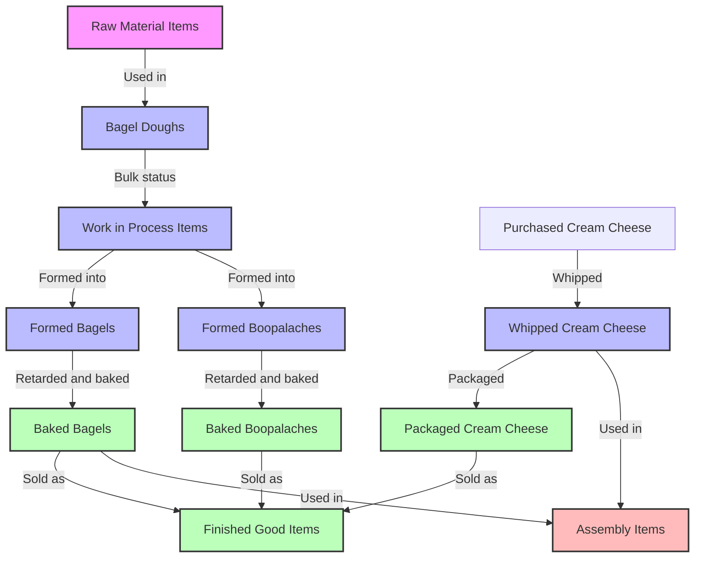

# Bakery Business Central Data Model

## Core Business Entities and Relationships

```mermaid
erDiagram
    ITEM {
        string ItemNo PK
        string Description
        enum Type "Raw Material|WIP|Finished Good"
        decimal BaseUnitCost
        string BaseUnitOfMeasure
        boolean Inventory
        boolean Purchased
        boolean Sales
        boolean Assembly
    }
    
    ITEM_CATEGORY {
        string Code PK
        string Description
    }
    
    UOM {
        string Code PK
        string Description
        decimal QtyPerUOM
        string BaseUOM FK
    }
    
    BOM_HEADER {
        string No PK
        string Description
        string Status "Draft|Certified|Closed"
        string UnitOfMeasure FK
        decimal Quantity
    }
    
    BOM_LINE {
        string BOMNo FK
        int LineNo PK
        string Type "Item|Resource|Text"
        string No FK
        decimal Quantity
        string UnitOfMeasure FK
    }
    
    ROUTING_HEADER {
        string No PK
        string Description
        string Status "Draft|Certified|Closed"
    }
    
    ROUTING_LINE {
        string RoutingNo FK
        int OperationNo PK
        string Type "Work Center|Machine Center"
        string No FK
        decimal SetupTime
        decimal RunTime
        decimal WaitTime
        string TimeUnit "Minutes|Hours|Days"
    }
    
    WORK_CENTER {
        string No PK
        string Name
        decimal Capacity
        decimal DirectUnitCost
        decimal IndirectCostPercentage
    }
    
    PRODUCTION_ORDER {
        string No PK
        string Description
        string Status "Planned|Firm Planned|Released|Finished"
        string SourceType "Item|Sale Order"
        string SourceNo FK
        decimal Quantity
        date DueDate
    }
    
    PRODUCTION_ORDER_LINE {
        string OrderNo FK
        int LineNo PK
        string ItemNo FK
        decimal Quantity
        string UnitOfMeasure FK
        string Status "Bulk|Formed|Retarding|Baking|Ready-to-Sell"
        string ProductionBOMNo FK
        string RoutingNo FK
    }
    
    WASTE_ENTRY {
        int EntryNo PK
        date PostingDate
        time PostingTime
        string ItemNo FK
        string ProductionOrderNo FK
        int ProductionOrderLineNo FK
        string Status "Bulk|Formed|Retarding|Baking|Ready-to-Sell"
        string ReasonCode FK
        string Description
        decimal Quantity
        string UnitOfMeasure FK
    }
    
    PAR_VALUE {
        string ItemNo FK
        string DayOfWeek "Monday|Tuesday|Wednesday|Thursday|Friday|Saturday|Sunday" 
        decimal Quantity
        string UnitOfMeasure FK
    }
    
    ASSEMBLY_HEADER {
        string No PK
        string ItemNo FK
        decimal Quantity
        string UnitOfMeasure FK
        date PostingDate
    }
    
    ASSEMBLY_LINE {
        string AssemblyNo FK
        int LineNo PK
        string Type "Item|Resource|Cost"
        string No FK
        decimal Quantity
        string UnitOfMeasure FK
    }
    
    INVENTORY_ENTRY {
        int EntryNo PK
        date PostingDate
        string ItemNo FK
        string DocumentType "Purchase|Sale|Positive Adjmt.|Negative Adjmt.|Transfer|Consumption|Output"
        string DocumentNo
        decimal Quantity
        decimal Cost
    }
    
    ITEM_CONVERSION {
        string FromItemNo FK
        string ToItemNo FK
        decimal ConversionFactor
    }
    
    STORAGE_CONTAINER {
        string Code PK
        string Description
        string Location FK
        decimal Capacity
        string UnitOfMeasure FK
    }
    
    BOARD {
        string No PK
        string Status "Empty|In Use|Full"
        int CurrentCapacity
        int MaxCapacity "24 for bagels (6x4)"
        string CurrentItemNo FK
        string RackNo FK
    }
    
    RACK {
        string No PK
        string Status "Empty|In Use|Full"
        int CurrentBoardCount
        int MaxBoardCount
        string Location FK
    }
    
    SALES_ORDER_HEADER {
        string No PK
        string CustomerNo FK
        date OrderDate
        string OrderType "Retail|Catering|Wholesale"
        string Status "Open|Released|Shipped|Invoiced"
    }
    
    SALES_ORDER_LINE {
        string OrderNo FK
        int LineNo PK
        string Type "Item|Resource|GL Account|Assembly|Text"
        string No FK
        decimal Quantity
        string UnitOfMeasure FK
        decimal UnitPrice
    }
    
    ITEM ||--o{ UOM : "has"
    ITEM ||--o{ BOM_HEADER : "has recipe"
    ITEM ||--o{ ROUTING_HEADER : "has routing"
    ITEM ||--o{ PAR_VALUE : "has"
    ITEM }|--|| ITEM_CATEGORY : "belongs to"
    BOM_HEADER ||--o{ BOM_LINE : "contains"
    BOM_LINE }o--|| ITEM : "uses"
    ROUTING_HEADER ||--o{ ROUTING_LINE : "contains"
    ROUTING_LINE }o--|| WORK_CENTER : "uses"
    PRODUCTION_ORDER ||--o{ PRODUCTION_ORDER_LINE : "contains"
    PRODUCTION_ORDER_LINE }o--|| ITEM : "produces"
    PRODUCTION_ORDER_LINE }o--|| BOM_HEADER : "uses"
    PRODUCTION_ORDER_LINE }o--|| ROUTING_HEADER : "follows"
    WASTE_ENTRY }o--|| ITEM : "tracks"
    WASTE_ENTRY }o--|| PRODUCTION_ORDER_LINE : "related to"
    ASSEMBLY_HEADER ||--o{ ASSEMBLY_LINE : "contains"
    ASSEMBLY_HEADER }o--|| ITEM : "assembles"
    ASSEMBLY_LINE }o--|| ITEM : "uses"
    INVENTORY_ENTRY }o--|| ITEM : "tracks"
    ITEM_CONVERSION }o--|| ITEM : "from"
    ITEM_CONVERSION }o--|| ITEM : "to"
    BOARD }o--|| ITEM : "holds"
    BOARD }o--|| RACK : "placed on"
    SALES_ORDER_HEADER ||--o{ SALES_ORDER_LINE : "contains"
    SALES_ORDER_LINE }o--|| ITEM : "sells"
```

## Simplified Item Type Relationships

```mermaid
flowchart TD
    RM[Raw Material Items]
    WIP[Work in Process Items]
    FG[Finished Good Items]
    AS[Assembly Items]
    
    RM -->|Used in| BD[Bagel Doughs]
    BD -->|Bulk status| WIP
    WIP -->|Formed into| FB[Formed Bagels]
    WIP -->|Formed into| FBO[Formed Boopalaches]
    FB -->|Retarded and baked| BBA[Baked Bagels]
    FBO -->|Retarded and baked| BBO[Baked Boopalaches]
    BBA -->|Sold as| FG
    BBO -->|Sold as| FG
    
    CR[Purchased Cream Cheese]
    CR -->|Whipped| WCR[Whipped Cream Cheese]
    WCR -->|Packaged| PCR[Packaged Cream Cheese]
    WCR -->|Used in| AS
    PCR -->|Sold as| FG
    
    BBA -->|Used in| AS
    
    classDef rawMat fill:#f9f,stroke:#333,stroke-width:2px
    classDef wip fill:#bbf,stroke:#333,stroke-width:2px
    classDef finGood fill:#bfb,stroke:#333,stroke-width:2px
    classDef assembly fill:#fbb,stroke:#333,stroke-width:2px
    
    class RM rawMat
    class WIP,BD,FB,FBO,WCR wip
    class FG,BBA,BBO,PCR finGood
    class AS assembly
```
