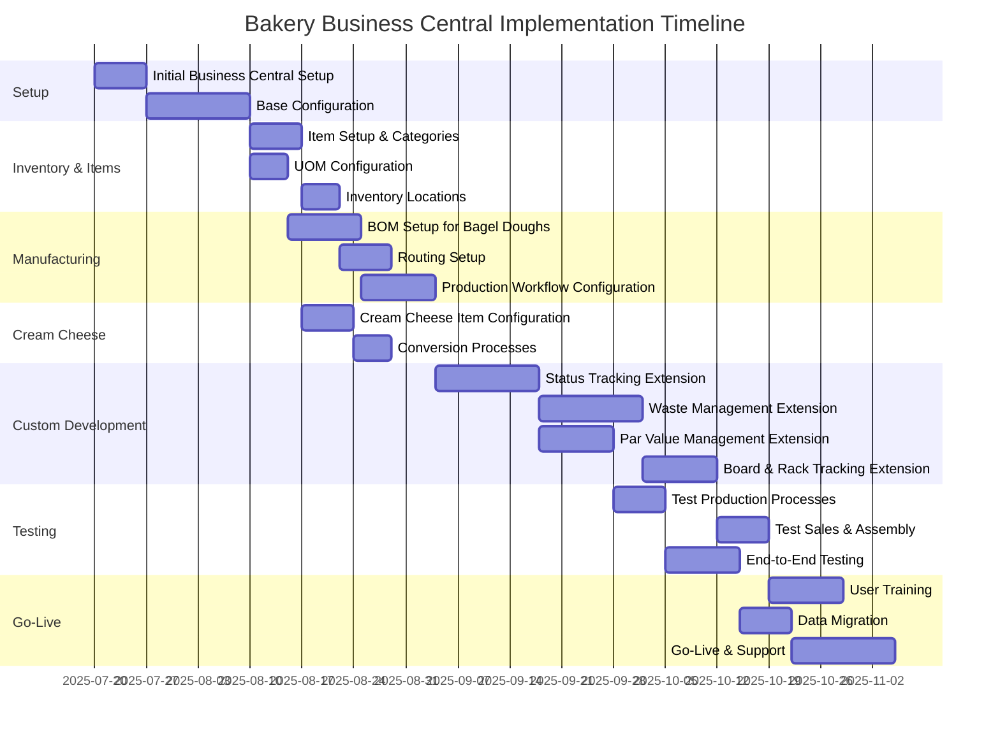

# Bakery Business Central Implementation Guide

## Implementation Phases



## Key Configuration Tasks

### 1. Business Central Base Configuration

- Company Information
- Users & Permissions
- Number Series
- Basic Financial Setup
- General Posting Groups
- Inventory Posting Groups

### 2. Item Management Configuration

- Item Categories
  - Raw Materials
  - Work in Progress
  - Finished Goods
  - Assembly Components
  - Retail Products
- Units of Measure
  - Base Units (lb, oz, each)
  - Multiple Units per Item
  - Conversion Factors
- Inventory Setup
  - Locations (Storage Areas, Walk-in, Service Area)
  - Bins (Boards, Racks)
  - Costing Methods (FIFO)

### 3. Manufacturing Module Configuration

- Production BOMs
  - Bagel Dough Recipes
  - Variants for Different Types
  - Multi-level BOMs for Formed Products
- Routings
  - Work Centers (Mixer, Walk-in, Bagel Machine)
  - Operations with Wait Times
  - Capacity Constraints
- Production Orders
  - Status Flow Configuration
  - Output Journals
  - Consumption Journals

### 4. Custom Extensions Development

#### Status Tracking Extension
```csharp
// Pseudo-code for status tracking table
table 50100 "Bakery Product Status"
{
    fields
    {
        field(1; "Item No."; Code[20])
        {
            TableRelation = Item;
        }
        field(2; "Status"; Enum "Bakery Status")
        {
            // Bulk, Formed, Retarding, Baking, Ready-to-Sell
        }
        field(3; "Timestamp"; DateTime)
        {
        }
        field(4; "User ID"; Code[50])
        {
        }
        // Additional tracking fields
    }
}
```

#### Waste Tracking Extension
```csharp
// Pseudo-code for waste tracking table
table 50110 "Bakery Waste Entry"
{
    fields
    {
        field(1; "Entry No."; Integer)
        {
            AutoIncrement = true;
        }
        field(2; "Item No."; Code[20])
        {
            TableRelation = Item;
        }
        field(3; "Posting Date"; Date)
        {
        }
        field(4; "Status"; Enum "Bakery Status")
        {
        }
        field(5; "Reason Code"; Code[10])
        {
            TableRelation = "Reason Code";
        }
        field(6; "Quantity"; Decimal)
        {
        }
        // Additional fields
    }
}
```

#### Par Value Management Extension
```csharp
// Pseudo-code for par value table
table 50120 "Bakery Par Value"
{
    fields
    {
        field(1; "Item No."; Code[20])
        {
            TableRelation = Item;
        }
        field(2; "Day of Week"; Enum "Day of Week")
        {
        }
        field(3; "Quantity"; Decimal)
        {
        }
        field(4; "Unit of Measure"; Code[10])
        {
            TableRelation = "Unit of Measure";
        }
        // Additional fields
    }
    
    keys
    {
        key(PK; "Item No.", "Day of Week")
        {
            Clustered = true;
        }
    }
}
```

### 5. Integration Points

- **Assembly Management Module**
  - Assembly BOMs for combination products
  - Assembly order processing
  - Component consumption
  
- **Sales Module**
  - Sales item setup
  - Pricing configuration
  - Order processing
  
- **Resource Management**
  - Staff scheduling
  - Capacity planning
  - Resource costs

- **Financial Reporting**
  - Cost center setup
  - Product line profitability
  - Waste cost analysis

## User Training Plan

| Role | Training Modules | Duration |
|------|-----------------|----------|
| Baker | Production Orders, Waste Recording, Par Value Usage | 8 hours |
| Server | Sales Orders, Inventory Counting, Waste Recording | 4 hours |
| Supervisor | All Operational Modules, Basic Reporting | 16 hours |
| Accountant | Financial Setup, Cost Analysis, Reporting | 12 hours |
| Management | Overview of All Modules, Advanced Reporting, KPIs | 8 hours |

## Critical Success Factors

1. **Accurate Item Setup**
   - Proper units of measure
   - Correct BOMs and recipes
   - Appropriate costing methods

2. **Production Process Alignment**
   - Status flow matches actual operations
   - Wait times properly configured
   - Capacity constraints accurately modeled

3. **User Adoption**
   - Simplified interfaces for daily operations
   - Clear procedures for status updates
   - Comprehensive training for all roles

4. **Data Integrity**
   - Regular inventory counts
   - Consistent waste tracking
   - Accurate production reporting

5. **Reporting Relevance**
   - KPIs aligned with business goals
   - Daily operational reports
   - Management-level analysis tools
