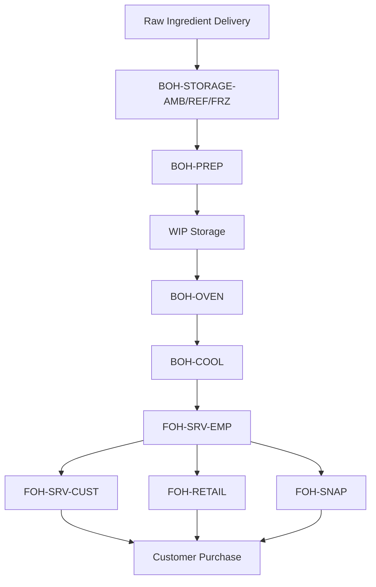

# Bakery Locations and Layout

## Primary Location

| Location Info | Details |
|--------------|---------|
| Name | Boopas Bagels |
| Address | 6513 North Beach Street |
| City | Fort Worth |
| State | TX |
| Zip | 76137 |
| Country | USA |
| Phone | |
| Email | |

## Location Zones

The bakery is divided into two main areas:

1. **Front of House (FOH)**
2. **Back of House (BOH)**

### Front of House (FOH) Sub-Zones

| Zone Code | Description | Purpose | Inventory Type | Notes |
|-----------|-------------|---------|---------------|-------|
| FOH-SRV-EMP | Service Bar (Employee Side) | Food preparation, packaging, assembly | Assembly components, Finished goods | Employee-only access |
| FOH-SRV-CUST | Service Bar (Customer Side) | Display of bagels and other products | Finished goods (display only) | Customer-facing displays |
| FOH-CHECKOUT | Checkout Area | Sales transactions, retail display | Retail products | Includes refrigerators with N/A beverages |
| FOH-COFFEE | Coffee Bar | Coffee service | Coffee products, condiments | Self-service for cream and sugar |
| FOH-RETAIL | Retail Area | Product display and sales | Retail products | Customer-accessible products |
| FOH-SNAP | Snapple Cooler | Cold storage for TKOs | TKOs and cold retail items | Branded cooler for retail sales |

### Back of House (BOH) Sub-Zones

| Zone Code | Description | Purpose | Inventory Type | Notes |
|-----------|-------------|---------|---------------|-------|
| BOH-PREP | Preparation Area | Dough mixing, bagel forming | Raw ingredients, WIP | |
| BOH-OVEN | Oven Area | Baking | WIP | |
| BOH-COOL | Cooling Area | Post-bake cooling | Finished goods (not yet ready for sale) | |
| BOH-STORAGE-AMB | Ambient Storage | Storage for dry goods | Raw ingredients (ambient) | |
| BOH-STORAGE-REF | Refrigerated Storage | Storage for cold items | Raw ingredients, WIP (refrigerated) | |
| BOH-STORAGE-FRZ | Freezer Storage | Storage for frozen items | Raw ingredients (frozen) | |

## Vendor Managed Inventory Areas

| Zone Code | Description | Vendor | Products | Notes |
|-----------|-------------|--------|----------|-------|
| FOH-BVNDR-COKE | Coke Refrigerator | Coca-Cola | Coke products | Vendor maintained |
| FOH-BVNDR-DP | Dr. Pepper Refrigerator | Dr. Pepper | Dr. Pepper products | Vendor maintained |

## Retail Definition

Retail products are defined as:

1. Items customers can grab for themselves
2. Items stored/displayed on the customer side of the counter

## Inventory Flow

## Business Central Location Setup

For Business Central implementation, we will configure:

1. **Locations**
   - MAIN - Main location (entire store)

2. **Bins within the MAIN location**
   - All zone codes listed above will be configured as bins
   - Transfer orders will be used to move inventory between bins

3. **Pick/Put-away Strategy**
   - Directed put-away and pick for efficient inventory handling
   - Zone-specific default bins for different item categories

4. **Stockkeeping Units**
   - Location-specific SKUs for items with different handling at different locations
   - Will be primarily used for finished goods and retail items

## Vendor Relationship Management

| Vendor | Contact Method | Order Frequency | Lead Time | Notes |
|--------|----------------|-----------------|-----------|-------|
| Coca-Cola | | Weekly | | Vendor managed inventory |
| Dr. Pepper | | Weekly | | Vendor managed inventory |
| [Other vendors to be added] | | | | |
