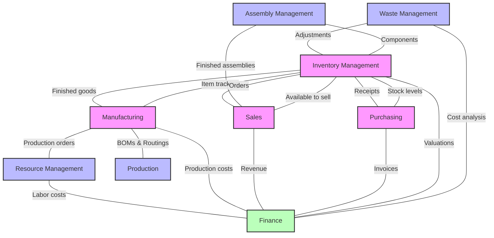
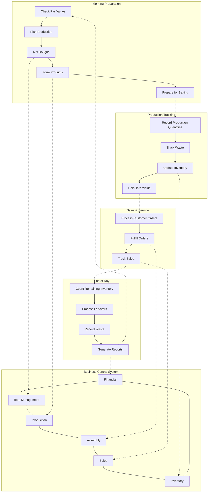
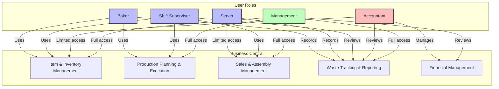
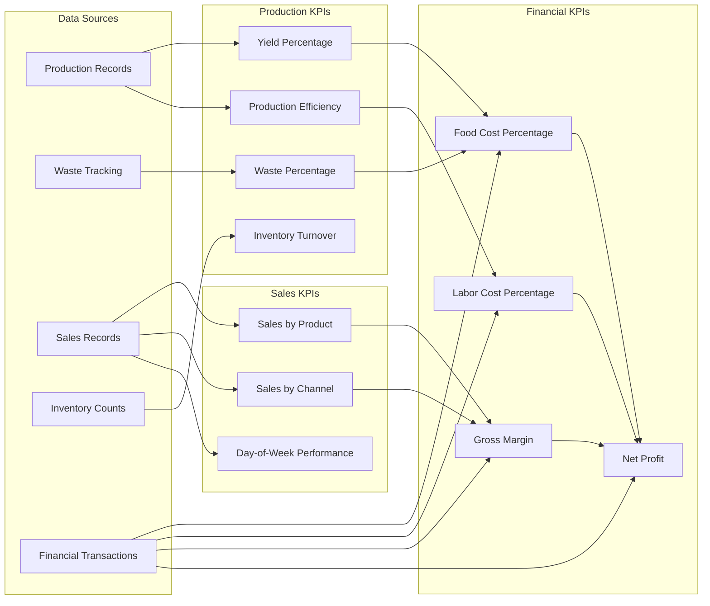

# Bakery Business Central System Overview

## Business Central Module Integration

```mermaid
flowchart TD
    INV[Inventory Management] ---|Item tracking| MFG[Manufacturing]
    INV ---|Stock levels| PUR[Purchasing]
    INV ---|Available to sell| SALES[Sales]
    MFG ---|Production orders| RM[Resource Management]
    MFG ---|BOMs & Routings| PROD[Production]
    MFG ---|Finished goods| INV
    PUR ---|Receipts| INV
    SALES ---|Orders| INV
    ASM[Assembly Management] ---|Components| INV
    ASM ---|Finished assemblies| SALES
    WASTE[Waste Management] ---|Adjustments| INV
    WASTE ---|Cost analysis| FIN[Finance]
    INV ---|Valuations| FIN
    PUR ---|Invoices| FIN
    SALES ---|Revenue| FIN
    MFG ---|Production costs| FIN
    RM ---|Labor costs| FIN
    
    classDef core fill:#f9f,stroke:#333,stroke-width:2px
    classDef secondary fill:#bbf,stroke:#333,stroke-width:2px
    classDef finance fill:#bfb,stroke:#333,stroke-width:2px
    
    class INV,MFG,SALES,PUR core
    class ASM,RM,PROD,WASTE secondary
    class FIN finance
```

## Daily Business Process Overview

```mermaid
graph TD
    subgraph "Morning Preparation"
        A1[Check Par Values] --> A2[Plan Production]
        A2 --> A3[Mix Doughs]
        A3 --> A4[Form Products]
        A4 --> A5[Prepare for Baking]
    end
    
    subgraph "Production Tracking"
        B1[Record Production Quantities] --> B2[Track Waste]
        B2 --> B3[Update Inventory]
        B3 --> B4[Calculate Yields]
    end
    
    subgraph "Sales & Service"
        C1[Process Customer Orders] --> C2[Fulfill Orders]
        C2 --> C3[Track Sales]
    end
    
    subgraph "End of Day"
        D1[Count Remaining Inventory] --> D2[Process Leftovers]
        D2 --> D3[Record Waste]
        D3 --> D4[Generate Reports]
    end
    
    subgraph "Business Central System"
        E1[Item Management] --- E2[Production]
        E2 --- E3[Assembly]
        E3 --- E4[Sales]
        E4 --- E5[Inventory]
        E5 --- E6[Financial]
        E6 --- E1
    end
    
    A5 -.-> B1
    B4 -.-> C1
    C3 -.-> D1
    D4 -.-> A1
    
    A3 -.-> E1
    A4 -.-> E2
    B3 -.-> E5
    C2 -.-> E3
    C3 -.-> E4
    D4 -.-> E6
```

## User Roles and System Access

```mermaid
flowchart TD
    subgraph "Business Central"
        BC1[Item & Inventory Management]
        BC2[Production Planning & Execution]
        BC3[Sales & Assembly Management]
        BC4[Waste Tracking & Reporting]
        BC5[Financial Management]
    end
    
    subgraph "User Roles"
        U1[Baker]
        U2[Server]
        U3[Shift Supervisor]
        U4[Accountant]
        U5[Management]
    end
    
    U1 -->|Uses| BC1
    U1 -->|Uses| BC2
    U1 -->|Records| BC4
    
    U2 -->|Limited access| BC3
    U2 -->|Records| BC4
    
    U3 -->|Uses| BC1
    U3 -->|Uses| BC2
    U3 -->|Uses| BC3
    U3 -->|Reviews| BC4
    
    U4 -->|Limited access| BC1
    U4 -->|Reviews| BC4
    U4 -->|Manages| BC5
    
    U5 -->|Full access| BC1
    U5 -->|Full access| BC2
    U5 -->|Full access| BC3
    U5 -->|Full access| BC4
    U5 -->|Reviews| BC5
    
    classDef operations fill:#bbf,stroke:#333,stroke-width:2px
    classDef management fill:#bfb,stroke:#333,stroke-width:2px
    classDef finance fill:#fbb,stroke:#333,stroke-width:2px
    
    class U1,U2,U3 operations
    class U5 management
    class U4 finance
```

## Key Performance Indicators (KPIs)

```mermaid
graph LR
    subgraph "Production KPIs"
        P1[Yield Percentage]
        P2[Waste Percentage]
        P3[Production Efficiency]
        P4[Inventory Turnover]
    end
    
    subgraph "Sales KPIs"
        S1[Sales by Product]
        S2[Sales by Channel]
        S3[Day-of-Week Performance]
    end
    
    subgraph "Financial KPIs"
        F1[Food Cost Percentage]
        F2[Labor Cost Percentage]
        F3[Gross Margin]
        F4[Net Profit]
    end
    
    subgraph "Data Sources"
        D1[Production Records]
        D2[Waste Tracking]
        D3[Sales Records]
        D4[Inventory Counts]
        D5[Financial Transactions]
    end
    
    D1 --> P1
    D1 --> P3
    D2 --> P2
    D3 --> S1
    D3 --> S2
    D3 --> S3
    D4 --> P4
    D5 --> F1
    D5 --> F2
    D5 --> F3
    D5 --> F4
    
    P1 --> F1
    P2 --> F1
    S1 --> F3
    S2 --> F3
    P3 --> F2
    F1 --> F4
    F2 --> F4
    F3 --> F4
```
