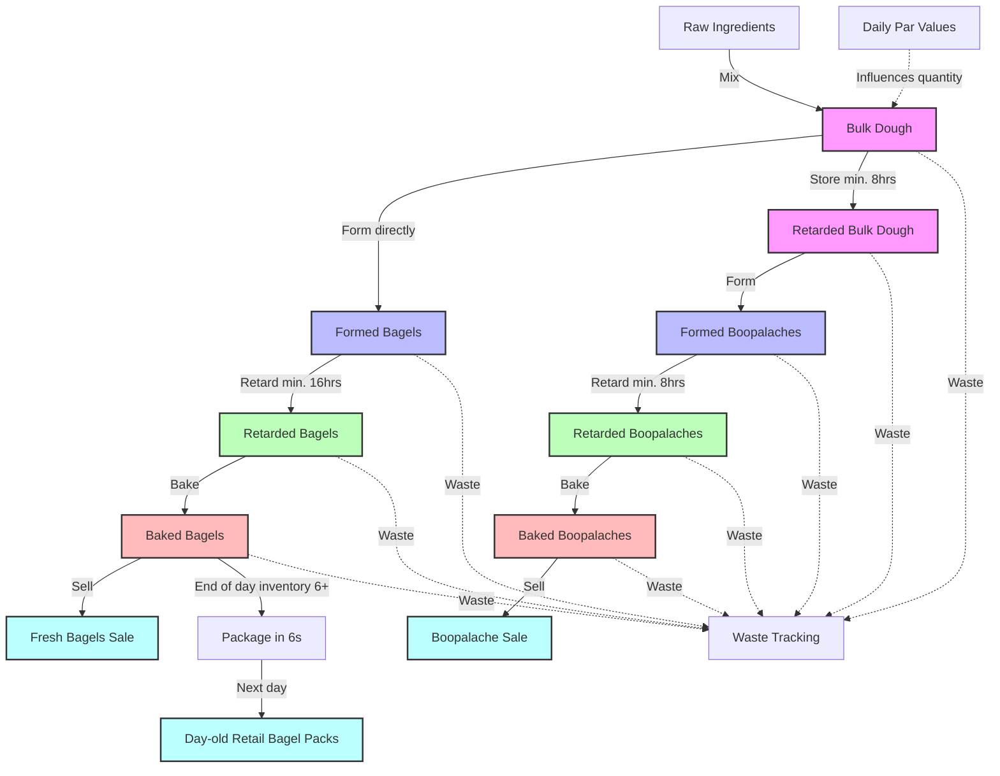
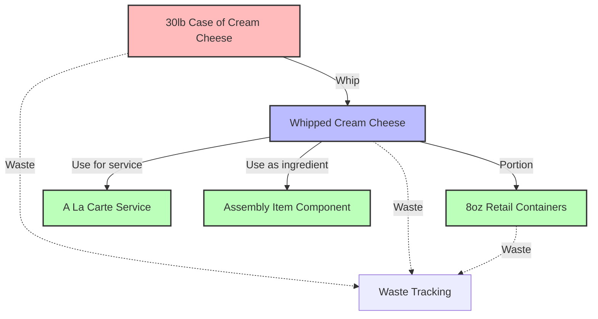
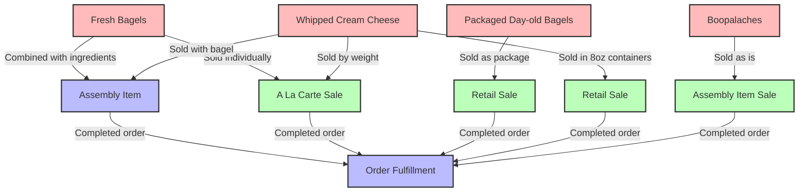
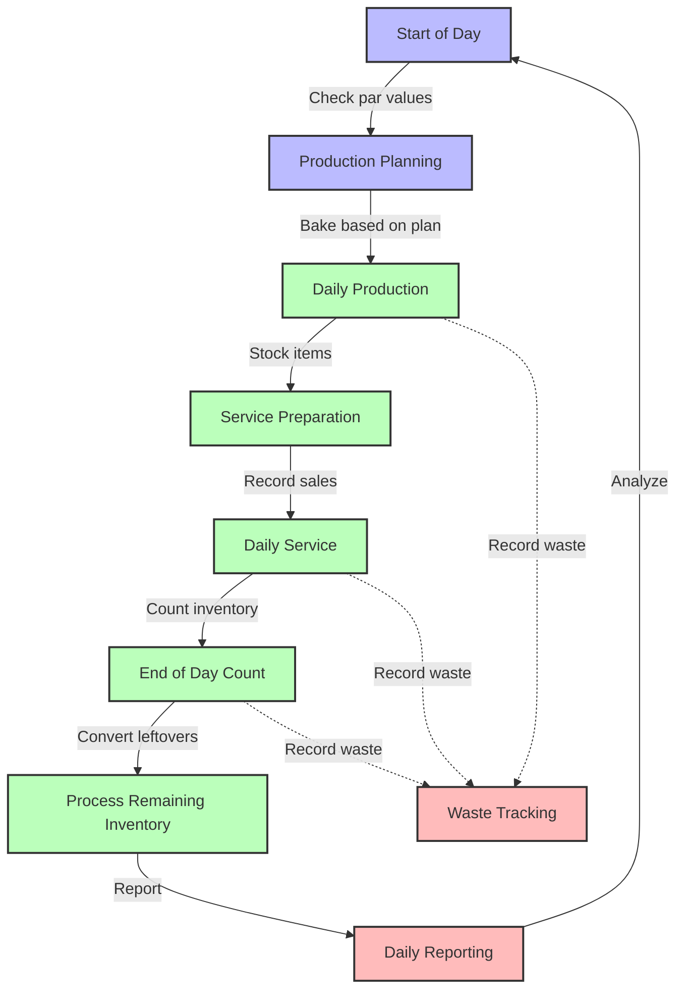

# Bakery Business Central Workflows

## 1. Bagel Production Workflow

```mermaid
flowchart TD
    A[Raw Ingredients] -->|Mix| B[Bulk Dough]
    B -->|Form directly| C[Formed Bagels]
    B -->|Store min. 8hrs| D[Retarded Bulk Dough]
    D -->|Form| E[Formed Boopalaches]
    C -->|Retard min. 16hrs| F[Retarded Bagels]
    E -->|Retard min. 8hrs| G[Retarded Boopalaches]
    F -->|Bake| H[Baked Bagels]
    G -->|Bake| I[Baked Boopalaches]
    H -->|Sell| J[Fresh Bagels Sale]
    H -->|End of day inventory 6+| K[Package in 6s]
    K -->|Next day| L[Day-old Retail Bagel Packs]
    I -->|Sell| M[Boopalache Sale]
    
    %% Waste tracking points
    B -.->|Waste| W1[Waste Tracking]
    C -.->|Waste| W1
    D -.->|Waste| W1
    E -.->|Waste| W1
    F -.->|Waste| W1
    G -.->|Waste| W1
    H -.->|Waste| W1
    I -.->|Waste| W1
    
    %% Par value influence
    P[Daily Par Values] -.->|Influences quantity| B
    
    %% Product status tracking
    classDef statusBulk fill:#f9f,stroke:#333,stroke-width:2px
    classDef statusFormed fill:#bbf,stroke:#333,stroke-width:2px
    classDef statusRetarding fill:#bfb,stroke:#333,stroke-width:2px
    classDef statusBaking fill:#fbb,stroke:#333,stroke-width:2px
    classDef statusReady fill:#bff,stroke:#333,stroke-width:2px
    
    class B,D statusBulk
    class C,E statusFormed
    class F,G statusRetarding
    class H,I statusBaking
    class J,L,M statusReady
```

## 2. Cream Cheese Processing Workflow

```mermaid
flowchart TD
    A[30lb Case of Cream Cheese] -->|Whip| B[Whipped Cream Cheese]
    B -->|Portion| C[8oz Retail Containers]
    B -->|Use for service| D[A La Carte Service]
    B -->|Use as ingredient| E[Assembly Item Component]
    
    %% Waste tracking points
    A -.->|Waste| W1[Waste Tracking]
    B -.->|Waste| W1
    C -.->|Waste| W1
    
    classDef purchased fill:#fbb,stroke:#333,stroke-width:2px
    classDef processed fill:#bbf,stroke:#333,stroke-width:2px
    classDef product fill:#bfb,stroke:#333,stroke-width:2px
    
    class A purchased
    class B processed
    class C,D,E product
```

## 3. Sales Process Workflow

```mermaid
flowchart TD
    A1[Fresh Bagels] -->|Sold individually| B1[A La Carte Sale]
    A1 -->|Combined with ingredients| C1[Assembly Item]
    A2[Packaged Day-old Bagels] -->|Sold as package| B2[Retail Sale]
    A3[Whipped Cream Cheese] -->|Sold in 8oz containers| B3[Retail Sale]
    A3 -->|Sold with bagel| C1
    A3 -->|Sold by weight| B1
    A4[Boopalaches] -->|Sold as is| D[Assembly Item Sale]
    
    C1 -->|Completed order| E[Order Fulfillment]
    B1 -->|Completed order| E
    B2 -->|Completed order| E
    B3 -->|Completed order| E
    D -->|Completed order| E
    
    classDef inventory fill:#fbb,stroke:#333,stroke-width:2px
    classDef sale fill:#bfb,stroke:#333,stroke-width:2px
    classDef process fill:#bbf,stroke:#333,stroke-width:2px
    
    class A1,A2,A3,A4 inventory
    class B1,B2,B3,D sale
    class C1,E process
```

## 4. Daily Operations Workflow

```mermaid
flowchart TD
    A[Start of Day] -->|Check par values| B[Production Planning]
    B -->|Bake based on plan| C[Daily Production]
    C -->|Stock items| D[Service Preparation]
    D -->|Record sales| E[Daily Service]
    E -->|Count inventory| F[End of Day Count]
    F -->|Convert leftovers| G[Process Remaining Inventory]
    G -->|Report| H[Daily Reporting]
    H -->|Analyze| A
    
    %% Additional tracking processes
    C -.->|Record waste| W[Waste Tracking]
    E -.->|Record waste| W
    F -.->|Record waste| W
    
    classDef planning fill:#bbf,stroke:#333,stroke-width:2px
    classDef operations fill:#bfb,stroke:#333,stroke-width:2px
    classDef reporting fill:#fbb,stroke:#333,stroke-width:2px
    
    class A,B planning
    class C,D,E,F,G operations
    class H,W reporting
```
