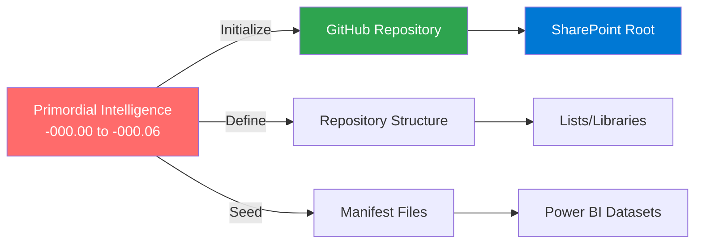
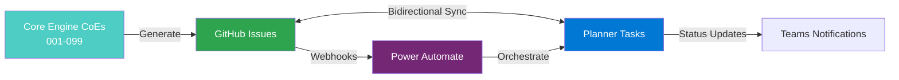
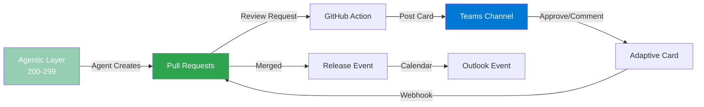
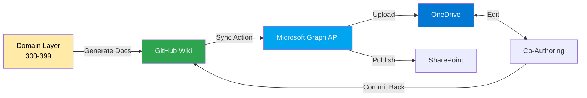
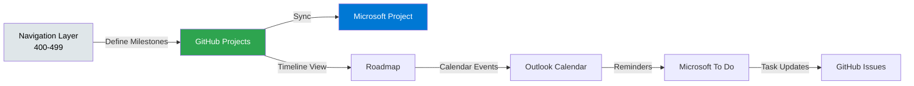
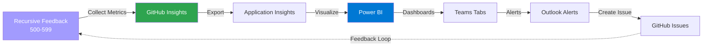

```mermaid
graph TB
    subgraph "Precursive Layer (-000.x)"
        P000["Primordial Intelligence CoE<br/>-000.00"]
        P001["Semantic Genesis Module<br/>-000.01"]
        P002["Dimensional Awareness<br/>-000.02"]
        P003["Agentic Activation<br/>-000.03"]
        P004["Intent Verification<br/>-000.04"]
        P005["Modular Distribution<br/>-000.05"]
        P006["Memory Encoding<br/>-000.06"]
    end
    
    subgraph "Core Engine Layer (001-099)"

        CE001["Core Engine CoE 001"]
        CE025["Core Engine CoE 025"]
        CE050["Core Engine CoE 050"]
        CE075["Core Engine CoE 075"]
        CE099["Core Engine CoE 099"]
    end
    
    subgraph "Recursive Modules Layer (100-199)"
        RM100["Recursive Modules 100"]
        RM125["Recursive Modules 125"]
        RM150["Recursive Modules 150"]
        RM175["Recursive Modules 175"]
        RM199["Recursive Modules 199"]
    end
    
    subgraph "Agentic Layer (200-299)"
        AG200["Agentic Layer 200"]
        AG225["Agentic Layer 225"]
        AG250["Agentic Layer 250"]
        AG275["Agentic Layer 275"]
        AG299["Agentic Layer 299"]
    end
    
    subgraph "Domain Layer (300-399)"
        DM300["Domain Layer 300"]
        DM325["Domain Layer 325"]
        DM350["Domain Layer 350"]
        DM375["Domain Layer 375"]
        DM399["Domain Layer 399"]
    end
    
    subgraph "Navigation Layer (400-499)"
        NV400["Navigation Layer 400"]
        NV425["Navigation Layer 425"]
        NV450["Navigation Layer 450"]
        NV475["Navigation Layer 475"]
        NV499["Navigation Layer 499"]
    end
    
    subgraph "Recursive Feedback Layer (500-599)"
        RF500["Recursive Feedback 500"]
        RF525["Recursive Feedback 525"]
        RF550["Recursive Feedback 550"]
        RF575["Recursive Feedback 575"]
        RF599["Recursive Feedback 599"]
    end
    
    subgraph "GitHub Integration Points"
        GH_ISSUES[GitHub Issues]
        GH_PR[Pull Requests]
        GH_ACTIONS[GitHub Actions]
        GH_PROJECTS[Projects]
    end
    
    subgraph "Microsoft 365 Integration Points"
        M365_PLANNER[Planner Tasks]
        M365_TEAMS[Teams Channels]
        M365_ONEDRIVE[OneDrive Docs]
        M365_CALENDAR[Outlook Calendar]
    end
    
    %% Hierarchical flow
    P000 --> P001
    P001 --> P002
    P002 --> P003
    P003 --> P004
    P004 --> P005
    P005 --> P006
    
    P006 --> CE001
    CE001 --> CE025 --> CE050 --> CE075 --> CE099
    CE099 --> RM100
    RM100 --> RM125 --> RM150 --> RM175 --> RM199
    RM199 --> AG200
    AG200 --> AG225 --> AG250 --> AG275 --> AG299
    AG299 --> DM300
    DM300 --> DM325 --> DM350 --> DM375 --> DM399
    DM399 --> NV400
    NV400 --> NV425 --> NV450 --> NV475 --> NV499
    NV499 --> RF500
    RF500 --> RF525 --> RF550 --> RF575 --> RF599
    
    %% Alternating Current Integration
    CE001 <-->|Component Tasks| GH_ISSUES
    GH_ISSUES <-->|Sync| M365_PLANNER
    
    AG250 <-->|PR Workflow| GH_PR
    GH_PR <-->|Notifications| M365_TEAMS
    
    DM350 <-->|Documentation| GH_ACTIONS
    GH_ACTIONS <-->|Sync| M365_ONEDRIVE
    
    NV450 <-->|Milestones| GH_PROJECTS
    GH_PROJECTS <-->|Events| M365_CALENDAR
    
    RF599 -.->|Feedback Loop| P000
    
    style P000 fill:#ff6b6b,color:#fff
    style CE001 fill:#4ecdc4,color:#fff
    style RM100 fill:#45b7d1,color:#fff
    style AG200 fill:#96ceb4,color:#fff
    style DM300 fill:#ffeaa7,color:#000
    style NV400 fill:#dfe6e9,color:#000
    style RF500 fill:#a29bfe,color:#fff
    
    style GH_ISSUES fill:#2ea44f,color:#fff
    style GH_PR fill:#2ea44f,color:#fff
    style GH_ACTIONS fill:#2ea44f,color:#fff
    style GH_PROJECTS fill:#2ea44f,color:#fff
    
    style M365_PLANNER fill:#0078d4,color:#fff
    style M365_TEAMS fill:#0078d4,color:#fff
    style M365_ONEDRIVE fill:#0078d4,color:#fff
    style M365_CALENDAR fill:#0078d4,color:#fff
```

# 🌐 IntelIntent Centers of Excellence - Hierarchy & Integration Map

## Overview

This document visualizes the complete **619 Centers of Excellence** structure with GitHub and Microsoft 365 integrataion points showing "alternating current" data flow.

---

## 📊 Complete CoE Architecture



---

## 🔄 Layer-by-Layer Integration

### Precursive Layer → GitHub Foundation



### Core Engine → Issue Tracking



### Agentic Layer → Pull Request Workflow



### Domain Layer → Documentation Sync



### Navigation Layer → Project Management



### Recursive Feedback → Monitoring



---

## 📋 CoE Layer Breakdown

### Precursive Layer (-000.x) - **19 Components**

| ID | Name | Purpose | GitHub Integration | M365 Integration |
|----|------|---------|-------------------|------------------|
| -000.00 | Primordial Intelligence | Foundation | Repository Structure | SharePoint Site |
| -000.01 | Semantic Genesis | Etymology & Intent | Issue Templates | Planner Buckets |
| -000.02 | Dimensional Awareness | Recursive Zoom | Project Boards | Project Online |
| -000.03 | Agentic Activation | PAID Identity | Actions Workflows | Power Automate |
| -000.04 | Intent Verification | Command Hierarchy | PR Templates | Approval Flows |
| -000.05 | Modular Distribution | Zippit Protocol | Release Assets | OneDrive Packages |
| -000.06 | Memory Encoding | Feedback Capture | Discussions | Teams Posts |

### Core Engine CoEs (001-099) - **99 Components**

**Sample Components:**
- 001-020: **Infrastructure** → Azure Resources, Key Vault, RBAC
- 021-040: **Authentication** → Entra ID, Certificate Auth, MFA
- 041-060: **Orchestration** → Manifest Reader, Component Generator
- 061-080: **Data Management** → Checkpoints, Codex Scrolls, Power BI
- 081-099: **Security** → Circuit Breaker, Health Checks, Compliance

**Integration Pattern:**
```
Core Engine Issue → Power Automate → Planner "Infrastructure" Bucket
Planner Task Update → Power Automate → GitHub Issue Comment
```

### Recursive Modules CoEs (100-199) - **100 Components**

**Focus:** Self-modifying code generation, template evolution

**Integration Pattern:**
```
Module Generated → GitHub Actions → Test Suite
Test Results → Teams Adaptive Card → Developer Notification
```

### Agentic Layer CoEs (200-299) - **100 Components**

**Focus:** AgentBridge.psm1 specializations
- 200-225: **FinanceAgent** - Investment portfolio, market events
- 226-250: **BoopasAgent** - POS, inventory, vendor management
- 251-275: **IdentityAgent** - Email, access control, governance
- 276-299: **DeploymentAgent** - Azure provisioning, config

**Integration Pattern:**
```
Agent Task → GitHub Issue (auto-assigned to agent owner)
Agent Completion → Planner Task Complete → Teams Notification
```

### Domain Layer CoEs (300-399) - **100 Components**

**Focus:** Business domain implementations
- 300-325: **Universal Creative** - Scripture, Temple, Blueprint
- 326-350: **Finance Domain** - Ledger, reconciliation, reporting
- 351-375: **Boopas Domain** - Storefront, e-commerce, inventory
- 376-399: **Identity Domain** - User management, SSO, MFA

**Integration Pattern:**
```
Domain Wiki → OneDrive Documentation → SharePoint Knowledge Base
Documentation Update → GitHub Wiki Commit → Teams Notification
```

### Navigation Layer CoEs (400-499) - **100 Components**

**Focus:** User journey, routing, intent resolution

**Integration Pattern:**
```
User Journey Map → GitHub Project → Outlook Milestone Events
Sprint Planning → Planner Sprint Board → Teams Sprint Channel
```

### Recursive Feedback CoEs (500-599) - **100 Components**

**Focus:** Monitoring, analytics, continuous improvement

**Integration Pattern:**
```
Checkpoint Data → Power BI Dataset → Teams Dashboard Tab
Alert Triggered → Outlook High-Priority Email → GitHub Issue (auto-created)
```

---

## 🎯 Activation Sequence with M365 Integration

### Phase 1: Primordial Layer Activation

```powershell
# Step 1: Initialize GitHub repository structure
git init
git remote add origin https://github.com/cf7928pdxg-sketch/IntelIntent.git

# Step 2: Create SharePoint site for documentation
New-PnPSite -Type TeamSite -Title "IntelIntent Knowledge Base" -Alias "IntelIntent"

# Step 3: Set up Power Automate environment
$environment = New-AdminPowerAppEnvironment -DisplayName "IntelIntent-Prod" -Location "unitedstates"

# Step 4: Configure Azure AD app registration
.\IntelIntent-Seed\scripts\Setup-AzureADIntegration.ps1
```

### Phase 2: Core Engine Layer Activation

```powershell
# Step 1: Generate Core Engine CoE issues
.\IntelIntent_Seeding\Orchestrator.ps1 -Mode Full -Category "Core_Engine"

# Step 2: Sync issues to Planner
.\IntelIntent-Seed\scripts\Sync-GitHubToPlanner.ps1 `
    -GitHubRepo "cf7928pdxg-sketch/IntelIntent" `
    -PlannerPlanId "YOUR_PLAN_ID" `
    -BucketId "Infrastructure"

# Step 3: Deploy GitHub Actions for automation
git add .github/workflows/sync-to-onedrive.yml
git commit -m "feat: Add OneDrive sync workflow"
git push
```

### Phase 3: Agentic Layer Activation

```powershell
# Step 1: Deploy AgentBridge module
Import-Module .\IntelIntent_Seeding\AgentBridge.psm1

# Step 2: Create agent-specific Planner boards
$agents = @("FinanceAgent", "BoopasAgent", "IdentityAgent", "DeploymentAgent")
foreach ($agent in $agents) {
    New-PlannerPlan -DisplayName "IntelIntent-$agent" -Owner "YOUR_GROUP_ID"
}

# Step 3: Configure agent notification flows
# Deploy Power Automate flows for each agent type
```

---

## 📊 M365 Dashboard Integration

### Power BI Dashboard for CoE Monitoring

**Data Sources:**
1. GitHub Issues API → Issue status, assignments, labels
2. Planner Tasks API → Task completion, progress
3. Teams Activity → Collaboration metrics
4. OneDrive API → Documentation updates
5. Outlook Calendar → Milestone tracking

**DAX Measures:**
```dax
// Total CoE Components
TotalCoEs = 619

// Active Issues
ActiveIssues = COUNTROWS(FILTER(GitHubIssues, GitHubIssues[State] = "open"))

// Sync Success Rate
SyncSuccessRate = 
DIVIDE(
    COUNTROWS(FILTER(SyncLog, SyncLog[Status] = "Success")),
    COUNTROWS(SyncLog)
) * 100

// Average Sync Latency
AvgSyncLatency = AVERAGE(SyncLog[DurationSeconds])

// CoE Activation Progress
ActivationProgress = 
DIVIDE(
    COUNTROWS(FILTER(CoEComponents, CoEComponents[Status] = "Active")),
    [TotalCoEs]
) * 100
```

### Teams Dashboard Tabs

**Tab 1: CoE Overview**
- Total components by layer
- Activation status (Precursive → Feedback)
- Current sprint progress

**Tab 2: GitHub Activity**
- Recent commits
- Open PRs
- Issue burn-down chart

**Tab 3: Planner Sync**
- Synced tasks count
- Sync errors log
- Manual sync trigger button

**Tab 4: Documentation**
- Recent OneDrive updates
- SharePoint wiki links
- Quick access to Codex scrolls

---

## 🔐 Security & Compliance

### Access Control Matrix

| Layer | GitHub Access | M365 Access | Integration Auth |
|-------|--------------|-------------|------------------|
| Precursive | Admin | Global Admin | Service Principal |
| Core Engine | Write | Contributor | Managed Identity |
| Agentic | Write | Member | Azure AD App |
| Domain | Read | Member | User Delegation |
| Navigation | Read | Guest | OAuth 2.0 |
| Feedback | Read | Guest | OAuth 2.0 |

### Audit Trail

All integration activities logged to:
1. **Azure Application Insights** - Real-time monitoring
2. **GitHub Audit Log** - Repository actions
3. **M365 Unified Audit Log** - Compliance tracking
4. **Power BI Dataset** - Historical analysis

---

## 🚀 Quick Start Commands

```powershell
# Clone repository
git clone https://github.com/cf7928pdxg-sketch/IntelIntent.git
cd IntelIntent

# Load integration scripts
. .\IntelIntent-Seed\scripts\Setup-GitHubM365Integration.ps1

# Initialize alternating current
Initialize-AlternatingCurrent `
    -GitHubRepo "cf7928pdxg-sketch/IntelIntent" `
    -TenantId "YOUR_TENANT_ID" `
    -ClientId "YOUR_CLIENT_ID" `
    -ClientSecret "YOUR_CLIENT_SECRET"

# Verify integration
Test-AlternatingCurrentFlow -Verbose
```

---

## 📚 Documentation Cross-References

- **[GitHub M365 Integration Guide](GITHUB_M365_INTEGRATION.md)** - Complete technical implementation
- **[Recursive Table](intelintent_recursive_table.txt)** - Full 619 CoE listing
- **[Orchestrator](../IntelIntent_Seeding/Orchestrator.ps1)** - Component generation engine
- **[Manifest Reader](../IntelIntent_Seeding/ManifestReader.ps1)** - CoE parsing logic

---

*CoE visualization and integration map created November 29, 2025*

