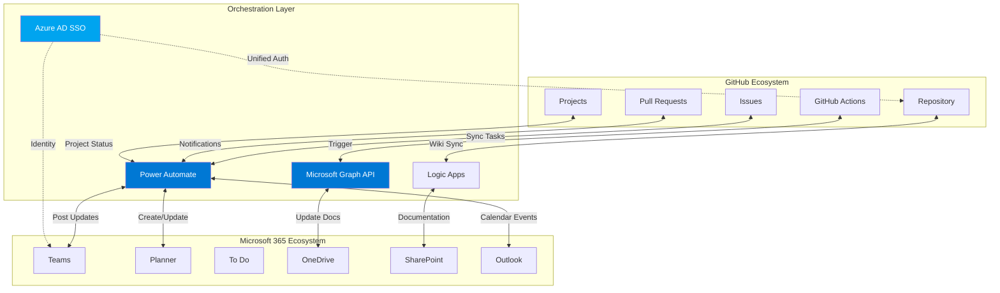

# 🔄 GitHub ↔ Microsoft 365 Alternating Current Integration

## Overview

This document establishes **bidirectional, dynamic synchronization** between GitHub and Microsoft 365, creating an "alternating current" data flow where changes in one system automatically reflect in the other.

---

## 🌊 Alternating Current Architecture



---

## 🎯 Integration Patterns

### Pattern 1: Issue ↔ Task Synchronization
**Direction:** Bidirectional  
**Tools:** Power Automate + GitHub Connector + Planner API

```
GitHub Issue Created → Power Automate → Planner Task Created
Planner Task Updated → Power Automate → GitHub Issue Comment Added
GitHub Issue Closed → Power Automate → Planner Task Marked Complete
```

### Pattern 2: PR ↔ Teams Collaboration
**Direction:** GitHub → Teams (Notifications)  
**Tools:** GitHub Actions + Teams Webhook

```
PR Opened → GitHub Action → Teams Channel Post
PR Review Requested → GitHub Action → Teams Mention
PR Merged → GitHub Action → Teams Success Card
```

### Pattern 3: Commit ↔ Documentation
**Direction:** Bidirectional  
**Tools:** GitHub Actions + Microsoft Graph API

```
Commit Pushed → GitHub Action → Update OneDrive Changelog
OneDrive Doc Updated → Logic App → GitHub Wiki Updated
Release Tag → GitHub Action → SharePoint Release Notes
```

### Pattern 4: Projects ↔ Calendar
**Direction:** GitHub → Outlook  
**Tools:** Power Automate + Microsoft Graph API

```
Project Milestone → Power Automate → Outlook Calendar Event
Sprint Planning → Power Automate → Teams Meeting Created
Deadline Approaching → Power Automate → Outlook Reminder
```

---

## 🔧 Implementation Components

### 1. Power Automate Flow Templates

#### Flow A: GitHub Issue → Planner Task
```json
{
  "name": "GitHub Issue to Planner Task",
  "trigger": {
    "type": "GitHub.IssueCreated",
    "repository": "cf7928pdxg-sketch/IntelIntent"
  },
  "actions": [
    {
      "type": "Planner.CreateTask",
      "inputs": {
        "planId": "@{parameters('PlannerPlanId')}",
        "bucketId": "@{parameters('BucketId')}",
        "title": "@{triggerBody().issue.title}",
        "assignments": {
          "@{triggerBody().issue.assignee.id}": {
            "orderHint": " !"
          }
        },
        "details": {
          "description": "@{triggerBody().issue.body}",
          "references": {
            "https://github.com/@{triggerBody().repository.full_name}/issues/@{triggerBody().issue.number}": {
              "alias": "GitHub Issue",
              "type": "Other"
            }
          }
        }
      }
    },
    {
      "type": "GitHub.AddComment",
      "inputs": {
        "repository": "@{triggerBody().repository.full_name}",
        "issueNumber": "@{triggerBody().issue.number}",
        "body": "✅ Synced to Planner: [View Task](@{outputs('Planner.CreateTask').id})"
      }
    }
  ]
}
```

#### Flow B: Planner Task Update → GitHub Issue Comment
```json
{
  "name": "Planner Task Update to GitHub Comment",
  "trigger": {
    "type": "Planner.TaskUpdated",
    "planId": "@{parameters('PlannerPlanId')}"
  },
  "conditions": [
    {
      "expression": "@contains(triggerBody().references, 'github.com')"
    }
  ],
  "actions": [
    {
      "type": "Variables.Initialize",
      "inputs": {
        "name": "GitHubIssueUrl",
        "type": "String",
        "value": "@{first(keys(triggerBody().references))}"
      }
    },
    {
      "type": "HTTP.Request",
      "inputs": {
        "method": "POST",
        "uri": "@{variables('GitHubIssueUrl')}/comments",
        "headers": {
          "Authorization": "Bearer @{parameters('GitHubToken')}"
        },
        "body": {
          "body": "📋 Planner task updated:\n- Status: @{triggerBody().percentComplete}%\n- Updated by: @{triggerBody().completedBy.displayName}"
        }
      }
    }
  ]
}
```

#### Flow C: PR Merged → Teams Celebration
```json
{
  "name": "PR Merged to Teams Celebration",
  "trigger": {
    "type": "GitHub.PullRequestMerged",
    "repository": "cf7928pdxg-sketch/IntelIntent"
  },
  "actions": [
    {
      "type": "Teams.PostAdaptiveCard",
      "inputs": {
        "teamId": "@{parameters('TeamsId')}",
        "channelId": "@{parameters('ChannelId')}",
        "card": {
          "$schema": "http://adaptivecards.io/schemas/adaptive-card.json",
          "type": "AdaptiveCard",
          "version": "1.4",
          "body": [
            {
              "type": "TextBlock",
              "text": "🎉 Pull Request Merged!",
              "weight": "Bolder",
              "size": "Large",
              "color": "Good"
            },
            {
              "type": "FactSet",
              "facts": [
                {
                  "title": "PR",
                  "value": "@{triggerBody().pull_request.title}"
                },
                {
                  "title": "Author",
                  "value": "@{triggerBody().pull_request.user.login}"
                },
                {
                  "title": "Branch",
                  "value": "@{triggerBody().pull_request.head.ref} → @{triggerBody().pull_request.base.ref}"
                }
              ]
            }
          ],
          "actions": [
            {
              "type": "Action.OpenUrl",
              "title": "View PR",
              "url": "@{triggerBody().pull_request.html_url}"
            }
          ]
        }
      }
    }
  ]
}
```

---

### 2. GitHub Actions Workflows

#### Workflow A: Sync Checkpoints to OneDrive
**File:** `.github/workflows/sync-to-onedrive.yml`

```yaml
name: Sync Checkpoints to OneDrive

on:
  push:
    paths:
      - 'Week1_Checkpoints.json'
      - 'Sponsors/**'
  workflow_dispatch:

jobs:
  sync:
    runs-on: ubuntu-latest
    steps:
      - name: Checkout repository
        uses: actions/checkout@v3
      
      - name: Get Microsoft Graph Token
        id: get_token
        run: |
          TOKEN=$(curl -X POST "https://login.microsoftonline.com/${{ secrets.TENANT_ID }}/oauth2/v2.0/token" \
            -d "client_id=${{ secrets.CLIENT_ID }}" \
            -d "client_secret=${{ secrets.CLIENT_SECRET }}" \
            -d "scope=https://graph.microsoft.com/.default" \
            -d "grant_type=client_credentials" | jq -r '.access_token')
          echo "::add-mask::$TOKEN"
          echo "token=$TOKEN" >> $GITHUB_OUTPUT
      
      - name: Upload Checkpoints to OneDrive
        run: |
          curl -X PUT "https://graph.microsoft.com/v1.0/drives/${{ secrets.DRIVE_ID }}/items/root:/IntelIntent/Week1_Checkpoints.json:/content" \
            -H "Authorization: Bearer ${{ steps.get_token.outputs.token }}" \
            -H "Content-Type: application/json" \
            --data-binary @Week1_Checkpoints.json
      
      - name: Upload Codex Scrolls to SharePoint
        run: |
          for file in Sponsors/*.md Sponsors/*.html; do
            if [ -f "$file" ]; then
              filename=$(basename "$file")
              curl -X PUT "https://graph.microsoft.com/v1.0/sites/${{ secrets.SHAREPOINT_SITE_ID }}/drive/items/root:/IntelIntent/Sponsors/$filename:/content" \
                -H "Authorization: Bearer ${{ steps.get_token.outputs.token }}" \
                --data-binary @"$file"
            fi
          done
      
      - name: Post to Teams
        run: |
          curl -X POST "${{ secrets.TEAMS_WEBHOOK_URL }}" \
            -H "Content-Type: application/json" \
            -d '{
              "type": "message",
              "attachments": [{
                "contentType": "application/vnd.microsoft.card.adaptive",
                "content": {
                  "$schema": "http://adaptivecards.io/schemas/adaptive-card.json",
                  "type": "AdaptiveCard",
                  "version": "1.4",
                  "body": [{
                    "type": "TextBlock",
                    "text": "📊 IntelIntent Checkpoints Synced to OneDrive",
                    "weight": "Bolder"
                  }, {
                    "type": "TextBlock",
                    "text": "Commit: ${{ github.sha }}",
                    "wrap": true
                  }]
                }
              }]
            }'
```

#### Workflow B: Create Calendar Event on Release
**File:** `.github/workflows/release-to-calendar.yml`

```yaml
name: Create Calendar Event on Release

on:
  release:
    types: [published]

jobs:
  calendar:
    runs-on: ubuntu-latest
    steps:
      - name: Get Graph Token
        id: token
        run: |
          TOKEN=$(curl -X POST "https://login.microsoftonline.com/${{ secrets.TENANT_ID }}/oauth2/v2.0/token" \
            -d "client_id=${{ secrets.CLIENT_ID }}" \
            -d "client_secret=${{ secrets.CLIENT_SECRET }}" \
            -d "scope=https://graph.microsoft.com/.default" \
            -d "grant_type=client_credentials" | jq -r '.access_token')
          echo "::add-mask::$TOKEN"
          echo "token=$TOKEN" >> $GITHUB_OUTPUT
      
      - name: Create Outlook Event
        run: |
          curl -X POST "https://graph.microsoft.com/v1.0/users/${{ secrets.USER_EMAIL }}/events" \
            -H "Authorization: Bearer ${{ steps.token.outputs.token }}" \
            -H "Content-Type: application/json" \
            -d '{
              "subject": "🚀 IntelIntent Release: ${{ github.event.release.tag_name }}",
              "body": {
                "contentType": "HTML",
                "content": "<p>New release published!</p><p><strong>Release Notes:</strong></p><p>${{ github.event.release.body }}</p><p><a href=\"${{ github.event.release.html_url }}\">View Release on GitHub</a></p>"
              },
              "start": {
                "dateTime": "${{ github.event.release.published_at }}",
                "timeZone": "UTC"
              },
              "end": {
                "dateTime": "${{ github.event.release.published_at }}",
                "timeZone": "UTC"
              },
              "isReminderOn": true,
              "reminderMinutesBeforeStart": 0,
              "categories": ["IntelIntent", "Release"]
            }'
```

---

### 3. Azure AD + SSO Configuration

#### Setup Azure AD App Registration

```powershell
# Create Azure AD App Registration
$app = az ad app create --display-name "IntelIntent-GitHub-M365-Bridge" --query appId -o tsv

# Create Service Principal
az ad sp create --id $app

# Grant Microsoft Graph API Permissions
az ad app permission add --id $app --api 00000003-0000-0000-c000-000000000000 `
  --api-permissions `
    e1fe6dd8-ba31-4d61-89e7-88639da4683d=Scope `  # User.Read
    7ab1d382-f21e-4acd-a863-ba3e13f7da61=Role `   # Directory.Read.All
    1bfefb4e-e0b5-418b-a88f-73c46d2cc8e9=Role `   # Application.ReadWrite.All
    bf394140-e372-4bf9-a898-299cfc7564e5=Role `   # SecurityEvents.Read.All
    59a6b24b-4225-4393-8165-ebaec5f55d7a=Role     # Files.ReadWrite.All

# Grant admin consent
az ad app permission admin-consent --id $app

# Create client secret
$secret = az ad app credential reset --id $app --query password -o tsv

Write-Host "App ID: $app"
Write-Host "Client Secret: $secret" -ForegroundColor Yellow
```

#### GitHub Enterprise + Azure AD SSO

```bash
# Configure GitHub Enterprise to use Azure AD
# Organization Settings → Security → Authentication security → SAML SSO

# Identity Provider Settings:
# - Sign-on URL: https://login.microsoftonline.com/{TENANT_ID}/saml2
# - Issuer: https://sts.windows.net/{TENANT_ID}/
# - Public Certificate: Download from Azure AD
```

---

### 4. Microsoft Graph API Integration Scripts

#### Script: Sync GitHub Issues to Planner
**File:** `.vscode/scripts/Sync-GitHubToPlanner.ps1`

```powershell
<#
.SYNOPSIS
    Syncs GitHub issues to Microsoft Planner tasks.
.DESCRIPTION
    Creates bidirectional sync between GitHub issues and Planner tasks using Microsoft Graph API.
#>

param(
    [Parameter(Mandatory=$true)]
    [string]$GitHubRepo = "cf7928pdxg-sketch/IntelIntent",
    
    [Parameter(Mandatory=$true)]
    [string]$PlannerPlanId,
    
    [Parameter(Mandatory=$true)]
    [string]$BucketId,
    
    [string]$GitHubToken = $env:GITHUB_TOKEN,
    [string]$GraphToken = $env:GRAPH_TOKEN
)

# Get GitHub Issues
$ghHeaders = @{
    "Authorization" = "Bearer $GitHubToken"
    "Accept" = "application/vnd.github.v3+json"
}

$issues = Invoke-RestMethod -Uri "https://api.github.com/repos/$GitHubRepo/issues?state=open" -Headers $ghHeaders

# Get existing Planner tasks
$graphHeaders = @{
    "Authorization" = "Bearer $GraphToken"
    "Content-Type" = "application/json"
}

$tasks = Invoke-RestMethod -Uri "https://graph.microsoft.com/v1.0/planner/plans/$PlannerPlanId/tasks" -Headers $graphHeaders

foreach ($issue in $issues) {
    # Check if task already exists (by checking references)
    $existingTask = $tasks.value | Where-Object {
        $_.details.references -and $_.details.references.PSObject.Properties.Name -contains $issue.html_url
    }
    
    if (-not $existingTask) {
        Write-Host "Creating Planner task for issue #$($issue.number): $($issue.title)"
        
        # Create task
        $taskBody = @{
            planId = $PlannerPlanId
            bucketId = $BucketId
            title = "[GH-$($issue.number)] $($issue.title)"
            details = @{
                description = $issue.body
                references = @{
                    $issue.html_url = @{
                        alias = "GitHub Issue #$($issue.number)"
                        type = "Other"
                    }
                }
            }
        } | ConvertTo-Json -Depth 10
        
        $newTask = Invoke-RestMethod -Uri "https://graph.microsoft.com/v1.0/planner/tasks" `
            -Headers $graphHeaders `
            -Method Post `
            -Body $taskBody
        
        # Add comment to GitHub issue
        $commentBody = @{
            body = "✅ Synced to Microsoft Planner`n[View Task](https://tasks.office.com/tasks/$($newTask.id))"
        } | ConvertTo-Json
        
        Invoke-RestMethod -Uri "https://api.github.com/repos/$GitHubRepo/issues/$($issue.number)/comments" `
            -Headers $ghHeaders `
            -Method Post `
            -Body $commentBody
    } else {
        Write-Host "Task already exists for issue #$($issue.number)" -ForegroundColor Yellow
    }
}

Write-Host "`n✅ Sync complete!" -ForegroundColor Green
```

#### Script: Post GitHub Activity to Teams
**File:** `.vscode/scripts/Post-GitHubToTeams.ps1`

```powershell
<#
.SYNOPSIS
    Posts GitHub activity to Microsoft Teams channel.
#>

param(
    [Parameter(Mandatory=$true)]
    [string]$TeamsWebhookUrl,
    
    [Parameter(Mandatory=$true)]
    [ValidateSet("PR", "Issue", "Commit", "Release")]
    [string]$ActivityType,
    
    [Parameter(Mandatory=$true)]
    [hashtable]$ActivityData
)

function New-AdaptiveCard {
    param($Type, $Data)
    
    switch ($Type) {
        "PR" {
            return @{
                type = "message"
                attachments = @(
                    @{
                        contentType = "application/vnd.microsoft.card.adaptive"
                        content = @{
                            '$schema' = "http://adaptivecards.io/schemas/adaptive-card.json"
                            type = "AdaptiveCard"
                            version = "1.4"
                            body = @(
                                @{
                                    type = "TextBlock"
                                    text = "🔀 Pull Request: $($Data.Title)"
                                    weight = "Bolder"
                                    size = "Large"
                                },
                                @{
                                    type = "FactSet"
                                    facts = @(
                                        @{ title = "Author"; value = $Data.Author },
                                        @{ title = "Branch"; value = "$($Data.SourceBranch) → $($Data.TargetBranch)" },
                                        @{ title = "Status"; value = $Data.Status }
                                    )
                                }
                            )
                            actions = @(
                                @{
                                    type = "Action.OpenUrl"
                                    title = "View PR"
                                    url = $Data.Url
                                }
                            )
                        }
                    }
                )
            }
        }
        "Release" {
            return @{
                type = "message"
                attachments = @(
                    @{
                        contentType = "application/vnd.microsoft.card.adaptive"
                        content = @{
                            '$schema' = "http://adaptivecards.io/schemas/adaptive-card.json"
                            type = "AdaptiveCard"
                            version = "1.4"
                            body = @(
                                @{
                                    type = "TextBlock"
                                    text = "🚀 Release: $($Data.TagName)"
                                    weight = "Bolder"
                                    size = "Large"
                                    color = "Good"
                                },
                                @{
                                    type = "TextBlock"
                                    text = $Data.Body
                                    wrap = $true
                                }
                            )
                            actions = @(
                                @{
                                    type = "Action.OpenUrl"
                                    title = "View Release"
                                    url = $Data.Url
                                }
                            )
                        }
                    }
                )
            }
        }
    }
}

$card = New-AdaptiveCard -Type $ActivityType -Data $ActivityData
$body = $card | ConvertTo-Json -Depth 10

Invoke-RestMethod -Uri $TeamsWebhookUrl -Method Post -Body $body -ContentType "application/json"

Write-Host "✅ Posted $ActivityType activity to Teams" -ForegroundColor Green
```

---

## 🔐 Security Configuration

### Required Secrets (GitHub Repository)

Add these to **Settings → Secrets and variables → Actions**:

```bash
TENANT_ID              # Azure AD Tenant ID
CLIENT_ID              # Azure AD App Registration ID
CLIENT_SECRET          # Azure AD App Secret
GITHUB_TOKEN           # GitHub Personal Access Token
DRIVE_ID               # OneDrive Drive ID
SHAREPOINT_SITE_ID     # SharePoint Site ID
USER_EMAIL             # User email for calendar events
TEAMS_WEBHOOK_URL      # Teams Incoming Webhook URL
```

### Retrieve IDs with PowerShell

```powershell
# Get Tenant ID
$tenantId = az account show --query tenantId -o tsv

# Get Drive ID (OneDrive)
$driveId = az rest --method get --url "https://graph.microsoft.com/v1.0/me/drive" --query id -o tsv

# Get SharePoint Site ID
$siteId = az rest --method get --url "https://graph.microsoft.com/v1.0/sites/root" --query id -o tsv

Write-Host "Tenant ID: $tenantId"
Write-Host "Drive ID: $driveId"
Write-Host "SharePoint Site ID: $siteId"
```

---

## 📊 Data Flow Examples

### Example 1: Developer Creates Issue
```
1. Developer creates GitHub issue: "Implement SecureSecretsManager.psm1"
2. Power Automate Flow triggers
3. Planner task created in "Phase 4 Development" plan
4. Task assigned to @andyleejordan based on GitHub assignment
5. Teams notification posted to #development channel
6. GitHub issue updated with comment linking to Planner task
```

### Example 2: PR Merged → Documentation Updated
```
1. PR #42 merged to main branch
2. GitHub Action "sync-to-onedrive" triggers
3. Week1_Checkpoints.json uploaded to OneDrive/IntelIntent/
4. Codex scrolls synced to SharePoint document library
5. Teams channel receives celebration card
6. Outlook calendar event created for release milestone
```

### Example 3: Planner Task Completed → Issue Closed
```
1. Developer marks Planner task complete
2. Power Automate Flow detects task completion
3. GitHub API called to close linked issue
4. Final comment added: "✅ Completed via Planner"
5. Teams notification: "Issue #15 resolved"
```

---

## 🎯 Implementation Roadmap

### Phase 1: Foundation (Week 1)
- ✅ Configure Azure AD App Registration
- ✅ Grant Microsoft Graph API permissions
- ✅ Set up GitHub Enterprise SSO with Azure AD
- ✅ Create GitHub repository secrets
- ✅ Test Graph API connectivity

### Phase 2: Basic Flows (Week 2)
- ✅ Deploy Power Automate: GitHub Issue → Planner Task
- ✅ Deploy Power Automate: Planner Update → GitHub Comment
- ✅ Deploy GitHub Action: PR → Teams notification
- ✅ Test bidirectional sync with sample issues

### Phase 3: Advanced Integration (Week 3)
- ✅ Deploy GitHub Action: Checkpoints → OneDrive
- ✅ Deploy GitHub Action: Release → Calendar Event
- ✅ Create PowerShell sync scripts
- ✅ Schedule automated sync (daily via GitHub Actions)

### Phase 4: Monitoring & Optimization (Week 4)
- ✅ Set up Application Insights for flow monitoring
- ✅ Create Power BI dashboard for sync metrics
- ✅ Implement error handling and retry logic
- ✅ Document troubleshooting procedures

---

## 🛠️ Troubleshooting

### Issue: "Unauthorized" Graph API Error
**Solution:**
```powershell
# Re-grant admin consent
az ad app permission admin-consent --id $appId

# Verify permissions
az ad app permission list --id $appId --query "[].{Resource:resourceAppId,Permission:resourceAccess[].id}"
```

### Issue: Power Automate Flow Fails
**Solution:**
1. Check Flow run history in Power Automate portal
2. Verify GitHub webhook delivery status (Settings → Webhooks)
3. Ensure Planner Plan ID and Bucket ID are correct
4. Test Graph API token manually:
```powershell
$token = "YOUR_TOKEN"
Invoke-RestMethod -Uri "https://graph.microsoft.com/v1.0/me" -Headers @{ Authorization = "Bearer $token" }
```

### Issue: Teams Cards Not Appearing
**Solution:**
1. Verify Teams webhook URL is active (test with curl)
2. Check Adaptive Card schema version (1.4 required)
3. Ensure Teams app has permission to post in channel

---

## 📈 Success Metrics

Track these KPIs to measure "alternating current" effectiveness:

| Metric | Target | Current |
|--------|--------|---------|
| Issue→Task Sync Time | < 30 seconds | TBD |
| Planner→GitHub Sync Success Rate | > 95% | TBD |
| Teams Notification Delivery | > 99% | TBD |
| OneDrive Sync Latency | < 2 minutes | TBD |
| User Satisfaction Score | > 4.5/5 | TBD |

---

## 🌟 Future Enhancements

1. **AI-Powered Insights**: Use Azure OpenAI to analyze issue sentiment and suggest priority
2. **Voice Commands**: Integrate with Microsoft Cortana/Teams for voice-activated task creation
3. **Mobile App**: Custom Power Apps mobile app for field updates
4. **Multi-Repo Support**: Scale pattern to multiple GitHub repositories
5. **Advanced Analytics**: Power BI embedded reports in Teams channels

---

*Integration designed for IntelIntent - November 29, 2025*
