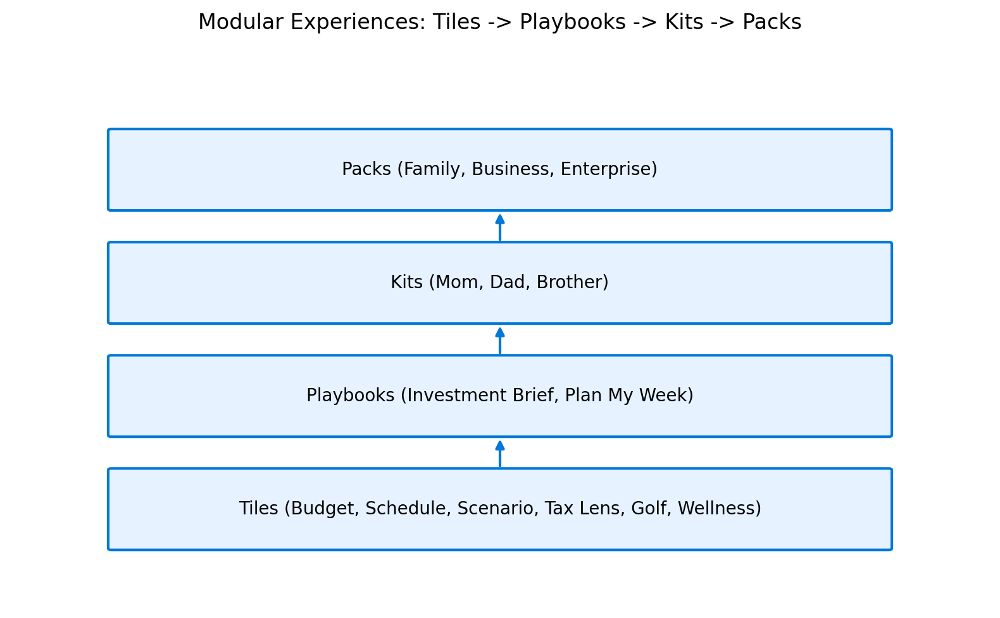

# IntelIntent

**Simplifying life today, empowering collaboration tomorrow, creating a legacy of intelligence for future generations.**

IntelIntent is our family's intelligent core—an intent-driven system that orchestrates **modular experiences** across personal, family, business, and enterprise.

> Ask -> Orchestrate -> Execute -> Explain -> Log

## Modular Experiences

- **Tiles**: capability units (Budget, Schedule, Scenario, Tax Lens, Golf, Wellness)
- **Playbooks**: chained tiles for outcomes (Investment Brief, Plan My Week)
- **Kits**: persona bundles (Mom, Dad, Brother)
- **Packs**: domain bundles (Family, Business, Enterprise)

## Get the PDFs

- [Executive One-Pager](downloads/IntelIntent_OnePage.pdf)
- [Concept Brief](downloads/IntelIntent_ConceptBrief.pdf)

## Next

Use the navigation to explore Personas, Partner Success, CEO Integration, Lifestyle Automation, 4-Week Journey, and the Declaration Library.
