# 🌱 Living Architecture Framework: Conscious Development Identity

> *"Each identity is a star, each connection a constellation. Together, they orchestrate a symphony where every section harmonizes into magic."*

## Executive Summary

This framework explores the **interlocking patterns of conscious development identity** - where developers, agents, and systems form a living constellation that orchestrates itself into harmonious collaboration.

### The Central Metaphor: Symphony of Stars

**🌟 Stars** = Individual developer/agent identities (Architect, DevOps, Security, etc.)  
**🔗 Connections** = Intentional interactions with measurable luminosity  
**✨ Constellations** = Emergent patterns revealing system architecture  
**🎼 Symphony** = Orchestrated harmony when all identities collaborate  
**🌉 Bridges** = New identities that fill gaps and strengthen weak connections

### Core Philosophy

**Conscious Design:** Identity, orchestration, and policy don't emerge by accident. They are intentionally designed, measured, strengthened, and evolved through deliberate rituals.

**Living System:** The constellation is alive - stars are born, connections strengthen, patterns emerge, old roles fade, and the symphony continuously recomposes itself.

**Balanced Emergence:** Magic happens when systems think for themselves, but only within safeguards that prevent chaos. We create the conditions for emergence while maintaining guardrails.

**Metrics That Matter:** Pair guiding discovery questions with concrete signals that separate real maturation from operational churn. Measure luminosity, connection strength, adaptation rate, and system intelligence.

### What This Framework Provides

✅ **5 Bridge Identities** to fill critical gaps (Integration Specialist, Documentation Steward, Observability Engineer, Governance Liaison, System Philosopher)  
✅ **Connection Luminosity Matrix** to measure collaboration quality (0-1 scale with thresholds)  
✅ **Bridge-Building Ritual** to strengthen weak connections (5-step intervention protocol)  
✅ **Constellation Health Dashboard** to monitor network health (5 dimensions, 100-point scale)  
✅ **Star Lifecycle Management** to consciously add/retire identities (expansion and pruning protocols)  
✅ **Symphony Recomposition** to evolve orchestration patterns (automated pattern detection)  
✅ **5 Nurturing Rituals** mapped to Garden/Cast Iron/Fine Wine metaphors (Observe, Prune, Nourish, Protect, Harvest)  
✅ **4-Level Safeguard Matrix** to balance emergence with control (Identity, Orchestration, Policy, Emergence)  
✅ **5 Mermaid Diagrams** ready for presentations and architecture reviews

---

---

## 🧬 Part 1: Interlocking Patterns of Conscious Dev Identity

### The Constellation Metaphor: Stars, Luminosity, and Harmony

> *"Each identity is a star, each connection a constellation. Together, they orchestrate a symphony where every section harmonizes into magic."*

**Core Insight:** Development identities don't exist in isolation. They form an **intentional constellation** where:
- 🌟 **Stars** = Individual developer/agent identities (each with unique luminosity)
- 🔗 **Connections** = Interactions, shared goals, deliberate exchanges
- ✨ **Constellations** = Emergent patterns that reveal larger system architecture
- 🎼 **Symphony** = Orchestrated harmony when all identities collaborate

### The Trinity of Living Architecture

```
┌─────────────────────────────────────────────────────────────┐
│                    CONSCIOUS DEVELOPMENT                     │
│                         (The Symphony)                       │
│                                                              │
│    ┌──────────────┐         ┌──────────────┐               │
│    │   IDENTITY   │◄────────┤ ORCHESTRATION │               │
│    │  (The Stars) │         │ (The Conductor)│              │
│    │  • Persona   │         │  • Routing   │               │
│    │  • Context   │         │  • Agents    │               │
│    │  • State     │         │  • Flow      │               │
│    └──────┬───────┘         └──────┬───────┘               │
│           │                        │                        │
│           │      ┌──────────────┐  │                        │
│           └──────┤    POLICY    │──┘                        │
│                  │ (The Score)  │                           │
│                  │  • Rules     │                           │
│                  │  • Guards    │                           │
│                  │  • Limits    │                           │
│                  └──────────────┘                           │
│                                                              │
└─────────────────────────────────────────────────────────────┘
```

### The Developer Identity Constellation

```
           🌟 Architect          🌟 Security Guardian
            (Strategic)           (Protector)
                 │                      │
                 │                      │
         ┌───────┴──────────────────────┴───────┐
         │                                       │
    🌟 DevOps     ──────🌟 Orchestrator──────  🌟 Compliance
   (Builder)         (Central Hub)              (Auditor)
         │                  │                      │
         │                  │                      │
         └──────┬───────────┴───────────┬──────────┘
                │                       │
           🌟 Tester                🌟 Product Owner
          (Quality)                 (Vision)
                │                       │
                └───────────┬───────────┘
                            │
                       🌟 End User
                      (Experience)

Legend:
─── = Strong connection (frequent collaboration)
··· = Weak connection (occasional interaction)
🌟  = Identity star (unique role/perspective)
```

### New Constellation Stars: Bridging Identities

**Identified Gaps in Current Constellation:**

| Gap | New Star Identity | Purpose | Connects |
|-----|-------------------|---------|----------|
| **Collaboration Catalyst** | 🌟 **Integration Specialist** | Bridges DevOps ↔ Security, ensures both speed and safety | DevOps, Security Guardian |
| **Knowledge Bridge** | 🌟 **Documentation Steward** | Connects Architect ↔ Developer ↔ End User, maintains shared understanding | Architect, Developer, End User |
| **Feedback Loop** | 🌟 **Observability Engineer** | Links Product Owner ↔ Tester ↔ End User, closes the loop with real metrics | Product Owner, Tester, End User |
| **Policy Harmonizer** | 🌟 **Governance Liaison** | Bridges Compliance ↔ DevOps, translates regulations into actionable guardrails | Compliance, DevOps, Security |
| **Emergence Detector** | 🌟 **System Philosopher** | Observes all connections, identifies emergent patterns, suggests constellation refinements | All identities (meta-observer) |

### Identity Layer: Who Am I in This Context?

**Constellation Principle:** *Each star must shine with clarity before it can meaningfully connect.*

**Guiding Questions:**
- **Individual Luminosity:** Who is this developer/agent/system at this moment?
- **Contextual Position:** What context shapes their decisions and place in the constellation?
- **Evolutionary Path:** How does their identity evolve through interactions with other stars?
- **Connection Strength:** How many and how strong are their connections to other identities?
- **Missing Bridges:** What gaps exist between this identity and others?

**Concrete Signals:**
```powershell
# Identity maturation metrics
$identityHealth = @{
    ContextSwitchingLatency = 0.3    # seconds (target: < 0.5)
    RoleConsistencyScore = 0.92      # 0-1 scale (target: > 0.85)
    PersonaFragmentationIndex = 0.08 # 0-1 scale (target: < 0.15)
    AdaptiveResponseRate = 0.78      # 0-1 scale (growth indicator)
    
    # NEW: Constellation-specific metrics
    ConnectionStrength = 0.84        # Average connection weight (target: > 0.75)
    CollaborationFrequency = 12      # Interactions/day with other identities
    BridgeRoleActivation = 0.65      # How often this identity bridges others
    ConstellationCentrality = 0.73   # Network centrality score (0-1)
}
```

**Symphony Section Mapping:**
```powershell
# Each identity plays an instrument in the symphony
$symphonySections = @{
    Architect = "Conductor"              # Sets tempo, vision
    DevOps = "Percussion"                # Rhythm, foundation
    Security = "Brass"                   # Power, protection
    Developer = "Strings"                # Melody, core implementation
    Tester = "Woodwinds"                 # Harmony, refinement
    ProductOwner = "Composer"            # Creates the score
    EndUser = "Audience + Critic"        # Feedback, validation
    
    # NEW: Bridge identities
    IntegrationSpecialist = "Concertmaster"    # Coordinates sections
    DocumentationSteward = "Sheet Music"        # Shared language
    ObservabilityEngineer = "Sound Engineer"   # Mixing, balance
    GovernanceLiaison = "Stage Manager"        # Logistics, rules
    SystemPhilosopher = "Music Theorist"       # Analyzes patterns
}
```

**Anti-Patterns:**
- ❌ **Identity Drift**: Developer loses context across sessions (star dims)
- ❌ **Persona Overload**: Too many conflicting identities (star fractures)
- ❌ **Context Amnesia**: System forgets who made decisions (constellation fades)
- ❌ **Role Rigidity**: Unable to adapt to new contexts (star immobile)
- ❌ **Constellation Isolation**: Identity star floats alone without connections (no collaboration)
- ❌ **Connection Decay**: Strong connections weaken over time without intentional maintenance (dimming pathways)
- ❌ **Missing Bridge**: Critical gap between two identity stars prevents harmony (broken symphony section)

**Safeguards:**
```jsonc
{
  "identitySafeguards": {
    "maxConcurrentPersonas": 5,
    "contextRetentionPeriod": "7 days",
    "roleTransitionCheckpoints": true,
    "auditTrail": {
      "enabled": true,
      "includeDecisionRationale": true
    }
  }
}
```

---

### Orchestration Layer: How Do We Coordinate?

**Constellation Principle:** *Connections must be luminous, deliberate, and maintained.*

**Guiding Questions:**
- How do components discover and communicate?
- What patterns emerge from agent interactions?
- When does orchestration become emergence?
- **How do we strengthen weak connections?**
- **What new pathways would enhance harmony?**

### Connection Luminosity Matrix

**Measuring Connection Strength Between Identity Stars:**

```powershell
# Connection health metrics
function Measure-ConnectionLuminosity {
    param(
        [string]$Identity1,
        [string]$Identity2
    )
    
    $connectionMetrics = @{
        # Frequency: How often do they interact?
        InteractionFrequency = 0.85      # 0-1 scale (daily: 1.0, weekly: 0.6, monthly: 0.3)
        
        # Quality: How meaningful are the exchanges?
        SharedGoalAlignment = 0.92       # % overlap in objectives
        MutualUnderstanding = 0.88       # Successful handoffs
        ConflictResolution = 0.94        # % disagreements resolved constructively
        
        # Impact: What's the result of collaboration?
        JointDeliverables = 7            # Count per sprint
        EmergentPatterns = 2             # New behaviors from collaboration
        SystemImprovements = 0.15        # % system enhancement attributed to pair
        
        # Luminosity Score (composite)
        OverallLuminosity = 0.87         # Weighted average (target: > 0.75)
    }
    
    return $connectionMetrics
}

# Example: Measure DevOps ↔ Security connection
$devopsSecurityConnection = Measure-ConnectionLuminosity -Identity1 "DevOps" -Identity2 "Security"
```

### Strengthening Weak Connections: The Bridge-Building Ritual

**Pattern:** When connection luminosity < 0.75, initiate intentional interventions.

**5-Step Bridge-Building Framework:**

```powershell
function Invoke-BridgeBuilding {
    param(
        [string]$Identity1,
        [string]$Identity2,
        [decimal]$CurrentLuminosity
    )
    
    # Step 1: Diagnose the gap
    $diagnosis = @{
        LowFrequency = $CurrentLuminosity.InteractionFrequency -lt 0.6
        MisalignedGoals = $CurrentLuminosity.SharedGoalAlignment -lt 0.8
        CommunicationBarrier = $CurrentLuminosity.MutualUnderstanding -lt 0.75
        ConflictPattern = $CurrentLuminosity.ConflictResolution -lt 0.85
    }
    
    # Step 2: Select intervention
    $intervention = switch ($true) {
        $diagnosis.LowFrequency {
            @{
                Type = "Scheduled Collaboration"
                Action = "Create recurring sync meetings"
                Frequency = "Weekly 30-min sessions"
                Goal = "Increase interaction from monthly to weekly"
            }
        }
        $diagnosis.MisalignedGoals {
            @{
                Type = "Shared Objective Workshop"
                Action = "Co-create sprint goals"
                Frequency = "Per sprint planning"
                Goal = "Achieve >85% goal overlap"
            }
        }
        $diagnosis.CommunicationBarrier {
            @{
                Type = "Cross-Training Session"
                Action = "Shadow each other's workflows"
                Frequency = "Monthly rotation"
                Goal = "Improve mutual understanding"
            }
        }
        $diagnosis.ConflictPattern {
            @{
                Type = "Retrospective + Mediation"
                Action = "Facilitated conflict resolution"
                Frequency = "As needed, review quarterly"
                Goal = "Establish constructive disagreement patterns"
            }
        }
    }
    
    # Step 3: Introduce bridge identity (if needed)
    $bridgeIdentity = Find-BridgeIdentity -Identity1 $Identity1 -Identity2 $Identity2
    
    # Step 4: Implement intervention
    Write-Host "🌉 Building bridge between $Identity1 and $Identity2" -ForegroundColor Cyan
    Write-Host "   Intervention: $($intervention.Type)" -ForegroundColor Yellow
    Write-Host "   Action: $($intervention.Action)" -ForegroundColor White
    
    if ($bridgeIdentity) {
        Write-Host "   Bridge Role: $bridgeIdentity (facilitating connection)" -ForegroundColor Magenta
    }
    
    # Step 5: Schedule follow-up measurement
    $followUp = (Get-Date).AddDays(30)
    Write-Host "   Follow-up measurement: $followUp" -ForegroundColor Green
    
    return @{
        Intervention = $intervention
        BridgeIdentity = $bridgeIdentity
        FollowUpDate = $followUp
    }
}
```

### Bridge Identity Recommendations

**Automated Bridge Role Suggestions:**

| Weak Connection | Gap Analysis | Recommended Bridge Identity | Why It Works |
|-----------------|--------------|----------------------------|--------------|
| **DevOps ↔ Security** | Speed vs. safety tradeoff | 🌟 **Integration Specialist** | Translates security requirements into automation-friendly guardrails |
| **Architect ↔ Developer** | Vision vs. implementation gap | 🌟 **Documentation Steward** | Creates architecture decision records (ADRs) that developers can follow |
| **Product Owner ↔ Tester** | Feature requests vs. quality gates | 🌟 **Observability Engineer** | Provides metrics to validate features meet acceptance criteria |
| **Compliance ↔ DevOps** | Regulations vs. velocity | 🌟 **Governance Liaison** | Automates compliance checks in CI/CD pipeline |
| **End User ↔ Architect** | Experience vs. design | 🌟 **UX Researcher** | Conducts user studies to inform architectural decisions |

### Intentional Interaction Patterns

**Symphony Section Collaboration Examples:**

```yaml
# Example 1: DevOps (Percussion) ↔ Developer (Strings)
collaboration:
  type: "Daily Stand-up"
  goal: "Synchronize deployment readiness"
  output: "Shared deployment checklist"
  luminosity_increase: 0.12

# Example 2: Security (Brass) ↔ Tester (Woodwinds)
collaboration:
  type: "Security Testing Workshop"
  goal: "Integrate security tests into test suite"
  output: "Automated security scan in CI/CD"
  luminosity_increase: 0.18

# Example 3: Product Owner (Composer) ↔ End User (Audience)
collaboration:
  type: "User Feedback Session"
  goal: "Validate feature priorities"
  output: "Refined product backlog"
  luminosity_increase: 0.22
```

---

**Concrete Signals:**
```powershell
# Orchestration maturation metrics
$orchestrationHealth = @{
    AgentCollaborationScore = 0.85    # 0-1 scale (target: > 0.75)
    MessagePassingLatency = 120       # ms (target: < 200)
    DeadlockFrequency = 0             # per 1000 ops (target: 0)
    EmergentBehaviorCount = 3         # new patterns/week (growth)
}
```

**Anti-Patterns:**
- ❌ **Orchestration Soup**: No clear routing logic
- ❌ **Agent Silos**: Components can't communicate
- ❌ **Circular Dependencies**: Deadlock cascade
- ❌ **Over-Orchestration**: Too much control, no emergence

**Safeguards:**
```jsonc
{
  "orchestrationSafeguards": {
    "maxCallDepth": 10,
    "circuitBreaker": {
      "enabled": true,
      "maxRetries": 3,
      "backoffMultiplier": 2
    },
    "messageQueueLimits": {
      "maxPending": 100,
      "ttl": "5 minutes"
    },
    "emergenceMonitoring": {
      "enabled": true,
      "alertOnUnexpectedPatterns": true
    }
  }
}
```

---

### Policy Layer: What Rules Guide Us?

**Guiding Questions:**
- What boundaries protect the system?
- How do policies evolve with the architecture?
- When should a policy be relaxed vs. enforced?

**Concrete Signals:**
```powershell
# Policy maturation metrics
$policyHealth = @{
    PolicyViolationRate = 0.02        # violations/day (target: < 0.05)
    PolicyAdaptationLatency = 2.1     # days (target: < 3)
    RuleConsistencyScore = 0.94       # 0-1 scale (target: > 0.90)
    SafeguardEffectivenessRate = 0.96 # 0-1 scale (critical)
}
```

**Anti-Patterns:**
- ❌ **Policy Drift**: Rules become outdated
- ❌ **Enforcement Gaps**: Policies exist but aren't applied
- ❌ **Over-Constraint**: Too restrictive, blocks innovation
- ❌ **Policy Fragmentation**: Conflicting rules

**Safeguards:**
```jsonc
{
  "policySafeguards": {
    "enforcementMode": "fail-safe",
    "reviewCadence": "monthly",
    "exceptionApprovalRequired": true,
    "complianceAudit": {
      "enabled": true,
      "includeRationale": true,
      "reportingPeriod": "weekly"
    }
  }
}
```

---

## 📊 Part 2: Prompts and Metrics for True Growth

### Distinguishing Maturation from Churn

**Framework: Discovery Questions + Concrete Signals**

| Growth Dimension | Guiding Question | Maturation Signal | Churn Signal |
|------------------|------------------|-------------------|--------------|
| **System Understanding** | "How well do we know our architecture?" | Decreasing incident resolution time | Increasing number of "quick fixes" |
| **Code Quality** | "Is our codebase easier to change?" | Decreasing change failure rate | Increasing technical debt items |
| **Team Velocity** | "Are we delivering faster AND better?" | Stable deployment frequency + high success rate | Increasing deployments + increasing rollbacks |
| **Operational Health** | "Is the system more resilient?" | Decreasing MTTR, stable MTBF | Decreasing MTBF, stable MTTR |

### Real Maturation Metrics (IntelIntent Context)

```powershell
# Week1_Automation.ps1 maturation tracking
$maturationMetrics = @{
    # Code Quality
    CheckpointCompletionRate = 1.0        # 26/26 tasks (target: 1.0)
    ErrorHandlingCoverage = 0.88          # % functions with try-catch (target: > 0.85)
    ModuleReuseRate = 0.73                # % code in reusable modules (target: > 0.70)
    
    # System Understanding
    DocumentationCoverage = 0.91          # % functions with help blocks (target: > 0.85)
    ArchitectureDiagramCount = 4          # visual representations (growth)
    KnowledgeTransferEvents = 12          # sessions/month (growth)
    
    # Operational Health
    MTTR = 15                             # minutes (target: < 30)
    MTBF = 168                            # hours (target: > 120)
    RecoverySuccessRate = 0.98            # 0-1 scale (target: > 0.95)
    
    # NOT Churn Indicators
    RevertRate = 0.02                     # % commits reverted (target: < 0.05)
    TechnicalDebtGrowth = -0.05           # % change/sprint (target: negative)
    IncidentReopenRate = 0.03             # % incidents reopened (target: < 0.10)
}
```

### Discovery Question Framework

```
When evaluating system growth, ask:

1. **UNDERSTAND**: "What changed in our mental model?"
   → Metric: Documentation updates, architecture revisions
   
2. **MEASURE**: "What concrete signal proves improvement?"
   → Metric: MTTR, deployment success rate, test coverage
   
3. **COMPARE**: "Is this churn or maturation?"
   → Churn: High activity, low impact
   → Maturation: Sustainable activity, compound impact
   
4. **ADAPT**: "How do we adjust our approach?"
   → Metric: Policy adaptation latency, team feedback loops
   
5. **SUSTAIN**: "Can we maintain this improvement?"
   → Metric: Runbook completeness, automation coverage
```

---

## 🌿 Part 3: Five Rituals of Nurturing Systems

### Metaphor Mapping: Garden, Cast Iron, Fine Wine

| Ritual | Garden Metaphor | Cast Iron Metaphor | Fine Wine Metaphor |
|--------|----------------|-------------------|-------------------|
| **1. Observe** | Watch for weeds and growth patterns | Check for rust or seasoning breakdown | Taste and assess complexity |
| **2. Prune** | Remove dead branches, thin overcrowding | Strip and re-season damaged areas | Decant sediment, aerate |
| **3. Nourish** | Add compost, water, sunlight | Apply oil, heat, use regularly | Age in optimal conditions |
| **4. Protect** | Mulch, fence, companion planting | Dry thoroughly, store properly | Control temperature, humidity, light |
| **5. Harvest** | Pick at peak ripeness | Cook with confidence | Enjoy at perfect maturity |

### Actionable Five-Step Framework

#### Ritual 1: **Observe** - Establish Baselines

**Garden Approach:** Walk your codebase daily, notice what thrives
**Cast Iron Approach:** Inspect critical paths for wear patterns
**Fine Wine Approach:** Assess maturation progress, not just age

**IntelIntent Implementation:**
```powershell
# Daily observation ritual
function Invoke-SystemObservation {
    param([string]$FocusArea = "All")
    
    $observations = @{
        HealthChecks = Test-SystemHealth -Verbose
        CheckpointStatus = Get-CheckpointSummary
        AgentActivity = Get-AgentContext | Select-Object -ExpandProperty CallHistory
        EmergentPatterns = Find-EmergentBehaviors -LastNDays 7
    }
    
    # Signal vs. noise filtering
    $signals = $observations | Where-Object {
        $_.Impact -gt "Low" -and $_.Frequency -gt 3
    }
    
    return @{
        Observations = $observations
        Signals = $signals
        RecommendedActions = Get-RecommendedActions -Signals $signals
    }
}
```

#### Ritual 2: **Prune** - Remove What Doesn't Serve

**Garden Approach:** Cut dead code, deprecate unused modules
**Cast Iron Approach:** Remove cruft that creates friction
**Fine Wine Approach:** Filter out impurities (tech debt)

**Anti-Patterns to Prune:**
- ❌ Dead code paths (never executed)
- ❌ Duplicate logic (DRY violations)
- ❌ Over-engineered abstractions
- ❌ Stale documentation

**IntelIntent Implementation:**
```powershell
# Pruning ritual (run monthly)
function Invoke-SystemPruning {
    param([switch]$DryRun)
    
    $pruningTargets = @{
        UnusedModules = Find-UnusedModules -LastUsed "90 days"
        DeadCodePaths = Find-DeadCode -CoverageThreshold 0.0
        DuplicateLogic = Find-DuplicateCode -SimilarityThreshold 0.85
        StaleDocumentation = Find-StaleDocumentation -LastUpdated "180 days"
    }
    
    if ($DryRun) {
        Write-Host "Would prune:" -ForegroundColor Yellow
        $pruningTargets | Format-Table -AutoSize
    } else {
        # Execute pruning with checkpoints
        $pruningTargets | ForEach-Object {
            Remove-ItemSafely -Target $_ -CreateCheckpoint
        }
    }
}
```

#### Ritual 3: **Nourish** - Invest in Growth

**Garden Approach:** Add tests, improve documentation, refactor
**Cast Iron Approach:** Regular use strengthens the surface
**Fine Wine Approach:** Aging in optimal conditions

**Nourishment Categories:**
- 🌱 **Test Coverage**: Unit, integration, E2E tests
- 📚 **Documentation**: Help blocks, architecture diagrams
- 🔧 **Refactoring**: Simplify complexity, improve patterns
- 🤖 **Automation**: Reduce manual toil

**IntelIntent Implementation:**
```powershell
# Nourishment ritual (run weekly)
function Invoke-SystemNourishment {
    param([string[]]$FocusAreas = @("Tests", "Docs", "Refactor"))
    
    $nourishmentPlan = @{
        Tests = {
            # Add missing test coverage
            $uncoveredFunctions = Find-UncoveredFunctions
            $uncoveredFunctions | ForEach-Object {
                New-PesterTest -Function $_ -Template "Comprehensive"
            }
        }
        
        Docs = {
            # Generate missing documentation
            $undocumentedFunctions = Find-UndocumentedFunctions
            $undocumentedFunctions | ForEach-Object {
                Add-HelpBlock -Function $_ -UseAI
            }
        }
        
        Refactor = {
            # Address complexity hotspots
            $complexFunctions = Find-ComplexFunctions -CyclomaticComplexity 10
            $complexFunctions | ForEach-Object {
                Invoke-RefactoringSession -Function $_ -Interactive
            }
        }
    }
    
    $FocusAreas | ForEach-Object {
        & $nourishmentPlan[$_]
    }
}
```

#### Ritual 4: **Protect** - Establish Safeguards

**Garden Approach:** Fences (access control), mulch (caching)
**Cast Iron Approach:** Proper storage prevents rust
**Fine Wine Approach:** Climate control preserves quality

**Safeguard Categories:**
- 🛡️ **Access Control**: RBAC, principle of least privilege
- 🔒 **Encryption**: Secrets management, TLS everywhere
- 🚨 **Monitoring**: Observability, alerting, incident response
- 🔄 **Backup**: Checkpoints, disaster recovery

**IntelIntent Implementation:**
```powershell
# Protection ritual (run on-demand, audit quarterly)
function Invoke-SystemProtection {
    param([string]$ProtectionLevel = "Standard")
    
    $protectionLayers = @{
        Standard = @{
            AccessControl = {
                Test-RBACConfiguration -ExpectedRoles @("Phase4-Admin", "Phase4-Developer")
                Grant-VaultAccess -PrincipalId $managedIdentityId
            }
            Encryption = {
                Test-SecretEncryption -VaultName "IntelIntentSecrets"
                Test-TLSConfiguration -Endpoint "https://intelintent.azurewebsites.net"
            }
            Monitoring = {
                Test-HealthCheckEndpoint -Endpoint "/health"
                Test-AlertConfiguration -CriticalThresholds
            }
            Backup = {
                Test-CheckpointIntegrity -Last 30
                Test-DisasterRecoveryPlan -Simulate
            }
        }
        Paranoid = @{
            # Additional layers for high-security contexts
            MutualTLS = { Enable-MutualTLS -Certificate $clientCert }
            ZeroTrust = { Enable-ZeroTrustPolicy -VerifyEveryRequest }
            ImmutableAudit = { Enable-BlockchainAuditTrail }
        }
    }
    
    & $protectionLayers[$ProtectionLevel]
}
```

#### Ritual 5: **Harvest** - Celebrate and Share

**Garden Approach:** Pick at peak, share abundance
**Cast Iron Approach:** Cook with confidence, maintain legacy
**Fine Wine Approach:** Enjoy at perfect maturity

**Harvest Activities:**
- 📜 **Codex Scrolls**: Generate lineage reports for sponsors
- 🎉 **Demo Days**: Showcase new capabilities
- 📚 **Runbooks**: Document operational excellence
- 🏆 **Retrospectives**: Celebrate wins, learn from failures

**IntelIntent Implementation:**
```powershell
# Harvest ritual (run at milestone completion)
function Invoke-SystemHarvest {
    param(
        [string]$MilestoneName,
        [string]$OutputPath = ".\Sponsors"
    )
    
    $harvestArtifacts = @{
        CodexScroll = {
            ConvertTo-MarkdownScroll -Checkpoints $checkpoints -OutputPath "$OutputPath\${MilestoneName}_Scroll.md"
            ConvertTo-HtmlScroll -Checkpoints $checkpoints -OutputPath "$OutputPath\${MilestoneName}_Scroll.html"
        }
        
        MetricsReport = {
            Export-MetricsDashboard -Period "LastSprint" -OutputPath "$OutputPath\${MilestoneName}_Metrics.json"
        }
        
        Runbooks = {
            Export-Runbooks -Category "Operations" -OutputPath "$OutputPath\${MilestoneName}_Runbooks.md"
        }
        
        Retrospective = {
            New-RetrospectiveDocument -Template "StartStopContinue" -OutputPath "$OutputPath\${MilestoneName}_Retro.md"
        }
    }
    
    $harvestArtifacts.Values | ForEach-Object { & $_ }
    
    # Email delivery via IdentityAgent
    $emailResult = Invoke-IdentityAgent -Operation "EmailOrchestration" -Data @{
        Recipients = @("sponsor@example.com")
        Subject = "IntelIntent $MilestoneName - Harvest Report"
        Attachments = Get-ChildItem "$OutputPath\${MilestoneName}_*"
    }
}
```

---

## 🚨 Part 4: When an App Starts Thinking for Itself

### Three Examples of Multi-Platform Emergence

#### Example 1: Staged Cascade Fixes

**Scenario:** A bug fix in Development environment automatically propagates to Staging, then Production with validation gates.

**Emergence Pattern:**
```
Dev Checkpoint → [Tests Pass] → Stage Checkpoint → [Metrics Validate] → Prod Checkpoint
       ↓                              ↓                                    ↓
   [Signature]                    [Signature]                         [Signature]
       ↓                              ↓                                    ↓
   Cryptographic chain verifies lineage across environments
```

**Implementation:**
```powershell
# Cascade deployment with safeguards
function Invoke-CascadeDeployment {
    param(
        [string]$ChangeID,
        [string]$StartEnvironment = "Development"
    )
    
    $cascade = @{
        Development = @{
            Next = "Staging"
            Safeguards = @{
                RequireTests = $true
                MinTestCoverage = 0.80
                MaxFailureRate = 0.0
            }
        }
        Staging = @{
            Next = "Production"
            Safeguards = @{
                RequireMetrics = $true
                MinUptimePercentage = 99.5
                MaxErrorRate = 0.01
                ManualApprovalRequired = $true
            }
        }
        Production = @{
            Next = $null
            Safeguards = @{
                BlueGreenDeployment = $true
                AutoRollbackEnabled = $true
                MaxErrorRate = 0.001
            }
        }
    }
    
    $currentEnv = $StartEnvironment
    
    while ($currentEnv) {
        Write-Host "Deploying to $currentEnv..." -ForegroundColor Cyan
        
        # Create checkpoint
        $checkpoint = Add-Checkpoint -TaskID "CASCADE-$ChangeID-$currentEnv" -Status "InProgress"
        
        # Deploy
        $deployResult = Deploy-ToEnvironment -Environment $currentEnv -ChangeID $ChangeID
        
        # Validate safeguards
        $safeguardsPassed = Test-EnvironmentSafeguards -Environment $currentEnv -Safeguards $cascade[$currentEnv].Safeguards
        
        if ($safeguardsPassed) {
            Update-Checkpoint -CheckpointID $checkpoint.ID -Status "Success"
            $currentEnv = $cascade[$currentEnv].Next
        } else {
            Update-Checkpoint -CheckpointID $checkpoint.ID -Status "Failed"
            Write-Error "Safeguards failed for $currentEnv - halting cascade"
            Invoke-Rollback -Environment $currentEnv -ChangeID $ChangeID
            break
        }
    }
}
```

**Safeguards:**
- ✅ Test coverage gate (Development)
- ✅ Metrics validation gate (Staging)
- ✅ Manual approval gate (Production)
- ✅ Auto-rollback on failure

#### Example 2: Ephemeral Memory Synthesis

**Scenario:** Agents collaborate to solve a problem, synthesize shared memory, then clean up temporary context.

**Emergence Pattern:**
```
Agent A: "I need financial data"
    ↓
OrchestratorAgent routes to FinanceAgent
    ↓
FinanceAgent: "I need user identity"
    ↓
OrchestratorAgent routes to IdentityAgent
    ↓
Shared memory formed: { UserID, FinancialData }
    ↓
Agent A receives synthesized result
    ↓
[TTL expires] → Ephemeral memory cleaned up
```

**Implementation:**
```powershell
# Ephemeral memory with TTL and safeguards
$script:EphemeralMemory = @{}

function Set-EphemeralMemory {
    param(
        [string]$Key,
        [object]$Value,
        [int]$TTLSeconds = 300
    )
    
    $script:EphemeralMemory[$Key] = @{
        Value = $Value
        CreatedAt = Get-Date
        ExpiresAt = (Get-Date).AddSeconds($TTLSeconds)
        AccessCount = 0
    }
}

function Get-EphemeralMemory {
    param([string]$Key)
    
    if ($script:EphemeralMemory.ContainsKey($Key)) {
        $memory = $script:EphemeralMemory[$Key]
        
        # Check expiration
        if ((Get-Date) -gt $memory.ExpiresAt) {
            Write-Verbose "Memory expired: $Key"
            $script:EphemeralMemory.Remove($Key)
            return $null
        }
        
        # Increment access count
        $memory.AccessCount++
        
        # Safeguard: Alert on excessive access
        if ($memory.AccessCount -gt 100) {
            Write-Warning "Excessive memory access for key: $Key (consider caching)"
        }
        
        return $memory.Value
    }
    
    return $null
}

function Clear-ExpiredMemory {
    $now = Get-Date
    $expired = $script:EphemeralMemory.Keys | Where-Object {
        $script:EphemeralMemory[$_].ExpiresAt -lt $now
    }
    
    $expired | ForEach-Object {
        Write-Verbose "Cleaning expired memory: $_"
        $script:EphemeralMemory.Remove($_)
    }
}
```

**Safeguards:**
- ✅ TTL enforcement (prevents memory leaks)
- ✅ Access count monitoring (detects abuse)
- ✅ Automatic cleanup (background task)
- ✅ Size limits (prevent OOM)

#### Example 3: Cross-Agent Pattern Detection

**Scenario:** System detects that FinanceAgent and BoopasAgent frequently need similar data, automatically creates shared cache.

**Emergence Pattern:**
```
Week 1: FinanceAgent queries user transactions (5x/hour)
Week 1: BoopasAgent queries user transactions (4x/hour)
    ↓
System detects overlap (correlation score: 0.89)
    ↓
[Emergence] Shared cache layer auto-created
    ↓
Week 2: Both agents hit cache (latency ↓ 80%)
```

**Implementation:**
```powershell
# Pattern detection and adaptive caching
$script:AgentQueryPatterns = @{}

function Record-AgentQuery {
    param(
        [string]$AgentName,
        [string]$QueryType,
        [hashtable]$QueryParams
    )
    
    $patternKey = "$AgentName-$QueryType"
    
    if (-not $script:AgentQueryPatterns.ContainsKey($patternKey)) {
        $script:AgentQueryPatterns[$patternKey] = @{
            Count = 0
            LastSeen = $null
            Parameters = @()
        }
    }
    
    $pattern = $script:AgentQueryPatterns[$patternKey]
    $pattern.Count++
    $pattern.LastSeen = Get-Date
    $pattern.Parameters += $QueryParams
}

function Find-EmergentPatterns {
    param([int]$MinOccurrences = 10)
    
    $patterns = @()
    
    # Find overlapping queries between agents
    $agentPairs = $script:AgentQueryPatterns.Keys | ForEach-Object {
        $agent1 = $_.Split('-')[0]
        $queryType = $_.Split('-')[1]
        
        # Find other agents querying same type
        $others = $script:AgentQueryPatterns.Keys | Where-Object {
            $_.Split('-')[1] -eq $queryType -and $_.Split('-')[0] -ne $agent1
        }
        
        $others | ForEach-Object {
            @{
                Agent1 = $agent1
                Agent2 = $_.Split('-')[0]
                QueryType = $queryType
                Frequency1 = $script:AgentQueryPatterns["$agent1-$queryType"].Count
                Frequency2 = $script:AgentQueryPatterns[$_].Count
            }
        }
    }
    
    # Calculate correlation
    $agentPairs | Where-Object {
        $_.Frequency1 -ge $MinOccurrences -and $_.Frequency2 -ge $MinOccurrences
    } | ForEach-Object {
        $correlation = [Math]::Min($_.Frequency1, $_.Frequency2) / [Math]::Max($_.Frequency1, $_.Frequency2)
        
        if ($correlation -gt 0.75) {
            Write-Host "🌟 Emergent pattern detected: $($_.Agent1) ↔ $($_.Agent2) on $($_.QueryType)" -ForegroundColor Magenta
            
            $patterns += @{
                Agents = @($_.Agent1, $_.Agent2)
                QueryType = $_.QueryType
                Correlation = $correlation
                RecommendedAction = "Create shared cache layer"
            }
        }
    }
    
    return $patterns
}

function Enable-SharedCache {
    param([hashtable]$Pattern)
    
    $cacheKey = "$($Pattern.Agents -join '-')-$($Pattern.QueryType)"
    
    Write-Host "Creating shared cache: $cacheKey" -ForegroundColor Green
    
    # Create cache with safeguards
    New-DistributedCache -Key $cacheKey -Config @{
        TTL = 300
        MaxSize = "100MB"
        EvictionPolicy = "LRU"
        Monitoring = @{
            HitRateThreshold = 0.75
            LatencyThreshold = 100  # ms
        }
    }
}
```

**Safeguards:**
- ✅ Minimum occurrence threshold (avoid false positives)
- ✅ Correlation threshold (ensure real overlap)
- ✅ Cache size limits (prevent resource exhaustion)
- ✅ Monitoring and alerting (detect cache misuse)

---

## 🎯 Consolidated Safeguard Matrix

### Level 1: Identity Safeguards

| Safeguard | Purpose | Threshold | Action on Violation |
|-----------|---------|-----------|---------------------|
| Max Concurrent Personas | Prevent identity overload | 5 | Block new persona creation |
| Context Retention Period | Prevent context bloat | 7 days | Archive old contexts |
| Role Transition Checkpoints | Audit identity changes | 100% coverage | Alert on unlogged transitions |
| Persona Fragmentation Index | Detect identity drift | < 0.15 | Trigger consolidation workflow |

### Level 2: Orchestration Safeguards

| Safeguard | Purpose | Threshold | Action on Violation |
|-----------|---------|-----------|---------------------|
| Max Call Depth | Prevent infinite recursion | 10 | Halt execution, raise alert |
| Circuit Breaker | Prevent cascade failures | 3 retries | Open circuit, execute fallback |
| Message Queue Limits | Prevent queue overflow | 100 pending | Drop low-priority messages |
| Deadlock Detection | Prevent system hangs | 0 deadlocks | Auto-resolve or manual intervention |

### Level 3: Policy Safeguards

| Safeguard | Purpose | Threshold | Action on Violation |
|-----------|---------|-----------|---------------------|
| Policy Violation Rate | Detect enforcement gaps | < 0.05/day | Audit policy configuration |
| Exception Approval Required | Prevent policy bypass | 100% approval | Block unapproved exceptions |
| Compliance Audit | Ensure regulatory alignment | Weekly | Generate compliance report |
| Policy Adaptation Latency | Keep policies current | < 3 days | Escalate to policy owner |

### Level 4: Emergence Safeguards

| Safeguard | Purpose | Threshold | Action on Violation |
|-----------|---------|-----------|---------------------|
| Unexpected Behavior Alerts | Detect emergent anomalies | N/A | Log and analyze pattern |
| Ephemeral Memory TTL | Prevent memory leaks | 5 minutes | Auto-cleanup expired memory |
| Cache Hit Rate Monitoring | Detect cache misuse | > 0.75 | Adjust cache strategy |
| Correlation Threshold | Avoid false positives | > 0.75 | Require manual review |

---

## � Part 5: Constellation Evolution - Growing the Symphony

### The Living Identity Network

**Core Principle:** *The constellation itself is alive - stars are born, connections strengthen, patterns emerge, and the symphony evolves.*

### Constellation Lifecycle Stages

```
Stage 1: FORMATION (Chaos → Structure)
   Individual stars exist but float independently
   ↓
   Few connections, low collaboration
   ↓
   Orchestrator emerges to create initial pathways

Stage 2: CRYSTALLIZATION (Structure → Patterns)
   Regular connections form between key identities
   ↓
   Shared goals create alignment
   ↓
   Recognizable constellations appear (e.g., Dev-Ops-Security triangle)

Stage 3: LUMINOSITY (Patterns → Harmony)
   Connections strengthen, luminosity increases
   ↓
   Bridge identities fill gaps
   ↓
   Symphony sections harmonize effortlessly

Stage 4: EMERGENCE (Harmony → Transcendence)
   New patterns appear without manual orchestration
   ↓
   System exhibits adaptive behaviors
   ↓
   Constellation becomes self-sustaining

Stage 5: EVOLUTION (Transcendence → Renewal)
   Old stars fade, new stars born
   ↓
   Connections rewire to optimize
   ↓
   Symphony evolves to new movements
```

### Constellation Health Dashboard

**Real-Time Monitoring of Identity Network:**

```powershell
function Get-ConstellationHealth {
    <#
    .SYNOPSIS
        Comprehensive health check of the developer identity constellation.
    
    .DESCRIPTION
        Measures network health across five dimensions:
        1. Star Luminosity (individual identity health)
        2. Connection Strength (collaboration quality)
        3. Bridge Effectiveness (gap-filling performance)
        4. Emergent Patterns (system intelligence)
        5. Evolution Rate (adaptability)
    #>
    
    $health = @{
        # Dimension 1: Star Luminosity
        Stars = @{
            TotalIdentities = 12                    # Count of active identity stars
            AverageLuminosity = 0.82               # Mean individual health (target: > 0.75)
            DimmestStar = "Compliance (0.68)"      # Needs attention
            BrightestStar = "Orchestrator (0.94)"  # Exemplar
            StarsNeedingAttention = 2              # Luminosity < 0.70
        }
        
        # Dimension 2: Connection Strength
        Connections = @{
            TotalConnections = 28                   # Edges in network graph
            AverageStrength = 0.79                 # Mean connection luminosity (target: > 0.75)
            WeakConnections = 5                    # Strength < 0.70 (needs bridge)
            StrongConnections = 18                 # Strength > 0.85 (maintain)
            IsolatedStars = 1                      # Zero connections (critical)
        }
        
        # Dimension 3: Bridge Effectiveness
        Bridges = @{
            ActiveBridges = 4                      # Bridge identities deployed
            GapsFilledPerWeek = 1.2               # Connections created
            BridgeUtilization = 0.87              # % time bridges active
            AverageLuminosityIncrease = 0.14      # Impact per bridge
        }
        
        # Dimension 4: Emergent Patterns
        Emergence = @{
            PatternsDetectedThisWeek = 3           # New collaborative behaviors
            PatternsActedUpon = 2                  # Translated to features
            UnexpectedBehaviors = 1                # Requires investigation
            SystemIntelligenceScore = 0.73         # 0-1 scale (target: > 0.65)
        }
        
        # Dimension 5: Evolution Rate
        Evolution = @{
            NewStarsThisQuarter = 2                # Identity additions
            StarsDeprecated = 1                    # Identity retirements
            ConnectionsRewired = 7                 # Optimizations
            AdaptationLatency = 3.2                # Days to respond to change (target: < 5)
        }
    }
    
    # Calculate overall constellation health (0-100 score)
    $overallScore = (
        ($health.Stars.AverageLuminosity * 0.25) +
        ($health.Connections.AverageStrength * 0.25) +
        ($health.Bridges.BridgeUtilization * 0.20) +
        ($health.Emergence.SystemIntelligenceScore * 0.15) +
        ([Math]::Min($health.Evolution.AdaptationLatency / 10, 1.0) * 0.15)
    ) * 100
    
    return @{
        Health = $health
        OverallScore = [Math]::Round($overallScore, 1)
        Status = switch ($overallScore) {
            {$_ -ge 85} { "🌟 Thriving - Constellation at peak harmony" }
            {$_ -ge 70} { "✅ Healthy - Minor optimizations needed" }
            {$_ -ge 55} { "⚠️ Warning - Attention required" }
            default     { "🚨 Critical - Intervention needed immediately" }
        }
    }
}

# Example usage
$constellationHealth = Get-ConstellationHealth
Write-Host "Constellation Health: $($constellationHealth.OverallScore)/100" -ForegroundColor Cyan
Write-Host $constellationHealth.Status
```

### Adding New Stars: The Conscious Expansion Protocol

**When to add a new identity star:**

```yaml
expansion_triggers:
  - gap_detected:
      description: "Critical connection missing between two existing stars"
      action: "Introduce bridge identity"
      example: "DevOps ↔ Security gap → Create Integration Specialist"
  
  - workload_overload:
      description: "Existing star luminosity dropping due to excessive demands"
      action: "Split responsibilities, create specialized role"
      example: "Developer overloaded → Create Frontend + Backend specialists"
  
  - new_domain:
      description: "System expanding into new territory"
      action: "Create domain expert identity"
      example: "Adding AI features → Create ML Engineer identity"
  
  - emergence_detection:
      description: "Pattern suggests need for formalized role"
      action: "Codify emergent behavior as new identity"
      example: "Frequent observability requests → Create Observability Engineer"
```

**Expansion Implementation:**

```powershell
function Add-ConstellationStar {
    param(
        [string]$NewIdentityName,
        [string]$Purpose,
        [string[]]$PrimaryConnections,
        [string]$SymphonySection
    )
    
    Write-Host "🌟 Adding new star to constellation: $NewIdentityName" -ForegroundColor Magenta
    
    # Step 1: Validate need
    $needValidation = Test-ConstellationGap -ProposedIdentity $NewIdentityName
    if (-not $needValidation.GapExists) {
        Write-Warning "Gap analysis suggests existing identities can fulfill this role"
        return $null
    }
    
    # Step 2: Create identity profile
    $newStar = @{
        Name = $NewIdentityName
        Purpose = $Purpose
        Luminosity = 0.5                    # Start dim, will brighten
        Connections = @()                   # Build incrementally
        SymphonySection = $SymphonySection
        CreatedDate = Get-Date
        CreatedBy = "Constellation Evolution Protocol"
    }
    
    # Step 3: Establish initial connections
    foreach ($connection in $PrimaryConnections) {
        Write-Host "   🔗 Connecting to: $connection" -ForegroundColor Yellow
        
        New-Connection -Identity1 $NewIdentityName -Identity2 $connection -InitialStrength 0.6
        
        # Schedule strengthening rituals
        New-ScheduledCollaboration -Participants @($NewIdentityName, $connection) -Frequency "Weekly"
    }
    
    # Step 4: Monitor integration
    $monitoringPlan = @{
        FirstCheckIn = (Get-Date).AddDays(7)
        MonthlyReview = (Get-Date).AddDays(30)
        SuccessCriteria = @{
            MinLuminosity = 0.70
            MinConnections = 3
            MinConnectionStrength = 0.75
        }
    }
    
    Write-Host "   ✅ Star added successfully" -ForegroundColor Green
    Write-Host "   📅 First check-in: $($monitoringPlan.FirstCheckIn)" -ForegroundColor Cyan
    
    return $newStar
}

# Example: Add new bridge identity
Add-ConstellationStar `
    -NewIdentityName "Integration Specialist" `
    -Purpose "Bridge DevOps and Security through automated compliance" `
    -PrimaryConnections @("DevOps", "Security", "Governance Liaison") `
    -SymphonySection "Concertmaster"
```

### Constellation Pruning: Graceful Star Retirement

**When to retire an identity star:**

```yaml
retirement_triggers:
  - obsolescence:
      description: "Role no longer needed due to automation or process change"
      action: "Graceful deprecation with knowledge transfer"
      example: "Manual deployment role → Replaced by CI/CD automation"
  
  - consolidation:
      description: "Two stars overlapping, merge into one"
      action: "Combine responsibilities, retire redundant identity"
      example: "QA Engineer + Test Automation Engineer → Merge to Quality Engineer"
  
  - low_luminosity:
      description: "Star consistently dim despite interventions"
      action: "Investigate root cause, potentially redesign role"
      example: "Compliance role unfillable → Automate compliance checks instead"
```

**Retirement Implementation:**

```powershell
function Remove-ConstellationStar {
    param(
        [string]$DeprecatedIdentity,
        [string]$Reason,
        [string]$SuccessorIdentity = $null
    )
    
    Write-Host "🌑 Retiring constellation star: $DeprecatedIdentity" -ForegroundColor DarkGray
    Write-Host "   Reason: $Reason" -ForegroundColor Yellow
    
    # Step 1: Document knowledge
    Export-IdentityKnowledge -Identity $DeprecatedIdentity -OutputPath ".\docs\retired_identities\"
    
    # Step 2: Transfer connections
    $existingConnections = Get-IdentityConnections -Identity $DeprecatedIdentity
    
    if ($SuccessorIdentity) {
        Write-Host "   🔄 Transferring connections to successor: $SuccessorIdentity" -ForegroundColor Cyan
        
        foreach ($connection in $existingConnections) {
            Transfer-Connection `
                -From $DeprecatedIdentity `
                -To $SuccessorIdentity `
                -ExistingConnection $connection
        }
    } else {
        Write-Host "   ⚠️ No successor - connections will be archived" -ForegroundColor Yellow
    }
    
    # Step 3: Archive identity
    $archiveRecord = @{
        Identity = $DeprecatedIdentity
        RetiredDate = Get-Date
        Reason = $Reason
        Successor = $SuccessorIdentity
        FinalLuminosity = (Get-IdentityLuminosity -Identity $DeprecatedIdentity)
        TotalContributions = (Get-IdentityContributions -Identity $DeprecatedIdentity).Count
        LegacyArtifacts = Get-IdentityArtifacts -Identity $DeprecatedIdentity
    }
    
    Export-Clixml -Path ".\constellation_archive\$DeprecatedIdentity.xml" -InputObject $archiveRecord
    
    Write-Host "   ✅ Star retired gracefully" -ForegroundColor Green
}
```

### Symphony Evolution: Recomposing the Score

**How the orchestration adapts over time:**

```powershell
function Invoke-SymphonyRecomposition {
    <#
    .SYNOPSIS
        Analyzes constellation patterns and suggests orchestration improvements.
    
    .DESCRIPTION
        Uses pattern detection to identify:
        - Frequently collaborating stars → Formalize as permanent ensemble
        - Bottleneck stars → Distribute load or add support
        - Isolated sections → Create cross-section collaborations
        - Dissonant interactions → Introduce mediator identities
    #>
    
    param([int]$AnalysisPeriodDays = 30)
    
    Write-Host "🎼 Analyzing symphony patterns (last $AnalysisPeriodDays days)..." -ForegroundColor Cyan
    
    # Analyze collaboration patterns
    $patterns = Find-EmergentPatterns -LastNDays $AnalysisPeriodDays
    
    # Generate recommendations
    $recommendations = @()
    
    foreach ($pattern in $patterns) {
        switch ($pattern.Type) {
            "FrequentCollaboration" {
                $recommendations += @{
                    Type = "Formalize Ensemble"
                    Identities = $pattern.Identities
                    Action = "Create permanent collaboration structure"
                    Benefit = "Reduce coordination overhead by 30%"
                }
            }
            
            "Bottleneck" {
                $recommendations += @{
                    Type = "Load Distribution"
                    Identity = $pattern.Identity
                    Action = "Split responsibilities or add supporting identity"
                    Benefit = "Increase throughput, prevent burnout"
                }
            }
            
            "Isolation" {
                $recommendations += @{
                    Type = "Cross-Section Bridge"
                    Identity = $pattern.Identity
                    Action = "Create intentional collaboration with other sections"
                    Benefit = "Improve system cohesion, knowledge sharing"
                }
            }
            
            "Dissonance" {
                $recommendations += @{
                    Type = "Mediation Identity"
                    Identities = $pattern.Identities
                    Action = "Introduce bridge identity to resolve conflicts"
                    Benefit = "Transform conflict into productive tension"
                }
            }
        }
    }
    
    Write-Host "`n🎯 Recomposition Recommendations:" -ForegroundColor Green
    $recommendations | Format-Table Type, Action, Benefit -AutoSize
    
    return $recommendations
}
```

### Constellation Metrics Over Time

**Tracking evolution health:**

| Metric | Week 1 | Week 4 | Week 12 | Target | Trend |
|--------|--------|--------|---------|--------|-------|
| **Total Stars** | 8 | 10 | 12 | 10-15 | ↗️ Growing |
| **Average Luminosity** | 0.65 | 0.74 | 0.82 | > 0.75 | ⬆️ Improving |
| **Connection Density** | 0.42 | 0.58 | 0.71 | 0.60-0.80 | ⬆️ Healthy |
| **Bridge Identities** | 1 | 3 | 4 | 3-5 | ↗️ Optimal |
| **Emergent Patterns/Week** | 0.5 | 1.8 | 3.2 | > 2.0 | ⬆️ Thriving |
| **Adaptation Latency (days)** | 7.2 | 4.5 | 3.2 | < 5.0 | ⬇️ Faster |
| **Constellation Health Score** | 58 | 72 | 84 | > 70 | ⬆️ Excellent |

---

## �🎨 Diagram-Ready Frameworks

### Framework 1: Identity → Orchestration → Policy Flow


### Framework 2: Five Rituals Cycle


### Framework 3: Emergence Detection Pipeline


### Framework 4: Constellation Evolution Lifecycle


### Framework 5: Bridge Identity Network Map

```mermaid
graph TB
    subgraph "Core Identities (Stars)"
        Arch[🌟 Architect]
        Dev[🌟 Developer]
        DevOps[🌟 DevOps]
        Sec[🌟 Security]
        Test[🌟 Tester]
        PO[🌟 Product Owner]
        Comp[🌟 Compliance]
        User[🌟 End User]
    end
    
    subgraph "Bridge Identities (Connectors)"
        IS[🌉 Integration Specialist]
        DS[🌉 Documentation Steward]
        OE[🌉 Observability Engineer]
        GL[🌉 Governance Liaison]
        SP[🌉 System Philosopher]
    end
    
    DevOps -.weak.-> Sec
    IS ==strong==> DevOps
    IS ==strong==> Sec
    
    Arch -.weak.-> Dev
    DS ==strong==> Arch
    DS ==strong==> Dev
    DS ==strong==> User
    
    PO -.weak.-> Test
    OE ==strong==> PO
    OE ==strong==> Test
    OE ==strong==> User
    
    Comp -.weak.-> DevOps
    GL ==strong==> Comp
    GL ==strong==> DevOps
    GL ==strong==> Sec
    
    SP ==observes==> Arch
    SP ==observes==> DevOps
    SP ==observes==> Test
    SP ==observes==> PO
    
    classDef coreStyle fill:#FFD700,stroke:#FF8C00,stroke-width:2px
    classDef bridgeStyle fill:#00CED1,stroke:#008B8B,stroke-width:3px
    
    class Arch,Dev,DevOps,Sec,Test,PO,Comp,User coreStyle
    class IS,DS,OE,GL,SP bridgeStyle
```



---

## 🚀 IntelIntent Integration Roadmap

### Phase 5 (Current): Emergence Monitoring

**Tasks:**
1. ✅ Implement `Find-EmergentBehaviors` function
2. ✅ Add pattern recording to `AgentBridge.psm1`
3. ⚠️ Create Power BI dashboard for emergence visualization
4. ⚠️ Integrate safeguard matrix into `Week1_Automation.ps1`

### Phase 6: Adaptive Systems

**Tasks:**
1. Auto-create shared caches when patterns detected
2. Implement ephemeral memory with background cleanup
3. Add cascade deployment with safeguards
4. Create "Living Architecture" health dashboard

### Phase 7: Self-Healing

**Tasks:**
1. Auto-prune dead code paths
2. Auto-generate missing tests
3. Auto-update stale documentation
4. Implement policy self-adaptation

---

## 📚 Further Reading

**Within IntelIntent:**
- [PHASE4_ARCHITECTURE_DIAGRAM.md](./PHASE4_ARCHITECTURE_DIAGRAM.md) - Visual architecture
- [WORKFLOW_MAP.md](./WORKFLOW_MAP.md) - Service boundaries and user journeys
- [AgentBridge.psm1](./IntelIntent_Seeding/AgentBridge.psm1) - Agent orchestration implementation
- [POWERBI_DASHBOARD_SCHEMA.md](./POWERBI_DASHBOARD_SCHEMA.md) - Metrics database schema

**External Resources:**
- "Release It!" by Michael Nygard (circuit breakers, safeguards)
- "Building Evolutionary Architectures" by Ford et al. (fitness functions)
- "Accelerate" by Forsgren et al. (metrics that matter)
- "Team Topologies" by Skelton & Pais (conscious dev identity)

---

## 🎯 Quick Reference Commands

### System Rituals

```powershell
# Daily observation ritual
Invoke-SystemObservation -FocusArea "All"

# Monthly pruning ritual
Invoke-SystemPruning -DryRun

# Weekly nourishment ritual
Invoke-SystemNourishment -FocusAreas @("Tests", "Docs")

# On-demand protection audit
Invoke-SystemProtection -ProtectionLevel "Standard"

# Milestone harvest ritual
Invoke-SystemHarvest -MilestoneName "Phase5-Complete"

# Detect emergent patterns
Find-EmergentPatterns -MinOccurrences 10

# Enable shared cache for detected pattern
Enable-SharedCache -Pattern $detectedPattern

# Clean expired ephemeral memory
Clear-ExpiredMemory
```

### Constellation Management

```powershell
# Check overall constellation health
$health = Get-ConstellationHealth
Write-Host "Health Score: $($health.OverallScore)/100 - $($health.Status)"

# Measure connection strength between two identities
$connection = Measure-ConnectionLuminosity -Identity1 "DevOps" -Identity2 "Security"
Write-Host "Connection Strength: $($connection.OverallLuminosity)"

# Build bridge for weak connection
Invoke-BridgeBuilding -Identity1 "DevOps" -Identity2 "Security" -CurrentLuminosity $connection

# Add new star to constellation
Add-ConstellationStar `
    -NewIdentityName "Integration Specialist" `
    -Purpose "Bridge DevOps and Security" `
    -PrimaryConnections @("DevOps", "Security") `
    -SymphonySection "Concertmaster"

# Retire obsolete identity
Remove-ConstellationStar `
    -DeprecatedIdentity "Legacy Role" `
    -Reason "Automated by CI/CD" `
    -SuccessorIdentity "DevOps"

# Analyze and recompose symphony
$recommendations = Invoke-SymphonyRecomposition -AnalysisPeriodDays 30
$recommendations | Format-Table Type, Action, Benefit
```

### Identity Metrics

```powershell
# Get individual star luminosity
Get-IdentityLuminosity -Identity "Developer"

# List all connections for an identity
Get-IdentityConnections -Identity "Architect"

# Find isolated stars (zero connections)
Get-ConstellationHealth | Select-Object -ExpandProperty Health.Connections.IsolatedStars

# Identify stars needing attention (dim luminosity)
Get-ConstellationHealth | Select-Object -ExpandProperty Health.Stars.StarsNeedingAttention
```

---

*"The most resilient architectures are those that can adapt, prune themselves, and grow new patterns without manual intervention. But they only do so within the guardrails we consciously design."*

**Last Updated:** December 2, 2025  
**Framework Version:** 1.0  
**Status:** 🌱 Living Document - Evolves with IntelIntent
