# IntelIntent Phase 4 - Enterprise Architecture Diagram

## Visual Architecture: Azure DevOps Pipeline + Power BI + Sponsor Delivery

```mermaid
graph TB
    %% ===========================
    %% Azure DevOps Pipeline Stages
    %% ===========================
    subgraph Pipeline["🔵 Azure DevOps Pipeline"]
        direction LR
        Stage1["<b>Stage 1: Build</b><br/>📦 Run Week1_Automation.ps1<br/>📜 Generate:<br/>• CodexScroll_Week1.md<br/>• CodexScroll_Week1.html<br/>• Week1_Checkpoints.json"]
        Stage2["<b>Stage 2: IntegrityCheck</b><br/>🔍 Test-CodexIntegrity<br/>✅ Validate:<br/>• SHA256 placeholders<br/>• Checkpoint structure<br/>• Agent distribution<br/>📊 Output: IntegrityReport.json"]
        Stage3["<b>Stage 3: PowerBIIngestion</b><br/>💾 Parse Week1_Checkpoints.json<br/>📥 Bulk insert into SQL<br/>(Checkpoints table)<br/>🔄 Trigger Power BI refresh"]
        Stage4["<b>Stage 4: SponsorApproval</b><br/>⏸️ Manual validation gate<br/>👀 Review:<br/>• IntegrityReport.json<br/>• Power BI dashboard<br/>✅ Approve/Reject"]
        Stage5["<b>Stage 5: Delivery</b><br/>📧 IdentityAgent email<br/>📜 Attach scrolls<br/>📊 Integrity summary<br/>🔗 Power BI link"]
        
        Stage1 --> Stage2
        Stage2 --> Stage3
        Stage3 --> Stage4
        Stage4 --> Stage5
    end
    
    %% ===========================
    %% Artifact Storage Layer
    %% ===========================
    subgraph Artifacts["🟠 Artifacts & Data Storage"]
        direction TB
        Scroll1["📄 CodexScroll_Week1.md<br/>(Markdown format)"]
        Scroll2["📄 CodexScroll_Week1.html<br/>(HTML with gradient header)"]
        Checkpoints["📋 Week1_Checkpoints.json<br/>(26 checkpoints with SHA256)"]
        IntegrityRpt["✅ IntegrityReport.json<br/>(Validation results)"]
        
        SQLTable["🗄️ SQL Database<br/><b>Checkpoints Table</b><br/>• SessionID<br/>• TaskID<br/>• Status<br/>• Duration<br/>• Artifacts<br/>• Signature (SHA256)<br/>• Timestamp"]
    end
    
    Stage1 --> Scroll1
    Stage1 --> Scroll2
    Stage1 --> Checkpoints
    Stage2 --> IntegrityRpt
    Stage3 --> SQLTable
    Checkpoints --> SQLTable
    
    %% ===========================
    %% Power BI Dashboard Layer
    %% ===========================
    subgraph PowerBI["🟢 Power BI Dashboard"]
        direction TB
        Dataset["📊 Power BI Dataset<br/>(Connected to SQL)"]
        
        subgraph Pages["Dashboard Pages"]
            direction LR
            Page1["📈 <b>Overview</b><br/>KPIs: Success Rate | Avg Duration<br/>Visuals: Stacked bar (timeline)"]
            Page2["🔍 <b>Drill-Down</b><br/>Slicers: Agent, Status<br/>Matrix: Task details"]
            Page3["🔐 <b>Integrity</b><br/>Pass/Fail matrix<br/>SHA256 validation status"]
            Page4["📧 <b>Delivery</b><br/>Last delivery timestamp<br/>Email status<br/>Refresh button"]
        end
        
        RefreshBtn["🔄 Power Automate Button<br/>Trigger dataset refresh<br/>REST API call"]
        
        SQLTable --> Dataset
        Dataset --> Pages
        Page4 --> RefreshBtn
        RefreshBtn -.->|Refresh| Dataset
    end
    
    %% ===========================
    %% Sponsor Interaction Layer
    %% ===========================
    subgraph Sponsor["🟣 Sponsor Interaction"]
        direction LR
        Email["📧 <b>Email Delivery</b><br/>• Gradient header (Fluent 2)<br/>• Summary table<br/>• Embedded HTML scroll<br/>• Markdown attachment<br/>• Power BI link"]
        
        Dashboard["📊 <b>Power BI Dashboard</b><br/>• KPIs: Lineage integrity<br/>• Interactive slicers<br/>• Drill-through to tasks<br/>• Manual refresh button"]
        
        POV["📖 <b>POV-EI Digest</b><br/>(Publications layer)<br/>• Overview: KRIs, timeline<br/>• Drill-Down: Stacked bar<br/>• Delivery: Timestamp"]
    end
    
    Stage5 --> Email
    Stage4 -.->|Sponsor reviews| Dashboard
    PowerBI --> Dashboard
    Dashboard --> POV
    Email -.->|Link to| Dashboard
    
    %% ===========================
    %% Feedback Loop
    %% ===========================
    Stage5 -.->|Triggers email| Email
    IntegrityRpt -.->|Attached to| Email
    Scroll1 -.->|Attached to| Email
    Scroll2 -.->|Embedded in| Email
    
    %% ===========================
    %% Styling
    %% ===========================
    classDef pipelineStyle fill:#0078D4,stroke:#005A9E,stroke-width:3px,color:#fff
    classDef artifactStyle fill:#FF8C00,stroke:#CC7000,stroke-width:2px,color:#000
    classDef dataStyle fill:#107C10,stroke:#0B5A0B,stroke-width:2px,color:#fff
    classDef sponsorStyle fill:#8661C1,stroke:#6B4C9A,stroke-width:2px,color:#fff
    
    class Stage1,Stage2,Stage3,Stage4,Stage5 pipelineStyle
    class Scroll1,Scroll2,Checkpoints,IntegrityRpt artifactStyle
    class SQLTable,Dataset,Pages,RefreshBtn dataStyle
    class Email,Dashboard,POV sponsorStyle
```



---

## Architecture Components

### 🔵 **Azure DevOps Pipeline Stages**

| Stage | Purpose | Artifacts Generated | Duration |
|-------|---------|---------------------|----------|
| **1. Build** | Execute Week1_Automation.ps1, generate scrolls | CodexScroll_Week1.md, CodexScroll_Week1.html, Week1_Checkpoints.json | ~5-7 min |
| **2. IntegrityCheck** | Validate checkpoint structure, SHA256 placeholders | IntegrityReport.json | ~30 sec |
| **3. PowerBIIngestion** | Parse JSON, bulk insert into SQL, trigger refresh | SQL Checkpoints table populated | ~1 min |
| **4. SponsorApproval** | Manual gate for sponsor/auditor review | (None - approval/rejection only) | Variable |
| **5. Delivery** | Send email via IdentityAgent with scrolls + dashboard link | Email sent to sponsors | ~30 sec |

---

### 🟠 **Artifacts & Data Storage**

```
CodexScroll_Week1.md          # Markdown format for audit archives
├─ 26 checkpoints with SHA256 placeholders
├─ Task delegation chains
└─ Power BI anchor links

CodexScroll_Week1.html         # HTML format with Fluent 2 design
├─ Gradient header (#0078D4 → #005A9E)
├─ Summary table (Session ID, checkpoints, success rate)
├─ Embedded checkpoint details
└─ Cryptographic verification notice

Week1_Checkpoints.json         # Raw checkpoint data
├─ SessionID, StartTime, EndTime
├─ Checkpoints array (26 items)
│   ├─ TaskID, Status, Duration
│   ├─ Artifacts (files, certificates, config)
│   ├─ Signature (SHA256 placeholder)
│   └─ ParentTaskID (delegation chain)
└─ Summary metrics

IntegrityReport.json           # Validation results
├─ StructureValid: true/false
├─ SHA256PlaceholdersPresent: true/false
├─ AgentDistribution: balanced/unbalanced
├─ MissingCheckpoints: []
└─ IntegrityScore: 0-100
```

---

### 🗄️ **SQL Database Schema**

```sql
CREATE TABLE Checkpoints (
    CheckpointID INT IDENTITY(1,1) PRIMARY KEY,
    SessionID NVARCHAR(50) NOT NULL,
    TaskID NVARCHAR(50) NOT NULL,
    Status NVARCHAR(20) NOT NULL,        -- Success, Failed, Pending
    Duration DECIMAL(10,2) NOT NULL,     -- Seconds
    Artifacts NVARCHAR(MAX),             -- JSON array
    Signature NVARCHAR(64),              -- SHA256 hash (or placeholder)
    ParentTaskID NVARCHAR(50),           -- Delegation chain
    Timestamp DATETIME2 NOT NULL DEFAULT GETUTCDATE()
);

CREATE INDEX IX_SessionID ON Checkpoints(SessionID);
CREATE INDEX IX_Status ON Checkpoints(Status);
CREATE INDEX IX_Timestamp ON Checkpoints(Timestamp);
```

**Sample Data:**
```sql
INSERT INTO Checkpoints (SessionID, TaskID, Status, Duration, Artifacts, Signature, ParentTaskID)
VALUES 
    ('WK1-20250115-103045', 'KV-001', 'Success', 12.3, '["IntelIntentSecrets"]', '[Pending SHA256]', NULL),
    ('WK1-20250115-103045', 'RBAC-001', 'Success', 8.7, '["Phase4-Admin", "Phase4-Developer"]', '[Pending SHA256]', 'KV-001');
```

---

### 🟢 **Power BI Dashboard**

#### **Dataset Connection**
```
Data Source: Azure SQL Database
Connection Mode: DirectQuery (real-time updates)
Authentication: Azure AD Service Principal
Refresh Schedule: On-demand via Power Automate button
```

#### **Dashboard Pages**

**Page 1: Overview**
- **Stacked Bar Chart**: Checkpoints over time (X: Timestamp, Y: Count, Legend: Status)
- **KPI Cards**: Total Checkpoints (26), Success Rate (100%), Avg Duration (10.5s)
- **Timeline Slicer**: Filter by date range

**Page 2: Drill-Down**
- **Matrix Visual**: TaskID, Status, Duration, Artifacts (expandable)
- **Slicers**: Agent (Secrets, RBAC, Graph, CircuitBreaker, Health), Status (Success/Failed)
- **Stacked Bar**: Duration by agent

**Page 3: Integrity**
- **Pass/Fail Matrix**: Checkpoint integrity validation results
  - ✅ Structure valid
  - ✅ SHA256 placeholders present
  - ✅ Agent distribution balanced
  - ⚠️ Missing checkpoints (if any)
- **Gauge Visual**: Integrity Score (0-100)

**Page 4: Delivery**
- **Card Visual**: Last delivery timestamp (e.g., "2025-01-15 10:30:45 UTC")
- **Text Box**: Email status (Sent/Failed), recipient list
- **Power Automate Button**: "🔄 Refresh Dataset" (triggers REST API call)

#### **DAX Measures**

```dax
SuccessRate = 
    DIVIDE(
        COUNTROWS(FILTER(Checkpoints, Checkpoints[Status] = "Success")),
        COUNTROWS(Checkpoints),
        0
    ) * 100

AvgDuration = 
    AVERAGE(Checkpoints[Duration])

IntegrityScore = 
    VAR StructureValid = IF([StructureValidCount] = [TotalCheckpoints], 25, 0)
    VAR SHA256Valid = IF([SHA256PlaceholderCount] = [TotalCheckpoints], 25, 0)
    VAR AgentBalanced = IF([AgentDistributionScore] >= 80, 25, [AgentDistributionScore] * 0.25)
    VAR NoMissing = IF([MissingCheckpointCount] = 0, 25, 25 - ([MissingCheckpointCount] * 5))
    RETURN StructureValid + SHA256Valid + AgentBalanced + NoMissing
```

---

### 🟣 **Sponsor Interaction**

#### **Email Delivery (IdentityAgent)**

**Template Structure:**
```html
<!DOCTYPE html>
<html>
<head>
    <style>
        .header { background: linear-gradient(135deg, #0078D4 0%, #005A9E 100%); }
        .summary { border: 1px solid #ccc; border-radius: 8px; }
        .scroll { font-family: 'Courier New', monospace; background: #f5f5f5; }
    </style>
</head>
<body>
    <div class="header">
        <h1>Phase 4 Codex Scroll Update</h1>
    </div>
    
    <div class="summary">
        <table>
            <tr><td>Session ID</td><td>WK1-20250115-103045</td></tr>
            <tr><td>Total Checkpoints</td><td>26</td></tr>
            <tr><td>Success Rate</td><td>100%</td></tr>
            <tr><td>Timestamp</td><td>2025-01-15 10:30:45 UTC</td></tr>
        </table>
    </div>
    
    <div class="scroll">
        <!-- Embedded HTML scroll content -->
    </div>
    
    <p>📊 <a href="https://app.powerbi.com/...">View Live Dashboard</a></p>
</body>
</html>
```

**Attachments:**
- `CodexScroll_Week1.md` (Markdown format for archives)

**Recipients:**
- `sponsor@intelintent.com`
- `auditor@intelintent.com` (CC)

#### **Power BI Dashboard Access**

**Row-Level Security (RLS):**
```dax
[Sponsor RLS] = 
    IF(
        USERPRINCIPALNAME() = "sponsor@intelintent.com",
        TRUE(),
        FALSE()
    )
```

**Refresh Button (Power Automate Flow):**
```json
{
    "type": "Button",
    "label": "🔄 Refresh Dataset",
    "action": {
        "type": "HTTP",
        "method": "POST",
        "uri": "https://api.powerbi.com/v1.0/myorg/groups/{workspaceId}/datasets/{datasetId}/refreshes",
        "authentication": {
            "type": "ManagedIdentity"
        }
    }
}
```

---

## Data Flow Summary

```
┌─────────────────────────────────────────────────────────────────┐
│                     Commit to Main Branch                       │
└────────────────────────────┬────────────────────────────────────┘
                             │
                             ▼
                  ┌──────────────────────┐
                  │  Stage 1: Build      │
                  │  Week1_Automation.ps1│
                  └──────────┬───────────┘
                             │
        ┌────────────────────┼────────────────────┐
        │                    │                    │
        ▼                    ▼                    ▼
 ┌─────────────┐    ┌─────────────┐     ┌─────────────┐
 │ .md scroll  │    │ .html scroll│     │Checkpoints  │
 │             │    │             │     │  .json      │
 └─────────────┘    └─────────────┘     └──────┬──────┘
        │                    │                  │
        │                    │                  ▼
        │                    │         ┌─────────────────┐
        │                    │         │ Stage 2:        │
        │                    │         │ IntegrityCheck  │
        │                    │         └────────┬────────┘
        │                    │                  │
        │                    │                  ▼
        │                    │         ┌─────────────────┐
        │                    │         │IntegrityReport  │
        │                    │         │   .json         │
        │                    │         └────────┬────────┘
        │                    │                  │
        │                    │                  ▼
        │                    │         ┌─────────────────┐
        │                    │         │ Stage 3:        │
        │                    │         │PowerBIIngestion │
        │                    │         └────────┬────────┘
        │                    │                  │
        │                    │                  ▼
        │                    │         ┌─────────────────┐
        │                    │         │  SQL Table      │
        │                    │         │  (Checkpoints)  │
        │                    │         └────────┬────────┘
        │                    │                  │
        │                    │                  ▼
        │                    │         ┌─────────────────┐
        │                    │         │  Power BI       │
        │                    │         │  Dataset        │
        │                    │         └────────┬────────┘
        │                    │                  │
        │                    │         ┌────────┴────────┐
        │                    │         │                 │
        │                    │         ▼                 ▼
        │                    │    ┌──────────┐    ┌──────────┐
        │                    │    │Dashboard │    │ Refresh  │
        │                    │    │  Pages   │    │  Button  │
        │                    │    └──────────┘    └──────────┘
        │                    │         │
        │                    │         ▼
        │                    │  ┌──────────────────┐
        │                    │  │ Stage 4:         │
        │                    │  │ SponsorApproval  │
        │                    │  │ (Manual Gate)    │
        │                    │  └────────┬─────────┘
        │                    │           │
        │                    │           ▼
        │                    │  ┌──────────────────┐
        │                    │  │ Stage 5:         │
        └────────────────────┼─►│ Delivery         │
                             │  │ (IdentityAgent)  │
                             │  └────────┬─────────┘
                             │           │
                             ▼           ▼
                    ┌──────────────────────────┐
                    │  📧 Sponsor Email        │
                    │  • Gradient header       │
                    │  • Summary table         │
                    │  • Embedded HTML scroll  │
                    │  • .md attachment        │
                    │  • Power BI link         │
                    └──────────────────────────┘
```

---

## Key Integrations

### 1. **Azure DevOps → SQL Database**
```yaml
# Stage 3: PowerBIIngestion
- task: AzureCLI@2
  inputs:
    scriptType: pscore
    inlineScript: |
      $checkpoints = Get-Content "Week1_Checkpoints.json" | ConvertFrom-Json
      
      foreach ($checkpoint in $checkpoints.Checkpoints) {
        $query = @"
        INSERT INTO Checkpoints (SessionID, TaskID, Status, Duration, Artifacts, Signature, ParentTaskID)
        VALUES ('$($checkpoint.SessionID)', '$($checkpoint.TaskID)', '$($checkpoint.Status)', 
                $($checkpoint.Duration), '$($checkpoint.Artifacts | ConvertTo-Json -Compress)', 
                '$($checkpoint.Signature)', '$($checkpoint.ParentTaskID)')
"@
        Invoke-Sqlcmd -ServerInstance "intelintent-sql.database.windows.net" `
                      -Database "Phase4DB" `
                      -Query $query `
                      -AccessToken $(az account get-access-token --resource https://database.windows.net --query accessToken -o tsv)
      }
```

### 2. **SQL Database → Power BI Dataset**
```
Connection String: Server=intelintent-sql.database.windows.net;Database=Phase4DB;
Authentication: Azure Active Directory - Service Principal
Client ID: {service-principal-client-id}
Client Secret: (stored in Azure Key Vault)
Tenant ID: {tenant-id}
```

### 3. **Power BI → Power Automate Refresh**
```json
{
  "name": "RefreshPowerBIDataset",
  "trigger": {
    "type": "Button"
  },
  "actions": [
    {
      "type": "HTTP",
      "method": "POST",
      "uri": "https://api.powerbi.com/v1.0/myorg/groups/{workspaceId}/datasets/{datasetId}/refreshes",
      "headers": {
        "Authorization": "Bearer @{body('GetAccessToken').access_token}"
      }
    }
  ]
}
```

### 4. **IdentityAgent → Graph API Email**
```powershell
Import-Module Get-CodexEmailBody.psm1

$payload = Get-CodexEmailBody `
  -ScrollPath ".\Sponsors\Week1_Codex_Scroll.html" `
  -Recipients @("sponsor@intelintent.com") `
  -Subject "Phase 4 Week 1 Complete - Codex Lineage Report" `
  -Template "Executive" `
  -Attachments @(".\Sponsors\Week1_Codex_Scroll.md")

$token = az account get-access-token --resource https://graph.microsoft.com --query accessToken -o tsv

Send-CodexEmail -Payload $payload -AccessToken $token
```

---

## Security & Compliance

### **Access Control Matrix**

| Persona | SQL Access | Power BI Access | Email Recipient | Dashboard Pages |
|---------|-----------|----------------|----------------|----------------|
| **Admin** | Read/Write (all tables) | Full access (4 pages) | ❌ No | Overview, Drill-Down, Integrity, Delivery |
| **Developer** | Read-only (Checkpoints) | Read-only (3 pages) | ❌ No | Overview, Drill-Down, Integrity |
| **Sponsor** | ❌ No direct access | Read-only (2 pages) | ✅ Yes | Overview, Delivery |
| **Auditor** | Read-only (append-only audit logs) | Read-only (4 pages) | ✅ Yes (CC) | Overview, Drill-Down, Integrity, Delivery |

### **RLS Configuration**

```dax
[Admin RLS] = 
    USERPRINCIPALNAME() IN {
        "admin@intelintent.com",
        "devops@intelintent.com"
    }

[Developer RLS] = 
    USERPRINCIPALNAME() IN {
        "developer@intelintent.com"
    }
    && [PageName] <> "Delivery"

[Sponsor RLS] = 
    USERPRINCIPALNAME() IN {
        "sponsor@intelintent.com"
    }
    && [PageName] IN {"Overview", "Delivery"}

[Auditor RLS] = 
    USERPRINCIPALNAME() IN {
        "auditor@intelintent.com"
    }
```

---

## Rendering Instructions

### **View in VS Code**
1. Install **Markdown Preview Mermaid Support** extension
2. Open this file: `PHASE4_ARCHITECTURE_DIAGRAM.md`
3. Press `Ctrl+Shift+V` (Preview Mode)
4. Right-click diagram → **Copy as PNG** or **Export to SVG**

### **Export as PNG**
```bash
# Using Mermaid CLI (if installed)
mmdc -i PHASE4_ARCHITECTURE_DIAGRAM.md -o Phase4_Architecture.png -t dark -b transparent

# Or use online renderer:
# https://mermaid.live/ → Paste code → Export PNG/SVG
```

### **Embed in Documentation**
```markdown

```

---

## Next Steps

1. ✅ **Review diagram** with stakeholders (sponsors, auditors, developers)
2. ✅ **Validate data flow** against actual pipeline execution
3. ✅ **Export PNG/SVG** for presentation decks
4. ✅ **Update as needed** for Week 2-12 extensions
5. ✅ **Share with team** via email or SharePoint

---

**Last Updated:** 2025-01-15  
**Version:** 1.0.0  
**Maintainer:** IntelIntent Phase 4 Team
