# IntelIntent Phase 4 Deployment Roadmap

**Purpose:** Visual roadmap for IntelIntent Phase 4 deployment pipeline with clickable links to scripts, modules, and documentation.

**Version:** 1.0.0  
**Created:** 2025-11-30  
**Author:** IntelIntent Orchestration Team

---

## Interactive Deployment Flow

```mermaid
flowchart TD
    Start([🚀 Start Deployment]) --> EnvSetup[Environment Setup]
    EnvSetup --> Security[Security & Resilience]
    Security --> Integration[Universal Integration]
    Integration --> Automation[Week 1 Automation]
    Automation --> Monitoring[Monitoring & Reporting]
    Monitoring --> Complete([✅ Deployment Complete])

    subgraph EnvSetup [Environment Setup]
        E1[Install PowerShell 7+<br/>Azure CLI, Python, Git, VS Code]
        E2[Fix PATH Entries<br/>Chocolatey, Python paths]
        E3[Verify Readiness<br/>Score calculation 0-100%]
        E4[Run Verification Script]
        
        E1 --> E2 --> E3 --> E4
    end

    subgraph Security [Security & Resilience]
        S1[Import Production Modules<br/>SecureSecretsManager.psm1<br/>CircuitBreaker.psm1<br/>AgentBridge.psm1]
        S2[Provision Azure Key Vault<br/>New-SecretVault]
        S3[Configure Circuit Breaker<br/>MicrosoftGraph service]
        
        S1 --> S2 --> S3
    end

    subgraph Integration [Universal Integration]
        I1[Deploy GitHub ↔ M365<br/>Context-based flows]
        I2[Validate integration-config.json<br/>5 contexts supported]
        I3[Activate Integration Flows<br/>Issue→Task, PR→Teams, etc.]
        
        I1 --> I2 --> I3
    end

    subgraph Automation [Week 1 Automation]
        A1[Run Week1_Automation.ps1<br/>DryRun mode first]
        A2[Full Execution<br/>26 checkpoint tasks]
        A3[Generate Codex Scrolls<br/>Markdown + HTML]
        A4[Validate Checkpoints<br/>JSON schema check]
        
        A1 --> A2 --> A3 --> A4
    end

    subgraph Monitoring [Monitoring & Reporting]
        M1[Push to Power BI<br/>SQL ingestion]
        M2[Validate Compliance Logs<br/>Audit trail]
        M3[Run Post-Install Verification<br/>Final readiness check]
        M4[Export Deployment Session<br/>JSON lineage]
        
        M1 --> M2 --> M3 --> M4
    end

    click EnvSetup "https://github.com/cf7928pdxg-sketch/IntelIntent/blob/main/Deploy-IntelIntentPhase4.ps1" "Deploy-IntelIntentPhase4.ps1"
    click Security "https://github.com/cf7928pdxg-sketch/IntelIntent/blob/main/IntelIntent_Seeding/SecureSecretsManager.psm1" "SecureSecretsManager.psm1"
    click Integration "https://github.com/cf7928pdxg-sketch/IntelIntent/blob/main/IntelIntent-Seed/config/integration-config.json" "integration-config.json"
    click Automation "https://github.com/cf7928pdxg-sketch/IntelIntent/blob/main/Week1_Automation.ps1" "Week1_Automation.ps1"
    click Monitoring "https://github.com/cf7928pdxg-sketch/IntelIntent/blob/main/POWERBI_PHASE4_SCHEMA.md" "POWERBI_PHASE4_SCHEMA.md"
```



---

## Deployment Phases Quick Reference

### Phase 1: Environment Setup

**Duration:** 10-15 minutes  
**Prerequisites:** Administrator privileges for tool installation

| Step | Script/Command | Status Check |
|------|----------------|--------------|
| **1. Install Tools** | `choco install azure-cli powershell-core git vscode python --version=3.14 -y` | `choco list --local` |
| **2. Fix PATH** | `.\Verify-DevelopmentEnvironment.ps1 -Fix` | `$env:Path` |
| **3. Verify Readiness** | `.\Test-PostInstall.ps1` | Readiness Score ≥ 80% |
| **4. Restart Shell** | `exit` then reopen PowerShell | `python --version` |

**Key Files:**
- [Deploy-IntelIntentPhase4.ps1](Deploy-IntelIntentPhase4.ps1) - Unified deployment script
- [Verify-DevelopmentEnvironment.ps1](Verify-DevelopmentEnvironment.ps1) - Environment verification with auto-fix
- [Test-PostInstall.ps1](Test-PostInstall.ps1) - Post-installation verification script
- [CHOCOLATEY_QUICKSTART.md](CHOCOLATEY_QUICKSTART.md) - Chocolatey reference guide

**Success Criteria:**
- ✅ PowerShell 7+ installed (`pwsh --version`)
- ✅ Azure CLI installed (`az --version`)
- ✅ Python 3.14 installed (`python --version`)
- ✅ Git installed (`git --version`)
- ✅ VS Code installed (`code --version`)
- ✅ PATH entries configured (Python, Chocolatey)
- ✅ Readiness score ≥ 80%

---

### Phase 2: Security & Resilience

**Duration:** 5-10 minutes  
**Prerequisites:** Azure CLI authentication (`az login`)

| Step | Script/Module | Verification |
|------|---------------|--------------|
| **1. Import Modules** | `Import-Module .\IntelIntent_Seeding\SecureSecretsManager.psm1 -Force` | `Get-Command New-SecretVault` |
| **2. Azure Key Vault** | `New-SecretVault -VaultName "IntelIntentSecrets" -ResourceGroup "Phase4RG"` | `az keyvault list` |
| **3. Circuit Breaker** | `Set-CircuitBreakerConfig -ServiceName "MicrosoftGraph" -Config @{ MaxRetries = 3 }` | `Get-CircuitBreakerStatus` |
| **4. Test Integration** | `Test-VaultConnection -VaultName "IntelIntentSecrets"` | Vault reachable |

**Key Files:**
- [SecureSecretsManager.psm1](IntelIntent_Seeding/SecureSecretsManager.psm1) - Azure Key Vault integration (608 lines)
- [CircuitBreaker.psm1](IntelIntent_Seeding/CircuitBreaker.psm1) - Resilience patterns (530 lines)
- [AgentBridge.psm1](IntelIntent_Seeding/AgentBridge.psm1) - Agent routing (447 lines)
- [REMAINING_MODULES_ROADMAP.md](REMAINING_MODULES_ROADMAP.md) - Pending module specifications

**Success Criteria:**
- ✅ Azure Key Vault provisioned
- ✅ RBAC roles assigned (Key Vault Secrets Officer)
- ✅ Circuit breaker configured for MicrosoftGraph service
- ✅ Production modules imported successfully
- ✅ Vault connectivity test passed

---

### Phase 3: Universal Integration

**Duration:** 5 minutes  
**Prerequisites:** GitHub authentication, M365 account

| Step | Script/Config | Verification |
|------|---------------|--------------|
| **1. Validate Config** | Review `IntelIntent-Seed/config/integration-config.json` | 5 contexts defined |
| **2. Deploy Integration** | `.\IntelIntent-Seed\scripts\Deploy-UniversalIntegration.ps1 -Context "Developer"` | Power Automate flows created |
| **3. Test Sync** | Create GitHub issue → Check Planner task | Bidirectional sync working |

**Key Files:**
- [integration-config.json](IntelIntent-Seed/config/integration-config.json) - Universal integration configuration
- [Deploy-UniversalIntegration.ps1](IntelIntent-Seed/scripts/Deploy-UniversalIntegration.ps1) - Deployment script (pending)
- [UNIVERSAL_CONFIGURATION_TEMPLATE.md](IntelIntent-Seed/UNIVERSAL_CONFIGURATION_TEMPLATE.md) - Configuration guide (800+ lines)

**Supported Integrations:**
- ✅ GitHub Issues ↔ Microsoft Planner Tasks
- ✅ Pull Requests → Teams Adaptive Cards
- ✅ Git Commits → OneDrive/SharePoint Docs
- ✅ GitHub Milestones → Outlook Calendar Events

**Success Criteria:**
- ✅ Integration flows deployed for selected context
- ✅ GitHub ↔ M365 bidirectional sync working
- ✅ Power Automate flows active and passing health checks
- ✅ Integration logs captured in Power BI

---

### Phase 4: Week 1 Automation

**Duration:** 15-20 minutes  
**Prerequisites:** Azure subscription, Key Vault provisioned

| Step | Script/Command | Output |
|------|----------------|--------|
| **1. Dry Run** | `.\Week1_Automation.ps1 -DryRun -SkipEmail` | Simulates 26 tasks |
| **2. Full Execution** | `.\Week1_Automation.ps1` | Week1_Checkpoints.json |
| **3. Validate Checkpoints** | `Get-Content .\Week1_Checkpoints.json \| ConvertFrom-Json` | 26 checkpoints |
| **4. Review Codex Scrolls** | Open `Sponsors/Week1_Codex_Scroll.html` | Fluent 2 design |

**Key Files:**
- [Week1_Automation.ps1](Week1_Automation.ps1) - Core automation script (1,200+ lines)
- [WEEK1_IMPLEMENTATION_CHECKLIST.md](WEEK1_IMPLEMENTATION_CHECKLIST.md) - Task breakdown (855 lines)
- [WEEK1_CODEX_SCROLLS.md](WEEK1_CODEX_SCROLLS.md) - Lineage fragment examples
- [CodexRenderer.psm1](IntelIntent_Seeding/CodexRenderer.psm1) - Checkpoint → Scroll rendering (pending)

**Automation Tasks (26 Checkpoints):**
1. **Key Vault Operations (5 tasks):** Provision vault, configure RBAC, certificate auth
2. **Identity Integration (6 tasks):** Entra ID connection, Graph API setup, MFA validation
3. **Circuit Breaker (4 tasks):** Configure retry logic, test resilience patterns
4. **Health Checks (5 tasks):** Validate Azure resources, test endpoints
5. **Codex Generation (3 tasks):** Render Markdown/HTML scrolls, email delivery
6. **Validation (3 tasks):** Schema checks, integrity verification, signature placeholders

**Success Criteria:**
- ✅ All 26 checkpoints completed successfully
- ✅ Week1_Checkpoints.json generated with valid schema
- ✅ Codex scrolls rendered (Markdown + HTML)
- ✅ No critical failures in checkpoint log
- ✅ Azure resources provisioned and validated

---

### Phase 5: Monitoring & Reporting

**Duration:** 5 minutes  
**Prerequisites:** Power BI workspace, Azure SQL Database

| Step | Script/Tool | Verification |
|------|-------------|--------------|
| **1. Push to Power BI** | `.\IntelIntent_Seeding\Push-CheckpointsToSQL.ps1 -SqlServer "intelintent.database.windows.net"` | SQL rows inserted |
| **2. Validate Schema** | `.\Test-CheckpointSchema.ps1` | Schema compliance |
| **3. Run Final Verification** | `.\Test-PostInstall.ps1 -ExportReport -TestAzureConnectivity` | JSON report generated |
| **4. Review Dashboard** | Open Power BI dashboard | 6 pages populated |

**Key Files:**
- [POWERBI_PHASE4_SCHEMA.md](POWERBI_PHASE4_SCHEMA.md) - SQL schema, DAX measures (complete)
- [POWERBI_DASHBOARD_SCHEMA.md](POWERBI_DASHBOARD_SCHEMA.md) - Original dashboard schema
- [Push-CheckpointsToSQL.ps1](IntelIntent_Seeding/Push-CheckpointsToSQL.ps1) - SQL ingestion script (pending)

**Power BI Dashboard Pages:**
1. **Executive Summary:** Readiness score, success rate, deployment trends
2. **Environment Readiness:** Tool installation, PATH config, Azure auth
3. **Deployment Execution:** Session tracking, checkpoint details, phase breakdown
4. **CoE Activation Progress:** Component activation, semantic priority distribution
5. **Universal Integration Health:** GitHub ↔ M365 sync events, success rates
6. **Copilot Lineage:** AI-assisted development metrics, adoption rates

**Success Criteria:**
- ✅ Checkpoints ingested into SQL database
- ✅ Power BI dashboard refreshed successfully
- ✅ All 6 dashboard pages populated with data
- ✅ Readiness score displayed accurately
- ✅ Final verification report exported to JSON

---

## Quick Start Commands

### Option 1: Full Automated Deployment

```powershell
# Run unified deployment script (DryRun mode first)
.\Deploy-IntelIntentPhase4.ps1 -DryRun

# Review output, then run production deployment
.\Deploy-IntelIntentPhase4.ps1 -Context "Developer" -ResourceGroup "Phase4RG" -VaultName "IntelIntentSecrets"
```

### Option 2: Phase-by-Phase Manual Deployment

```powershell
# Phase 1: Environment Setup
choco install azure-cli powershell-core git vscode python --version=3.14 -y
.\Verify-DevelopmentEnvironment.ps1 -Fix
exit  # Restart shell
.\Test-PostInstall.ps1

# Phase 2: Security & Resilience
az login
Import-Module .\IntelIntent_Seeding\SecureSecretsManager.psm1 -Force
Import-Module .\IntelIntent_Seeding\CircuitBreaker.psm1 -Force
New-SecretVault -VaultName "IntelIntentSecrets" -ResourceGroup "Phase4RG"
Set-CircuitBreakerConfig -ServiceName "MicrosoftGraph" -Config @{ MaxRetries = 3; TimeoutSeconds = 10; BackoffMultiplier = 2 }

# Phase 3: Universal Integration
.\IntelIntent-Seed\scripts\Deploy-UniversalIntegration.ps1 -Context "Developer" -DryRun

# Phase 4: Week 1 Automation
.\Week1_Automation.ps1 -DryRun -SkipEmail
.\Week1_Automation.ps1

# Phase 5: Monitoring & Reporting
.\IntelIntent_Seeding\Push-CheckpointsToSQL.ps1 -SqlServer "intelintent.database.windows.net" -Database "IntelIntentMetrics"
.\Test-PostInstall.ps1 -ExportReport -TestAzureConnectivity
```

### Option 3: Quick Verification Only

```powershell
# Verify current environment without deployment
.\Verify-DevelopmentEnvironment.ps1

# Detailed post-install check
.\Test-PostInstall.ps1 -ExportReport -TestAzureConnectivity
```

---

## Deployment Parameters Reference

### Deploy-IntelIntentPhase4.ps1 Parameters

| Parameter | Type | Default | Description |
|-----------|------|---------|-------------|
| `-DryRun` | Switch | `$false` | Simulate deployment without making changes |
| `-SkipToolInstallation` | Switch | `$false` | Skip Chocolatey tool installation (if already installed) |
| `-SkipAzureProvisioning` | Switch | `$false` | Skip Azure Key Vault and RBAC setup |
| `-SkipIntegration` | Switch | `$false` | Skip GitHub ↔ M365 universal integration |
| `-Context` | String | `"Developer"` | Deployment context: Personal, Developer, Family, Business, Enterprise |
| `-ResourceGroup` | String | `"Phase4RG"` | Azure resource group for Key Vault |
| `-VaultName` | String | `"IntelIntentSecrets"` | Azure Key Vault name |

**Examples:**

```powershell
# Minimal deployment (tools only, no Azure)
.\Deploy-IntelIntentPhase4.ps1 -SkipAzureProvisioning -SkipIntegration

# Enterprise context with custom resource group
.\Deploy-IntelIntentPhase4.ps1 -Context "Enterprise" -ResourceGroup "ProdRG" -VaultName "EntSecrets"

# Full DryRun simulation
.\Deploy-IntelIntentPhase4.ps1 -DryRun
```

---

## Troubleshooting Common Issues

### Issue 1: "Chocolatey command not found"

**Symptom:** `choco : The term 'choco' is not recognized`

**Solution:**
```powershell
# Install Chocolatey
Set-ExecutionPolicy Bypass -Scope Process -Force
[System.Net.ServicePointManager]::SecurityProtocol = [System.Net.ServicePointManager]::SecurityProtocol -bor 3072
iex ((New-Object System.Net.WebClient).DownloadString('https://community.chocolatey.org/install.ps1'))

# Restart shell
exit
```

### Issue 2: "Azure CLI not authenticated"

**Symptom:** `az account show` returns error

**Solution:**
```powershell
# Authenticate to Azure
az login

# Verify authentication
az account show

# Set default subscription
az account set --subscription "IntelIntent-Subscription"
```

### Issue 3: "Module not found" errors

**Symptom:** `Import-Module : The specified module 'SecureSecretsManager' was not loaded`

**Solution:**
```powershell
# Use absolute paths for module imports
$modulePath = Resolve-Path ".\IntelIntent_Seeding\SecureSecretsManager.psm1"
Import-Module $modulePath -Force

# Verify module loaded
Get-Module SecureSecretsManager
```

### Issue 4: "PATH not updated after fix"

**Symptom:** `python` command not found after running `Verify-DevelopmentEnvironment.ps1 -Fix`

**Solution:**
```powershell
# Restart PowerShell shell to apply PATH changes
exit  # Close current session
# Open new PowerShell session

# Verify PATH
$env:Path -split ';' | Where-Object { $_ -like '*Python*' }

# Manual PATH fix if needed
[Environment]::SetEnvironmentVariable("Path", $env:Path + ";C:\Python314;C:\Python314\Scripts", [EnvironmentVariableTarget]::User)
```

### Issue 5: "Readiness score below 80%"

**Symptom:** `.\Test-PostInstall.ps1` shows readiness score < 80%

**Solution:**
```powershell
# Identify missing tools
.\Verify-DevelopmentEnvironment.ps1

# Install missing tools individually
choco install azure-cli -y         # If Azure CLI missing
choco install powershell-core -y   # If PowerShell 7+ missing

# Re-run verification
.\Test-PostInstall.ps1
```

---

## Success Metrics & KPIs

### Deployment Health

| Metric | Target | Measurement |
|--------|--------|-------------|
| **Readiness Score** | ≥ 80% | `Test-PostInstall.ps1` output |
| **Deployment Success Rate** | ≥ 95% | Power BI: `SuccessRate` measure |
| **Average Deployment Duration** | ≤ 30 minutes | Power BI: `AvgDeploymentDuration` |
| **Critical Failures** | 0 | Power BI: `CriticalFailures` count |

### Environment Configuration

| Metric | Target | Measurement |
|--------|--------|-------------|
| **Tools Installed** | 8/8 (100%) | `Verify-DevelopmentEnvironment.ps1` |
| **PATH Configured** | Yes | Python accessible without full path |
| **Azure Authenticated** | Yes | `az account show` successful |
| **Modules Present** | 5/5 | SecureSecretsManager, CircuitBreaker, AgentBridge, CopilotLifecycleTracker, Get-CodexEmailBody |

### Automation Execution

| Metric | Target | Measurement |
|--------|--------|-------------|
| **Week 1 Checkpoints** | 26/26 | `Week1_Checkpoints.json` count |
| **Checkpoint Success Rate** | 100% | All checkpoints status = "Success" |
| **Codex Scrolls Generated** | 2 (MD + HTML) | `Sponsors/` directory |
| **Power BI Data Pushed** | Yes | SQL row count in `Week1Checkpoints` table |

### CoE & Integration

| Metric | Target | Measurement |
|--------|--------|-------------|
| **CoE Activation Rate** | ≥ 80% | Power BI: `CoEActivationRate` |
| **Integration Success Rate** | ≥ 95% | Power BI: `IntegrationSuccessRate` |
| **Copilot Usage Trend** | Increasing | Power BI: Copilot invocations over time |

---

## Next Steps After Deployment

1. **Authenticate to Azure:** `az login` (if not already done)
2. **Test Production Modules:** `.\Test-ProductionModules.ps1 -DryRun`
3. **Implement Pending Modules:**
   - RBACManager.psm1 (Azure RBAC automation)
   - CertificateAuthBridge.psm1 (Certificate-based Graph API auth)
   - HealthCheckAPI.ps1 (Container health endpoints)
   - CodexRenderer.psm1 (Checkpoint → Markdown/HTML rendering)
   - Deploy-UniversalIntegration.ps1 (GitHub ↔ M365 deployment)
4. **Configure Power BI Dashboard:**
   - Create Azure SQL Database: `IntelIntentMetrics`
   - Execute SQL schema scripts from [POWERBI_PHASE4_SCHEMA.md](POWERBI_PHASE4_SCHEMA.md)
   - Implement `Push-CheckpointsToSQL.ps1` ingestion script
   - Build 6-page dashboard in Power BI Service
5. **Schedule Automation:**
   - Configure Azure DevOps pipeline (`azure-pipelines.yml`)
   - Set up scheduled deployment runs (nightly for testing environments)
6. **Share with Stakeholders:**
   - Distribute Power BI dashboard link
   - Share Codex scrolls from `Sponsors/` directory
   - Present readiness metrics and automation success rates

---

## References & Documentation

### Core Documentation
- [PHASE4_ARCHITECTURE_DIAGRAM.md](PHASE4_ARCHITECTURE_DIAGRAM.md) - Visual system architecture with Mermaid diagrams
- [PHASE4_PREVIEW.md](PHASE4_PREVIEW.md) - Production hardening roadmap (2,847 lines)
- [WORKFLOW_MAP.md](WORKFLOW_MAP.md) - Service boundaries, user journeys, event contracts
- [WEEK1_IMPLEMENTATION_CHECKLIST.md](WEEK1_IMPLEMENTATION_CHECKLIST.md) - Detailed task breakdown (855 lines)

### Module Documentation
- [REMAINING_MODULES_ROADMAP.md](REMAINING_MODULES_ROADMAP.md) - Pending module specifications (600+ lines)
- [PRODUCTION_MODULES_QUICKSTART.md](PRODUCTION_MODULES_QUICKSTART.md) - Quick start guide for production modules (pending update)
- [CHOCOLATEY_QUICKSTART.md](CHOCOLATEY_QUICKSTART.md) - Chocolatey reference guide (400+ lines)

### Integration & Compliance
- [UNIVERSAL_CONFIGURATION_TEMPLATE.md](IntelIntent-Seed/UNIVERSAL_CONFIGURATION_TEMPLATE.md) - GitHub ↔ M365 integration guide (800+ lines)
- [COMPLIANCE_AND_AUTHENTICATION_ARCHITECTURE.md](COMPLIANCE_AND_AUTHENTICATION_ARCHITECTURE.md) - RBAC, certificate auth, security patterns
- [CI_CD_SETUP_GUIDE.md](CI_CD_SETUP_GUIDE.md) - GitHub Actions + Azure DevOps setup

### Power BI & Monitoring
- [POWERBI_PHASE4_SCHEMA.md](POWERBI_PHASE4_SCHEMA.md) - SQL schema, DAX measures (complete)
- [POWERBI_DASHBOARD_SCHEMA.md](POWERBI_DASHBOARD_SCHEMA.md) - Original dashboard schema

---

## Version History

| Version | Date | Changes | Author |
|---------|------|---------|--------|
| 1.0.0 | 2025-11-30 | Initial roadmap with 5 deployment phases, Mermaid diagrams, clickable links | IntelIntent Team |

---

## Support & Feedback

**Questions?** Review documentation links above or check [GitHub Issues](https://github.com/cf7928pdxg-sketch/IntelIntent/issues)

**Contributing?** See [INTELINTENT_GAP_ANALYSIS.md](INTELINTENT_GAP_ANALYSIS.md) for current status and pending tasks

**Deployment Issues?** Run diagnostic: `.\Verify-DevelopmentEnvironment.ps1` and review output
