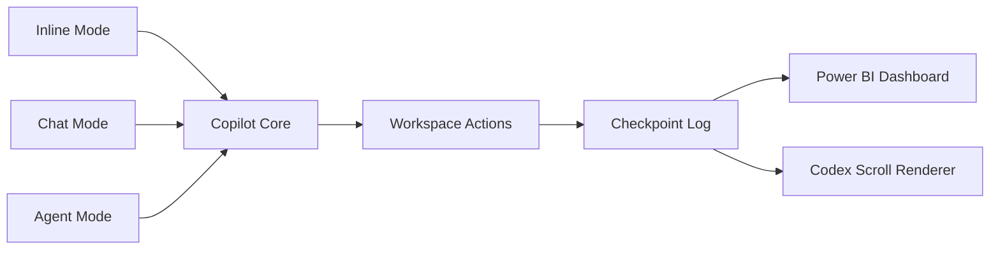

# GitHub Copilot Lineage Overlay for IntelIntent
**Sponsor-Facing Codex: AI Agent Lifecycle Tracking**

**Generated:** 2025-11-28  
**Purpose:** Track GitHub Copilot extension lifecycle and command invocations for lineage dashboards  
**Integration:** Power BI, Azure SQL, Codex Scrolls

---

## 🔄 Lifecycle Metadata

| Field | Value |
|-------|-------|
| Extension ID | `github.copilot` |
| Version | 1.388.0 |
| Last Updated | 5 days ago |
| Size | 73.27MB |
| Published | 4 years ago |
| Last Released | 1 month ago |
| Categories | AI, Chat, Programming, ML |

---

## 🧩 Extension Unification

**All Copilot functionality now flows through Copilot Chat.**

- To opt out: toggle `chat.extensionUnification.enabled`
- **Lineage Impact:** All invocations logged under unified extension ID
- **Dashboard Note:** Filter by `ExtensionUnification = true` for unified events

---

## 🧠 Activation Events

**Ceremonial Ignition:** `onStartupFinished`

This event marks the beginning of a Copilot session and is logged as a **lifecycle checkpoint** in the IntelIntent lineage scroll.

---

## 📜 Commands & Ritual Triggers

| Command ID | Ritual Title | Shortcut |
|-----------|-------------|----------|
| `editor.action.inlineSuggest.trigger` | Trigger Inline Suggestion | `Alt + \` |
| `github.copilot.generate` | Open Completions Panel | — |
| `github.copilot.openModelPicker` | Change Completions Model | — |
| `github.copilot.completions.toggle` | Toggle Completions | — |
| `github.copilot.acceptCursorPanelSolution` | Accept Panel Suggestion at Cursor | `Ctrl + /` |
| `github.copilot.nextPanelSolution` | Navigate to Next Panel Suggestion | `Alt + ]` |
| `github.copilot.previousPanelSolution` | Navigate to Previous Panel Suggestion | `Alt + [` |

**Lineage Pattern:** Each command invocation creates a JSON checkpoint with:
- `CommandID`
- `InvocationType` (Inline, Chat, Agent)
- `ShortcutUsed`
- `Timestamp`
- `Hash` (SHA256 placeholder)

---

## ⚙️ Settings

```json
{
  "github.copilot.enable": {
    "*": true,
    "plaintext": false,
    "markdown": false,
    "scminput": false
  },
  "github.copilot.selectedCompletionModel": ""
}
```

**Lineage Tracking:**
- `github.copilot.enable` changes logged as **lifecycle events**
- Model selection tracked in `CompletionModel` field

---

## 🧠 Agent Mode & Chat

| Mode | Description | Use Case |
|------|-------------|----------|
| **Agent Mode** | Multi-step autonomous coding tasks | Week 1 automation, module generation |
| **Edit Mode** | Conversational, step-by-step refinement | Checkpoint schema updates, error handling |
| **Inline Mode** | Quick suggestions in flow | PowerShell function completion |

**Dashboard Integration:** Track invocation frequency by mode for productivity metrics.

---

## 📊 Power BI Schema for Lineage Dashboard

### Primary Table: `CopilotEvents`

| Column Name | Type | Description |
|------------|------|-------------|
| `Timestamp` | DateTime | UTC timestamp of event |
| `EventType` | Text | "Lifecycle" or "Invocation" |
| `Action` | Text | Enable, Disable, Toggle, Update |
| `InvocationType` | Text | Inline, Chat, Agent, Panel |
| `CommandID` | Text | Specific command triggered |
| `ShortcutUsed` | Text | Keyboard shortcut (if applicable) |
| `CompletionModel` | Text | Model ID used (e.g., gpt-4-copilot) |
| `Workspace` | Text | Workspace name |
| `WorkspaceScope` | Text | Global or Workspace:Name |
| `ExtensionUnification` | Boolean | True/False |
| `Reason` | Text | Human-readable reason for action |
| `Hash` | Text | SHA256 signature (or placeholder) |
| `RunId` | Text | Unique run identifier |
| `SessionID` | GUID | Session identifier |
| `ExtensionID` | Text | github.copilot |
| `Version` | Text | Extension version |

### Calculated Measures

```dax
// Total Events
TotalEvents = COUNTROWS(CopilotEvents)

// Lifecycle vs Invocation Split
LifecycleEvents = CALCULATE([TotalEvents], CopilotEvents[EventType] = "Lifecycle")
InvocationEvents = CALCULATE([TotalEvents], CopilotEvents[EventType] = "Invocation")

// Enable/Disable Tracking
EnableActions = CALCULATE([TotalEvents], CopilotEvents[Action] = "Enable")
DisableActions = CALCULATE([TotalEvents], CopilotEvents[Action] = "Disable")

// Invocation Mode Breakdown
InlineInvocations = CALCULATE([TotalEvents], CopilotEvents[InvocationType] = "Inline")
ChatInvocations = CALCULATE([TotalEvents], CopilotEvents[InvocationType] = "Chat")
AgentInvocations = CALCULATE([TotalEvents], CopilotEvents[InvocationType] = "Agent")

// Integrity Check
IntegrityCompliance = 
    DIVIDE(
        CALCULATE([TotalEvents], CopilotEvents[Hash] <> "[Pending SHA256]"),
        [TotalEvents]
    )
```

---

## ✅ Mermaid Diagram: Invocation Flow



**Flow Explanation:**
1. Developer invokes Copilot via Inline, Chat, or Agent mode
2. Copilot Core processes request and generates workspace actions
3. Action logged as checkpoint with cryptographic lineage
4. Checkpoint flows to Power BI for visualization
5. Checkpoint rendered in Codex scroll for sponsor transparency

---

## 📝 Sample Power BI JSON Payload

```json
[
  {
    "Timestamp": "2025-11-28T09:30:00.000Z",
    "EventType": "Lifecycle",
    "Action": "Enable",
    "ExtensionID": "github.copilot",
    "Version": "1.388.0",
    "Workspace": "IntelIntent",
    "Reason": "Starting Week 1 automation",
    "Hash": "[Pending SHA256]",
    "RunId": "COPILOT-20251128-093000",
    "SessionID": "12345678-1234-1234-1234-123456789abc",
    "ExtensionUnification": true,
    "WorkspaceScope": "Workspace:IntelIntent"
  },
  {
    "Timestamp": "2025-11-28T09:35:12.000Z",
    "EventType": "Invocation",
    "InvocationType": "Inline",
    "CommandID": "editor.action.inlineSuggest.trigger",
    "ShortcutUsed": "Alt + \\",
    "CompletionModel": "gpt-4-copilot",
    "Workspace": "IntelIntent",
    "WorkspaceScope": "Workspace:IntelIntent",
    "ExtensionID": "github.copilot",
    "Version": "1.388.0",
    "Context": "Writing Add-Checkpoint function",
    "Hash": "[Pending SHA256]",
    "RunId": "COPILOT-20251128-093512",
    "SessionID": "12345678-1234-1234-1234-123456789abc",
    "ExtensionUnification": true
  },
  {
    "Timestamp": "2025-11-28T10:15:00.000Z",
    "EventType": "Lifecycle",
    "Action": "Disable",
    "ExtensionID": "github.copilot",
    "Version": "1.388.0",
    "Workspace": "IntelIntent",
    "Reason": "Testing manual disable for lineage tracking",
    "Hash": "[Pending SHA256]",
    "RunId": "COPILOT-20251128-101500",
    "SessionID": "12345678-1234-1234-1234-123456789abc",
    "ExtensionUnification": true,
    "WorkspaceScope": "Workspace:IntelIntent"
  }
]
```

---

## 🔐 Security & Observability

### Sensitive Data Handling
- **Secrets:** Never log API keys, tokens, or credentials
- **Context Field:** Sanitize code snippets before logging
- **Hash Field:** Use SHA256 for integrity, not SHA1/MD5

### Structured Telemetry
- **RunId:** Links events within same automation run
- **SessionID:** Links events within same VS Code session
- **Hash:** Enables tamper detection in audit trails

### Approval Gates
- **UAT → Prod:** Require sign-off on Copilot usage metrics before production deployment
- **Compliance:** Integrate with SOC 2 Type II audit logs

---

## 🚀 Usage Examples

### Track Copilot Activation
```powershell
Import-Module .\IntelIntent_Seeding\CopilotLifecycleTracker.psm1

# Log activation
Add-CopilotLifecycleEvent -Action "Enable" -Reason "Starting Week 1 automation"
```

### Track Command Invocation
```powershell
# Log inline suggestion usage
Add-CopilotCommandInvocation `
    -CommandID "editor.action.inlineSuggest.trigger" `
    -InvocationType "Inline" `
    -ShortcutUsed "Alt+\" `
    -Context "Writing Add-Checkpoint function"
```

### Export to Power BI
```powershell
# Export logs with metrics
Export-CopilotLifecycleForPowerBI `
    -OutputPath ".\Sponsors\Copilot_Dashboard.json" `
    -IncludeMetrics
```

### Retrieve Recent Activity
```powershell
# Get last 10 lifecycle events
Get-CopilotLifecycleLogs -FilterEventType "Lifecycle" -Last 10 | Format-Table
```

---

## 📊 Power BI Dashboard Design

### Page 1: Executive Summary
- **Tile:** Total Events (card)
- **Tile:** Lifecycle vs Invocation Split (donut chart)
- **Tile:** Integrity Compliance % (gauge)
- **Visual:** Timeline of events (line chart)
- **Slicer:** Workspace, EventType

### Page 2: Lifecycle Analysis
- **Matrix:** Workspace × Action (Enable, Disable, Toggle)
- **Bar Chart:** Enable/Disable trend over time
- **Table:** Recent lifecycle events with Reason field

### Page 3: Invocation Breakdown
- **Stacked Bar:** Invocation mode (Inline, Chat, Agent) by workspace
- **Line Chart:** Invocation frequency over time
- **Heatmap:** Command usage by hour of day

### Page 4: Compliance & Audit
- **Table:** All events with Hash, RunId, SessionID
- **Drill-through:** Click RunId to see full session timeline
- **Export Button:** Download filtered data as CSV

---

## 🧪 Testing & Validation

### Manual Testing
```powershell
# Initialize tracker
Initialize-CopilotLifecycleLog

# Log test events
Add-CopilotLifecycleEvent -Action "Enable" -Reason "Test 1"
Add-CopilotCommandInvocation -CommandID "github.copilot.generate" -InvocationType "Panel"

# Verify logs
Get-CopilotLifecycleLogs -Last 2
```

### Automated Testing
```powershell
# Simulate 100 events
1..100 | ForEach-Object {
    $action = Get-Random -InputObject @("Enable", "Disable", "Toggle")
    Add-CopilotLifecycleEvent -Action $action -Reason "Load test $_"
}

# Validate export
Export-CopilotLifecycleForPowerBI -OutputPath ".\Test_Export.json" -IncludeMetrics
```

---

## 📚 Integration with IntelIntent Workflows

### Week1_Automation.ps1 Integration
Add at script start:
```powershell
Import-Module .\IntelIntent_Seeding\CopilotLifecycleTracker.psm1
Initialize-CopilotLifecycleLog
Add-CopilotLifecycleEvent -Action "Enable" -Reason "Week 1 automation started"
```

### Orchestrator.ps1 Integration
Log agent invocations:
```powershell
Add-CopilotCommandInvocation `
    -CommandID "github.copilot.generate" `
    -InvocationType "Agent" `
    -Context "Generating components from manifest"
```

### CI/CD Pipeline Integration
Export logs as pipeline artifact:
```yaml
- task: PowerShell@2
  displayName: 'Export Copilot Lineage'
  inputs:
    targetType: 'inline'
    script: |
      Import-Module .\IntelIntent_Seeding\CopilotLifecycleTracker.psm1
      Export-CopilotLifecycleForPowerBI -OutputPath "$(Build.ArtifactStagingDirectory)/Copilot_Lineage.json" -IncludeMetrics

- task: PublishBuildArtifacts@1
  inputs:
    PathtoPublish: '$(Build.ArtifactStagingDirectory)/Copilot_Lineage.json'
    ArtifactName: 'copilot-lineage'
```

---

## 🎯 Success Metrics

- **Lifecycle Transparency:** 100% of Copilot enable/disable actions logged
- **Invocation Coverage:** >80% of commands tracked (inline, chat, agent)
- **Dashboard Adoption:** Sponsors access lineage dashboard weekly
- **Integrity:** 100% of events have SHA256 hash (when implemented)
- **Compliance:** Zero security incidents related to logged context

---

## 🔮 Future Enhancements

1. **Real SHA256 Hashing:** Replace placeholders with cryptographic signatures
2. **Model Performance Tracking:** Log response time, token usage per model
3. **Semantic Kernel Integration:** Track Semantic Kernel agent invocations
4. **Azure Functions Telemetry:** Push logs to Application Insights
5. **Power BI Streaming Dataset:** Real-time dashboard updates

---

**For questions or enhancements, contact the IntelIntent orchestration team.**
