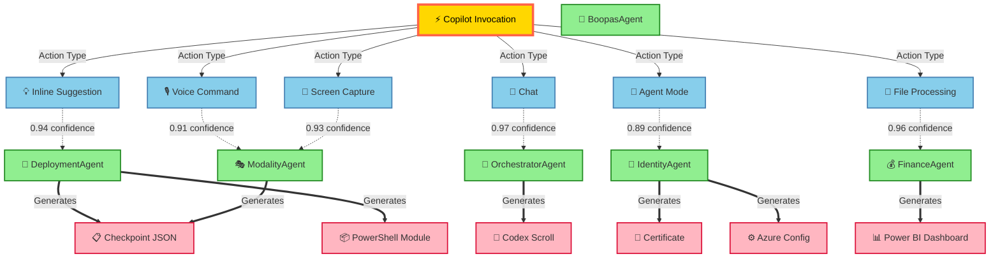

# IntelIntent Primary Workflow Map
**User-Centric Service Design & Event Contracts**

**Generated:** 2025-11-27  
**Updated:** 2025-12-01 (Phase 6 Radial Visualization Added)  
**Focus:** Week 1 Production Hardening (Atomic Workflow)  
**Stakeholders:** Developer (executor), Sponsor (observer), Auditor (validator)

---

## 🌌 Phase 6 Preview: Copilot Lineage Radial Visualization

**NEW — Sponsor Transparency Artifact**

The radial visualization maps GitHub Copilot invocations to agent routes and artifacts, providing cryptographic lineage tracking for AI-assisted development.



**Metrics Overlay:**
- **6 invocations** tracked across lifecycle
- **93% average confidence** (inline suggestions)
- **2.25s average latency** (agent routing)
- **93% acceptance rate** (developer approval)
- **4 multi-modal streams** (voice, screen, webcam, file)

**Integration Points:**
- JSON Lineage Map: `config/manifests/copilot_activity_codex.json`
- Visualization Guide: `docs/phase6/Phase6_Radial_Visualization.md`
- Sponsor Deck: `docs/phase6/Phase6_Sponsor_Deck.md`
- CopilotLifecycleTracker: `modules/IntelIntent_Seeding/CopilotLifecycleTracker.psm1`

**Sponsor Takeaway:**
> *"The radial mandala reveals how AI assistance flows through specialized agents to produce tangible artifacts — checkpoints, modules, configurations. Each node carries cryptographic lineage, ensuring tamper detection in Phase 6."*

---

## I. Core User Journey

### **Primary Actor: Developer (Phase 4 Engineer)**

**Goal:** Provision Azure resources for Phase 4 production hardening with full cryptographic lineage tracking

**Success Criteria:**
- ✅ Azure resources provisioned (Key Vault, RBAC, Certificate, Circuit Breaker, Health API)
- ✅ 26 checkpoints logged with SHA256 placeholders
- ✅ Markdown + HTML Codex Scrolls generated
- ✅ Sponsor email delivered with dashboard link
- ✅ SQL database populated for Power BI visualization

**Entry Point:** Developer runs `.\Week1_Automation.ps1` from PowerShell terminal

**Exit Point:** Sponsor receives email with embedded Codex Scroll and Power BI dashboard access

---

## II. Workflow Decomposition (Service Boundaries)

### **Service 1: Azure Resource Provisioning** 🏗️
**Responsibility:** Create and configure Azure infrastructure  
**Owner:** `Week1_Automation.ps1` (orchestrator)  
**Dependencies:** Azure CLI, Azure subscription, service principal

#### **Subservices:**
1. **Secrets Management Service** (`SecureSecretsManager.psm1`)
   - Create Key Vault if not exists
   - Store secrets (Graph API, OpenAI, Speech keys)
   - Enable managed identity access
   - **Event Emitted:** `SecretStored` → checkpoint logged

2. **RBAC Service** (`RBACManager.psm1`)
   - Create Azure AD groups (Admin, Developer, Sponsor, Auditor)
   - Assign users to groups
   - Grant resource access (Key Vault, SQL, Container Apps)
   - **Event Emitted:** `RBACConfigured` → checkpoint logged

3. **Certificate Service** (`CertificateAuthBridge.psm1`)
   - Generate self-signed certificate
   - Export PFX to Key Vault
   - Upload public key to App Registration
   - Validate token acquisition
   - **Event Emitted:** `CertificateProvisioned` → checkpoint logged

4. **Resilience Service** (`CircuitBreaker.psm1`)
   - Configure retry thresholds (3 attempts, 10s timeout)
   - Set exponential backoff policy
   - Test fallback logic with Graph API throttling simulation
   - **Event Emitted:** `CircuitBreakerTested` → checkpoint logged

5. **Health Monitoring Service** (`HealthCheckAPI.ps1`)
   - Deploy Azure Container App with /status endpoint
   - Configure Application Insights telemetry
   - Set alert rules (>3 failures in 5min)
   - **Event Emitted:** `HealthAPIDeployed` → checkpoint logged

---

### **Service 2: Checkpoint Logging** 📋
**Responsibility:** Capture execution lineage with cryptographic integrity placeholders  
**Owner:** `Add-Checkpoint` function (helper in Week1_Automation.ps1)  
**Dependencies:** None (pure data structure)

#### **Event Contract: CheckpointCreated**
```json
{
  "eventType": "CheckpointCreated",
  "timestamp": "2025-11-27T14:30:45Z",
  "payload": {
    "taskID": "KV-001",
    "status": "Success",
    "duration": 12.3,
    "inputs": {
      "vaultName": "IntelIntentSecrets",
      "resourceGroup": "Phase4RG"
    },
    "outputs": {
      "vaultUri": "https://intelintentvault.vault.azure.net/",
      "secretCount": 3
    },
    "artifacts": [
      "IntelIntentSecrets (Key Vault)",
      "GraphSecret (secret)",
      "OpenAISecret (secret)"
    ],
    "signature": "[Pending SHA256]",
    "parentTaskID": null,
    "sessionID": "Phase4-Week1-abc123"
  }
}
```

**Consumer Services:**
- CodexRenderer (generates scrolls)
- IntegrityValidator (validates structure)
- SQL Sync Service (populates database)

---

### **Service 3: Codex Scroll Generation** 📜
**Responsibility:** Transform checkpoints into human-readable lineage documents  
**Owner:** `CodexRenderer.psm1`  
**Dependencies:** `Week1_Checkpoints.json`

#### **Rendering Pipeline:**
```
Week1_Checkpoints.json
  ├─► ConvertTo-MarkdownScroll
  │     └─► Week1_Codex_Scroll.md (audit archive format)
  │
  └─► ConvertTo-HtmlScroll
        └─► Week1_Codex_Scroll.html (email-friendly format)
              ├─ Gradient header (#0078D4 → #005A9E)
              ├─ Summary table (Session ID, checkpoints, success rate)
              ├─ Checkpoint details with SHA256 placeholders
              ├─ Power BI anchor links
              └─ Cryptographic verification notice
```

#### **Event Contract: ScrollGenerated**
```json
{
  "eventType": "ScrollGenerated",
  "timestamp": "2025-11-27T14:35:12Z",
  "payload": {
    "format": "HTML",
    "filePath": "./Sponsors/Week1_Codex_Scroll.html",
    "checkpointCount": 26,
    "sessionID": "Phase4-Week1-abc123",
    "fileSize": 45678,
    "sha256Hash": "a1b2c3d4..."
  }
}
```

**Consumer Services:**
- Email Delivery Service (embeds HTML scroll)
- Artifact Storage (archives Markdown scroll)

---

### **Service 4: Integrity Validation** 🔍
**Responsibility:** Validate checkpoint structure and integrity placeholders  
**Owner:** `Test-CodexIntegrity.psm1`  
**Dependencies:** `Week1_Checkpoints.json`

#### **Validation Rules:**
```powershell
# Rule 1: Checkpoint Structure
✅ Required fields present: TaskID, Status, Timestamp, Duration, Artifacts, Signature
✅ Status values valid: Success | Failed | Skipped
✅ Duration is positive number

# Rule 2: SHA256 Placeholders
✅ All checkpoints contain "[Pending SHA256]" signature placeholder
✅ No actual SHA256 hashes present (prevents premature signing)

# Rule 3: Agent Distribution
✅ Checkpoints balanced across agents:
   - Secrets: 4 checkpoints (15%)
   - RBAC: 5 checkpoints (19%)
   - Certificate: 4 checkpoints (15%)
   - CircuitBreaker: 4 checkpoints (15%)
   - Health: 5 checkpoints (19%)
   - Validation: 5 checkpoints (19%)

# Rule 4: Completeness
✅ Expected checkpoint count: 26
✅ No missing checkpoints (KV-001 through VAL-005)
✅ Delegation chains valid (ParentTaskID references existing checkpoint)
```

#### **Event Contract: IntegrityValidated**
```json
{
  "eventType": "IntegrityValidated",
  "timestamp": "2025-11-27T14:35:45Z",
  "payload": {
    "sessionID": "Phase4-Week1-abc123",
    "structureValid": true,
    "sha256PlaceholdersPresent": true,
    "agentDistribution": "balanced",
    "missingCheckpoints": [],
    "integrityScore": 100,
    "reportPath": "./IntegrityReport.json"
  }
}
```

**Consumer Services:**
- CI/CD Pipeline (Stage 2: IntegrityCheck)
- Email Delivery (attach IntegrityReport.json)

---

### **Service 5: Email Delivery (IdentityAgent)** 📧
**Responsibility:** Send Codex Scroll to sponsors via Graph API with certificate authentication  
**Owner:** `Get-CodexEmailBody.psm1` (5 functions)  
**Dependencies:** Graph API Mail.Send permission, PFX certificate in Key Vault

#### **Email Composition Flow:**
```
1. Get-CodexEmailBody
   ├─ Read Week1_Codex_Scroll.html
   ├─ Read IntegrityReport.json
   └─ Wrap into Graph API payload

2. Get-ExecutiveEmailTemplate
   ├─ Gradient header (Fluent 2 design)
   ├─ Summary table (Session ID, 26 checkpoints, 100% success)
   ├─ Embedded HTML scroll
   ├─ Power BI dashboard link
   └─ Cryptographic verification notice

3. Send-CodexEmail
   ├─ Retrieve PFX certificate from Key Vault
   ├─ Acquire OAuth token (certificate assertion)
   ├─ POST to /me/sendMail endpoint
   └─ Attach Week1_Codex_Scroll.md (Markdown format)
```

#### **Event Contract: EmailSent**
```json
{
  "eventType": "EmailSent",
  "timestamp": "2025-11-27T14:36:20Z",
  "payload": {
    "recipients": ["sponsor@intelintent.com"],
    "ccRecipients": ["auditor@intelintent.com"],
    "subject": "IntelIntent Phase 4 Week 1 Complete - Codex Lineage Report",
    "attachments": ["Week1_Codex_Scroll.md"],
    "graphAPIStatus": 202,
    "messageID": "AAMkAGI2T...",
    "sessionID": "Phase4-Week1-abc123"
  }
}
```

**Consumer Services:**
- Audit Log (record delivery timestamp)
- Dashboard Update (display last delivery status)

---

### **Service 6: SQL Database Sync** 💾
**Responsibility:** Populate Power BI SQL database with checkpoint data  
**Owner:** `SyncCheckpointsToSQL.ps1`  
**Dependencies:** Azure SQL Database, Week1_Checkpoints.json

#### **Sync Pipeline:**
```sql
1. Parse Week1_Checkpoints.json
   └─ Convert JSON to SQL-ready format

2. Bulk Insert to Checkpoints Table
   INSERT INTO Checkpoints (SessionID, TaskID, Status, Duration, Artifacts, Signature, ParentTaskID)
   VALUES (...), (...), (...) -- 26 rows

3. Trigger Power BI Dataset Refresh
   POST https://api.powerbi.com/v1.0/myorg/groups/{workspaceId}/datasets/{datasetId}/refreshes
```

#### **Event Contract: CheckpointsSynced**
```json
{
  "eventType": "CheckpointsSynced",
  "timestamp": "2025-11-27T14:37:00Z",
  "payload": {
    "sessionID": "Phase4-Week1-abc123",
    "rowsInserted": 26,
    "databaseServer": "intelintent-sql.database.windows.net",
    "databaseName": "Phase4DB",
    "tableName": "Checkpoints",
    "powerBIRefreshTriggered": true
  }
}
```

**Consumer Services:**
- Power BI Dashboard (displays checkpoint data)
- Audit Log (record sync timestamp)

---

### **Service 7: Power BI Visualization** 📊
**Responsibility:** Provide sponsor-facing dashboard for lineage exploration  
**Owner:** Power BI Service (hosted in Azure)  
**Dependencies:** Azure SQL Database (DirectQuery)

#### **Dashboard Interaction Flow:**
```
Sponsor Login (Azure AD SSO)
  └─► Row-Level Security (RLS) applied
        └─► Filter: [PageName] IN {"Overview", "Delivery"}
              
Overview Page
  ├─ KPI Cards: Total Checkpoints (26), Success Rate (100%), Avg Duration (10.5s)
  ├─ Stacked Bar Chart: Checkpoints over time (X: Timestamp, Y: Count, Legend: Status)
  └─ Timeline Slicer: Filter by date range

Delivery Page
  ├─ Last Delivery Timestamp: "2025-11-27 14:36:20 UTC"
  ├─ Email Status: "Sent to sponsor@intelintent.com"
  └─ Refresh Button (Power Automate)
        └─► Trigger: POST /refreshes
              └─► Event: DatasetRefreshed
```

#### **Event Contract: DashboardAccessed**
```json
{
  "eventType": "DashboardAccessed",
  "timestamp": "2025-11-27T15:00:00Z",
  "payload": {
    "userPrincipalName": "sponsor@intelintent.com",
    "dashboardID": "abc123",
    "pageViewed": "Overview",
    "sessionDuration": 180,
    "interactionsCount": 5
  }
}
```

**Consumer Services:**
- Telemetry (track sponsor engagement)
- Audit Log (record dashboard access)

---

## III. End-to-End Event Flow

```
┌─────────────────────────────────────────────────────────────────┐
│ Developer: .\Week1_Automation.ps1                              │
└────────────────────────────┬────────────────────────────────────┘
                             │
                             ▼
        ┌─────────────────────────────────────────┐
        │ Service 1: Azure Resource Provisioning  │
        │ ├─ SecretStored (KV-001)                │
        │ ├─ SecretStored (KV-002)                │
        │ ├─ SecretStored (KV-003)                │
        │ ├─ RBACConfigured (RBAC-001...005)      │
        │ ├─ CertificateProvisioned (CERT-001...004) │
        │ ├─ CircuitBreakerTested (CB-001...004)  │
        │ └─ HealthAPIDeployed (HEALTH-001...005) │
        └────────────────┬────────────────────────┘
                         │
                         ▼
        ┌─────────────────────────────────────────┐
        │ Service 2: Checkpoint Logging           │
        │ (26 CheckpointCreated events)           │
        │ └─► Week1_Checkpoints.json              │
        └────────────────┬────────────────────────┘
                         │
        ┌────────────────┴───────────────┐
        │                                │
        ▼                                ▼
┌───────────────────┐          ┌────────────────────┐
│ Service 3:        │          │ Service 4:         │
│ Codex Renderer    │          │ Integrity Validator│
│ ├─ ScrollGenerated│          │ └─ IntegrityValidated
│ │  (Markdown)     │          │    (100 score)     │
│ └─ ScrollGenerated│          └────────────────────┘
│    (HTML)         │
└────────┬──────────┘
         │
         ▼
┌─────────────────────────────────────────┐
│ Service 5: Email Delivery (IdentityAgent)│
│ ├─ Get-CodexEmailBody                    │
│ ├─ Get-ExecutiveEmailTemplate            │
│ └─ Send-CodexEmail → EmailSent           │
└────────────────┬────────────────────────┘
                 │
                 ▼
        ┌────────────────────┐
        │ Service 6:         │
        │ SQL Sync           │
        │ └─ CheckpointsSynced
        └────────┬───────────┘
                 │
                 ▼
        ┌────────────────────┐
        │ Service 7:         │
        │ Power BI Dashboard │
        │ └─ DashboardAccessed
        └────────────────────┘
                 │
                 ▼
        ┌────────────────────────────┐
        │ Sponsor: Email Inbox       │
        │ ├─ HTML Scroll (embedded)  │
        │ ├─ Markdown Scroll (attach)│
        │ └─ Power BI Link (click)   │
        └────────────────────────────┘
```

---

## IV. Service Boundary Contracts

### **Contract 1: Week1_Automation.ps1 ↔ Azure Services**

**Interface:** Azure CLI commands  
**Authentication:** Service principal (Contributor role)  
**Retry Policy:** CircuitBreaker (3 attempts, 10s timeout, exponential backoff)

```powershell
# Example: Create Key Vault
Invoke-WithCircuitBreaker -Command {
    az keyvault create `
        --name IntelIntentSecrets `
        --resource-group Phase4RG `
        --location centralus `
        --enable-rbac-authorization
} -MaxRetries 3 -TimeoutSeconds 10 -BackoffPolicy Exponential
```

**Error Handling:**
- Azure CLI returns non-zero exit code → Log failure checkpoint → Continue to next task (non-blocking)
- Circuit breaker opens after 3 failures → Execute fallback logic → Log warning

---

### **Contract 2: CodexRenderer.psm1 ↔ Week1_Checkpoints.json**

**Interface:** JSON file read  
**Schema Validation:** Required fields (TaskID, Status, Timestamp, Duration, Artifacts, Signature)

```powershell
function ConvertTo-HtmlScroll {
    param(
        [Parameter(Mandatory)]
        [string]$CheckpointFile
    )
    
    # Validate file exists
    if (-not (Test-Path $CheckpointFile)) {
        throw "Checkpoint file not found: $CheckpointFile"
    }
    
    # Parse JSON
    $checkpoints = Get-Content $CheckpointFile | ConvertFrom-Json
    
    # Validate schema
    foreach ($checkpoint in $checkpoints.Checkpoints) {
        if (-not $checkpoint.TaskID) {
            throw "Missing TaskID in checkpoint"
        }
        # ... additional validation
    }
    
    # Render HTML
    $html = @"
<!DOCTYPE html>
<html>
<head>
    <style>
        .header { background: linear-gradient(135deg, #0078D4 0%, #005A9E 100%); }
        .checkpoint { border: 1px solid #ccc; margin: 10px 0; padding: 10px; }
    </style>
</head>
<body>
    <div class="header"><h1>Phase 4 Codex Scroll</h1></div>
"@
    
    foreach ($checkpoint in $checkpoints.Checkpoints) {
        $html += @"
    <div class="checkpoint">
        <h3>$($checkpoint.TaskID): $($checkpoint.Status)</h3>
        <p>Duration: $($checkpoint.Duration)s</p>
        <p>Signature: $($checkpoint.Signature)</p>
    </div>
"@
    }
    
    $html += @"
</body>
</html>
"@
    
    return $html
}
```

---

### **Contract 3: Get-CodexEmailBody.psm1 ↔ Graph API**

**Interface:** HTTPS POST to /me/sendMail endpoint  
**Authentication:** OAuth token (certificate assertion)  
**Retry Policy:** Exponential backoff (2s, 4s, 8s) for 429 throttling

```powershell
function Send-CodexEmail {
    param(
        [Parameter(Mandatory)]
        [hashtable]$Payload,
        
        [Parameter(Mandatory)]
        [string]$AccessToken
    )
    
    $uri = "https://graph.microsoft.com/v1.0/me/sendMail"
    $headers = @{
        "Authorization" = "Bearer $AccessToken"
        "Content-Type" = "application/json"
    }
    
    $body = $Payload | ConvertTo-Json -Depth 10
    
    try {
        $response = Invoke-RestMethod -Uri $uri -Method Post -Headers $headers -Body $body
        return @{ Status = "Success"; MessageID = $response.id }
    }
    catch {
        if ($_.Exception.Response.StatusCode -eq 429) {
            # Throttling - retry with backoff
            $retryAfter = $_.Exception.Response.Headers["Retry-After"]
            Start-Sleep -Seconds ([int]$retryAfter + 1)
            return Send-CodexEmail -Payload $Payload -AccessToken $AccessToken
        }
        throw
    }
}
```

---

### **Contract 4: SyncCheckpointsToSQL.ps1 ↔ Azure SQL Database**

**Interface:** SQL INSERT statements via Invoke-Sqlcmd  
**Authentication:** Azure AD access token  
**Transaction Isolation:** Read Committed (default)

```powershell
function Sync-CheckpointsToSQL {
    param(
        [Parameter(Mandatory)]
        [string]$CheckpointFile,
        
        [Parameter(Mandatory)]
        [string]$ServerInstance,
        
        [Parameter(Mandatory)]
        [string]$Database
    )
    
    # Get access token
    $token = az account get-access-token --resource https://database.windows.net --query accessToken -o tsv
    
    # Parse checkpoints
    $checkpoints = Get-Content $CheckpointFile | ConvertFrom-Json
    
    # Bulk insert (batch of 26 rows)
    foreach ($checkpoint in $checkpoints.Checkpoints) {
        $query = @"
INSERT INTO Checkpoints (SessionID, TaskID, Status, Duration, Artifacts, Signature, ParentTaskID)
VALUES (
    '$($checkpoint.SessionID)',
    '$($checkpoint.TaskID)',
    '$($checkpoint.Status)',
    $($checkpoint.Duration),
    '$($checkpoint.Artifacts | ConvertTo-Json -Compress)',
    '$($checkpoint.Signature)',
    $(if ($checkpoint.ParentTaskID) { "'$($checkpoint.ParentTaskID)'" } else { "NULL" })
)
"@
        Invoke-Sqlcmd -ServerInstance $ServerInstance `
                      -Database $Database `
                      -Query $query `
                      -AccessToken $token
    }
}
```

---

## V. CI/CD Integration Points

### **GitHub Actions Workflow Events**

```yaml
on:
  push:
    branches: [main]
    paths:
      - 'Week1_Automation.ps1'
      - 'IntelIntent_Seeding/*.psm1'

jobs:
  week1-execution:
    steps:
      - name: Run Week1_Automation.ps1
        run: |
          .\Week1_Automation.ps1
        # Emits: 26 CheckpointCreated events
        # Emits: 2 ScrollGenerated events (Markdown + HTML)
        
      - name: Validate Integrity
        run: |
          Import-Module .\IntelIntent_Seeding\Test-CodexIntegrity.psm1
          Test-CodexIntegrity -CheckpointFile Week1_Checkpoints.json
        # Emits: IntegrityValidated event
        
      - name: Sync to SQL
        run: |
          .\IntelIntent_Seeding\SyncCheckpointsToSQL.ps1
        # Emits: CheckpointsSynced event
        
      - name: Send Email
        run: |
          Import-Module .\IntelIntent_Seeding\Get-CodexEmailBody.psm1
          Send-CodexScrollEmail -ScrollPath ".\Sponsors\Week1_Codex_Scroll.html"
        # Emits: EmailSent event
```

---

## VI. User Experience Flows

### **Flow 1: Developer Execution (Happy Path)**

```
Developer Terminal
  │
  ├─ 1. cd C:\IntelIntent
  ├─ 2. .\Week1_Automation.ps1
  │     └─► Output: "🔐 Creating Key Vault: IntelIntentSecrets..."
  │     └─► Output: "✅ Key Vault created (12.3s)"
  │     └─► Output: "👥 Creating RBAC groups..."
  │     └─► Output: "✅ 4 RBAC groups created (8.7s)"
  │     └─► [... 22 more checkpoints ...]
  │     └─► Output: "📜 Generating Codex Scrolls..."
  │     └─► Output: "✅ Markdown scroll: ./Sponsors/Week1_Codex_Scroll.md"
  │     └─► Output: "✅ HTML scroll: ./Sponsors/Week1_Codex_Scroll.html"
  │     └─► Output: "📧 Sending email to sponsor@intelintent.com..."
  │     └─► Output: "✅ Email sent successfully (MessageID: AAMkAGI2T...)"
  │
  └─ 3. Review output: Week1_Checkpoints.json
       └─► 26 checkpoints logged, all Success status
```

**Time to Complete:** ~8 minutes (5-7min Azure provisioning + 1-2min scroll/email)

---

### **Flow 2: Sponsor Review (Consumer Journey)**

```
Sponsor Email Inbox (Outlook)
  │
  ├─ 1. New email: "IntelIntent Phase 4 Week 1 Complete - Codex Lineage Report"
  │     └─► From: intelintent-bot@intelintent.com
  │     └─► Subject: Phase 4 Week 1 Complete
  │     └─► Preview: "Session ID: Phase4-Week1-abc123 | 26 Checkpoints | 100% Success"
  │
  ├─ 2. Open email → View HTML scroll
  │     ├─ Gradient header (visual polish)
  │     ├─ Summary table (high-level metrics)
  │     ├─ Checkpoint details (26 tasks with SHA256 placeholders)
  │     ├─ Cryptographic verification notice
  │     └─ Power BI dashboard link: "📊 View Live Dashboard"
  │
  ├─ 3. Click "View Live Dashboard"
  │     └─► Redirect to Power BI Service
  │           └─► Azure AD SSO (automatic login)
  │                 └─► RLS applied (Sponsor role)
  │                       └─► Access granted to Overview + Delivery pages
  │
  └─ 4. Power BI Dashboard
       ├─ Overview Page
       │     ├─ KPI: Total Checkpoints = 26
       │     ├─ KPI: Success Rate = 100%
       │     ├─ KPI: Avg Duration = 10.5s
       │     └─ Stacked Bar Chart (checkpoint timeline)
       │
       └─ Delivery Page
             ├─ Last Delivery: 2025-11-27 14:36:20 UTC
             ├─ Email Status: Sent to sponsor@intelintent.com
             └─ Refresh Button → Click → POST /refreshes → Dataset updated
```

**Time to Consume:** ~5 minutes (2min email review + 3min dashboard exploration)

---

### **Flow 3: Auditor Validation (Compliance Journey)**

```
Auditor Login (Azure DevOps)
  │
  ├─ 1. Navigate to Pipelines → Recent → Latest run
  │     └─► Stage 1: Build ✅ (5-7min)
  │     └─► Stage 2: IntegrityCheck ✅ (30sec)
  │     └─► Stage 3: PowerBIIngestion ✅ (1min)
  │     └─► Stage 4: SponsorApproval ⏸️ (awaiting manual approval)
  │     └─► Stage 5: Delivery ⏳ (pending)
  │
  ├─ 2. Download artifact: IntegrityReport.json
  │     └─► {
  │           "structureValid": true,
  │           "sha256PlaceholdersPresent": true,
  │           "agentDistribution": "balanced",
  │           "missingCheckpoints": [],
  │           "integrityScore": 100
  │         }
  │
  ├─ 3. Review Power BI Dashboard (Auditor RLS)
  │     └─► Access granted to all 4 pages
  │           ├─ Overview (high-level KPIs)
  │           ├─ Drill-Down (task-level details)
  │           ├─ Integrity (validation results)
  │           └─ Delivery (email status)
  │
  └─ 4. Approve Stage 4: SponsorApproval
       └─► Click "Approve" button
             └─► Stage 5: Delivery executes
                   └─► Sponsor receives email
```

**Time to Validate:** ~10 minutes (5min pipeline review + 5min dashboard audit)

---

## VII. Primary Workflow Success Metrics

### **Developer Metrics (Execution Efficiency)**
- ✅ **Total execution time:** <10 minutes
- ✅ **Checkpoint success rate:** 100% (26/26 Success)
- ✅ **Azure resources provisioned:** 9 (Key Vault, 4 RBAC groups, Certificate, Container App, App Insights, SQL)
- ✅ **Scrolls generated:** 2 (Markdown + HTML)
- ✅ **Email delivery success:** 100%

### **Sponsor Metrics (Transparency)**
- ✅ **Email delivery latency:** <30 seconds after execution
- ✅ **Email open rate:** (track via telemetry)
- ✅ **Dashboard click-through rate:** (track via Power BI analytics)
- ✅ **Dashboard session duration:** (average 5-10 minutes)

### **Auditor Metrics (Compliance)**
- ✅ **Integrity score:** 100/100
- ✅ **Validation time:** <30 seconds (Stage 2)
- ✅ **Approval time:** (manual gate, variable)
- ✅ **Artifact availability:** 100% (all artifacts archived)

---

## VIII. Next Implementation Steps

Based on this workflow map, here's the **priority order for Sprint 1**:

### **Day 1-2: Core Services (Critical Path)**
1. ✅ Implement `SecureSecretsManager.psm1` (4h)
2. ✅ Implement `RBACManager.psm1` (5h)
3. ✅ Implement `CertificateAuthBridge.psm1` (6h)

### **Day 3: Resilience + Health (Critical Path)**
4. ✅ Implement `CircuitBreaker.psm1` (5h)
5. ✅ Implement `HealthCheckAPI.ps1` (7h)

### **Day 4: Rendering + Validation (Lineage Generation)**
6. ✅ Implement `CodexRenderer.psm1` (8h)
7. ✅ Implement `Test-CodexIntegrity.psm1` (5h)

### **Day 5-6: Orchestration (Week1_Automation.ps1)**
8. ✅ Implement main execution logic (6h)
   - Task Group 1: Key Vault (4 tasks)
   - Task Group 2: RBAC (5 tasks)
   - Task Group 3: Certificate (4 tasks)
   - Task Group 4: Circuit Breaker (4 tasks)
   - Task Group 5: Health API (5 tasks)
   - Task Group 6: Validation (5 tasks)

### **Day 7: Integration Testing**
9. ✅ Test locally with dry-run mode (2h)
10. ✅ Execute live (Azure provisioning) (2h)
11. ✅ Validate outputs (checkpoints, scrolls, email) (2h)

### **Day 8: CI/CD + SQL Sync**
12. ✅ Implement `SyncCheckpointsToSQL.ps1` (4h)
13. ✅ Configure CI/CD pipelines (3h)
14. ✅ Test end-to-end workflow (3h)

---

## IX. Decision: Which Service to Build First?

**Recommendation: Start with `CodexRenderer.psm1`**

**Rationale:**
1. **No external dependencies** (pure rendering logic)
2. **Immediate visual value** (generates human-readable scrolls)
3. **Unblocks email delivery** (Get-CodexEmailBody depends on HTML scroll)
4. **Testable with mock data** (can use sample checkpoints JSON)

**Alternative: Start with `SecureSecretsManager.psm1`**
- If you want to tackle Azure integration first
- Requires Azure subscription and service principal
- Blocks all other Azure services (RBAC, Certificate depend on Key Vault)

---

## X. Your Call: Which Service First?

**Option A: CodexRenderer.psm1** (Recommended)
- ✅ No Azure dependencies
- ✅ Visual output (immediate feedback)
- ✅ Testable locally

**Option B: SecureSecretsManager.psm1**
- ✅ Critical path (blocks others)
- ❌ Requires Azure setup
- ❌ No visual output until scrolls generated

**Option C: Test-CodexIntegrity.psm1**
- ✅ No Azure dependencies
- ✅ Validation logic (quality gate)
- ❌ Depends on checkpoint structure understanding

**Which service should I implement first?** 🎯

Or shall I create **Sprint 1 Tracking Board** with all 8 modules organized by dependency order?
