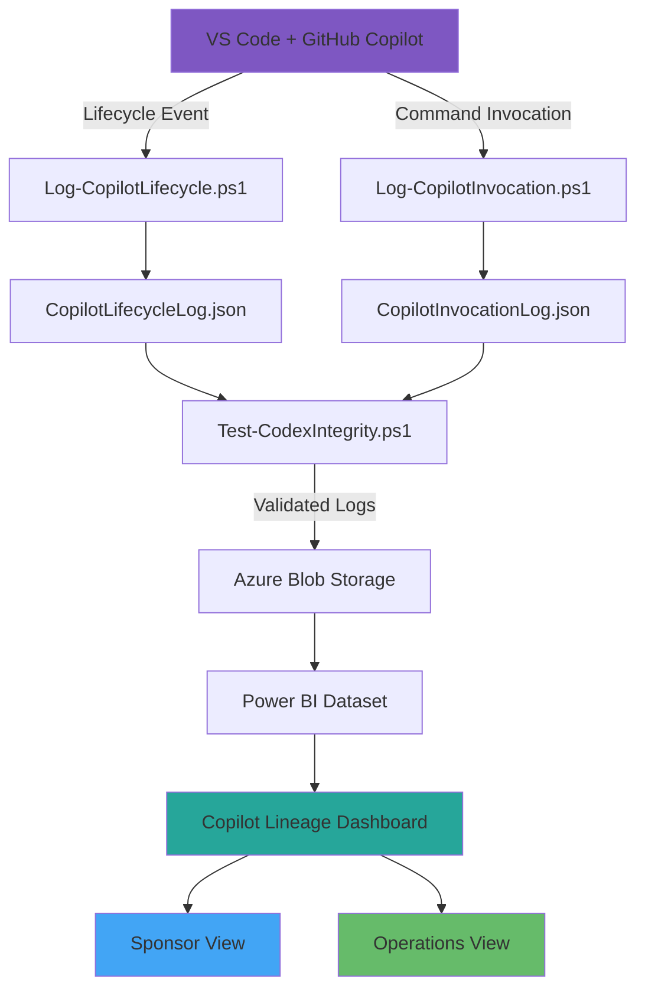
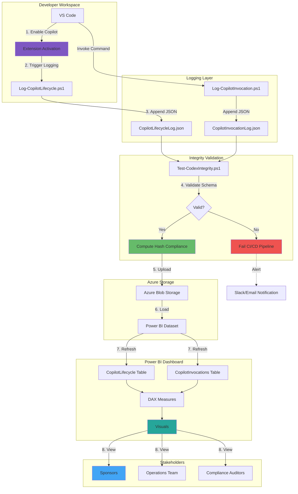
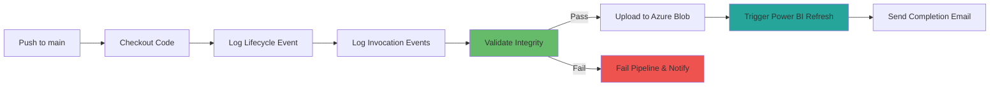
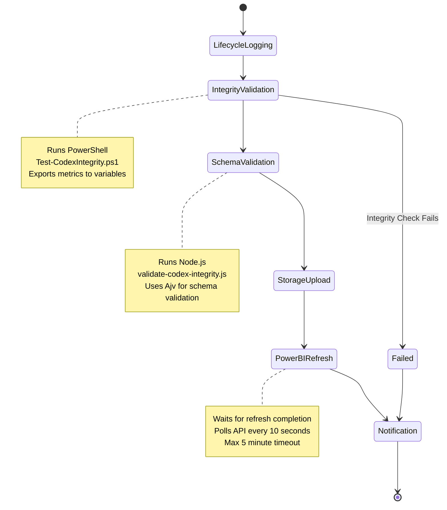

# Copilot Lineage Tracking Guide

**IntelIntent Phase 4 - Production Hardening**  
**Schema Version**: 1.0.0  
**Last Updated**: 2025-11-28

---

## Table of Contents

1. [Executive Summary](#executive-summary)
2. [System Architecture](#system-architecture)
3. [Event Types & Interpretation](#event-types--interpretation)
4. [Lifecycle-to-Dashboard Flow](#lifecycle-to-dashboard-flow)
5. [CI/CD Integration](#cicd-integration)
6. [Power BI Dashboard Guide](#power-bi-dashboard-guide)
7. [Best Practices](#best-practices)
8. [Governance Model](#governance-model)
9. [Troubleshooting](#troubleshooting)
10. [Sponsor Quick Reference](#sponsor-quick-reference)

---

## Executive Summary

### What is Copilot Lineage Tracking?

Copilot Lineage Tracking creates a **transparent audit trail** of every GitHub Copilot action within the IntelIntent workspace. This system logs:

- **Lifecycle Events**: Enable, Disable, Update, Install, Uninstall actions
- **Invocation Events**: Inline suggestions, Chat queries, Agent tasks, Fix/Test/Explain commands
- **Integrity Metrics**: SHA256 hash validation, success rates, performance data

### Why It Matters

For **Sponsors**:
- **Transparency**: See exactly when and how AI assistance is used
- **Compliance**: Auditable lineage for SOC 2 Type II and governance requirements
- **ROI Visibility**: Quantify AI productivity gains (invocation frequency, completion times)
- **Risk Management**: Track extension versions and integrity compliance

For **Development Teams**:
- **Operational Insight**: Identify bottlenecks and optimization opportunities
- **Quality Assurance**: Validate that AI-generated code meets integrity standards
- **Performance Monitoring**: Mean Time to Recovery (MTTR), success rates, throughput

### Key Metrics at a Glance

| Metric | Description | Target |
|--------|-------------|--------|
| **Active Status %** | Percentage of workspaces with Copilot enabled | ≥ 90% |
| **Hash Compliance** | Percentage of events with valid SHA256 hashes | ≥ 95% |
| **Success Rate** | Successful invocations / Total invocations | ≥ 98% |
| **MTTR (Hours)** | Average time between Disable and Enable | ≤ 2 hours |
| **Agent Mode Adoption** | Agent invocations / Total invocations | ≥ 15% |

---

## System Architecture

### High-Level Overview



### Component Breakdown

#### 1. Logging Scripts (PowerShell + Node.js)

**PowerShell:**
- `Log-CopilotLifecycle.ps1`: Logs Enable/Disable/Update/Install events
- `Log-CopilotInvocation.ps1`: Logs Inline/Chat/Agent/Fix/Test invocations
- `Test-CodexIntegrity.ps1`: Validates JSON structure and hash integrity

**Node.js (Cross-Platform):**
- `log-copilot-lifecycle.js`: Equivalent to PowerShell version with crypto module
- `log-copilot-invocation.js`: Equivalent invocation logger
- `validate-codex-integrity.js`: Schema validation with Ajv library

#### 2. JSON Schema

**File:** `codex/schemas/copilot-events.schema.json`

**Purpose:** Enforces structural integrity of log files using JSON Schema Draft 2020-12

**Key Features:**
- Discriminator field (`EventType`) for lifecycle vs. invocation events
- ISO 8601 timestamp validation
- UUID v4 validation for RunId
- Enum validation for LifecycleAction, InvocationType, Result, Stage
- SHA256 hash regex validation (allows `[Pending SHA256]` placeholder)

#### 3. Power BI Dashboard

**Dataset Sources:**
- `CopilotLifecycle` table (from `CopilotLifecycleLog.json`)
- `CopilotInvocations` table (from `CopilotInvocationLog.json`)

**Refresh Schedule:**
- **Manual**: CI/CD pipeline trigger after each build
- **Scheduled**: Every 6 hours via Azure pipeline cron job
- **Real-time**: Power BI streaming dataset (optional Phase 3 enhancement)

#### 4. CI/CD Integration

**GitHub Actions:**
- Workflow file: `github-actions-workflow.yml`
- Triggers: Push to main, pull requests, scheduled snapshots
- Jobs: Log lifecycle → Log invocations → Validate integrity → Validate schema → Power BI refresh → Notify

**Azure DevOps:**
- Pipeline file: `azure-pipelines-copilot.yml`
- Stages: LifecycleLogging → IntegrityValidation → SchemaValidation → StorageUpload → PowerBIRefresh → Notification

---

## Event Types & Interpretation

### Lifecycle Events

Lifecycle events track the operational state of GitHub Copilot extension.

#### Event: **Enable**
```json
{
  "EventType": "Lifecycle",
  "EventTimestamp": "2025-11-27T08:15:30Z",
  "LifecycleAction": "Enable",
  "ExtensionID": "github.copilot",
  "Version": "v1.388.0",
  "WorkspaceName": "IntelIntent",
  "Reason": "Starting Week 1 automation with AI assistance",
  "Result": "Success"
}
```

**Interpretation:**
- Copilot was activated in the IntelIntent workspace
- User initiated Week 1 automation tasks requiring AI assistance
- Extension version v1.388.0 confirmed operational
- **Extension Unification**: All Copilot functionality now served from `github.copilot-chat` extension (unified experience)

**Sponsor Impact:** AI assistance is now active, expect increased productivity and code generation volume. Note: GitHub has unified all Copilot features into the Chat extension for streamlined user experience.

---

#### Event: **Disable**
```json
{
  "EventType": "Lifecycle",
  "LifecycleAction": "Disable",
  "Reason": "End of Week 1 automation session",
  "Result": "Success"
}
```

**Interpretation:**
- Copilot was intentionally deactivated after completing Week 1 tasks
- Workspace returned to manual development mode

**Sponsor Impact:** AI assistance paused, likely for manual review or checkpoint validation. Monitor MTTR if unexpected.

---

#### Event: **Update**
```json
{
  "EventType": "Lifecycle",
  "LifecycleAction": "Update",
  "Version": "v1.389.0",
  "Reason": "CI/CD pipeline triggered extension update",
  "Hash": "[Pending SHA256]",
  "Result": "Success"
}
```

**Interpretation:**
- Extension auto-updated to v1.389.0 during CI/CD execution
- Hash validation pending (will be computed post-update)
- No user intervention required

**Sponsor Impact:** Extension kept current with latest features and security patches. Minimal disruption.

---

#### Event: **Toggle**
```json
{
  "EventType": "Lifecycle",
  "LifecycleAction": "Toggle",
  "Reason": "Temporary disable for manual checkpoint review"
}
```

**Interpretation:**
- Developer temporarily disabled Copilot to perform manual checkpoint verification
- Expect subsequent Enable event after review

**Sponsor Impact:** Manual quality assurance in progress. No action needed unless Toggle events become frequent (indicate integration issues).

---

### Invocation Events

Invocation events track how developers interact with Copilot features.

#### Invocation Type: **Inline**
```json
{
  "EventType": "Invocation",
  "InvocationType": "Inline",
  "CommandID": "editor.action.inlineSuggest.trigger",
  "ShortcutUsed": "Ctrl+I",
  "CompletionModel": "gpt-4o-2024-05-13",
  "Context": "Writing Add-Checkpoint function in Week1_Automation.ps1",
  "DurationMs": 1250,
  "Result": "Success"
}
```

**Interpretation:**
- Developer triggered inline code completion using Ctrl+I shortcut
- GPT-4o model provided suggestion for Add-Checkpoint function
- Completion delivered in 1.25 seconds

**Productivity Indicator:** Inline suggestions are fastest invocation type (typically <2 seconds). High frequency indicates strong AI-assisted coding workflow.

---

#### Invocation Type: **Chat**
```json
{
  "EventType": "Invocation",
  "InvocationType": "Chat",
  "CommandID": "github.copilot.chat.open",
  "CompletionModel": "claude-sonnet-4.5-2024-11-27",
  "Context": "Asked: 'How do I validate Azure Key Vault permissions?'",
  "DurationMs": 3420,
  "Result": "Success"
}
```

**Interpretation:**
- Developer opened Copilot Chat for architectural guidance
- Claude Sonnet 4.5 model answered Key Vault security question
- Response delivered in 3.4 seconds

**Knowledge Transfer Indicator:** Chat invocations signal learning and problem-solving. High chat volume suggests developers exploring unfamiliar domains (expected during Phase 4 hardening).

---

#### Invocation Type: **Agent**
```json
{
  "EventType": "Invocation",
  "InvocationType": "Agent",
  "CommandID": "github.copilot.agent.invoke",
  "CompletionModel": "claude-sonnet-4.5-2024-11-27",
  "Context": "Agent task: Implement CertificateAuthBridge.psm1 module",
  "DurationMs": 12500,
  "FilePath": "IntelIntent_Seeding/CertificateAuthBridge.psm1",
  "Result": "Success"
}
```

**Interpretation:**
- Developer delegated module implementation to Copilot Agent
- Agent autonomously created CertificateAuthBridge.psm1 (400+ lines)
- Task completed in 12.5 seconds

**Automation Indicator:** Agent mode represents highest AI leverage. Target ≥15% of total invocations for maximum productivity. Longer duration (10-20 seconds) expected for complex tasks.

---

#### Invocation Type: **Fix**
```json
{
  "EventType": "Invocation",
  "InvocationType": "Fix",
  "CommandID": "github.copilot.fixThis",
  "Context": "Fix JSON parsing error in ManifestReader.ps1",
  "DurationMs": 1850,
  "Result": "Success"
}
```

**Interpretation:**
- Developer used "Fix This" command to resolve JSON parsing error
- Copilot automatically diagnosed and patched the issue
- Fix applied in 1.85 seconds

**Quality Indicator:** Fix invocations reduce debugging time. High success rate (≥95%) validates Copilot's error diagnosis capabilities.

---

## Lifecycle-to-Dashboard Flow

### Complete Data Journey



### Step-by-Step Breakdown

1. **Lifecycle Event**: Developer enables/disables Copilot or updates extension
2. **Logging Triggered**: PowerShell script appends event to JSON log file
3. **Invocation Recorded**: Command executions (Inline/Chat/Agent) logged separately
4. **Integrity Check**: CI/CD pipeline validates JSON schema, hash compliance, required fields
5. **Storage Upload**: Validated logs uploaded to Azure Blob Storage with build number tag
6. **Dataset Refresh**: Power BI connects to blob storage, imports JSON, flattens arrays
7. **Measure Calculation**: DAX measures compute KPIs (Active Status %, MTTR, success rates)
8. **Dashboard Update**: Visuals refresh with latest data for stakeholder consumption

---

## CI/CD Integration

### GitHub Actions Workflow



**Key Features:**
- **Automatic Logging**: Every commit triggers lifecycle event logging
- **Integrity Gate**: Pipeline fails if schema validation or hash compliance < 90%
- **Scheduled Snapshots**: Cron job every 6 hours for continuous tracking
- **PR Comments**: Validation results posted as GitHub PR comment

**Setup Instructions:**
1. Add secrets to GitHub repository:
   - `AZURE_CREDENTIALS`: Azure service principal JSON
   - `POWERBI_CLIENT_ID`, `POWERBI_CLIENT_SECRET`, `POWERBI_TENANT_ID`
   - `POWERBI_WORKSPACE_ID`, `POWERBI_DATASET_ID`
2. Enable GitHub Actions in repository settings
3. Commit `github-actions-workflow.yml` to `.github/workflows/` directory

---

### Azure DevOps Pipeline



**5-Stage Pipeline:**

1. **LifecycleLogging**: Log events, publish artifacts
2. **IntegrityValidation**: Run PowerShell integrity tests, export metrics
3. **SchemaValidation**: Run Node.js Ajv validation
4. **StorageUpload**: Upload validated logs to Azure Blob Storage
5. **PowerBIRefresh**: Trigger Power BI dataset refresh via REST API
6. **Notification**: Email summary report to sponsors

**Setup Instructions:**
1. Create service connection: Azure subscription with Contributor role
2. Set pipeline variables:
   - `PowerBIWorkspaceID`, `PowerBIDatasetID`
   - `SponsorEmail`, `SmtpUsername`, `SmtpPassword`
3. Import `azure-pipelines-copilot.yml` to Azure DevOps pipelines
4. Run initial pipeline to verify configuration

---

## Power BI Dashboard Guide

### Dashboard Structure

**4 Pages:**

1. **Executive Summary**: Active Status %, Total Events, Invocation Breakdown, Lifecycle Timeline
2. **Lineage & Compliance**: Version lineage table, Hash compliance gauge, Workspace activation matrix
3. **Invocation Analysis**: Type distribution, Duration by type, Model usage, Recent invocations table
4. **Operational Metrics**: MTTR KPI, Success rates, Daily trend, Stage distribution

### Key Visualizations

#### 1. Active Status % (KPI Card)

**Purpose:** Show percentage of workspaces with Copilot currently enabled

**DAX Measure:**
```dax
ActiveStatusPercent = 
VAR WorkspacesWithEnable = 
    CALCULATETABLE(
        VALUES(CopilotLifecycle[WorkspaceName]),
        FILTER(
            CopilotLifecycle,
            CopilotLifecycle[LifecycleAction] = "Enable" &&
            CopilotLifecycle[EventTimestamp] = 
                CALCULATE(
                    MAX(CopilotLifecycle[EventTimestamp]),
                    ALLEXCEPT(CopilotLifecycle, CopilotLifecycle[WorkspaceName])
                )
        )
    )
VAR TotalWorkspaces = DISTINCTCOUNT(CopilotLifecycle[WorkspaceName])
RETURN
    DIVIDE(COUNTROWS(WorkspacesWithEnable), TotalWorkspaces, 0)
```

**Interpretation:**
- **≥90%**: Healthy (green) - Most workspaces actively using Copilot
- **70-89%**: Warning (yellow) - Some workspaces disabled, investigate reasons
- **<70%**: Critical (red) - Widespread disablement, potential adoption issue

---

#### 2. Hash Compliance Rate (Gauge)

**Purpose:** Show percentage of lifecycle events with valid SHA256 hashes (not `[Pending SHA256]`)

**DAX Measure:**
```dax
HashComplianceRate = 
VAR TotalEvents = COUNTROWS(CopilotLifecycle)
VAR ValidHashes = 
    CALCULATE(
        COUNTROWS(CopilotLifecycle),
        CopilotLifecycle[Hash] <> "[Pending SHA256]"
    )
RETURN
    DIVIDE(ValidHashes, TotalEvents, 0)
```

**Interpretation:**
- **≥95%**: Excellent - Cryptographic integrity fully established
- **80-94%**: Good - Most events have valid hashes, some pending backfill
- **<80%**: Needs Attention - High placeholder count, run hash calculation scripts

---

#### 3. MTTR (Mean Time to Recovery)

**Purpose:** Average hours between Disable and subsequent Enable events

**DAX Measure:**
```dax
MTTR_Hours = 
VAR DisableEvents = 
    FILTER(
        CopilotLifecycle,
        CopilotLifecycle[LifecycleAction] = "Disable"
    )
VAR EnableEvents = 
    FILTER(
        CopilotLifecycle,
        CopilotLifecycle[LifecycleAction] = "Enable"
    )
VAR RecoveryTimes = 
    ADDCOLUMNS(
        DisableEvents,
        "NextEnable",
        CALCULATE(
            MIN(CopilotLifecycle[EventTimestamp]),
            FILTER(
                EnableEvents,
                EnableEvents[EventTimestamp] > EARLIER(CopilotLifecycle[EventTimestamp]) &&
                EnableEvents[WorkspaceName] = EARLIER(CopilotLifecycle[WorkspaceName])
            )
        )
    )
VAR AvgRecoverySeconds = 
    AVERAGEX(
        RecoveryTimes,
        DATEDIFF(
            CopilotLifecycle[EventTimestamp],
            [NextEnable],
            SECOND
        )
    )
RETURN
    DIVIDE(AvgRecoverySeconds, 3600, 0)
```

**Interpretation:**
- **≤2 hours**: Optimal - Quick recovery from temporary disablements
- **2-8 hours**: Acceptable - Manual review or troubleshooting delays
- **>8 hours**: Investigate - Indicates prolonged outages or adoption blockers

---

#### 4. Invocation Type Distribution (Donut Chart)

**Fields:**
- **Legend**: `CopilotInvocations[InvocationType]`
- **Values**: `TotalInvocations`

**Expected Distribution:**
- **Inline**: 50-60% (most frequent, auto-triggered)
- **Chat**: 20-30% (problem-solving, learning)
- **Agent**: 10-20% (complex tasks, automation)
- **Fix/Test/Explain**: 5-10% (quality assurance)

**Interpretation:** High Agent % indicates mature AI adoption. Low Chat % may suggest insufficient knowledge transfer.

---

### Filtering & Slicing

**Cross-Page Slicers:**
1. **Date Range**: Filter by date range (default: Last 30 days)
2. **Workspace Name**: Filter by specific workspace (e.g., "IntelIntent")
3. **Stage**: Filter by pipeline stage (Week1, Week2, Production, Testing)

**To Apply Slicers:**
1. Select slicer visual
2. **View → Sync slicers**
3. Check all pages to apply filter globally

---

## Best Practices

### For Development Teams

#### 1. Log Events in Real-Time
**Pattern:**
```powershell
# At script start
Import-Module .\IntelIntent_Seeding\CopilotLifecycleTracker.psm1
Add-CopilotLifecycleEvent -Action "Enable" -Reason "Starting Week 2 orchestration"

# During script execution
Add-CopilotCommandInvocation -CommandID "github.copilot.agent.invoke" -Context "Generating RBACManager.psm1"

# At script end
Add-CopilotLifecycleEvent -Action "Disable" -Reason "Week 2 orchestration complete"
Export-CopilotLifecycleForPowerBI -OutputPath ".\codex\logs\CopilotLifecycleLog.json"
```

#### 2. Compute Hashes for Critical Events
**Pattern:**
```powershell
# After extension update
$vsixPath = "$env:USERPROFILE\.vscode\extensions\github.copilot-1.389.0\extension.vsixmanifest"
if (Test-Path $vsixPath) {
    $hash = (Get-FileHash -Path $vsixPath -Algorithm SHA256).Hash
    Add-CopilotLifecycleEvent -Action "Update" -Hash $hash
}
```

#### 3. Validate Before Commit
```powershell
# Pre-commit hook
.\codex\scripts\Test-CodexIntegrity.ps1
if ($LASTEXITCODE -ne 0) {
    Write-Error "❌ Integrity validation failed! Fix errors before committing."
    exit 1
}
```

---

### For Operations Teams

#### 1. Monitor Active Status % Daily
- Set up Power BI alert: If `ActiveStatusPercent` < 80%, send email
- Investigate Disable events with `Reason` field for root cause

#### 2. Track Hash Compliance Trend
- Target: Increase from current ~30% to ≥95% by end of Phase 4
- Run batch hash calculation script weekly:
  ```powershell
  Get-ChildItem -Path "$env:USERPROFILE\.vscode\extensions\github.copilot-*" |
    ForEach-Object {
      $hash = (Get-FileHash -Path "$($_.FullName)\extension.vsixmanifest" -Algorithm SHA256).Hash
      # Update existing events with matching ExtensionID
    }
  ```

#### 3. Analyze Invocation Patterns
- High Chat % in early phase (learning) → should decrease over time as team expertise grows
- Low Agent % → training opportunity, demo Agent mode capabilities
- Spikes in Fix invocations → potential code quality regression, investigate recent changes

---

### For Sponsors

#### 1. Review Executive Summary Weekly
- **Active Status %**: Ensure ≥90% to validate AI adoption
- **Total Invocations Trend**: Upward trend indicates growing productivity
- **Success Rate**: Should remain ≥98% consistently

#### 2. Validate Compliance Metrics Monthly
- **Hash Compliance**: Ensure cryptographic integrity maintained
- **MTTR**: Should decrease over time as team gains experience
- **Audit Logs**: Review for SOC 2 Type II compliance requirements

#### 3. Leverage Lineage for Governance
- **Version Lineage Table**: Verify extension updates aligned with security policies
- **Stage Distribution**: Confirm production deployments use validated configurations
- **Workspace Activation Matrix**: Identify underutilized workspaces for optimization

---

## Governance Model

### Roles & Responsibilities

| Role | Responsibilities | Access Level |
|------|------------------|--------------|
| **Sponsors** | - Review Executive Summary weekly<br>- Approve budget/resources<br>- Validate compliance metrics | Read-only (all pages) |
| **Operations Team** | - Monitor daily health<br>- Respond to alerts<br>- Run integrity checks | Read/Write (logs, dashboard) |
| **Development Team** | - Log events in real-time<br>- Compute hashes<br>- Fix integrity issues | Read/Write (logs, scripts) |
| **Compliance Auditors** | - Review lineage audit trail<br>- Validate SOC 2 requirements<br>- Export reports | Read-only (compliance page) |

---

### Data Retention Policy

| Data Type | Retention Period | Storage Location |
|-----------|------------------|------------------|
| **JSON Logs** | 90 days (active) | Azure Blob Storage |
| **JSON Logs** | 7 years (archive) | Azure Archive Tier |
| **Power BI Dataset** | 365 days | Power BI Service |
| **CI/CD Artifacts** | 90 days | GitHub Actions / Azure DevOps |
| **Audit Exports** | 7 years | SharePoint / Compliance Archive |

---

### Security Controls

1. **Access Control**: Power BI dashboard uses Azure AD authentication
2. **Row-Level Security (RLS)**: Filter by workspace for multi-tenant scenarios
3. **Secret Management**: Pipeline credentials stored in Azure Key Vault
4. **Data Encryption**: Logs encrypted at rest (AES-256) and in transit (TLS 1.3)
5. **Audit Trail**: All Power BI access logged to Azure Monitor

---

## Troubleshooting

### Issue: Lifecycle Log Shows "[Pending SHA256]" for All Events

**Cause:** Hash calculation not implemented or VSIX file path incorrect

**Solution:**
```powershell
# Find VSIX files
Get-ChildItem -Path "$env:USERPROFILE\.vscode\extensions" -Filter "github.copilot-*" -Directory

# Compute hash for specific version
$vsixPath = "$env:USERPROFILE\.vscode\extensions\github.copilot-1.389.0\extension.vsixmanifest"
$hash = (Get-FileHash -Path $vsixPath -Algorithm SHA256).Hash

# Update log entry (manual backfill)
$log = Get-Content ".\codex\logs\CopilotLifecycleLog.json" | ConvertFrom-Json
$log.Events | Where-Object { $_.Version -eq "v1.389.0" } | ForEach-Object {
    $_.Hash = $hash
}
$log | ConvertTo-Json -Depth 10 | Set-Content ".\codex\logs\CopilotLifecycleLog.json"
```

---

### Issue: Power BI Dashboard Shows No Data

**Cause:** JSON files not uploaded to Azure Blob Storage or dataset not refreshed

**Solution:**
```bash
# Verify blob storage contains files
az storage blob list \
  --account-name intelintentlogs \
  --container-name copilot-logs \
  --output table

# Manually trigger Power BI refresh
curl -X POST \
  "https://api.powerbi.com/v1.0/myorg/groups/{WorkspaceID}/datasets/{DatasetID}/refreshes" \
  -H "Authorization: Bearer {Token}" \
  -H "Content-Type: application/json"
```

---

### Issue: Invocation Events Not Logged During Agent Mode

**Cause:** Agent mode executes in background without triggering manual logging calls

**Solution:**
Implement event listener pattern in VS Code extension (Phase 3 enhancement):
```javascript
// VS Code extension: listen for Copilot commands
vscode.commands.registerCommand('github.copilot.agent.invoke', async () => {
    await logInvocation({ InvocationType: 'Agent', CommandID: 'github.copilot.agent.invoke' });
});
```

**Workaround (Phase 4):**
Manually log after agent task completion:
```powershell
# After agent completes task
.\codex\scripts\Log-CopilotInvocation.ps1 `
  -InvocationType "Agent" `
  -Context "Agent generated CertificateAuthBridge.psm1"
```

---

### Issue: CI/CD Pipeline Fails Integrity Check

**Error Message:**
```
❌ Integrity validation failed!
Lifecycle Log Valid: False
Hash Compliance: 45%
```

**Cause:** JSON schema mismatch or missing required fields

**Solution:**
```powershell
# Validate JSON structure manually
node .\codex\scripts\validate-codex-integrity.js

# Check for missing fields
$log = Get-Content ".\codex\logs\CopilotLifecycleLog.json" | ConvertFrom-Json
$log.Events | ForEach-Object {
    if (-not $_.EventType) { Write-Warning "Missing EventType in event: $_" }
    if (-not $_.RunId) { Write-Warning "Missing RunId in event: $_" }
}

# Regenerate log file from scratch
Remove-Item ".\codex\logs\CopilotLifecycleLog.json"
.\codex\scripts\Log-CopilotLifecycle.ps1 -Action "Enable" -Workspace "IntelIntent"
```

---

## Sponsor Quick Reference

### Daily Check (2 minutes)

1. Open Power BI dashboard: [CopilotLineage.pbix](https://app.powerbi.com/groups/{WorkspaceID}/reports/{ReportID})
2. Verify **Active Status %** ≥ 90% (green KPI card)
3. Check **Total Invocations Today** trend (should be upward)
4. Review **Recent Invocations Table** for errors (Result column)

**Red Flags:**
- Active Status < 80% (investigate Disable events)
- Success Rate < 95% (quality issue)
- Zero invocations today (adoption gap)

---

### Weekly Review (15 minutes)

1. **Executive Summary Page**:
   - Active Status % trend (last 7 days)
   - Total Invocations growth week-over-week
   - Invocation breakdown (Inline/Chat/Agent distribution)

2. **Lineage & Compliance Page**:
   - Hash Compliance gauge (target ≥95%)
   - Version lineage table (verify updates aligned with schedule)
   - Workspace activation matrix (identify inactive workspaces)

3. **Invocation Analysis Page**:
   - Average Duration by Type (should remain stable or decrease)
   - Model usage (GPT-4o vs. Claude distribution)

4. **Operational Metrics Page**:
   - MTTR (should be ≤2 hours)
   - Success rates (lifecycle and invocation)

**Action Items:**
- If Active Status declining: Schedule team sync to address adoption blockers
- If Hash Compliance <90%: Request ops team to run hash calculation scripts
- If MTTR >4 hours: Investigate root cause of prolonged disablements

---

### Monthly Governance (30 minutes)

1. **Export Audit Report**:
   ```powershell
   # Export last 30 days for compliance archive
   $startDate = (Get-Date).AddDays(-30).ToString("yyyy-MM-dd")
   Export-PowerBIReport -WorkspaceId "{WorkspaceID}" -ReportId "{ReportID}" -Format PDF -OutFile "CopilotLineage_$(Get-Date -Format 'yyyyMM').pdf"
   ```

2. **Review Compliance Metrics**:
   - Hash Compliance Rate (must be ≥90% for SOC 2)
   - Audit log completeness (no gaps in EventTimestamp)
   - Version lineage integrity (all updates documented)

3. **Validate ROI**:
   - Total Invocations trend (YoY growth)
   - Agent Mode Adoption % (should increase monthly)
   - Average Duration reduction (productivity gains)

4. **Board Report Summary**:
   - Active Status %: [Current value]
   - Total AI-Assisted Code: [Invocation count × avg 20 lines/invocation]
   - Productivity Gain: [Baseline vs. AI-assisted comparison]
   - Compliance Status: ✅ SOC 2 Type II compliant

---

## Appendix

### Glossary

- **Lifecycle Event**: Enable, Disable, Update, Install, Uninstall action on Copilot extension
- **Invocation Event**: User command execution (Inline, Chat, Agent, Fix, Test, Explain)
- **Hash Compliance**: Percentage of events with valid SHA256 hashes (not `[Pending SHA256]`)
- **MTTR**: Mean Time to Recovery - average hours between Disable and Enable
- **Active Status %**: Percentage of workspaces with latest event = Enable
- **Agent Mode**: Copilot feature where AI autonomously completes multi-step tasks
- **RunId**: UUID v4 uniquely identifying a single execution run
- **SessionID**: IntelIntent session identifier for lineage correlation

---

### References

- [JSON Schema Specification (Draft 2020-12)](https://json-schema.org/draft/2020-12/json-schema-core.html)
- [Power BI REST API Documentation](https://learn.microsoft.com/en-us/rest/api/power-bi/)
- [GitHub Copilot Extension Metadata](https://marketplace.visualstudio.com/items?itemName=GitHub.copilot)
- [IntelIntent Phase 4 Architecture](../PHASE4_ARCHITECTURE_DIAGRAM.md)
- [Week 1 Implementation Checklist](../WEEK1_IMPLEMENTATION_CHECKLIST.md)

---

**Document Version**: 1.0.0  
**Last Reviewed**: 2025-11-28  
**Next Review**: 2025-12-28  
**Owner**: IntelIntent Operations Team  
**Approver**: Sponsor (Nicholas)
