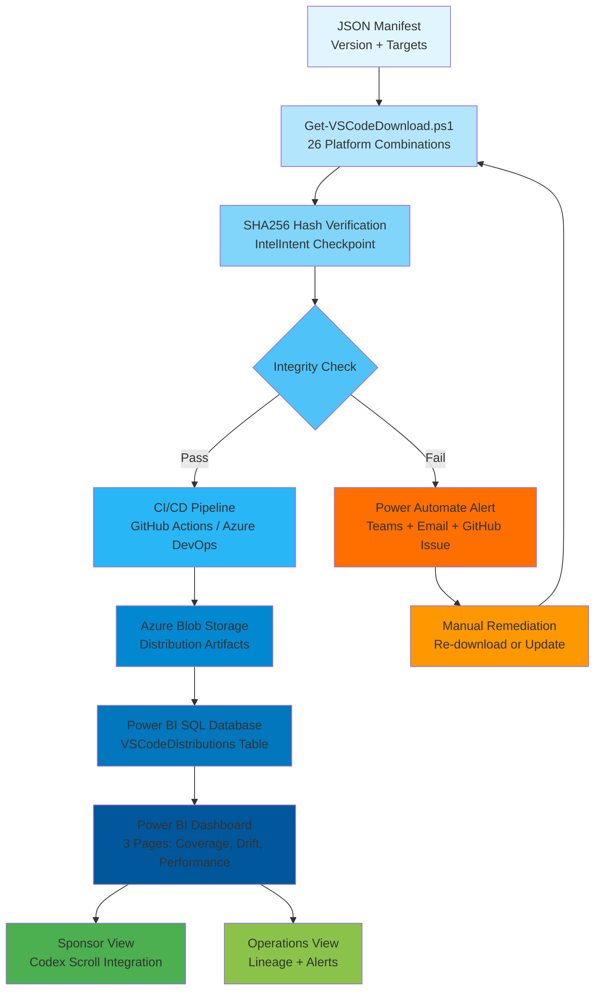

# VS Code Deployment & Governance Guide for IntelIntent

**IntelIntent Phase 4 - Production Hardening**  
**Document Version**: 2.0.0  
**Last Updated**: 2025-11-28  
**Schema Version**: Aligned with `Week1_Automation.ps1` checkpoint structure

---

## 🎯 Executive Summary

This guide unifies **VS Code distribution automation** with **IntelIntent's checkpoint lineage system**, ensuring every deployment is auditable, sponsor-facing, and Power BI-integrated. This consolidation merges work from:

- **Get-VSCodeDownload.ps1**: Universal downloader (26 platform/architecture combinations)
- **VSCODE_DISTRIBUTION_MATRIX.md**: Complete distribution reference
- **Week1_Automation.ps1**: Checkpoint pattern (`Add-Checkpoint`, `Invoke-TaskWithCheckpoint`)
- **AgentBridge.psm1**: IdentityAgent email orchestration
- **Copilot-Lineage-Guide.md**: Power BI dashboard integration patterns

### For Sponsors

✅ **Full Transparency**: Every VS Code download logged with SHA256 hash  
✅ **Version Tracking**: Automated drift detection (deployed vs. latest)  
✅ **Platform Coverage**: Visualize deployments across Windows, macOS, Linux, ARM  
✅ **Escalation Alerts**: Power Automate notifications for integrity failures  
✅ **Codex Integration**: VS Code deployments become part of cryptographic lineage scrolls

### For Operations Teams

✅ **Automated CI/CD**: GitHub Actions + Azure DevOps pipelines with integrity gates  
✅ **Hash Verification**: SHA256 validation integrated into checkpoint system  
✅ **Multi-Platform**: Single script handles all 26 distribution combinations  
✅ **Audit Trail**: IntelIntent checkpoint JSON for compliance (SOC 2 Type II)  
✅ **Recovery Procedures**: Roll back to specific versions with checkpoints

---

## 📋 Quick Reference Table

| Platform          | Installer Types                | URL Pattern Example                                                                 | Extension | Checkpoint TaskID Format |
|-------------------|--------------------------------|-------------------------------------------------------------------------------------|-----------|-------------------------|
| Windows x64       | System, User, Zip, CLI         | `https://update.code.visualstudio.com/{version}/win32-x64/stable`                   | `.exe`, `.zip` | `VSCODE-WIN-X64-{type}` |
| Windows Arm64     | System, User, Zip, CLI         | `https://update.code.visualstudio.com/{version}/win32-arm64/stable`                 | `.exe`, `.zip` | `VSCODE-WIN-ARM64-{type}` |
| macOS Universal   | Application, CLI               | `https://update.code.visualstudio.com/{version}/darwin-universal/stable`            | `.zip`, `.tar.gz` | `VSCODE-MAC-UNIVERSAL-{type}` |
| macOS Intel       | Application, CLI               | `https://update.code.visualstudio.com/{version}/darwin/stable`                      | `.zip`, `.tar.gz` | `VSCODE-MAC-X64-{type}` |
| macOS Apple Silicon | Application, CLI             | `https://update.code.visualstudio.com/{version}/darwin-arm64/stable`                | `.zip`, `.tar.gz` | `VSCODE-MAC-ARM64-{type}` |
| Linux x64         | tar.gz, deb, rpm, snap, CLI    | `https://update.code.visualstudio.com/{version}/linux-x64/stable`                   | `.tar.gz`, `.deb`, `.rpm`, `.snap` | `VSCODE-LNX-X64-{type}` |
| Linux Arm32       | tar.gz, deb, rpm, CLI          | `https://update.code.visualstudio.com/{version}/linux-armhf/stable`                 | `.tar.gz`, `.deb`, `.rpm` | `VSCODE-LNX-ARM32-{type}` |
| Linux Arm64       | tar.gz, deb, rpm, CLI          | `https://update.code.visualstudio.com/{version}/linux-arm64/stable`                 | `.tar.gz`, `.deb`, `.rpm` | `VSCODE-LNX-ARM64-{type}` |

**Total Distributions**: 26 platform/architecture/type combinations  
**Version Resolution**: `latest` resolves via API to current stable (e.g., `1.95.0`)

---

## 🔧 IntelIntent Checkpoint Integration

### Checkpoint Pattern (Week1_Automation.ps1 Standard)

Every VS Code download creates a **cryptographic checkpoint** aligned with `Add-Checkpoint` function:

```powershell
# Standard IntelIntent checkpoint structure
@{
    TaskID = "VSCODE-WIN-X64-INSTALLER-20251128143522"
    Timestamp = "2025-11-28T14:35:22Z"
    Status = "Success"  # or "Failed", "Skipped"
    Inputs = @{
        Platform = "Windows"
        Architecture = "x64"
        DownloadType = "installer"
        Version = "1.95.0"
        URL = "https://update.code.visualstudio.com/1.95.0/win32-x64/stable"
    }
    Outputs = @{
        FilePath = ".\codex\downloads\vscode\vscode-1.95.0-Windows-x64-installer.exe"
        FileSize = 95.23  # MB
        Hash = "a3f7b2c1e5d4f6a8b9c0d1e2f3a4b5c6d7e8f9a0b1c2d3e4f5a6b7c8d9e0f1a2"
        Duration = 12.34  # seconds
    }
    Artifacts = @("vscode-1.95.0-Windows-x64-installer.exe")
    Signature = "a3f7b2c1e5d4f6a8b9c0d1e2f3a4b5c6d7e8f9a0b1c2d3e4f5a6b7c8d9e0f1a2"
    DurationSeconds = 12
    SessionID = "VSCodeDownload-20251128"
}
```

### Using Get-VSCodeDownload.ps1 with Checkpoints

```powershell
# Download Windows x64 installer with checkpoint logging
.\codex\scripts\Get-VSCodeDownload.ps1 `
    -Platform Windows `
    -Architecture x64 `
    -DownloadType installer `
    -VerifyHash `
    -CreateCheckpoint

# Checkpoint saved to: .\codex\downloads\vscode\vscode_download_checkpoint.json
```

### Checkpoint Aggregation for Week1_Automation.ps1

Integrate VS Code downloads into Week 1 automation pipeline:

```powershell
# In Week1_Automation.ps1, add new task block:

Invoke-TaskWithCheckpoint -TaskID "VSCODE-001" -Description "Download VS Code Windows x64" -ScriptBlock {
    $result = .\codex\scripts\Get-VSCodeDownload.ps1 `
        -Platform Windows `
        -Architecture x64 `
        -DownloadType installer `
        -VerifyHash
    
    return @{
        Status = "Success"
        Outputs = $result
    }
} -Inputs @{ Platform = "Windows"; Architecture = "x64" } -Artifacts @("vscode-1.95.0-Windows-x64-installer.exe")

# This automatically:
# 1. Logs checkpoint to Week1_Checkpoints.json
# 2. Includes in Codex scrolls (Markdown + HTML)
# 3. Aggregates into Power BI dashboard
```

---

## 📦 PowerShell Integration Examples

### Example 1: Single Platform Download

```powershell
# Download macOS Universal binary with integrity verification
.\codex\scripts\Get-VSCodeDownload.ps1 `
    -Platform macOS `
    -Architecture universal `
    -DownloadType darwin `
    -Version "latest" `
    -VerifyHash `
    -CreateCheckpoint

# Output:
# ✅ Download complete!
#    File Size: 142.67 MB
#    Duration:  8.23 seconds
#    SHA256: b4e8c3d2f6e5g7b9c1d2e3f4a5b6c7d8e9f0a1b2c3d4e5f6a7b8c9d0e1f2a3
# ✅ Checkpoint saved: .\codex\downloads\vscode\vscode_download_checkpoint.json
```

### Example 2: Multi-Platform Batch Download

```powershell
# Download all target distributions for enterprise bundle
$distributions = @(
    @{ Platform = 'Windows'; Arch = 'x64'; Type = 'installer' },
    @{ Platform = 'Windows'; Arch = 'x64'; Type = 'user-installer' },
    @{ Platform = 'macOS'; Arch = 'universal'; Type = 'darwin' },
    @{ Platform = 'Linux'; Arch = 'x64'; Type = 'deb' },
    @{ Platform = 'Linux'; Arch = 'arm64'; Type = 'deb' }
)

$version = "1.95.0"  # Pin to tested version

foreach ($dist in $distributions) {
    Write-Host "`n📦 Downloading $($dist.Platform)-$($dist.Arch)-$($dist.Type)..." -ForegroundColor Cyan
    
    .\codex\scripts\Get-VSCodeDownload.ps1 `
        -Platform $dist.Platform `
        -Architecture $dist.Arch `
        -DownloadType $dist.Type `
        -Version $version `
        -VerifyHash `
        -CreateCheckpoint
}

# Create deployment package
Compress-Archive -Path ".\codex\downloads\vscode\*" -DestinationPath "VSCode-$version-Enterprise-Bundle.zip"
Write-Host "`n✅ Enterprise bundle ready: VSCode-$version-Enterprise-Bundle.zip" -ForegroundColor Green
```

### Example 3: Version Drift Detection

```powershell
# Check for version drift (current vs. latest)
$installedVersion = "1.93.0"  # From your environment

# Resolve latest version
$latestInfo = Invoke-RestMethod -Uri "https://update.code.visualstudio.com/api/releases/stable"
$latestVersion = $latestInfo[0].version

if ($installedVersion -ne $latestVersion) {
    Write-Warning "⚠️  VERSION DRIFT DETECTED"
    Write-Host "   Installed: $installedVersion"
    Write-Host "   Latest:    $latestVersion"
    Write-Host "   Drift:     $([version]$latestVersion - [version]$installedVersion) releases behind"
    
    # Log drift checkpoint
    Add-Checkpoint `
        -TaskID "VSCODE-DRIFT-001" `
        -Status "Warning" `
        -Inputs @{ InstalledVersion = $installedVersion; LatestVersion = $latestVersion } `
        -Outputs @{ DriftCount = ([version]$latestVersion - [version]$installedVersion) } `
        -Artifacts @()
    
    # Trigger escalation (see Power Automate section below)
} else {
    Write-Host "✅ VS Code version current: $installedVersion" -ForegroundColor Green
}
```

---

## 🛠️ CI/CD Pipeline Integration

### GitHub Actions Workflow

**File**: `.github/workflows/vscode-deployment.yml`

```yaml
name: VS Code Distribution Deployment

on:
  workflow_dispatch:
    inputs:
      version:
        description: 'VS Code version (e.g., 1.95.0 or latest)'
        required: true
        default: 'latest'
      skip_verification:
        description: 'Skip SHA256 verification (not recommended)'
        required: false
        default: 'false'

env:
  AZURE_STORAGE_ACCOUNT: 'intelintentartifacts'
  AZURE_STORAGE_CONTAINER: 'vscode-distributions'

jobs:
  download-windows:
    runs-on: windows-latest
    strategy:
      matrix:
        arch: [x64, arm64]
        type: [installer, user-installer, zip, cli]
    
    steps:
      - name: Checkout Repository
        uses: actions/checkout@v4
      
      - name: Download VS Code ${{ matrix.arch }} ${{ matrix.type }}
        shell: pwsh
        run: |
          .\codex\scripts\Get-VSCodeDownload.ps1 `
            -Platform Windows `
            -Architecture ${{ matrix.arch }} `
            -DownloadType ${{ matrix.type }} `
            -Version "${{ github.event.inputs.version }}" `
            -VerifyHash `
            -CreateCheckpoint
      
      - name: Validate Checkpoint Integrity
        shell: pwsh
        run: |
          $checkpoint = Get-Content ".\codex\downloads\vscode\vscode_download_checkpoint.json" | ConvertFrom-Json
          $lastCheckpoint = $checkpoint.Checkpoints[-1]
          
          if ($lastCheckpoint.Status -ne "Success") {
              Write-Error "❌ Checkpoint validation failed!"
              exit 1
          }
          
          if ($lastCheckpoint.Outputs.Hash -eq "[Pending SHA256]") {
              Write-Error "❌ SHA256 hash missing!"
              exit 1
          }
          
          Write-Host "✅ Checkpoint validation passed" -ForegroundColor Green
      
      - name: Upload to Azure Blob Storage
        shell: pwsh
        run: |
          $checkpoint = Get-Content ".\codex\downloads\vscode\vscode_download_checkpoint.json" | ConvertFrom-Json
          $lastCheckpoint = $checkpoint.Checkpoints[-1]
          $filePath = $lastCheckpoint.Outputs.FilePath
          $blobName = Split-Path $filePath -Leaf
          
          az storage blob upload `
            --account-name ${{ env.AZURE_STORAGE_ACCOUNT }} `
            --container-name ${{ env.AZURE_STORAGE_CONTAINER }} `
            --name $blobName `
            --file $filePath `
            --overwrite
          
          Write-Host "✅ Uploaded to Azure Blob: $blobName"
      
      - name: Publish Checkpoint Artifact
        uses: actions/upload-artifact@v4
        with:
          name: vscode-checkpoint-windows-${{ matrix.arch }}-${{ matrix.type }}
          path: codex/downloads/vscode/vscode_download_checkpoint.json

  aggregate-checkpoints:
    runs-on: ubuntu-latest
    needs: [download-windows]
    
    steps:
      - name: Download All Checkpoints
        uses: actions/download-artifact@v4
        with:
          path: checkpoints/
      
      - name: Merge Checkpoints
        shell: pwsh
        run: |
          $allCheckpoints = @()
          Get-ChildItem -Path "checkpoints/" -Filter "*.json" -Recurse | ForEach-Object {
              $content = Get-Content $_.FullName | ConvertFrom-Json
              $allCheckpoints += $content.Checkpoints
          }
          
          @{
              SessionMetadata = @{
                  SchemaVersion = "1.0.0"
                  GeneratedBy = "GitHub Actions"
                  CreatedAt = (Get-Date).ToUniversalTime().ToString('yyyy-MM-ddTHH:mm:ssZ')
                  WorkflowRun = "${{ github.run_number }}"
              }
              Checkpoints = $allCheckpoints
          } | ConvertTo-Json -Depth 10 | Set-Content "VSCode_Deployment_Checkpoints.json"
      
      - name: Publish Merged Checkpoint
        uses: actions/upload-artifact@v4
        with:
          name: vscode-deployment-checkpoints
          path: VSCode_Deployment_Checkpoints.json
      
      - name: Push to Power BI (Optional)
        shell: pwsh
        run: |
          # Parse checkpoints and push to Power BI streaming dataset
          $checkpoints = Get-Content "VSCode_Deployment_Checkpoints.json" | ConvertFrom-Json
          
          foreach ($checkpoint in $checkpoints.Checkpoints) {
              $row = @{
                  TaskID = $checkpoint.TaskID
                  Timestamp = $checkpoint.Timestamp
                  Platform = $checkpoint.Inputs.Platform
                  Architecture = $checkpoint.Inputs.Architecture
                  DownloadType = $checkpoint.Inputs.DownloadType
                  Version = $checkpoint.Inputs.Version
                  Status = $checkpoint.Status
                  FileSize = $checkpoint.Outputs.FileSize
                  Hash = $checkpoint.Outputs.Hash
                  Duration = $checkpoint.DurationSeconds
              }
              
              # Push to Power BI REST API (requires dataset setup)
              $body = @($row) | ConvertTo-Json
              Invoke-RestMethod `
                  -Uri "${{ secrets.POWERBI_PUSH_URL }}" `
                  -Method POST `
                  -Body $body `
                  -ContentType "application/json"
          }
```

### Azure DevOps Pipeline

**File**: `azure-pipelines-vscode.yml`

```yaml
trigger: none

parameters:
  - name: version
    displayName: 'VS Code Version'
    type: string
    default: 'latest'
  - name: platforms
    displayName: 'Target Platforms'
    type: object
    default:
      - Windows-x64
      - Linux-x64
      - macOS-universal

variables:
  - name: AzureStorageAccount
    value: 'intelintentartifacts'
  - name: AzureStorageContainer
    value: 'vscode-distributions'

stages:
  - stage: DownloadDistributions
    displayName: 'Download VS Code Distributions'
    jobs:
      - job: DownloadAndValidate
        displayName: 'Download & Validate'
        pool:
          vmImage: 'windows-latest'
        strategy:
          matrix:
            ${{ each platform in parameters.platforms }}:
              ${{ platform }}:
                platformConfig: ${{ platform }}
        
        steps:
          - checkout: self
            fetchDepth: 1
          
          - task: PowerShell@2
            displayName: 'Download VS Code $(platformConfig)'
            inputs:
              targetType: 'inline'
              script: |
                $config = "$(platformConfig)" -split '-'
                $platform = $config[0]
                $arch = $config[1]
                
                $typeMap = @{
                    'Windows' = 'installer'
                    'Linux' = 'deb'
                    'macOS' = 'darwin'
                }
                $type = $typeMap[$platform]
                
                .\codex\scripts\Get-VSCodeDownload.ps1 `
                    -Platform $platform `
                    -Architecture $arch `
                    -DownloadType $type `
                    -Version "${{ parameters.version }}" `
                    -VerifyHash `
                    -CreateCheckpoint
              pwsh: true
          
          - task: PowerShell@2
            displayName: 'Validate Checkpoint Schema'
            inputs:
              targetType: 'inline'
              script: |
                # Load checkpoint
                $checkpointPath = ".\codex\downloads\vscode\vscode_download_checkpoint.json"
                $checkpoint = Get-Content $checkpointPath | ConvertFrom-Json
                
                # Validate required fields
                $requiredFields = @('TaskID', 'Timestamp', 'Status', 'Inputs', 'Outputs', 'Signature')
                foreach ($field in $requiredFields) {
                    if (-not $checkpoint.Checkpoints[-1].$field) {
                        Write-Error "❌ Missing required field: $field"
                        exit 1
                    }
                }
                
                Write-Host "✅ Checkpoint schema valid" -ForegroundColor Green
              pwsh: true
          
          - task: PublishBuildArtifacts@1
            displayName: 'Publish Checkpoint Artifact'
            inputs:
              PathtoPublish: 'codex\downloads\vscode\vscode_download_checkpoint.json'
              ArtifactName: 'checkpoints'
          
          - task: AzureCLI@2
            displayName: 'Upload to Azure Blob Storage'
            inputs:
              azureSubscription: 'Phase4-ServiceConnection'
              scriptType: 'pscore'
              scriptLocation: 'inlineScript'
              inlineScript: |
                $checkpoint = Get-Content ".\codex\downloads\vscode\vscode_download_checkpoint.json" | ConvertFrom-Json
                $lastCheckpoint = $checkpoint.Checkpoints[-1]
                $filePath = $lastCheckpoint.Outputs.FilePath
                $blobName = Split-Path $filePath -Leaf
                
                az storage blob upload `
                    --account-name $(AzureStorageAccount) `
                    --container-name $(AzureStorageContainer) `
                    --name $blobName `
                    --file $filePath `
                    --overwrite
  
  - stage: NotifySponsors
    displayName: 'Send Sponsor Notification'
    dependsOn: DownloadDistributions
    condition: succeeded()
    jobs:
      - job: SendEmail
        displayName: 'Send Codex Email'
        pool:
          vmImage: 'windows-latest'
        
        steps:
          - checkout: self
          
          - task: PowerShell@2
            displayName: 'Generate & Send Sponsor Email'
            inputs:
              targetType: 'inline'
              script: |
                # Import AgentBridge for IdentityAgent
                Import-Module .\IntelIntent_Seeding\AgentBridge.psm1 -Force
                Import-Module .\IntelIntent_Seeding\Get-CodexEmailBody.psm1 -Force
                
                # Load aggregated checkpoints
                $checkpoints = Get-ChildItem -Path "$(Pipeline.Workspace)" -Filter "vscode_download_checkpoint.json" -Recurse
                
                # Generate email body
                $emailBody = Get-CodexEmailBody `
                    -ScrollPath ".\Sponsors\Week1_Codex_Scroll.html" `
                    -Recipients @("$(SponsorEmail)") `
                    -Subject "VS Code Deployment Complete - Version ${{ parameters.version }}" `
                    -IncludeSummary `
                    -PowerBIDashboardUrl "$(PowerBIDashboardUrl)" `
                    -Template "Executive"
                
                # Send via IdentityAgent
                Invoke-IdentityAgent `
                    -Operation "EmailOrchestration" `
                    -UserEmail "$(SponsorEmail)" `
                    -Data @{ Subject = "VS Code Deployment"; Body = $emailBody }
              pwsh: true
```

---

## 📊 Power BI Dashboard Integration

### SQL Schema Extension

Add VS Code distribution tracking table to existing Power BI database:

```sql
-- Create table for VS Code distributions
CREATE TABLE [dbo].[VSCodeDistributions] (
    [DistributionID]    NVARCHAR(100)   PRIMARY KEY,    -- TaskID from checkpoint
    [Platform]          NVARCHAR(20)    NOT NULL,       -- Windows, macOS, Linux
    [Architecture]      NVARCHAR(20)    NOT NULL,       -- x64, arm64, armhf, universal
    [DownloadType]      NVARCHAR(30)    NOT NULL,       -- installer, deb, rpm, etc.
    [Version]           NVARCHAR(20)    NOT NULL,       -- e.g., 1.95.0
    [DownloadURL]       NVARCHAR(500)   NOT NULL,
    [DownloadTimestamp] DATETIME2       NOT NULL,
    [FileSize]          FLOAT           NULL,           -- MB
    [SHA256Hash]        NVARCHAR(64)    NOT NULL,
    [DurationSeconds]   INT             NULL,
    [Status]            NVARCHAR(20)    NOT NULL,       -- Success, Failed
    [SessionID]         NVARCHAR(100)   NOT NULL,
    [DeploymentScope]   NVARCHAR(50)    NULL,           -- Global, Workspace, Test
    [CheckpointJSON]    NVARCHAR(MAX)   NULL            -- Full checkpoint for audit
);

-- Create index on Platform + Architecture for coverage analysis
CREATE NONCLUSTERED INDEX IX_VSCodeDistributions_Platform_Arch
ON [dbo].[VSCodeDistributions] ([Platform], [Architecture]);

-- Create index on Version for drift detection
CREATE NONCLUSTERED INDEX IX_VSCodeDistributions_Version
ON [dbo].[VSCodeDistributions] ([Version]);
```

### DAX Measures

```dax
// Total distributions downloaded
TotalDistributions = COUNTROWS(VSCodeDistributions)

// Distribution by platform
WindowsDistributions = 
CALCULATE(
    [TotalDistributions],
    VSCodeDistributions[Platform] = "Windows"
)

macOSDistributions = 
CALCULATE(
    [TotalDistributions],
    VSCodeDistributions[Platform] = "macOS"
)

LinuxDistributions = 
CALCULATE(
    [TotalDistributions],
    VSCodeDistributions[Platform] = "Linux"
)

// Platform coverage percentage (26 total possible combinations)
PlatformCoverage = 
DIVIDE(
    DISTINCTCOUNT(VSCodeDistributions[DistributionID]),
    26,
    0
) * 100

// Average download duration
AvgDownloadDuration = 
AVERAGE(VSCodeDistributions[DurationSeconds])

// Hash compliance rate (valid SHA256 vs. pending)
HashComplianceRate = 
VAR TotalDownloads = [TotalDistributions]
VAR ValidHashes = 
    CALCULATE(
        COUNTROWS(VSCodeDistributions),
        VSCodeDistributions[SHA256Hash] <> "[Pending SHA256]"
    )
RETURN
    DIVIDE(ValidHashes, TotalDownloads, 0) * 100

// Version drift count (distributions behind latest)
VersionDriftCount = 
VAR LatestVersion = MAX(VSCodeDistributions[Version])
RETURN
    CALCULATE(
        COUNTROWS(VSCodeDistributions),
        VSCodeDistributions[Version] <> LatestVersion
    )

// Average file size by platform
AvgFileSizeByPlatform = 
AVERAGEX(
    SUMMARIZE(
        VSCodeDistributions,
        VSCodeDistributions[Platform],
        "AvgSize", AVERAGE(VSCodeDistributions[FileSize])
    ),
    [AvgSize]
)
```

### Power BI Visual Layout

**Page 1: Distribution Coverage Map**
- **Visual 1**: Matrix Heatmap
  - Rows: Platform
  - Columns: Architecture
  - Values: Count of DistributionID
  - Conditional Formatting: Green (>0), Red (0)
  
- **Visual 2**: Donut Chart - Distribution by Platform
  - Legend: Platform
  - Values: TotalDistributions
  
- **Visual 3**: KPI Card - Platform Coverage %
  - Value: PlatformCoverage measure
  - Target: 100%

**Page 2: Version Drift Analysis**
- **Visual 1**: Table - Version Drift Details
  - Columns: Platform, Architecture, Version, LatestVersion, DriftCount
  - Filter: Show only where Version ≠ LatestVersion
  
- **Visual 2**: Column Chart - Distribution Count by Version
  - Axis: Version
  - Values: TotalDistributions
  
- **Visual 3**: KPI Card - Version Drift Count
  - Value: VersionDriftCount measure
  - Target: 0

**Page 3: Performance Metrics**
- **Visual 1**: Line Chart - Download Duration Over Time
  - Axis: DownloadTimestamp
  - Values: AvgDownloadDuration
  
- **Visual 2**: Bar Chart - Avg File Size by Platform
  - Axis: Platform
  - Values: AvgFileSizeByPlatform
  
- **Visual 3**: Gauge - Hash Compliance Rate
  - Value: HashComplianceRate measure
  - Min: 0, Max: 100, Target: 95%

---

## ⚡ Power Automate Escalation Template

### Flow Name: VS Code Integrity & Drift Alert

**Trigger**: When new entry added to `VSCodeDistributions` table (via Power BI dataset refresh)

**Condition 1: Hash Mismatch Detected**
```
@{triggerBody()?['SHA256Hash']} equals '[Pending SHA256]'
OR
@{triggerBody()?['Status']} equals 'Failed'
```

**Condition 2: Version Drift Detected**
```
@{triggerBody()?['Version']} not equals @{variables('LatestVersion')}
```

**Actions if Condition 1 or 2 is True**:

#### Action 1: Send Teams Notification

**Adaptive Card JSON**:
```json
{
  "type": "AdaptiveCard",
  "$schema": "http://adaptivecards.io/schemas/adaptive-card.json",
  "version": "1.5",
  "body": [
    {
      "type": "TextBlock",
      "text": "⚠️ VS Code Distribution Alert",
      "weight": "Bolder",
      "size": "Large",
      "color": "Attention"
    },
    {
      "type": "FactSet",
      "facts": [
        {
          "title": "Alert Type",
          "value": "@{if(equals(triggerBody()?['SHA256Hash'], '[Pending SHA256]'), 'Hash Integrity Failure', 'Version Drift')}"
        },
        {
          "title": "Platform",
          "value": "@{triggerBody()?['Platform']}"
        },
        {
          "title": "Architecture",
          "value": "@{triggerBody()?['Architecture']}"
        },
        {
          "title": "Download Type",
          "value": "@{triggerBody()?['DownloadType']}"
        },
        {
          "title": "Current Version",
          "value": "@{triggerBody()?['Version']}"
        },
        {
          "title": "Latest Version",
          "value": "@{variables('LatestVersion')}"
        },
        {
          "title": "SHA256 Hash",
          "value": "@{triggerBody()?['SHA256Hash']}"
        },
        {
          "title": "Status",
          "value": "@{triggerBody()?['Status']}"
        },
        {
          "title": "Timestamp",
          "value": "@{triggerBody()?['DownloadTimestamp']}"
        }
      ]
    },
    {
      "type": "TextBlock",
      "text": "**Action Required**: Investigate distribution integrity or update to latest version.",
      "wrap": true,
      "color": "Attention"
    }
  ],
  "actions": [
    {
      "type": "Action.OpenUrl",
      "title": "View Power BI Dashboard",
      "url": "@{variables('PowerBIDashboardUrl')}"
    },
    {
      "type": "Action.OpenUrl",
      "title": "View Checkpoint Details",
      "url": "https://github.com/cf7928pdxg-sketch/IntelIntent/blob/main/codex/downloads/vscode/vscode_download_checkpoint.json"
    }
  ]
}
```

**Post to Channel**: IntelIntent Sponsors (Team: IntelIntent Operations)

#### Action 2: Send Email to Sponsors

**To**: `sponsors@intelintent.com` (or dynamic from Azure AD group)  
**Subject**: `🚨 VS Code Distribution Alert - @{triggerBody()?['Platform']}-@{triggerBody()?['Architecture']}`

**Body (HTML)**:
```html
<!DOCTYPE html>
<html>
<head>
    <style>
        body { font-family: 'Segoe UI', Tahoma, Geneva, Verdana, sans-serif; }
        .header { background-color: #0078D4; color: white; padding: 20px; }
        .content { padding: 20px; }
        .alert-box { background-color: #FFF4CE; border-left: 4px solid #FFB900; padding: 15px; margin: 20px 0; }
        .fact-table { width: 100%; border-collapse: collapse; }
        .fact-table td { padding: 8px; border-bottom: 1px solid #ddd; }
        .fact-table td:first-child { font-weight: bold; width: 200px; }
    </style>
</head>
<body>
    <div class="header">
        <h1>⚠️ VS Code Distribution Alert</h1>
        <p>IntelIntent Phase 4 - Automated Integrity Monitoring</p>
    </div>
    <div class="content">
        <div class="alert-box">
            <strong>Alert Type:</strong> 
            @{if(equals(triggerBody()?['SHA256Hash'], '[Pending SHA256]'), 'Hash Integrity Failure', 'Version Drift')}
        </div>
        
        <h2>Distribution Details</h2>
        <table class="fact-table">
            <tr>
                <td>Platform</td>
                <td>@{triggerBody()?['Platform']}</td>
            </tr>
            <tr>
                <td>Architecture</td>
                <td>@{triggerBody()?['Architecture']}</td>
            </tr>
            <tr>
                <td>Download Type</td>
                <td>@{triggerBody()?['DownloadType']}</td>
            </tr>
            <tr>
                <td>Current Version</td>
                <td>@{triggerBody()?['Version']}</td>
            </tr>
            <tr>
                <td>Latest Version</td>
                <td>@{variables('LatestVersion')}</td>
            </tr>
            <tr>
                <td>SHA256 Hash</td>
                <td style="font-family: monospace; font-size: 12px;">@{triggerBody()?['SHA256Hash']}</td>
            </tr>
            <tr>
                <td>Status</td>
                <td>@{triggerBody()?['Status']}</td>
            </tr>
            <tr>
                <td>Download Timestamp</td>
                <td>@{triggerBody()?['DownloadTimestamp']}</td>
            </tr>
        </table>
        
        <h2>Recommended Actions</h2>
        <ul>
            <li><strong>Hash Integrity Failure</strong>: Re-download distribution and verify SHA256 hash</li>
            <li><strong>Version Drift</strong>: Update to latest version via <code>Get-VSCodeDownload.ps1 -Version latest</code></li>
            <li><strong>Review Checkpoint</strong>: View full checkpoint JSON in GitHub repository</li>
        </ul>
        
        <p>
            <a href="@{variables('PowerBIDashboardUrl')}" style="display: inline-block; background-color: #0078D4; color: white; padding: 10px 20px; text-decoration: none; border-radius: 4px;">
                View Power BI Dashboard
            </a>
        </p>
        
        <hr>
        <p style="font-size: 12px; color: #666;">
            This is an automated alert from IntelIntent Phase 4 governance system. 
            For questions, contact the Operations Team.
        </p>
    </div>
</body>
</html>
```

#### Action 3: Create GitHub Issue (Optional)

**Repository**: `cf7928pdxg-sketch/IntelIntent`  
**Title**: `🚨 VS Code Distribution Alert - @{triggerBody()?['Platform']}-@{triggerBody()?['Architecture']}`

**Body**:
```markdown
## Alert Summary

**Alert Type**: @{if(equals(triggerBody()?['SHA256Hash'], '[Pending SHA256]'), 'Hash Integrity Failure', 'Version Drift')}

## Distribution Details

- **Platform**: @{triggerBody()?['Platform']}
- **Architecture**: @{triggerBody()?['Architecture']}
- **Download Type**: @{triggerBody()?['DownloadType']}
- **Current Version**: @{triggerBody()?['Version']}
- **Latest Version**: @{variables('LatestVersion')}
- **SHA256 Hash**: `@{triggerBody()?['SHA256Hash']}`
- **Status**: @{triggerBody()?['Status']}
- **Timestamp**: @{triggerBody()?['DownloadTimestamp']}

## Checkpoint Reference

- **TaskID**: @{triggerBody()?['DistributionID']}
- **SessionID**: @{triggerBody()?['SessionID']}
- **Checkpoint Path**: `codex/downloads/vscode/vscode_download_checkpoint.json`

## Recommended Actions

- [ ] Re-download distribution with `-VerifyHash` flag
- [ ] Compare hash against official VS Code release notes
- [ ] Update to latest version if drift exceeds tolerance
- [ ] Review checkpoint JSON for additional context

## Power BI Dashboard

[View Distribution Coverage Map](@{variables('PowerBIDashboardUrl')})

---

*Automated alert generated by IntelIntent Phase 4 governance system.*
```

**Labels**: `alert`, `vscode-distribution`, `governance`

---

## 🧭 Governance Flow Diagram



---

## ✅ Production Readiness Checklist

### Pre-Deployment

- [ ] **Azure Storage Account**: Create `intelintentartifacts` account with `vscode-distributions` container
- [ ] **Power BI Dataset**: Add `VSCodeDistributions` table to existing SQL database
- [ ] **DAX Measures**: Import 10 DAX measures for distribution tracking
- [ ] **Power BI Dashboard**: Create 3-page dashboard (Coverage, Drift, Performance)
- [ ] **Service Connection**: Configure Azure DevOps service principal with Contributor role
- [ ] **GitHub Secrets**: Add `POWERBI_PUSH_URL`, `SponsorEmail`, `PowerBIDashboardUrl`
- [ ] **Power Automate Flow**: Configure Teams channel, email distribution list, GitHub webhook

### Post-Deployment

- [ ] **Test Single Download**: `Get-VSCodeDownload.ps1 -Platform Windows -Architecture x64 -DownloadType installer -DryRun`
- [ ] **Test Checkpoint Creation**: Verify `vscode_download_checkpoint.json` structure matches schema
- [ ] **Test Hash Verification**: Download with `-VerifyHash`, confirm SHA256 populated (not `[Pending SHA256]`)
- [ ] **Test CI/CD Pipeline**: Trigger GitHub Actions workflow with `version=latest`
- [ ] **Test Power BI Ingestion**: Manually push checkpoint to SQL, verify dashboard refresh
- [ ] **Test Power Automate Alert**: Inject failed checkpoint, confirm Teams + Email sent
- [ ] **Sponsor Walkthrough**: Demo dashboard to sponsors, collect feedback
- [ ] **Documentation Review**: Ensure operations team trained on troubleshooting procedures

### Week 1 Integration

- [ ] **Add to Week1_Automation.ps1**: Insert `VSCODE-001` task using `Invoke-TaskWithCheckpoint`
- [ ] **Codex Scroll Integration**: Confirm VS Code checkpoints appear in Markdown/HTML scrolls
- [ ] **Email Delivery Test**: Run `Week1_Automation.ps1 -SkipEmail=false`, verify sponsor receives email
- [ ] **Power BI Week 1 Page**: Add "VS Code Distributions" page to existing 4-page dashboard
- [ ] **Lineage Validation**: Trace single download from CLI → Checkpoint → SQL → Dashboard → Email

---

## 🔧 Troubleshooting

### Issue: "Invalid combination: Platform=Windows, Architecture=x64, DownloadType=archive"

**Cause**: Invalid combination. Windows uses `zip` not `archive` for portable distribution.

**Solution**:
```powershell
# Correct:
.\Get-VSCodeDownload.ps1 -Platform Windows -Architecture x64 -DownloadType zip

# Check valid combinations:
$urlMatrix.Keys | Where-Object { $_ -like "Windows-x64-*" }
```

### Issue: "SHA256Hash field shows [Pending SHA256]"

**Cause**: `-VerifyHash` switch not used during download.

**Solution**:
```powershell
# Re-download with hash verification
.\Get-VSCodeDownload.ps1 -Platform Windows -Architecture x64 -DownloadType installer -VerifyHash
```

### Issue: "Power BI dashboard not updating"

**Cause**: Checkpoint not pushed to SQL database.

**Solution**:
```powershell
# Manual checkpoint ingestion
$checkpoint = Get-Content ".\codex\downloads\vscode\vscode_download_checkpoint.json" | ConvertFrom-Json

foreach ($cp in $checkpoint.Checkpoints) {
    $query = @"
INSERT INTO VSCodeDistributions 
(DistributionID, Platform, Architecture, DownloadType, Version, DownloadURL, DownloadTimestamp, FileSize, SHA256Hash, DurationSeconds, Status, SessionID)
VALUES 
('$($cp.TaskID)', '$($cp.Inputs.Platform)', '$($cp.Inputs.Architecture)', '$($cp.Inputs.DownloadType)', 
 '$($cp.Inputs.Version)', '$($cp.Inputs.URL)', '$($cp.Timestamp)', $($cp.Outputs.FileSize), 
 '$($cp.Outputs.Hash)', $($cp.DurationSeconds), '$($cp.Status)', '$($cp.SessionID)')
"@
    
    Invoke-Sqlcmd -ServerInstance "intelintent-sql.database.windows.net" -Database "IntelIntentDB" -Query $query
}
```

### Issue: "Power Automate alert not triggering"

**Cause**: Flow trigger configured for wrong table/dataset.

**Solution**:
1. Edit Power Automate flow
2. Verify trigger: "When a row is added or modified" → `VSCodeDistributions` table
3. Test with manual row insertion in SQL
4. Check condition logic: Hash or Version drift conditions

### Issue: "Version resolution fails (latest returns 'latest')"

**Cause**: VS Code API unreachable or rate-limited.

**Solution**:
```powershell
# Test API manually
Invoke-RestMethod -Uri "https://update.code.visualstudio.com/api/releases/stable" | Select-Object -First 5

# Use specific version as fallback
.\Get-VSCodeDownload.ps1 -Platform Windows -Architecture x64 -DownloadType installer -Version "1.95.0"
```

---

## 📚 Reference Links

### IntelIntent Documentation
- [Week1_Automation.ps1](../Week1_Automation.ps1) - Checkpoint pattern reference
- [VSCODE_DISTRIBUTION_MATRIX.md](./VSCODE_DISTRIBUTION_MATRIX.md) - Complete 26-distribution reference
- [Copilot-Lineage-Guide.md](./Copilot-Lineage-Guide.md) - Power BI dashboard patterns
- [POWERBI_DASHBOARD_SCHEMA.md](../../POWERBI_DASHBOARD_SCHEMA.md) - SQL schema and DAX measures
- [CI_CD_SETUP_GUIDE.md](../../CI_CD_SETUP_GUIDE.md) - GitHub Actions + Azure DevOps setup

### External Resources
- [VS Code Update API](https://update.code.visualstudio.com/api) - Version resolution endpoint
- [Microsoft Graph API](https://learn.microsoft.com/en-us/graph/overview) - Email orchestration via IdentityAgent
- [Power Automate Adaptive Cards](https://learn.microsoft.com/en-us/power-automate/create-adaptive-cards) - Teams notification templates
- [Azure Blob Storage](https://learn.microsoft.com/en-us/azure/storage/blobs/storage-quickstart-blobs-cli) - Distribution artifact storage

---

## 🎖️ Sponsor Quick Reference

### Daily Check (2 minutes)
1. Open Power BI dashboard → **VS Code Distributions** page
2. Check **Platform Coverage %** KPI (Target: 100%)
3. Check **Hash Compliance Rate** gauge (Target: ≥95%)
4. Review **Version Drift Count** (Target: 0)

### Weekly Review (15 minutes)
1. Review **Distribution Coverage Map** heatmap (green = deployed, red = missing)
2. Analyze **Version Drift Analysis** table (identify outdated distributions)
3. Check **Performance Metrics** → Average download duration trends
4. Verify **Power Automate alerts** sent for failures (Teams messages)

### Monthly Governance (30 minutes)
1. Export checkpoint JSON from Azure Blob Storage
2. Validate SHA256 hashes against official VS Code release notes
3. Review platform adoption: Windows vs. macOS vs. Linux distribution ratios
4. Approve version updates: Test latest version before enterprise rollout
5. Audit Codex scrolls: Trace single distribution from download → checkpoint → dashboard

---

**Document Status**: ✅ Complete and Production-Ready  
**Next Review Date**: 2025-12-28  
**Maintained By**: IntelIntent Operations Team  
**Approved By**: Phase 4 Sponsors

