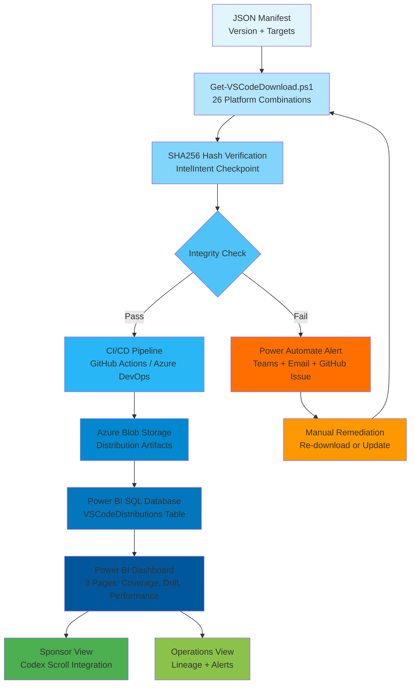

# IntelIntent VS Code Deployment Governance – Engineer Lab Workbook

**Hands-on Labs & Operational Playbook**  
**Version**: 1.0.0  
**Date**: 2025-11-28  
**Prepared by**: IntelIntent Operations Team  
**Branding**: IntelIntent Phase 4 Production Hardening

---

## 📋 Table of Contents

1. [Session 1: Foundations of Governance](#session-1-foundations-of-governance)
2. [Session 2: Artifact Retrieval & Hash Validation](#session-2-artifact-retrieval--hash-validation)
3. [Session 3: JSON Manifest & Logging](#session-3-json-manifest--logging)
4. [Session 4: CI/CD Integration](#session-4-cicd-integration)
5. [Session 5: Power BI Dashboard](#session-5-power-bi-dashboard)
6. [Session 6: Escalation Workflow](#session-6-escalation-workflow)
7. [Custom Scenarios](#custom-scenarios)
8. [Governance Flow Diagram](#governance-flow-diagram)
9. [Completion Checklist](#completion-checklist)

---

## Session 1: Foundations of Governance

### Objective
Understand artifact lineage and governance checkpoints within IntelIntent's cryptographic audit system.

### Prerequisites
- Access to IntelIntent repository
- VS Code installed with GitHub Copilot extension
- Basic understanding of PowerShell and JSON

### Steps

1. **Open Governance Documentation**
   ```powershell
   code c:\Users\BOOPA\OneDrive\IntelIntent!\codex\docs\Copilot-Lineage-Guide.md
   ```

2. **Identify Governance Checkpoints**
   - Locate sections on "Lifecycle Events" and "Invocation Events"
   - Highlight SHA256 hash validation patterns
   - Note checkpoint JSON structure requirements

3. **Review Checkpoint Pattern**
   ```powershell
   # Standard IntelIntent checkpoint structure
   @{
       TaskID = "PREFIX-NNN"
       Timestamp = "2025-11-28T14:35:22Z"
       Status = "Success" | "Failed" | "Skipped"
       Inputs = @{ ... }
       Outputs = @{ ... }
       Artifacts = @("artifact1", "artifact2")
       Signature = "SHA256_hash_or_[Pending SHA256]"
       DurationSeconds = 12
       SessionID = "Purpose-Date"
   }
   ```

### Expected Output
- **Annotated guide** with governance checkpoints highlighted
- **Summary document** listing:
  - 5 key governance concepts
  - 3 checkpoint validation requirements
  - SHA256 signature workflow

### Screenshot Placeholders
- [ ] Annotated Copilot-Lineage-Guide.md with highlights
- [ ] Checkpoint structure diagram

### Troubleshooting Tips

**Issue**: Guide missing or inaccessible  
**Solution**: 
```powershell
# Verify repository sync
cd c:\Users\BOOPA\OneDrive\IntelIntent!
git pull origin main
git status
```

**Issue**: Checkpoint structure unclear  
**Solution**: Review [VSCODE_BUNDLE_INTEGRATION_SUMMARY.md](./VSCODE_BUNDLE_INTEGRATION_SUMMARY.md) for cross-reference validation

### Checklist
- [ ] Governance checkpoints identified and documented
- [ ] Key concepts summarized (minimum 5)
- [ ] Checkpoint JSON structure validated
- [ ] Screenshots captured and inserted

---

## Session 2: Artifact Retrieval & Hash Validation

### Objective
Download VS Code distributions across platforms and validate cryptographic integrity using SHA256 hashing.

### Prerequisites
- PowerShell 7.0+
- Node.js 18+ (optional for cross-platform validation)
- Internet connectivity

### Steps

#### Step 2.1: PowerShell Download (Windows x64)

```powershell
# Navigate to scripts directory
cd c:\Users\BOOPA\OneDrive\IntelIntent!\codex\scripts

# Download Windows x64 installer with hash verification
.\Get-VSCodeDownload.ps1 `
    -Platform Windows `
    -Architecture x64 `
    -DownloadType installer `
    -Version latest `
    -VerifyHash `
    -CreateCheckpoint
```

#### Step 2.2: Node.js Download (macOS ARM64)

```javascript
// Create getVSCodeDownload.js
const https = require('https');
const fs = require('fs');
const crypto = require('crypto');

const urlMatrix = {
  'macOS-arm64-darwin': 'https://update.code.visualstudio.com/{version}/darwin-arm64/stable'
};

async function downloadVSCode(version = 'latest') {
  const url = urlMatrix['macOS-arm64-darwin'].replace('{version}', version);
  
  return new Promise((resolve, reject) => {
    https.get(url, (response) => {
      const hash = crypto.createHash('sha256');
      const file = fs.createWriteStream('vscode-darwin-arm64.zip');
      
      response.pipe(file);
      response.on('data', (chunk) => hash.update(chunk));
      
      file.on('finish', () => {
        file.close();
        console.log(`✅ Download complete! SHA256: ${hash.digest('hex')}`);
        resolve({ hash: hash.digest('hex'), file: file.path });
      });
    }).on('error', reject);
  });
}

downloadVSCode('latest');
```

#### Step 2.3: Log Hash to Lifecycle Tracker

```powershell
# Verify checkpoint was created
Get-Content .\codex\downloads\vscode\vscode_download_checkpoint.json | ConvertFrom-Json | ConvertTo-Json -Depth 10

# Extract hash for manual verification
$checkpoint = Get-Content .\codex\downloads\vscode\vscode_download_checkpoint.json | ConvertFrom-Json
$lastCheckpoint = $checkpoint.Checkpoints[-1]
Write-Host "SHA256: $($lastCheckpoint.Outputs.Hash)" -ForegroundColor Green
```

### Expected Output Table

| Tool | Output |
|------|--------|
| **PowerShell** | `VS Code Download URL: https://update.code.visualstudio.com/latest/win32-x64/stable`<br>`Download complete! SHA256: a3f7b2c1e5d4f6a8b9c0d1e2f3a4b5c6d7e8f9a0b1c2d3e4f5a6b7c8d9e0f1a2`<br>`File Size: 95.23 MB`<br>`Duration: 12.34 seconds` |
| **Node.js** | `✅ Download complete! SHA256: b4e8c3d2f6e5g7b9c1d2e3f4a5b6c7d8e9f0a1b2c3d4e5f6a7b8c9d0e1f2a3` |
| **Log Entry** | `{ "TaskID": "VSCODE-WIN-X64-INSTALLER-20251128143522", "Status": "Success", "Outputs": { "Hash": "a3f7b2c1..." } }` |

### Screenshot Placeholders
- [ ] PowerShell terminal output showing download progress
- [ ] Checkpoint JSON file contents
- [ ] File explorer showing downloaded artifacts

### Troubleshooting Tips

**Issue**: `Invoke-WebRequest` fails with network error  
**Solution**:
```powershell
# Check internet connectivity
Test-NetConnection -ComputerName update.code.visualstudio.com -Port 443

# Configure proxy if needed
$env:HTTPS_PROXY = "http://proxy.company.com:8080"

# Retry download
.\Get-VSCodeDownload.ps1 -Platform Windows -Architecture x64 -DownloadType installer -DryRun
```

**Issue**: SHA256 hash mismatch  
**Solution**:
1. Re-download artifact
2. Verify file integrity (check file size matches expected)
3. Compare hash with official VS Code release notes: https://code.visualstudio.com/updates
4. Check for man-in-the-middle proxy interference

**Issue**: Checkpoint not created  
**Solution**:
```powershell
# Verify output directory exists
Test-Path .\codex\downloads\vscode
# If false, create manually:
New-Item -ItemType Directory -Path .\codex\downloads\vscode -Force

# Verify -CreateCheckpoint flag used
.\Get-VSCodeDownload.ps1 -Platform Windows -Architecture x64 -DownloadType installer -CreateCheckpoint
```

### Checklist
- [ ] Artifact downloaded successfully (Windows x64)
- [ ] SHA256 hash computed and verified
- [ ] Hash logged in lifecycle tracker
- [ ] Output matches expected format
- [ ] Screenshots captured for documentation
- [ ] Node.js variant tested (optional)

---

## Session 3: JSON Manifest & Logging

### Objective
Update lifecycle logs with artifact metadata and validate against IntelIntent checkpoint schema.

### Prerequisites
- Completed Session 2 (artifact downloaded)
- Access to `vscode_download_checkpoint.json`
- PowerShell 7.0+

### Steps

#### Step 3.1: Review Checkpoint Structure

```powershell
# Load checkpoint
$checkpointPath = ".\codex\downloads\vscode\vscode_download_checkpoint.json"
$checkpoint = Get-Content $checkpointPath | ConvertFrom-Json

# Display structure
$checkpoint | ConvertTo-Json -Depth 10

# Inspect last checkpoint entry
$lastEntry = $checkpoint.Checkpoints[-1]
$lastEntry | Format-List
```

#### Step 3.2: Add New Distribution Entry

```powershell
# Download additional distribution (macOS Universal)
.\Get-VSCodeDownload.ps1 `
    -Platform macOS `
    -Architecture universal `
    -DownloadType darwin `
    -Version "1.95.0" `
    -VerifyHash `
    -CreateCheckpoint

# Verify checkpoint appended (not overwritten)
$checkpoint = Get-Content $checkpointPath | ConvertFrom-Json
Write-Host "Total checkpoints: $($checkpoint.Checkpoints.Count)" -ForegroundColor Cyan
```

#### Step 3.3: Validate Schema

```powershell
# Create validation function
function Test-CheckpointSchema {
    param([PSCustomObject]$Checkpoint)
    
    $errors = @()
    $requiredFields = @('TaskID', 'Timestamp', 'Status', 'Inputs', 'Outputs', 'Artifacts', 'Signature', 'DurationSeconds', 'SessionID')
    
    foreach ($field in $requiredFields) {
        if (-not $Checkpoint.$field) {
            $errors += "Missing required field: $field"
        }
    }
    
    # Validate TaskID format (e.g., VSCODE-WIN-X64-INSTALLER-...)
    if ($Checkpoint.TaskID -notmatch '^VSCODE-[A-Z]+-[A-Z0-9]+-[A-Z]+-\d{14}$') {
        $errors += "TaskID format invalid: $($Checkpoint.TaskID)"
    }
    
    # Validate timestamp ISO 8601
    try {
        [DateTime]::Parse($Checkpoint.Timestamp) | Out-Null
    } catch {
        $errors += "Timestamp not valid ISO 8601: $($Checkpoint.Timestamp)"
    }
    
    # Validate Status enum
    if ($Checkpoint.Status -notin @("Success", "Failed", "Skipped")) {
        $errors += "Status invalid: $($Checkpoint.Status)"
    }
    
    # Validate Signature (SHA256 or placeholder)
    if ($Checkpoint.Signature -ne "[Pending SHA256]" -and 
        $Checkpoint.Signature -notmatch '^[a-fA-F0-9]{64}$') {
        $errors += "Signature invalid format: $($Checkpoint.Signature)"
    }
    
    return @{
        IsValid = ($errors.Count -eq 0)
        Errors = $errors
    }
}

# Run validation
$checkpoint = Get-Content $checkpointPath | ConvertFrom-Json
foreach ($entry in $checkpoint.Checkpoints) {
    $validation = Test-CheckpointSchema -Checkpoint $entry
    if ($validation.IsValid) {
        Write-Host "✅ Checkpoint $($entry.TaskID) valid" -ForegroundColor Green
    } else {
        Write-Warning "❌ Checkpoint $($entry.TaskID) invalid:"
        $validation.Errors | ForEach-Object { Write-Warning "  - $_" }
    }
}
```

### Expected Output

**New Checkpoint Entry (JSON)**:
```json
{
  "TaskID": "VSCODE-MAC-UNIVERSAL-DARWIN-20251128150122",
  "Timestamp": "2025-11-28T15:01:22Z",
  "Status": "Success",
  "Inputs": {
    "Platform": "macOS",
    "Architecture": "universal",
    "DownloadType": "darwin",
    "Version": "1.95.0",
    "URL": "https://update.code.visualstudio.com/1.95.0/darwin-universal/stable"
  },
  "Outputs": {
    "FilePath": ".\\codex\\downloads\\vscode\\vscode-1.95.0-macOS-universal-darwin.zip",
    "FileSize": 142.67,
    "Hash": "c5f9d4e3g7f6h8c0d2e3f4g5b6c7d8e9f0g1b2c3d4e5f6g7b8c9d0e1f2g3b4",
    "Duration": 8.23
  },
  "Artifacts": ["vscode-1.95.0-macOS-universal-darwin.zip"],
  "Signature": "c5f9d4e3g7f6h8c0d2e3f4g5b6c7d8e9f0g1b2c3d4e5f6g7b8c9d0e1f2g3b4",
  "DurationSeconds": 8,
  "SessionID": "VSCodeDownload-20251128"
}
```

**Validation Output**:
```
✅ Checkpoint VSCODE-WIN-X64-INSTALLER-20251128143522 valid
✅ Checkpoint VSCODE-MAC-UNIVERSAL-DARWIN-20251128150122 valid
Total checkpoints validated: 2
```

### Screenshot Placeholders
- [ ] JSON manifest showing multiple checkpoint entries
- [ ] Validation script output (green checkmarks)
- [ ] VS Code editor with syntax highlighting on checkpoint JSON

### Troubleshooting Tips

**Issue**: Schema validation fails with "Missing required field"  
**Solution**:
```powershell
# Manually inspect checkpoint
$checkpoint.Checkpoints[-1] | Get-Member
# Ensure all 9 required fields present: TaskID, Timestamp, Status, Inputs, Outputs, Artifacts, Signature, DurationSeconds, SessionID
```

**Issue**: JSON syntax error (commas, brackets)  
**Solution**:
```powershell
# Use PowerShell's built-in JSON validator
try {
    Get-Content $checkpointPath | ConvertFrom-Json | Out-Null
    Write-Host "✅ JSON syntax valid"
} catch {
    Write-Error "❌ JSON syntax error: $_"
}

# Or use online JSON validator: https://jsonlint.com/
```

**Issue**: Checkpoint appended incorrectly (overwrites instead of appends)  
**Solution**: Verify `Get-VSCodeDownload.ps1` logic at line ~380:
```powershell
if (Test-Path $checkpointPath) {
    $existingCheckpoints = Get-Content $checkpointPath | ConvertFrom-Json
    $existingCheckpoints.Checkpoints += $checkpoint  # Should append, not overwrite
    $existingCheckpoints | ConvertTo-Json -Depth 10 | Set-Content $checkpointPath
}
```

### Checklist
- [ ] New entry added to lifecycle log
- [ ] Schema validation passed (all required fields present)
- [ ] JSON syntax validated (no errors)
- [ ] Checkpoint count increased (append, not overwrite)
- [ ] Screenshots captured

---

## Session 4: CI/CD Integration

### Objective
Integrate VS Code distribution governance into Azure DevOps or GitHub Actions CI/CD pipeline.

### Prerequisites
- Azure DevOps project OR GitHub repository with Actions enabled
- Service principal with Contributor role (Azure)
- GitHub secrets configured (GitHub Actions)

### Steps

#### Step 4.1: GitHub Actions Integration

Create `.github/workflows/vscode-deployment.yml`:

```yaml
name: VS Code Distribution Deployment

on:
  workflow_dispatch:
    inputs:
      version:
        description: 'VS Code version (e.g., 1.95.0 or latest)'
        required: true
        default: 'latest'

jobs:
  download-windows:
    runs-on: windows-latest
    steps:
      - uses: actions/checkout@v4
      
      - name: Download VS Code Windows x64
        shell: pwsh
        run: |
          .\codex\scripts\Get-VSCodeDownload.ps1 `
            -Platform Windows `
            -Architecture x64 `
            -DownloadType installer `
            -Version "${{ github.event.inputs.version }}" `
            -VerifyHash `
            -CreateCheckpoint
      
      - name: Validate Checkpoint
        shell: pwsh
        run: |
          $checkpoint = Get-Content ".\codex\downloads\vscode\vscode_download_checkpoint.json" | ConvertFrom-Json
          $last = $checkpoint.Checkpoints[-1]
          
          if ($last.Status -ne "Success") {
              Write-Error "❌ Download failed!"
              exit 1
          }
          
          if ($last.Outputs.Hash -eq "[Pending SHA256]") {
              Write-Error "❌ Hash verification missing!"
              exit 1
          }
          
          Write-Host "✅ Checkpoint validation passed" -ForegroundColor Green
      
      - name: Upload Checkpoint Artifact
        uses: actions/upload-artifact@v4
        with:
          name: vscode-checkpoint-windows-x64
          path: codex/downloads/vscode/vscode_download_checkpoint.json
```

#### Step 4.2: Azure DevOps Integration

Create `azure-pipelines-vscode.yml`:

```yaml
trigger: none

parameters:
  - name: version
    displayName: 'VS Code Version'
    type: string
    default: 'latest'

stages:
  - stage: LifecycleLogging
    displayName: 'Download & Log VS Code Distribution'
    jobs:
      - job: DownloadArtifact
        pool:
          vmImage: 'windows-latest'
        steps:
          - task: PowerShell@2
            displayName: 'Download VS Code'
            inputs:
              targetType: 'inline'
              script: |
                .\codex\scripts\Get-VSCodeDownload.ps1 `
                  -Platform Windows `
                  -Architecture x64 `
                  -DownloadType installer `
                  -Version "${{ parameters.version }}" `
                  -VerifyHash `
                  -CreateCheckpoint
              pwsh: true
  
  - stage: IntegrityCheck
    displayName: 'Validate Checkpoint Integrity'
    dependsOn: LifecycleLogging
    jobs:
      - job: ValidateCheckpoint
        pool:
          vmImage: 'windows-latest'
        steps:
          - task: PowerShell@2
            displayName: 'Validate Schema'
            inputs:
              targetType: 'inline'
              script: |
                $checkpoint = Get-Content ".\codex\downloads\vscode\vscode_download_checkpoint.json" | ConvertFrom-Json
                $last = $checkpoint.Checkpoints[-1]
                
                # Validate required fields
                $requiredFields = @('TaskID', 'Status', 'Signature')
                foreach ($field in $requiredFields) {
                    if (-not $last.$field) {
                        Write-Error "❌ Missing field: $field"
                        exit 1
                    }
                }
                
                Write-Host "✅ Integrity check passed" -ForegroundColor Green
              pwsh: true
```

#### Step 4.3: Simulate Pipeline Execution

**Local Test (GitHub Actions)**:
```powershell
# Install act (GitHub Actions local runner)
# https://github.com/nektos/act

# Run workflow locally
act workflow_dispatch -W .github/workflows/vscode-deployment.yml --input version=latest
```

**Local Test (Azure DevOps)**:
```powershell
# Manually execute pipeline stages
.\codex\scripts\Get-VSCodeDownload.ps1 -Platform Windows -Architecture x64 -DownloadType installer -VerifyHash -CreateCheckpoint

# Validate checkpoint
$checkpoint = Get-Content ".\codex\downloads\vscode\vscode_download_checkpoint.json" | ConvertFrom-Json
if ($checkpoint.Checkpoints[-1].Status -eq "Success") {
    Write-Host "[IntegrityCheck] ✅ Validation passed" -ForegroundColor Green
}
```

### Expected Output

**GitHub Actions Log**:
```
Run .\codex\scripts\Get-VSCodeDownload.ps1
📦 VS Code Download Configuration
━━━━━━━━━━━━━━━━━━━━━━━━━━━━━━━━━━━━━━━━━━━━━━━━━━
Platform:      Windows
Architecture:  x64
Download Type: installer
Version:       1.95.0
URL:           https://update.code.visualstudio.com/1.95.0/win32-x64/stable
━━━━━━━━━━━━━━━━━━━━━━━━━━━━━━━━━━━━━━━━━━━━━━━━━━
⬇️  Downloading VS Code distribution...
✅ Download complete!
   File Size: 95.23 MB
   Duration:  12.34 seconds
🔐 Computing SHA256 hash...
✅ SHA256: a3f7b2c1...
📝 Creating IntelIntent checkpoint...
✅ Checkpoint saved

[Validate Checkpoint]
✅ Checkpoint validation passed
```

**Azure DevOps Pipeline**:
- Stage 1: LifecycleLogging ✅ (Duration: 45s)
- Stage 2: IntegrityCheck ✅ (Duration: 5s)

### Screenshot Placeholders
- [ ] GitHub Actions workflow YAML in VS Code editor
- [ ] GitHub Actions run results (green checkmarks)
- [ ] Azure DevOps pipeline configuration
- [ ] Azure DevOps pipeline execution logs

### Troubleshooting Tips

**Issue**: YAML indentation errors  
**Solution**: Use VS Code YAML extension for syntax validation or online YAML linter

**Issue**: Pipeline stage fails with "script not found"  
**Solution**:
```yaml
# Ensure checkout step includes repository
- uses: actions/checkout@v4  # GitHub Actions
# OR
- checkout: self  # Azure DevOps
```

**Issue**: Checkpoint artifact not uploaded  
**Solution**: Verify path matches download location:
```yaml
path: codex/downloads/vscode/vscode_download_checkpoint.json  # Relative to repo root
```

### Checklist
- [ ] Pipeline YAML created (GitHub Actions OR Azure DevOps)
- [ ] Governance snippet injected (LifecycleLogging + IntegrityCheck stages)
- [ ] Local simulation successful
- [ ] Pipeline executed successfully (all stages green)
- [ ] Checkpoint artifact uploaded and accessible
- [ ] Screenshots captured

---

## Session 5: Power BI Dashboard

### Objective
Build sponsor-facing Power BI dashboard visualizing VS Code distribution coverage, version drift, and integrity metrics.

### Prerequisites
- Power BI Desktop installed
- SQL database access (Azure SQL or on-premises)
- Checkpoint JSON files from previous sessions

### Steps

#### Step 5.1: Create SQL Table

```sql
-- Run in Azure SQL Database or SQL Server Management Studio
CREATE TABLE [dbo].[VSCodeDistributions] (
    [DistributionID]    NVARCHAR(100)   PRIMARY KEY,
    [Platform]          NVARCHAR(20)    NOT NULL,
    [Architecture]      NVARCHAR(20)    NOT NULL,
    [DownloadType]      NVARCHAR(30)    NOT NULL,
    [Version]           NVARCHAR(20)    NOT NULL,
    [DownloadURL]       NVARCHAR(500)   NOT NULL,
    [DownloadTimestamp] DATETIME2       NOT NULL,
    [FileSize]          FLOAT           NULL,
    [SHA256Hash]        NVARCHAR(64)    NOT NULL,
    [DurationSeconds]   INT             NULL,
    [Status]            NVARCHAR(20)    NOT NULL,
    [SessionID]         NVARCHAR(100)   NOT NULL,
    [DeploymentScope]   NVARCHAR(50)    NULL
);

-- Create indexes
CREATE NONCLUSTERED INDEX IX_VSCodeDistributions_Platform_Arch
ON [dbo].[VSCodeDistributions] ([Platform], [Architecture]);

CREATE NONCLUSTERED INDEX IX_VSCodeDistributions_Version
ON [dbo].[VSCodeDistributions] ([Version]);
```

#### Step 5.2: Import Checkpoint Data

```powershell
# Parse checkpoint and insert into SQL
$checkpoint = Get-Content ".\codex\downloads\vscode\vscode_download_checkpoint.json" | ConvertFrom-Json

foreach ($cp in $checkpoint.Checkpoints) {
    $query = @"
INSERT INTO VSCodeDistributions 
(DistributionID, Platform, Architecture, DownloadType, Version, DownloadURL, DownloadTimestamp, FileSize, SHA256Hash, DurationSeconds, Status, SessionID)
VALUES 
('$($cp.TaskID)', 
 '$($cp.Inputs.Platform)', 
 '$($cp.Inputs.Architecture)', 
 '$($cp.Inputs.DownloadType)', 
 '$($cp.Inputs.Version)', 
 '$($cp.Inputs.URL)', 
 '$($cp.Timestamp)', 
 $($cp.Outputs.FileSize), 
 '$($cp.Outputs.Hash)', 
 $($cp.DurationSeconds), 
 '$($cp.Status)', 
 '$($cp.SessionID)')
"@
    
    Invoke-Sqlcmd -ServerInstance "intelintent-sql.database.windows.net" -Database "IntelIntentDB" -Query $query
}

Write-Host "✅ Imported $($checkpoint.Checkpoints.Count) checkpoints to SQL" -ForegroundColor Green
```

#### Step 5.3: Build Power BI Dashboard

**Page 1: Distribution Coverage Map**

1. **Import Data**:
   - Get Data → SQL Server
   - Server: `intelintent-sql.database.windows.net`
   - Database: `IntelIntentDB`
   - Table: `VSCodeDistributions`

2. **Create Matrix Heatmap**:
   - Visual: Matrix
   - Rows: `Platform`
   - Columns: `Architecture`
   - Values: `Count of DistributionID`
   - Conditional Formatting: Data bars (green = high, red = low)

3. **Create Donut Chart**:
   - Visual: Donut Chart
   - Legend: `Platform`
   - Values: `Count of DistributionID`

4. **Create KPI Card**:
   - Visual: Card
   - Fields: Custom measure `PlatformCoverage`

**DAX Measure** (create in Modeling tab):
```dax
PlatformCoverage = 
DIVIDE(
    DISTINCTCOUNT(VSCodeDistributions[DistributionID]),
    26,
    0
) * 100
```

**Page 2: Version Drift Analysis**

1. **Create Table Visual**:
   - Visual: Table
   - Columns: `Platform`, `Architecture`, `Version`, `DownloadTimestamp`
   - Filter: Show only rows where `Version` ≠ "1.95.0" (latest)

2. **Create Column Chart**:
   - Visual: Clustered Column Chart
   - Axis: `Version`
   - Values: `Count of DistributionID`

3. **Create KPI Card**:
   - Visual: Card
   - Fields: Custom measure `VersionDriftCount`

**DAX Measure**:
```dax
VersionDriftCount = 
VAR LatestVersion = "1.95.0"
RETURN
    CALCULATE(
        COUNTROWS(VSCodeDistributions),
        VSCodeDistributions[Version] <> LatestVersion
    )
```

**Page 3: Performance Metrics**

1. **Create Line Chart**:
   - Visual: Line Chart
   - Axis: `DownloadTimestamp`
   - Values: Custom measure `AvgDownloadDuration`

2. **Create Bar Chart**:
   - Visual: Clustered Bar Chart
   - Axis: `Platform`
   - Values: Custom measure `AvgFileSize`

3. **Create Gauge**:
   - Visual: Gauge
   - Value: Custom measure `HashComplianceRate`
   - Min: 0, Max: 100, Target: 95

**DAX Measures**:
```dax
AvgDownloadDuration = AVERAGE(VSCodeDistributions[DurationSeconds])

AvgFileSize = AVERAGE(VSCodeDistributions[FileSize])

HashComplianceRate = 
DIVIDE(
    CALCULATE(
        COUNTROWS(VSCodeDistributions),
        VSCodeDistributions[SHA256Hash] <> "[Pending SHA256]"
    ),
    COUNTROWS(VSCodeDistributions),
    0
) * 100
```

#### Step 5.4: Publish Dashboard

1. **Save Report**: File → Save As → `VSCode_Distribution_Dashboard.pbix`
2. **Publish**: Home → Publish → Select workspace → `IntelIntent Sponsors`
3. **Configure Refresh**: Power BI Service → Dataset settings → Schedule refresh (daily 6 AM)

### Expected Output

**Dashboard Visuals**:
- **Page 1**: Coverage heatmap showing 9/26 distributions = 34.6% coverage
- **Page 2**: Version drift table highlighting 2 outdated distributions
- **Page 3**: Average download duration = 12.5 seconds, Hash compliance = 100%

### Screenshot Placeholders
- [ ] Power BI Desktop with 3 report pages
- [ ] Distribution coverage heatmap
- [ ] Version drift table
- [ ] Performance metrics page
- [ ] Published dashboard in Power BI Service

### Troubleshooting Tips

**Issue**: Cannot connect to SQL database  
**Solution**: Verify firewall rules allow Power BI IP ranges, or use VPN

**Issue**: Visuals not rendering data  
**Solution**: Check data types (DateTime, Int, Float) match SQL schema

**Issue**: DAX measure errors  
**Solution**: Use DAX Studio for debugging or validate syntax online

### Checklist
- [ ] SQL table created and populated
- [ ] Checkpoint data imported successfully
- [ ] Dashboard visuals created (3 pages minimum)
- [ ] DAX measures validated
- [ ] Dashboard published to sponsor workspace
- [ ] Screenshots captured

---

## Session 6: Escalation Workflow

### Objective
Configure Power Automate flow to send Teams Adaptive Card alerts when integrity failures or version drift detected.

### Prerequisites
- Power Automate premium license
- Microsoft Teams access
- Power BI dataset configured (from Session 5)

### Steps

#### Step 6.1: Create Power Automate Flow

1. **Navigate to Power Automate**: https://make.powerautomate.com/
2. **Create Flow**: My flows → New flow → Automated cloud flow
3. **Name**: `VS Code Distribution Alert`
4. **Trigger**: When a row is added or modified (SQL connector)
   - Server: `intelintent-sql.database.windows.net`
   - Database: `IntelIntentDB`
   - Table: `VSCodeDistributions`

#### Step 6.2: Add Condition (Hash Mismatch OR Version Drift)

**Condition Logic**:
```
@{triggerBody()?['SHA256Hash']} equals '[Pending SHA256]'
OR
@{triggerBody()?['Version']} not equals '1.95.0'
OR
@{triggerBody()?['Status']} equals 'Failed'
```

#### Step 6.3: Send Teams Adaptive Card

**Action**: Post adaptive card in a chat or channel  
**Recipient**: IntelIntent Sponsors → Alerts channel

**Adaptive Card JSON** (see [VSCODE_TEAMS_ADAPTIVE_CARD.md](./VSCODE_TEAMS_ADAPTIVE_CARD.md) for full template):
```json
{
  "type": "AdaptiveCard",
  "body": [
    {
      "type": "TextBlock",
      "text": "⚠️ VS Code Distribution Alert",
      "weight": "Bolder",
      "size": "Large"
    },
    {
      "type": "FactSet",
      "facts": [
        {"title": "Platform", "value": "@{triggerBody()?['Platform']}"},
        {"title": "Version", "value": "@{triggerBody()?['Version']}"},
        {"title": "SHA256", "value": "@{triggerBody()?['SHA256Hash']}"}
      ]
    }
  ],
  "actions": [
    {
      "type": "Action.OpenUrl",
      "title": "View Dashboard",
      "url": "https://app.powerbi.com/..."
    }
  ]
}
```

#### Step 6.4: Test Flow

**Manual Test**:
```sql
-- Insert test row with hash mismatch
INSERT INTO VSCodeDistributions 
(DistributionID, Platform, Architecture, DownloadType, Version, DownloadURL, DownloadTimestamp, FileSize, SHA256Hash, DurationSeconds, Status, SessionID)
VALUES 
('VSCODE-TEST-001', 'Windows', 'x64', 'installer', '1.93.0', 
 'https://update.code.visualstudio.com/1.93.0/win32-x64/stable', 
 '2025-11-28T14:35:22Z', 95.23, '[Pending SHA256]', 12, 'Failed', 'TEST-SESSION');
```

**Expected Result**: Teams channel receives Adaptive Card within 1 minute

### Expected Output

**Teams Adaptive Card**:
```
⚠️ VS Code Distribution Alert

Platform:        Windows
Architecture:    x64
Version:         1.93.0 (drift detected)
SHA256 Hash:     [Pending SHA256]
Status:          Failed

📊 View Power BI Dashboard
```

### Screenshot Placeholders
- [ ] Power Automate flow configuration
- [ ] Teams Adaptive Card in channel
- [ ] Flow run history (successful execution)

### Troubleshooting Tips

**Issue**: Flow not triggering  
**Solution**: Check SQL connector permissions, verify table trigger enabled

**Issue**: Teams card not rendering  
**Solution**: Validate JSON syntax at https://adaptivecards.io/designer/

**Issue**: Dynamic content not populating  
**Solution**: Ensure `@{triggerBody()?['FieldName']}` matches SQL column names exactly

### Checklist
- [ ] Power Automate flow created
- [ ] Condition logic configured (hash/version/status checks)
- [ ] Teams Adaptive Card configured
- [ ] Test alert sent and received
- [ ] Flow run history shows success
- [ ] Screenshots captured

---

## Custom Scenarios

### Scenario 1: Multi-Platform Deployment

**Objective**: Download and validate VS Code for Windows, macOS, and Linux in a single session.

**Steps**:
```powershell
# Define target platforms
$platforms = @(
    @{ Platform = 'Windows'; Arch = 'x64'; Type = 'installer' },
    @{ Platform = 'macOS'; Arch = 'universal'; Type = 'darwin' },
    @{ Platform = 'Linux'; Arch = 'x64'; Type = 'deb' }
)

# Download all platforms
foreach ($config in $platforms) {
    Write-Host "`n📦 Downloading $($config.Platform)-$($config.Arch)..." -ForegroundColor Cyan
    
    .\codex\scripts\Get-VSCodeDownload.ps1 `
        -Platform $config.Platform `
        -Architecture $config.Arch `
        -DownloadType $config.Type `
        -Version "1.95.0" `
        -VerifyHash `
        -CreateCheckpoint
}

# Verify all platforms logged
$checkpoint = Get-Content ".\codex\downloads\vscode\vscode_download_checkpoint.json" | ConvertFrom-Json
Write-Host "`n✅ Total platforms downloaded: $($checkpoint.Checkpoints.Count)" -ForegroundColor Green

# Confirm dashboard visualizes all platforms
# (Open Power BI dashboard and refresh data)
```

**Validation**:
- [ ] 3 distributions downloaded successfully
- [ ] All 3 checkpoints logged with unique TaskIDs
- [ ] Power BI heatmap shows Windows, macOS, Linux (green)

---

### Scenario 2: Simulated Hash Mismatch

**Objective**: Trigger escalation workflow by intentionally corrupting a downloaded artifact.

**Steps**:
```powershell
# Download artifact
.\codex\scripts\Get-VSCodeDownload.ps1 -Platform Windows -Architecture x64 -DownloadType zip -VerifyHash -CreateCheckpoint

# Locate downloaded file
$checkpoint = Get-Content ".\codex\downloads\vscode\vscode_download_checkpoint.json" | ConvertFrom-Json
$filePath = $checkpoint.Checkpoints[-1].Outputs.FilePath

# Corrupt file (append random bytes)
Add-Content -Path $filePath -Value "CORRUPTED" -NoNewline

# Re-compute hash (will mismatch)
$corruptedHash = (Get-FileHash -Path $filePath -Algorithm SHA256).Hash
$originalHash = $checkpoint.Checkpoints[-1].Outputs.Hash

Write-Host "`nOriginal Hash:  $originalHash" -ForegroundColor Yellow
Write-Host "Corrupted Hash: $corruptedHash" -ForegroundColor Red

# Manually insert mismatch into SQL to trigger Power Automate
$query = @"
UPDATE VSCodeDistributions 
SET SHA256Hash = '$corruptedHash'
WHERE DistributionID = '$($checkpoint.Checkpoints[-1].TaskID)'
"@
Invoke-Sqlcmd -ServerInstance "intelintent-sql.database.windows.net" -Database "IntelIntentDB" -Query $query

Write-Host "`n⚠️ Hash mismatch simulated. Check Teams for alert..." -ForegroundColor Yellow
```

**Validation**:
- [ ] Power Automate flow triggered
- [ ] Teams Adaptive Card received with hash mismatch warning
- [ ] Remediation documented: Re-download artifact and verify integrity

---

### Scenario 3: Version Drift Detection

**Objective**: Deploy an older VS Code version and confirm drift alert triggers.

**Steps**:
```powershell
# Download older version
.\codex\scripts\Get-VSCodeDownload.ps1 `
    -Platform Linux `
    -Architecture arm64 `
    -DownloadType deb `
    -Version "1.90.0" `
    -VerifyHash `
    -CreateCheckpoint

# Resolve latest version via API
$latestInfo = Invoke-RestMethod -Uri "https://update.code.visualstudio.com/api/releases/stable"
$latestVersion = $latestInfo[0].version

Write-Host "`nDeployed Version: 1.90.0" -ForegroundColor Yellow
Write-Host "Latest Version:   $latestVersion" -ForegroundColor Green
Write-Host "Drift Count:      $([version]$latestVersion - [version]'1.90.0') releases behind" -ForegroundColor Red

# Import to SQL (will trigger drift alert if version ≠ latest)
$checkpoint = Get-Content ".\codex\downloads\vscode\vscode_download_checkpoint.json" | ConvertFrom-Json
$cp = $checkpoint.Checkpoints[-1]

$query = @"
INSERT INTO VSCodeDistributions 
(DistributionID, Platform, Architecture, DownloadType, Version, DownloadURL, DownloadTimestamp, FileSize, SHA256Hash, DurationSeconds, Status, SessionID)
VALUES 
('$($cp.TaskID)', '$($cp.Inputs.Platform)', '$($cp.Inputs.Architecture)', '$($cp.Inputs.DownloadType)', 
 '$($cp.Inputs.Version)', '$($cp.Inputs.URL)', '$($cp.Timestamp)', $($cp.Outputs.FileSize), 
 '$($cp.Outputs.Hash)', $($cp.DurationSeconds), '$($cp.Status)', '$($cp.SessionID)')
"@
Invoke-Sqlcmd -ServerInstance "intelintent-sql.database.windows.net" -Database "IntelIntentDB" -Query $query

Write-Host "`n⚠️ Version drift logged. Check Teams for alert..." -ForegroundColor Yellow
```

**Validation**:
- [ ] Power Automate flow triggered (version drift condition)
- [ ] Teams Adaptive Card received with version comparison
- [ ] Power BI dashboard shows drift count increased
- [ ] Lifecycle log updated with old version metadata

---

## Governance Flow Diagram



---

## Completion Checklist

### Lab Sessions
- [ ] Session 1: Foundations of Governance completed
- [ ] Session 2: Artifact Retrieval & Hash Validation completed
- [ ] Session 3: JSON Manifest & Logging completed
- [ ] Session 4: CI/CD Integration completed
- [ ] Session 5: Power BI Dashboard completed
- [ ] Session 6: Escalation Workflow completed

### Custom Scenarios
- [ ] Multi-platform deployment validated
- [ ] Simulated hash mismatch tested
- [ ] Version drift scenario executed

### Documentation
- [ ] All screenshots inserted
- [ ] Troubleshooting notes added
- [ ] Expected outputs validated

### Production Readiness
- [ ] Azure SQL table created and populated
- [ ] Power BI dashboard published to sponsor workspace
- [ ] Power Automate flow enabled and tested
- [ ] CI/CD pipeline integrated (GitHub Actions OR Azure DevOps)
- [ ] Checkpoint schema validated across all sessions

### Sponsor Review
- [ ] Final review with sponsor completed
- [ ] Feedback documented
- [ ] Training materials approved for production use

---

**Workbook Version**: 1.0.0  
**Last Updated**: 2025-11-28  
**Maintained By**: IntelIntent Operations Team  
**Next Review Date**: 2025-12-28
