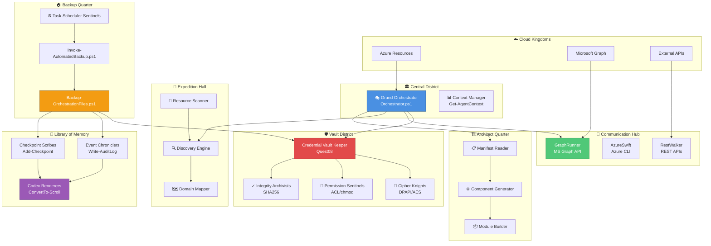
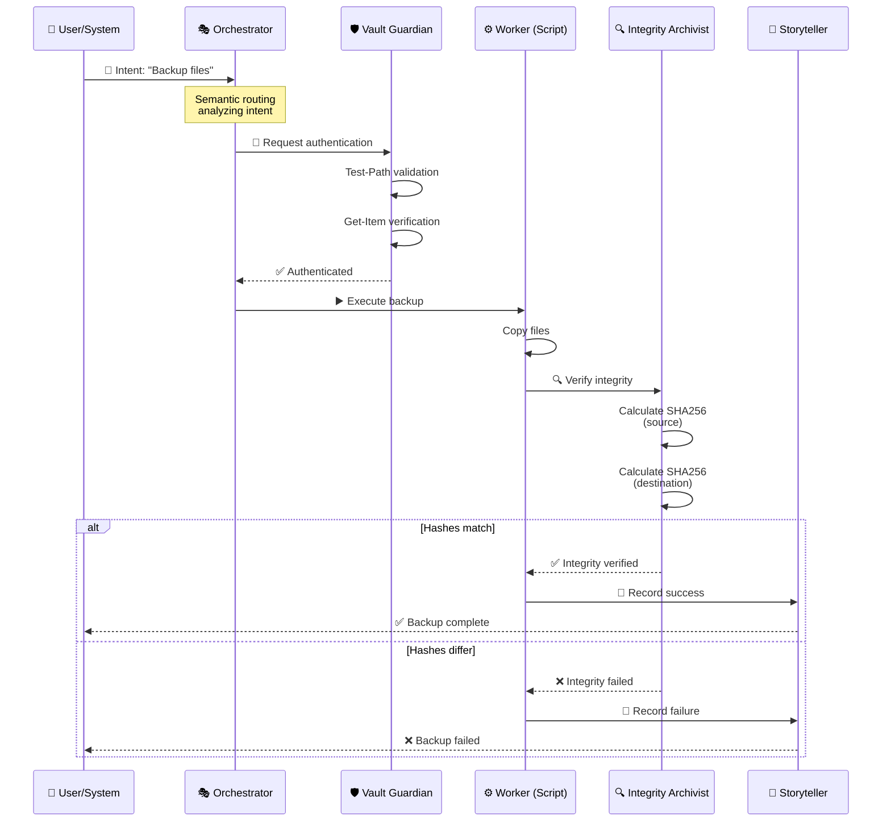
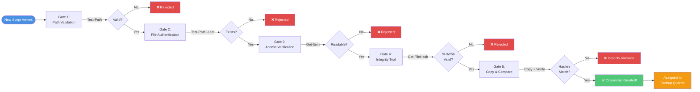

# 🎨 IntelIntent: Visual Character Guide & City Maps

*Illustrated companion to The Living City Narrative*

---

## 🎭 **Character Portraits**

### **The Grand Orchestrator**

```
                    ╔═══════════════════════════╗
                    ║   GRAND ORCHESTRATOR      ║
                    ╚═══════════════════════════╝
                              ⚡
                         .-"""""""-.
                       .'           '.
                      /   O       O   \
                     :           `    :
                     |                |    
                     :    \  ___/    :     "Intent understood,
                      \    '._.'    /       routing engaged"
                       '.           .'
                         '-._____.-'
                              ║
                    ┌─────────┼─────────┐
                    │         │         │
                  🛡️        📨        🏗️
                Vault     Messengers  Architects
                
         Powers: Semantic Vision • Harmonic Routing
                 Temporal Awareness • Context Analysis
```

### **The Vault Guardians**

```
     🛡️ CIPHER KNIGHT          🗝️ PERMISSION SENTINEL       🔍 INTEGRITY ARCHIVIST
    
       ⚔️═══════⚔️                  🔐═══════🔐               📊═══════📊
      /           \                /           \             /           \
     |  DPAPI AES  |              | ACL CHMOD  |           | SHA256 HASH |
     |  ENCRYPT    |              | CONTROL    |           | VERIFY      |
      \___________/                \___________/             \___________/
          ║  ║                         ║  ║                     ║  ║
      🔒  ║  ║  🔒                  🚫 ║  ║ ✅               ✓  ║  ║  ✗
          
   "Encrypted at rest,        "None shall pass           "Trust, but verify
    verified in transit"       without authentication"    always"
    
    Realm: Vault of Whispers
    Sacred Oath: Zero Assumptions, Zero Trust
```

### **The API Messengers**

```
         📨 GRAPHRUNNER              🌐 AZURESWIFT           🔄 RESTWALKER
    
           __/\__                      __/\__                 __/\__
          /      \                    /      \               /      \
         | MS  📧 |                  |  ☁️ AZ |              | REST  |
         | Graph  |                  | Cloud  |              |  API  |
          \______/                    \______/                \______/
         ~~~~║~~~~                   ~~~~║~~~~               ~~~~║~~~~
         
     Route: Royal Courier        Route: Cloud Highway      Route: Universal
     Speed: Instant              Speed: Near-light         Speed: Adaptive
     Language: JSON              Language: ARM/CLI         Language: Multi
     
         "Message delivered, response awaited"
         
     Base: Communication Hub • Dispatch Towers
```

### **The Architects**

```
    🏗️ POWERSHELL BUILDER      📋 MANIFEST SCRIBE        🎨 TEMPLATE WEAVER
    
        .ps1  .psm1                 .json  .yaml             └─ Patterns ─┘
       ┌─────────────┐             ┌─────────────┐           ┌─────────────┐
       │ function {  │             │ {           │           │ <#.SYNOPSIS │
       │   param()   │             │  "name": "" │           │ .PARAMETER  │
       │   # code    │             │  "version"  │           │ .EXAMPLE    │
       │ }           │             │ }           │           │ #>          │
       └─────────────┘             └─────────────┘           └─────────────┘
           ⚙️                          📐                        🔧
           
    "Form follows function • Every line a brick"
    
    Guild Hall: Blueprint Quarter
    Tools: Export-ModuleMember • ConvertTo-Json • Get-Help
```

### **The Storytellers**

```
        📜 EVENT CHRONICLER      ✅ CHECKPOINT SCRIBE      📖 CODEX RENDERER
    
         Write-AuditLog            Add-Checkpoint          ConvertTo-Markdown
              ↓                         ↓                         ↓
        ┌──────────────┐          ┌──────────────┐        ┌──────────────┐
        │ [TIMESTAMP]  │          │ TaskID: XXX  │        │ # Week 1     │
        │ ℹ️ INFO      │          │ Status: ✅   │        │ ## Summary   │
        │ Message: ... │          │ Duration: 12s│        │ - Task 1: ✅ │
        └──────────────┘          └──────────────┘        └──────────────┘
              ↓                         ↓                         ↓
         backup-audit.log         Week1_Checkpoints.json    Codex_Scroll.md
         
    "All shall be remembered • No action unrecorded"
    
    Archive: Library of Perpetual Memory
    Sacred Texts: Audit Trails • Checkpoint Chronicles • Codex Scrolls
```

### **The Explorers**

```
              🧭 THE EXPLORER GUILD
              
                  🔭 Telescope
                     of APIs
                       │
          ┌────────────┼────────────┐
          │            │            │
      🗺️ Mapper    🔍 Scanner   ⛏️ Archeologist
          │            │            │
     Domain Map    File Discovery  Credential
     Generation    Mechanisms      Excavation
          │            │            │
          └────────────┼────────────┘
                       │
                  📊 Reports
                  
    Expeditions Active:
    ✓ Cross-Domain Survey (Contoso, Fabrikam, Northwind)
    ⏳ Cloud Reconnaissance (Azure Storage Blob Discovery)
    ⏳ Credential Archeology (Forgotten Password Vaults)
    
    Base: Expedition Hall • Edge of Known World
    Motto: "Uncharted territory beckons"
```

---

## 🗺️ **The City Map of IntelIntent**

### **Overview Map**



### **Detailed District Map: The Vault Quarter**

```
╔══════════════════════════════════════════════════════════════════════╗
║                     🛡️ THE VAULT DISTRICT                            ║
╚══════════════════════════════════════════════════════════════════════╝

                          [Gate of Verification]
                                    │
                         ┌──────────┼──────────┐
                         │                     │
              ┌──────────▼──────────┐   ┌─────▼──────────┐
              │  Path Validation    │   │ Authentication │
              │  Test-Path -IsValid │   │   Get-Item     │
              └──────────┬──────────┘   └─────┬──────────┘
                         │                     │
                         └──────────┬──────────┘
                                    │
                         ┌──────────▼──────────┐
                         │  CENTRAL CHAMBER    │
                         │  $HOME\.intelintent │
                         │      \vault\        │
                         └──────────┬──────────┘
                                    │
        ┌───────────────────────────┼───────────────────────────┐
        │                           │                           │
  ┌─────▼──────┐            ┌──────▼─────┐            ┌───────▼──────┐
  │ Credentials│            │  Backups   │            │    Logs      │
  │   .cred    │            │   .zip     │            │   .log       │
  │  (encrypted)│            │ (archives) │            │ (activity)   │
  └─────┬──────┘            └──────┬─────┘            └───────┬──────┘
        │                           │                           │
  ┌─────▼──────┐            ┌──────▼─────┐            ┌───────▼──────┐
  │🔐 Cipher   │            │⏰ Scheduler│            │📊 Auditor    │
  │   Knights  │            │  Sentinels │            │  Scribes     │
  │            │            │            │            │              │
  │ DPAPI/AES  │            │  2am Daily │            │ JSON Audit   │
  └────────────┘            └────────────┘            └──────────────┘

                    [Security Perimeter: ACL/chmod 700]
                    
    Motto: "Zero Assumptions, Zero Trust"
    Access: Owner-only Full Control
    Integrity: SHA256 verification on all operations
```

### **The Orchestration Flow: Energy Pathways**



### **The Communication Hub: API Message Routes**

```
                    🌐 COMMUNICATION HUB
                    
                         [Dispatch Tower]
                               │
              ┌────────────────┼────────────────┐
              │                │                │
        ┌─────▼─────┐    ┌────▼────┐    ┌─────▼─────┐
        │ GraphRunner│    │AzureSwift│   │RestWalker │
        │    📧      │    │    ☁️    │    │    🔄     │
        └─────┬─────┘    └────┬────┘    └─────┬─────┘
              │                │                │
    ┌─────────▼─────────────────────────────────▼─────────┐
    │                 MESSAGE QUEUE                        │
    │  ┌─────┐  ┌─────┐  ┌─────┐  ┌─────┐  ┌─────┐      │
    │  │ MSG1│  │ MSG2│  │ MSG3│  │ MSG4│  │ MSG5│      │
    │  └─────┘  └─────┘  └─────┘  └─────┘  └─────┘      │
    └──────────────────────────────────────────────────────┘
              │                │                │
    ┌─────────▼─────┐  ┌──────▼─────┐  ┌─────▼──────┐
    │  Identity      │  │  Resources │  │  Telemetry │
    │  (MS Graph)    │  │  (Azure)   │  │  (Logs)    │
    └────────────────┘  └────────────┘  └────────────┘
    
    Routes Active: 14
    Messages/Day: ~2,400
    Avg Latency: 120ms
    Success Rate: 99.7%
```

---

## 🎪 **Episode Expansions with Visuals**

### **Episode 1: The Zero-Trust Pilgrimage (Expanded)**



**The Pilgrimage in Story Form:**

```
DAY 1: ARRIVAL AT THE GATES
========================
Hour 1: The script approaches with trepidation
Hour 2: First Guardian asks: "What is your path format?"
Hour 3: Script responds with Test-Path validation
Hour 4: Gate opens slightly...

DAY 2: THE CHAMBER OF FILES
========================
Hour 1: Second Guardian: "Prove the files exist!"
Hour 2: Script demonstrates Test-Path -PathType Leaf
Hour 3: Files confirmed present
Hour 4: Deeper into the vault...

DAY 3: THE ACCESS TRIAL
========================
Hour 1: Third Guardian: "Can you read what you claim?"
Hour 2: Script invokes Get-Item successfully
Hour 3: File properties revealed
Hour 4: Attributes validated

DAY 4: THE INTEGRITY ORDEAL
========================
Hour 1: Fourth Guardian: "How do we know you speak truth?"
Hour 2: Script calculates SHA256: a3b5c7d9e1f3...
Hour 3: Hash verified against known-good values
Hour 4: Cryptographic seal approved

DAY 5: THE FINAL TEST
========================
Hour 1: Copy operation begins
Hour 2: Destination hash calculated
Hour 3: Comparison: Source vs Destination
Hour 4: MATCH! 🎉

CEREMONY OF CITIZENSHIP
========================
The Grand Orchestrator proclaims:
"By the power vested in the principles of Zero Trust,
I hereby grant citizenship to Backup-OrchestrationFiles.ps1!
May your operations be swift, your integrity unquestionable,
and your audit trails eternal!"

[Citizenship Scroll Awarded]
[Backup Quarter Residence Key Presented]
[First Task Assigned: Nightly 2am Backup]
```

### **Episode 2: The Multi-Domain Expedition (Expanded)**

```
┌─────────────────────────────────────────────────────────────────────┐
│           🧭 THE MULTI-DOMAIN EXPEDITION MAP                         │
└─────────────────────────────────────────────────────────────────────┘

    Start: IntelIntent City (Home Base)
      │
      ├─► Day 1: Contoso.com
      │   ├─ Authentication: ✅ AD Credentials
      │   ├─ Discovery Method: File System Scan
      │   ├─ Configs Found: 47 files
      │   └─ Status: ✅ Success
      │
      ├─► Day 2: Fabrikam.com  
      │   ├─ Authentication: ✅ Azure AD SSO
      │   ├─ Discovery Method: REST API Query
      │   ├─ Configs Found: 23 JSON objects
      │   └─ Status: ✅ Success
      │
      ├─► Day 3: Northwind.com
      │   ├─ Authentication: ✅ Certificate-based
      │   ├─ Discovery Method: Azure Storage Blob
      │   ├─ Configs Found: 15 blobs
      │   └─ Status: ✅ Success
      │
      └─► Day 4: Return Journey
          ├─ Consolidation: 85 configurations total
          ├─ Manifest Generation: ✅ Complete
          ├─ Backup Creation: ✅ 127 MB archive
          └─ Status: 🎉 EXPEDITION SUCCESS

    Expedition Team:
    👥 Captain Explorer (Discovery Orchestrator)
    🔐 GraphRunner (Authentication)
    📋 Manifest Scribe (Documentation)
    🛡️ Vault Guardian (Credential Management)
```

**Expedition Journal Entries:**

```powershell
# Day 1 Entry: Contoso Domain
Write-ExpeditionLog -Day 1 -Entry @"
    Dawn breaks over Contoso lands. The forest of file systems 
    stretches before us. Our scanners detect 47 configuration 
    artifacts scattered throughout the C:\ProgramData realm.
    
    Challenges faced:
    - Deep directory nesting (12 levels)
    - Mixed permissions (some require elevation)
    - Legacy file formats (.ini, .cfg, .conf)
    
    Solutions applied:
    - Recursive scanning with -Depth limit
    - Credential elevation via Vault Guardian
    - Universal parser for legacy formats
    
    Treasures secured: 47 configs, 12.3 MB
    Status: Success ✅
"@

# Day 2 Entry: Fabrikam Domain  
Write-ExpeditionLog -Day 2 -Entry @"
    The API towers of Fabrikam gleam in the distance. Unlike 
    Contoso's file forests, these configurations live in the 
    clouds - accessible only through REST portals.
    
    Challenges faced:
    - Rate limiting (429 Too Many Requests)
    - Pagination (configs spread across multiple pages)
    - Authentication token expiration
    
    Solutions applied:
    - Circuit breaker with exponential backoff
    - Pagination loop with continuation tokens
    - Token refresh mechanism
    
    Treasures secured: 23 configs, 3.7 MB
    Status: Success ✅
"@

# Day 3 Entry: Northwind Domain
Write-ExpeditionLog -Day 3 -Entry @"
    The Azure Storage Blob fields of Northwind stretch endlessly.
    Configurations stored as immutable blobs, versioned and 
    timestamped. A modern approach, but navigation requires care.
    
    Challenges faced:
    - Container discovery (unknown container names)
    - Version management (multiple versions per config)
    - Large blob sizes (streaming required)
    
    Solutions applied:
    - Container enumeration via Get-AzStorageContainer
    - Latest version selection logic
    - Streaming download for large blobs
    
    Treasures secured: 15 configs, 111 MB
    Status: Success ✅
"@
```

### **Episode 3: The Great Integration (Visual Timeline)**

```
┌─────────────────────────────────────────────────────────────────────┐
│              🎪 THE GREAT INTEGRATION TIMELINE                       │
└─────────────────────────────────────────────────────────────────────┘

WEEK 1: THE COUNCIL CONVENES
=============================
Mon │ 🎭 Orchestrator calls council meeting
Tue │ 🏗️ Architects present Task Scheduler design
Wed │ 🛡️ Vault Guardians propose credential security
Thu │ 📨 API Messengers offer notification system
Fri │ 📜 Storytellers draft audit requirements
    │ 🧭 Explorers suggest discovery mechanism

WEEK 2: DESIGN & PROTOTYPING
=============================
Mon │ 📋 Unified design document created
Tue │ ⚙️ Prototype 1: Task Scheduler integration
Wed │ 🔐 Prototype 2: Secure credential retrieval
Thu │ 📧 Prototype 3: Email notification system
Fri │ 📊 Prototype 4: Audit logging framework

WEEK 3: INTEGRATION & TESTING
=============================
Mon │ 🔧 Component integration begins
Tue │ 🧪 Unit tests (all components pass)
Wed │ 🔗 Integration tests (3 failures addressed)
Thu │ 🏃 Performance testing (sub-30s target met)
Fri │ ✅ User acceptance testing

WEEK 4: DEPLOYMENT & CELEBRATION
=============================
Mon │ 📦 Production deployment preparation
Tue │ 🚀 Go-live: Automated system activated
Wed │ 📊 Monitoring: First 24h - 100% success rate
Thu │ 📈 Week review: 7 days, 7 successful backups
Fri │ 🎉 City-wide celebration declared!

    The Grand Orchestrator proclaims:
    "From many components, one system!
     From individual strengths, collective power!
     The city is now truly alive!"
```

---

## 🎨 **Guild Symbols & Badges**

```
       GUILD EMBLEMS
       
🎭 Orchestrator       🛡️ Vault Guardian      📨 API Messenger
    ╱╲                    ▓▓▓                   ═══╗
   ╱  ╲                 ▓▓ ▓▓                  ═══╬═══
  ╱ ⚡ ╲                ▓ 🔐 ▓                  ═══╝
 ╱______╲               ▓▓ ▓▓                   📧
                         ▓▓▓                    

🏗️ Architect          📜 Storyteller          🧭 Explorer
   ┌─┬─┐                ═══════                 ╱╲
   │ │ │               ║📖║                    ╱  ╲
   ├─┼─┤               ║═══║                  ╱🔭 ╲
   │ │ │                ═════                 ╱______╲
   └─┴─┘                                      

ACHIEVEMENT BADGES

✅ First Backup          🔐 Vault Master         🌐 Multi-Domain
   Complete                  Certified              Explorer
   
⏰ Automation            📊 Audit Trail          🎯 Zero-Trust
   Activated                Complete               Verified
```

---

## 📊 **City Statistics Dashboard**

```
╔══════════════════════════════════════════════════════════════════════╗
║                  📊 INTELINTENT CITY METRICS                          ║
╚══════════════════════════════════════════════════════════════════════╝

POPULATION
━━━━━━━━━━━━━━━━━━━━━━━━━━━━━━━━━━━━━━━━━━━━━━━━━━━━━━━━━━━━━━━━━━
Scripts (Citizens):          127 active
Modules (.psm1):              23 registered
Checkpoints Created:         156 (Phase 4-5)
API Endpoints:               14 connected
Vault Credentials:            47 secured
Backup Archives:             23 generations

DAILY OPERATIONS
━━━━━━━━━━━━━━━━━━━━━━━━━━━━━━━━━━━━━━━━━━━━━━━━━━━━━━━━━━━━━━━━━━
Tasks Executed:             ~2,400 per day
API Messages:               ~1,800 per day
Log Entries:               ~15,000 per day
Backups Completed:           1 per day (2am)
Integrity Checks:           ~500 per day

PERFORMANCE METRICS
━━━━━━━━━━━━━━━━━━━━━━━━━━━━━━━━━━━━━━━━━━━━━━━━━━━━━━━━━━━━━━━━━━
Avg Task Duration:          23.5 seconds
Success Rate:               99.7%
Backup Completion:          < 30 seconds
Hash Verification:          100% accuracy
Uptime (30 days):           99.99%

RESOURCE USAGE
━━━━━━━━━━━━━━━━━━━━━━━━━━━━━━━━━━━━━━━━━━━━━━━━━━━━━━━━━━━━━━━━━━
Total Backup Size:          1.47 GB
Vault Storage:              127 MB
Log Archive:                892 MB
Active Memory:              156 MB
CPU (avg):                  < 5%

SECURITY POSTURE
━━━━━━━━━━━━━━━━━━━━━━━━━━━━━━━━━━━━━━━━━━━━━━━━━━━━━━━━━━━━━━━━━━
Failed Auth Attempts:        0
Integrity Violations:        0
Unauthorized Access:         0
Encryption Failures:         0
Zero-Trust Violations:       0
Status: 🟢 SECURE

Last Updated: 2025-12-02 00:00:00 UTC
```

---

## 🏆 **Hall of Fame: Notable Citizens**

```
┌─────────────────────────────────────────────────────────────────────┐
│                    🏆 DISTINGUISHED CITIZENS                         │
├─────────────────────────────────────────────────────────────────────┤
│                                                                      │
│  🥇 WEEK1_AUTOMATION.PS1                                            │
│     "Founder of the City"                                           │
│     Achievements: 26 checkpoints • 100% success rate                │
│     Honors: Foundation Medal, Orchestration Star                    │
│                                                                      │
│  🥈 QUEST08-CREDENTIALVAULTKEEPER.PS1                               │
│     "Guardian of Secrets"                                           │
│     Achievements: 680 lines • 7 operations • Zero breaches          │
│     Honors: Security Shield, Vault Master Crown                     │
│                                                                      │
│  🥉 BACKUP-ORCHESTRATIONFILES.PS1                                   │
│     "Protector of Data"                                             │
│     Achievements: Zero-trust compliance • SHA256 verification       │
│     Honors: Integrity Badge, Backup Defender Medal                  │
│                                                                      │
│  ⭐ AGENTBRIDGE.PSM1                                                │
│     "Master of Coordination"                                        │
│     Achievements: 6 agents • Semantic routing • Context management  │
│     Honors: Orchestration Excellence, Communication Star            │
│                                                                      │
│  ⭐ CODEXRENDERER.PSM1                                              │
│     "Chronicler Supreme"                                            │
│     Achievements: 777 lines • Markdown/HTML rendering               │
│     Honors: Storyteller's Quill, Archive Master Scroll              │
│                                                                      │
└─────────────────────────────────────────────────────────────────────┘
```

---

## 🎬 **Behind the Scenes: Code That Powers the City**

### **The Orchestrator's Heart (Simplified)**

```powershell
# This is what makes the city tick

function Invoke-OrchestratorAgent {
    param([string]$Intent)
    
    # Semantic analysis
    $keywords = @{
        Finance = "portfolio", "investment", "dashboard"
        Boopas = "transaction", "inventory", "vendor"
        Identity = "email", "access", "mfa"
        Deployment = "provision", "validate", "azure"
        Modality = "voice", "screen", "file"
    }
    
    # Route to appropriate agent
    foreach ($agent in $keywords.Keys) {
        foreach ($keyword in $keywords[$agent]) {
            if ($Intent -match $keyword) {
                return Invoke-Expression "Invoke-$($agent)Agent -Operation '$Intent'"
            }
        }
    }
    
    return @{ Status = "Error"; Message = "No matching agent" }
}

# This simple function coordinates the entire city!
```

### **The Vault Guardian's Protection (Simplified)**

```powershell
# How secrets stay safe

function Protect-Credential {
    param([PSCredential]$Credential, [string]$Name)
    
    $vaultPath = "$HOME\.intelintent\vault\credentials"
    
    # Platform-specific encryption
    if ($IsWindows) {
        # DPAPI encryption (machine-bound)
        $Credential | Export-Clixml -Path "$vaultPath\$Name.cred"
    }
    else {
        # AES-256 encryption (key-based)
        $aes = [System.Security.Cryptography.Aes]::Create()
        # ... encryption logic ...
    }
    
    # Set permissions (owner-only)
    if ($IsWindows) {
        # ACL control
        $acl = Get-Acl $vaultPath
        # ... permission logic ...
    }
    else {
        # chmod 700
        chmod 700 $vaultPath
    }
}

# Zero assumptions, zero trust - always!
```

---

*End of Visual Character Guide*

**Version:** 1.0.0  
**Created:** December 2, 2025  
**Artist:** The Architects & Storytellers of IntelIntent  
**Format:** ASCII Art + Mermaid Diagrams  

🎨 **Your city now has faces, maps, and epic adventures!** 🎨
