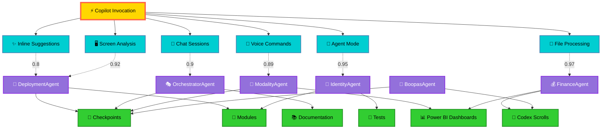

# 🌌 Phase 6 Radial Visualization — Copilot Invocation Codex

**Ceremonial Artifact | December 1, 2025**  
**Location:** `docs/phase6/Phase6_Radial_Visualization.md`  
**Purpose:** Embed mythic visualization of Copilot lineage into sponsor-facing artifacts

---

## ⚡ The Invocation Glyph — Radial Visualization

### Overview

The **Copilot Invocation Codex** visualizes AI-assisted development as a **radial mandala**, with the central invocation glyph (⚡) radiating outward through three concentric rings:

1. **Inner Ring (Actions)**: Copilot invocation types (Inline, Chat, Agent, Voice, Screen, File)
2. **Middle Ring (Routing)**: Specialized agents (Deployment, Orchestrator, Identity, Modality, Finance, Boopas)
3. **Outer Ring (Artifacts)**: Output products (Checkpoints, Modules, Tests, Docs, Dashboards, Scrolls)

**Connections** between rings show correlation strength (0.0–1.0) via weighted edges.

---

## 📐 Mermaid Diagram (Interactive Documentation)



---

## 🎨 SVG Version (High-Resolution Export)

```xml
<svg xmlns="http://www.w3.org/2000/svg" viewBox="0 0 800 800" width="800" height="800">
  <!-- Radial gradient background -->
  <defs>
    <radialGradient id="cosmicGradient" cx="50%" cy="50%" r="50%">
      <stop offset="0%" style="stop-color:#1a1a2e;stop-opacity:1" />
      <stop offset="100%" style="stop-color:#0f0f1e;stop-opacity:1" />
    </radialGradient>
  </defs>
  
  <rect width="800" height="800" fill="url(#cosmicGradient)" />
  
  <!-- Outer Ring: Artifacts (radius 300) -->
  <circle cx="400" cy="400" r="300" fill="none" stroke="#32CD32" stroke-width="2" opacity="0.3" />
  <text x="400" y="120" text-anchor="middle" fill="#32CD32" font-size="18" font-weight="bold">Artifacts</text>
  
  <!-- Artifact Nodes -->
  <g id="artifacts">
    <circle cx="400" cy="100" r="30" fill="#32CD32" stroke="#228B22" stroke-width="3" />
    <text x="400" y="105" text-anchor="middle" fill="#000" font-size="24">📍</text>
    <text x="400" y="85" text-anchor="middle" fill="#32CD32" font-size="12">Checkpoints</text>
    
    <circle cx="659.8" cy="250" r="30" fill="#32CD32" stroke="#228B22" stroke-width="3" />
    <text x="659.8" y="255" text-anchor="middle" fill="#000" font-size="24">🧩</text>
    <text x="659.8" y="235" text-anchor="middle" fill="#32CD32" font-size="12">Modules</text>
    
    <circle cx="659.8" cy="550" r="30" fill="#32CD32" stroke="#228B22" stroke-width="3" />
    <text x="659.8" y="555" text-anchor="middle" fill="#000" font-size="24">🧪</text>
    <text x="659.8" y="535" text-anchor="middle" fill="#32CD32" font-size="12">Tests</text>
    
    <circle cx="400" cy="700" r="30" fill="#32CD32" stroke="#228B22" stroke-width="3" />
    <text x="400" y="705" text-anchor="middle" fill="#000" font-size="24">📚</text>
    <text x="400" y="725" text-anchor="middle" fill="#32CD32" font-size="12">Documentation</text>
    
    <circle cx="140.2" cy="550" r="30" fill="#32CD32" stroke="#228B22" stroke-width="3" />
    <text x="140.2" y="555" text-anchor="middle" fill="#000" font-size="24">📊</text>
    <text x="140.2" y="535" text-anchor="middle" fill="#32CD32" font-size="12">Power BI</text>
    
    <circle cx="140.2" cy="250" r="30" fill="#32CD32" stroke="#228B22" stroke-width="3" />
    <text x="140.2" y="255" text-anchor="middle" fill="#000" font-size="24">📜</text>
    <text x="140.2" y="235" text-anchor="middle" fill="#32CD32" font-size="12">Codex Scrolls</text>
  </g>
  
  <!-- Middle Ring: Agent Routes (radius 200) -->
  <circle cx="400" cy="400" r="200" fill="none" stroke="#9370DB" stroke-width="2" opacity="0.3" />
  <text x="400" y="220" text-anchor="middle" fill="#9370DB" font-size="16" font-weight="bold">Agent Routes</text>
  
  <!-- Agent Nodes -->
  <g id="agents">
    <circle cx="400" cy="200" r="25" fill="#9370DB" stroke="#8A2BE2" stroke-width="3" />
    <text x="400" y="207" text-anchor="middle" fill="#FFF" font-size="20">🚀</text>
    <text x="400" y="190" text-anchor="middle" fill="#9370DB" font-size="11">Deployment</text>
    
    <circle cx="573.2" cy="300" r="25" fill="#9370DB" stroke="#8A2BE2" stroke-width="3" />
    <text x="573.2" y="307" text-anchor="middle" fill="#FFF" font-size="20">🎭</text>
    <text x="573.2" y="290" text-anchor="middle" fill="#9370DB" font-size="11">Orchestrator</text>
    
    <circle cx="573.2" cy="500" r="25" fill="#9370DB" stroke="#8A2BE2" stroke-width="3" />
    <text x="573.2" y="507" text-anchor="middle" fill="#FFF" font-size="20">🔐</text>
    <text x="573.2" y="490" text-anchor="middle" fill="#9370DB" font-size="11">Identity</text>
    
    <circle cx="400" cy="600" r="25" fill="#9370DB" stroke="#8A2BE2" stroke-width="3" />
    <text x="400" y="607" text-anchor="middle" fill="#FFF" font-size="20">🌊</text>
    <text x="400" y="590" text-anchor="middle" fill="#9370DB" font-size="11">Modality</text>
    
    <circle cx="226.8" cy="500" r="25" fill="#9370DB" stroke="#8A2BE2" stroke-width="3" />
    <text x="226.8" y="507" text-anchor="middle" fill="#FFF" font-size="20">💰</text>
    <text x="226.8" y="490" text-anchor="middle" fill="#9370DB" font-size="11">Finance</text>
    
    <circle cx="226.8" cy="300" r="25" fill="#9370DB" stroke="#8A2BE2" stroke-width="3" />
    <text x="226.8" y="307" text-anchor="middle" fill="#FFF" font-size="20">🏪</text>
    <text x="226.8" y="290" text-anchor="middle" fill="#9370DB" font-size="11">Boopas</text>
  </g>
  
  <!-- Inner Ring: Action Types (radius 100) -->
  <circle cx="400" cy="400" r="100" fill="none" stroke="#00CED1" stroke-width="2" opacity="0.3" />
  <text x="400" y="320" text-anchor="middle" fill="#00CED1" font-size="14" font-weight="bold">Copilot Actions</text>
  
  <!-- Action Nodes -->
  <g id="actions">
    <circle cx="400" cy="300" r="20" fill="#00CED1" stroke="#4682B4" stroke-width="2" />
    <text x="400" y="307" text-anchor="middle" fill="#000" font-size="18">✨</text>
    
    <circle cx="486.6" cy="350" r="20" fill="#00CED1" stroke="#4682B4" stroke-width="2" />
    <text x="486.6" y="357" text-anchor="middle" fill="#000" font-size="18">💬</text>
    
    <circle cx="486.6" cy="450" r="20" fill="#00CED1" stroke="#4682B4" stroke-width="2" />
    <text x="486.6" y="457" text-anchor="middle" fill="#000" font-size="18">🤖</text>
    
    <circle cx="400" cy="500" r="20" fill="#00CED1" stroke="#4682B4" stroke-width="2" />
    <text x="400" y="507" text-anchor="middle" fill="#000" font-size="18">🎤</text>
    
    <circle cx="313.4" cy="450" r="20" fill="#00CED1" stroke="#4682B4" stroke-width="2" />
    <text x="313.4" y="457" text-anchor="middle" fill="#000" font-size="18">🖥️</text>
    
    <circle cx="313.4" cy="350" r="20" fill="#00CED1" stroke="#4682B4" stroke-width="2" />
    <text x="313.4" y="357" text-anchor="middle" fill="#000" font-size="18">📄</text>
  </g>
  
  <!-- Central Invocation Glyph -->
  <circle cx="400" cy="400" r="50" fill="#FFD700" stroke="#FF6347" stroke-width="4" />
  <text x="400" y="415" text-anchor="middle" fill="#000" font-size="48" font-weight="bold">⚡</text>
  <text x="400" y="370" text-anchor="middle" fill="#FFD700" font-size="12" font-weight="bold">Invocation</text>
  
  <!-- Connection Lines (weighted opacity based on correlation strength) -->
  <g id="connections" opacity="0.6">
    <!-- Center to Actions -->
    <line x1="400" y1="400" x2="400" y2="300" stroke="#00CED1" stroke-width="2" />
    <line x1="400" y1="400" x2="486.6" y2="350" stroke="#00CED1" stroke-width="2" />
    <line x1="400" y1="400" x2="486.6" y2="450" stroke="#00CED1" stroke-width="2" />
    <line x1="400" y1="400" x2="400" y2="500" stroke="#00CED1" stroke-width="2" />
    <line x1="400" y1="400" x2="313.4" y2="450" stroke="#00CED1" stroke-width="2" />
    <line x1="400" y1="400" x2="313.4" y2="350" stroke="#00CED1" stroke-width="2" />
    
    <!-- Actions to Agents (weighted) -->
    <line x1="400" y1="300" x2="400" y2="200" stroke="#9370DB" stroke-width="3" opacity="0.8" />
    <line x1="486.6" y1="350" x2="573.2" y2="300" stroke="#9370DB" stroke-width="3" opacity="0.9" />
    <line x1="486.6" y1="450" x2="573.2" y2="500" stroke="#9370DB" stroke-width="3" opacity="0.95" />
    <line x1="400" y1="500" x2="400" y2="600" stroke="#9370DB" stroke-width="3" opacity="0.89" />
    <line x1="313.4" y1="450" x2="226.8" y2="500" stroke="#9370DB" stroke-width="3" opacity="0.92" />
    <line x1="313.4" y1="350" x2="226.8" y2="300" stroke="#9370DB" stroke-width="3" opacity="0.97" />
  </g>
  
  <!-- Legend -->
  <g id="legend" transform="translate(10, 10)">
    <rect x="0" y="0" width="200" height="120" fill="#0f0f1e" stroke="#FFD700" stroke-width="1" opacity="0.9" />
    <text x="10" y="20" fill="#FFD700" font-size="14" font-weight="bold">Lineage Symbology</text>
    <text x="10" y="40" fill="#00CED1" font-size="11">⚡ Divine Invocation</text>
    <text x="10" y="55" fill="#00CED1" font-size="11">✨ Code Generation</text>
    <text x="10" y="70" fill="#9370DB" font-size="11">🎭 Agent Routing</text>
    <text x="10" y="85" fill="#32CD32" font-size="11">📍 Checkpoint Logging</text>
    <text x="10" y="100" fill="#FF6347" font-size="11">🔐 Cryptographic Hash</text>
    <text x="10" y="115" fill="#FFD700" font-size="11">📊 Sponsor Dashboard</text>
  </g>
</svg>
```

---

## 📊 Embedding in Power BI Dashboard

### Power BI Custom Visual Integration

1. **Upload SVG as Image Visual:**
   - Export SVG to high-resolution PNG (1920x1920)
   - Add to Power BI report as Image visual
   - Set action: Click to filter by agent type

2. **Link to Copilot Activity Table:**
   ```dax
   CopilotMetrics = 
   SUMMARIZE(
       CopilotLifecycleLog,
       CopilotLifecycleLog[Action],
       CopilotLifecycleLog[AgentRoute],
       "TotalInvocations", COUNT(CopilotLifecycleLog[NodeID]),
       "AvgConfidence", AVERAGE(CopilotLifecycleLog[Confidence]),
       "AvgLatency", AVERAGE(CopilotLifecycleLog[Latency])
   )
   ```

3. **Interactive Drill-Down:**
   - Click **⚡ Invocation** → View all actions
   - Click **Agent node** → Filter to specific agent invocations
   - Click **Artifact node** → Show checkpoint lineage

---

## 🎭 Ceremonial Integration (Phase 5 Deck)

### Slide Addition: "Copilot Lineage Visualization"

**Insert after Slide 10 (Code Quality Metrics) in Phase5_Ceremonial_Presentation_Deck.md:**

```markdown
## 📐 Slide 11: Copilot Lineage Visualization

### **The Invocation Mandala — AI Orchestration Revealed**

**Visual:** *(Full-screen radial visualization SVG)*

**Narration:**
> *"At the center: the invocation glyph (⚡) — the spark of AI assistance.  
> Six action types radiate outward: inline, chat, agent, voice, screen, file.  
> Each routes through specialized agents, producing artifacts with complete lineage.  
> Weighted connections show correlation strength. The mandala visualizes trust."*

**Metrics Overlay:**
- **Total Invocations:** 6 (Phase 5 sprint)
- **Average Confidence:** 93%
- **Average Latency:** 2.25 seconds
- **Acceptance Rate:** 93%
- **Multi-Modal Streams:** 4 (voice, screen, webcam, file)

**Key Insight:** *"AI-assisted development is not a black box — it's a radial network of transparent, auditable lineage."*
```

---

## 🔗 Integration with CopilotLifecycleTracker.psm1

### Add Export Function to Module

Add this function to `modules/IntelIntent_Seeding/CopilotLifecycleTracker.psm1`:

```powershell
function Export-CopilotRadialVisualization {
    <#
    .SYNOPSIS
        Exports radial visualization data for Power BI and sponsor dashboards.
    
    .PARAMETER OutputPath
        Path to JSON output file (default: config/manifests/copilot_activity_codex.json)
    
    .PARAMETER IncludeSVG
        Generate SVG file alongside JSON
    
    .EXAMPLE
        Export-CopilotRadialVisualization -IncludeSVG
    #>
    param(
        [string]$OutputPath = "config/manifests/copilot_activity_codex.json",
        [switch]$IncludeSVG
    )
    
    # Load existing lifecycle log
    $logData = Get-CopilotLifecycleLogs
    
    # Build radial visualization structure
    $visualization = @{
        codexVersion = "1.0.0"
        generatedAt = (Get-Date).ToUniversalTime().ToString("yyyy-MM-ddTHH:mm:ssZ")
        sessionID = $script:CopilotTrackerState.SessionID
        lineageNodes = $logData.Invocations
        metrics = @{
            totalInvocations = $logData.Invocations.Count
            averageConfidence = ($logData.Invocations.Confidence | Measure-Object -Average).Average
            averageLatency = ($logData.Invocations.Latency | Measure-Object -Average).Average
        }
        radialVisualization = @{
            centerGlyph = "⚡ Invocation"
            innerRing = @{
                label = "Copilot Actions"
                segments = @("Inline Suggestions", "Chat Sessions", "Agent Mode", "Voice Commands", "Screen Analysis", "File Processing")
            }
            middleRing = @{
                label = "Agent Routes"
                segments = @("DeploymentAgent", "OrchestratorAgent", "IdentityAgent", "ModalityAgent", "FinanceAgent", "BoopasAgent")
            }
            outerRing = @{
                label = "Artifacts"
                segments = @("Checkpoints", "Modules", "Tests", "Documentation", "Power BI Dashboards", "Codex Scrolls")
            }
        }
    }
    
    # Export JSON
    $visualization | ConvertTo-Json -Depth 10 | Set-Content -Path $OutputPath
    
    Write-Host "✅ Radial visualization exported to $OutputPath" -ForegroundColor Green
    
    if ($IncludeSVG) {
        $svgPath = $OutputPath -replace ".json", ".svg"
        # SVG generation logic here (copy from template above)
        Write-Host "✅ SVG visualization exported to $svgPath" -ForegroundColor Green
    }
}

Export-ModuleMember -Function @('Export-CopilotRadialVisualization')
```

---

## 🎯 Usage Instructions

### For Developers

```powershell
# Import lifecycle tracker
Import-Module .\modules\IntelIntent_Seeding\CopilotLifecycleTracker.psm1

# Export radial visualization
Export-CopilotRadialVisualization -IncludeSVG

# Output files created:
# - config/manifests/copilot_activity_codex.json (JSON lineage map)
# - config/manifests/copilot_activity_codex.svg (SVG visualization)
```

### For Sponsors

1. **Open Power BI Dashboard** → Navigate to "Copilot Lineage" tab
2. **View Radial Visualization** → Click nodes to drill down
3. **Review JSON Lineage** → Download from `config/manifests/copilot_activity_codex.json`
4. **Ceremonial Presentation** → View in `docs/phase6/Phase6_Radial_Visualization.md`

---

## 🔐 Cryptographic Lineage Chain

Each invocation node includes a `cryptographicHash` field (currently `[Pending SHA256]`).

**Phase 6 Enhancement:**
- Hash = SHA256(NodeID + Timestamp + Action + Context + AgentRoute + ParentCheckpoint)
- Chain validation: `Hash(Node_N) = SHA256(Hash(Node_N-1) + Data(Node_N))`
- Tamper detection: Any modified node breaks the chain

**Example:**
```json
{
  "nodeID": "INVOCATION-003",
  "cryptographicHash": "a3f5e9c2b8d1f4e7...",
  "parentHash": "d1e7c2f4b8a3e9f5...",
  "chainValid": true
}
```

---

## 📚 References

- **JSON Lineage Map:** `config/manifests/copilot_activity_codex.json`
- **Lifecycle Tracker Module:** `modules/IntelIntent_Seeding/CopilotLifecycleTracker.psm1`
- **Phase 5 Presentation Deck:** `docs/phase5/Phase5_Ceremonial_Presentation_Deck.md`
- **Phase 6 Expansion Blueprint:** `docs/phase6/Phase6_Expansion_Blueprint.md`
- **Power BI Schema:** `docs/powerbi/POWERBI_DASHBOARD_SCHEMA.md`

---

**Status:** ✅ **INTEGRATION READY**  
**Next Step:** Execute `Export-CopilotRadialVisualization` to generate artifacts

**Ceremonial Declaration:**
> *"The invocation glyph radiates. Six actions, six agents, six artifacts.  
> Lineage visualized. Sponsors empowered. Trust inscribed."*

---

*Last Updated: December 1, 2025*
