# 🎮 IntelIntent Automation Quest System
**The Gamified Journey to Automation Mastery**

**Created:** December 1, 2025  
**Version:** 1.0  
**Total Quests:** 15  
**Total XP:** 25,000  
**Completion Time:** ~30 minutes

---

## 🗺️ Quest Map Overview

```mermaid
graph TD
    Start["🏁 START:<br/>Automation Adventure Begins"]
    
    %% Quest Chain 1: Display & Power
    Q1["🖥️ Quest 1: Resolution Perfected<br/>XP: 1000 | Time: 2min<br/>⭐ Reward: Blueprint Icon"]
    Q2["⚡ Quest 2: Power Mastery<br/>XP: 1200 | Time: 3min<br/>⭐ Reward: Energy Badge"]
    
    %% Quest Chain 2: Notifications & Focus
    Q3["🔕 Quest 3: Distraction Destroyer<br/>XP: 1500 | Time: 4min<br/>⭐ Reward: Focus Mode Badge"]
    Q4["🎯 Quest 4: Quiet Hours Guardian<br/>XP: 1300 | Time: 3min<br/>⭐ Reward: Night Owl Icon"]
    
    %% Quest Chain 3: Azure Provisioning
    Q5["🔐 Quest 5: Vault Master<br/>XP: 2000 | Time: 3min<br/>⭐ Reward: Security Shield"]
    Q6["👥 Quest 6: RBAC Commander<br/>XP: 2500 | Time: 4min<br/>⭐ Reward: Leadership Crown"]
    Q7["🔑 Quest 7: Certificate Sovereign<br/>XP: 3000 | Time: 5min<br/>⭐ Reward: Cryptographic Seal"]
    
    %% Quest Chain 4: Resilience
    Q8["🔌 Quest 8: Circuit Guardian<br/>XP: 1800 | Time: 3min<br/>⭐ Reward: Failover Wings"]
    Q9["🏥 Quest 9: Health Sentinel<br/>XP: 2200 | Time: 5min<br/>⭐ Reward: Healer's Staff"]
    
    %% Quest Chain 5: Delivery
    Q10["📜 Quest 10: Codex Scribe<br/>XP: 2000 | Time: 2min<br/>⭐ Reward: Scholar's Quill"]
    Q11["📧 Quest 11: Email Harbinger<br/>XP: 1500 | Time: 2min<br/>⭐ Reward: Messenger Wings"]
    Q12["📊 Quest 12: Dashboard Architect<br/>XP: 2500 | Time: 4min<br/>⭐ Reward: Architect's Compass"]
    
    %% Quest Chain 6: Bonus Quests
    Q13["🧹 Quest 13: Cleanup Crusader<br/>XP: 1000 | Time: 2min<br/>⭐ Reward: Janitor's Broom"]
    Q14["🔄 Quest 14: Backup Defender<br/>XP: 1500 | Time: 3min<br/>⭐ Reward: Time Turner"]
    Q15["🎨 Quest 15: Theme Enchanter<br/>XP: 1000 | Time: 2min<br/>⭐ Reward: Palette of Colors"]
    
    %% Boss Battle
    Boss["⚔️ FINAL BOSS:<br/>Master Automation<br/>XP: 5000 | Time: Full Run<br/>🏆 Legendary: Automation Wizard"]
    
    %% Flow
    Start --> Q1
    Q1 --> Q2
    Q2 --> Q3
    Q3 --> Q4
    Q4 --> Q5
    Q5 --> Q6
    Q6 --> Q7
    Q7 --> Q8
    Q8 --> Q9
    Q9 --> Q10
    Q10 --> Q11
    Q11 --> Q12
    Q12 --> Q13
    Q13 --> Q14
    Q14 --> Q15
    Q15 --> Boss
    
    %% Styling
    classDef displayPower fill:#87CEEB,stroke:#4682B4,stroke-width:2px
    classDef focus fill:#90EE90,stroke:#228B22,stroke-width:2px
    classDef azure fill:#0078D4,stroke:#005A9E,stroke-width:2px,color:#fff
    classDef resilience fill:#FFD700,stroke:#FF8C00,stroke-width:2px
    classDef delivery fill:#FFB6C1,stroke:#DC143C,stroke-width:2px
    classDef bonus fill:#DDA0DD,stroke:#8B008B,stroke-width:2px
    classDef boss fill:#8B0000,stroke:#FF0000,stroke-width:4px,color:#fff
    
    class Q1,Q2 displayPower
    class Q3,Q4 focus
    class Q5,Q6,Q7 azure
    class Q8,Q9 resilience
    class Q10,Q11,Q12 delivery
    class Q13,Q14,Q15 bonus
    class Boss boss
```



---

## 📋 Quest Details & Implementation

### **QUEST CHAIN 1: Display & Power Mastery** 🖥️⚡

#### **Quest 1: Resolution Perfected** 🖥️
**Milestone:** "Crystal Clear Vision Unlocked"  
**Objective:** Automate display resolution changes on workstation unlock/login  
**XP:** 1,000 | **Time:** 2 minutes  
**Reward:** 🎨 **Blueprint Icon** (Visual indicator on dashboard)

**Implementation:**

```powershell
<#
.SYNOPSIS
    Quest 1: Resolution Perfected
    
.DESCRIPTION
    Automatically sets display resolution based on monitor configuration.
    Triggers: Workstation unlock, Login
    
.EXAMPLE
    .\Quest01-ResolutionPerfected.ps1 -Width 1920 -Height 1080
#>

param(
    [int]$Width = 1920,
    [int]$Height = 1080,
    [switch]$AwardXP
)

# Import XP Tracker
Import-Module "$PSScriptRoot\..\modules\Measure-AutomationXP.ps1" -Force

Write-Host "🖥️ QUEST 1: RESOLUTION PERFECTED" -ForegroundColor Cyan
Write-Host "━━━━━━━━━━━━━━━━━━━━━━━━━━━━━━━━" -ForegroundColor Cyan

# Add Windows Forms assembly
Add-Type -AssemblyName System.Windows.Forms

try {
    $currentResolution = [System.Windows.Forms.Screen]::PrimaryScreen.Bounds
    
    Write-Host "   Current Resolution: $($currentResolution.Width)x$($currentResolution.Height)" -ForegroundColor Yellow
    Write-Host "   Target Resolution:  ${Width}x${Height}" -ForegroundColor Yellow
    
    if ($currentResolution.Width -ne $Width -or $currentResolution.Height -ne $Height) {
        Write-Host "   🔧 Changing resolution..." -ForegroundColor Cyan
        
        # Windows API signature
        $signature = @"
[DllImport("user32.dll")]
public static extern int ChangeDisplaySettingsEx(string lpszDeviceName, ref DEVMODE lpDevMode, IntPtr hwnd, int dwflags, IntPtr lParam);

[StructLayout(LayoutKind.Sequential)]
public struct DEVMODE {
    [MarshalAs(UnmanagedType.ByValTStr, SizeConst = 32)]
    public string dmDeviceName;
    public short dmSpecVersion;
    public short dmDriverVersion;
    public short dmSize;
    public short dmDriverExtra;
    public int dmFields;
    public int dmPositionX;
    public int dmPositionY;
    public int dmDisplayOrientation;
    public int dmDisplayFixedOutput;
    public short dmColor;
    public short dmDuplex;
    public short dmYResolution;
    public short dmTTOption;
    public short dmCollate;
    [MarshalAs(UnmanagedType.ByValTStr, SizeConst = 32)]
    public string dmFormName;
    public short dmLogPixels;
    public int dmBitsPerPel;
    public int dmPelsWidth;
    public int dmPelsHeight;
    public int dmDisplayFlags;
    public int dmDisplayFrequency;
}
"@
        
        $displayAPI = Add-Type -MemberDefinition $signature -Name DisplaySettings -Namespace Win32 -PassThru
        
        $devMode = New-Object Win32.DisplaySettings+DEVMODE
        $devMode.dmSize = [System.Runtime.InteropServices.Marshal]::SizeOf($devMode)
        $devMode.dmPelsWidth = $Width
        $devMode.dmPelsHeight = $Height
        $devMode.dmFields = 0x180000  # DM_PELSWIDTH | DM_PELSHEIGHT
        
        $result = $displayAPI::ChangeDisplaySettingsEx($null, [ref]$devMode, [IntPtr]::Zero, 0, [IntPtr]::Zero)
        
        if ($result -eq 0) {
            Write-Host "   ✅ Resolution changed successfully!" -ForegroundColor Green
            
            # Award XP
            if ($AwardXP) {
                Add-CheckpointXP -TaskID "QUEST-001" -XP 1000
                Write-Host ""
                Write-Host "   🎨 REWARD UNLOCKED: Blueprint Icon" -ForegroundColor Magenta
                Write-Host "   📍 Location: Visual Dashboard" -ForegroundColor Magenta
            }
        } else {
            Write-Host "   ⚠️ Resolution change failed (code: $result)" -ForegroundColor Yellow
        }
    } else {
        Write-Host "   ✅ Resolution already perfect!" -ForegroundColor Green
        
        if ($AwardXP) {
            Add-CheckpointXP -TaskID "QUEST-001" -XP 1000
        }
    }
}
catch {
    Write-Error "❌ Quest failed: $_"
}

Write-Host ""
Write-Host "🏆 QUEST COMPLETE: Resolution Perfected" -ForegroundColor Green
Write-Host "━━━━━━━━━━━━━━━━━━━━━━━━━━━━━━━━" -ForegroundColor Green
```

**Task Scheduler XML:** `config/tasks/Quest01-ResolutionPerfected.xml`

---

#### **Quest 2: Power Mastery** ⚡
**Milestone:** "Energy Flow Controlled"  
**Objective:** Automate power plan switching based on time of day or AC/battery status  
**XP:** 1,200 | **Time:** 3 minutes  
**Reward:** ⚡ **Energy Badge** (Dashboard indicator)

**Implementation:**

```powershell
<#
.SYNOPSIS
    Quest 2: Power Mastery
    
.DESCRIPTION
    Automatically switches power plans based on:
    - Time of day (High Performance: 8am-6pm, Balanced: 6pm-8am)
    - Power source (High Performance: AC, Power Saver: Battery)
    
.EXAMPLE
    .\Quest02-PowerMastery.ps1 -Mode TimeOfDay
    .\Quest02-PowerMastery.ps1 -Mode PowerSource
#>

param(
    [ValidateSet("TimeOfDay", "PowerSource", "Manual")]
    [string]$Mode = "TimeOfDay",
    
    [ValidateSet("HighPerformance", "Balanced", "PowerSaver")]
    [string]$ManualPlan,
    
    [switch]$AwardXP
)

Import-Module "$PSScriptRoot\..\modules\Measure-AutomationXP.ps1" -Force

Write-Host "⚡ QUEST 2: POWER MASTERY" -ForegroundColor Cyan
Write-Host "━━━━━━━━━━━━━━━━━━━━━━━━━━━━━━━━" -ForegroundColor Cyan

# Power plan GUIDs
$powerPlans = @{
    HighPerformance = "8c5e7fda-e8bf-4a96-9a85-a6e23a8c635c"
    Balanced = "381b4222-f694-41f0-9685-ff5bb260df2e"
    PowerSaver = "a1841308-3541-4fab-bc81-f71556f20b4a"
}

function Set-PowerPlan {
    param([string]$PlanGUID, [string]$PlanName)
    
    try {
        Write-Host "   🔧 Switching to $PlanName..." -ForegroundColor Cyan
        powercfg /setactive $PlanGUID
        
        # Verify
        $activePlan = (powercfg /getactivescheme).Split()[3]
        if ($activePlan -eq $PlanGUID) {
            Write-Host "   ✅ Power plan activated: $PlanName" -ForegroundColor Green
            return $true
        }
    }
    catch {
        Write-Host "   ⚠️ Failed to set power plan: $_" -ForegroundColor Yellow
        return $false
    }
}

# Determine target plan
$targetPlan = switch ($Mode) {
    "TimeOfDay" {
        $currentHour = (Get-Date).Hour
        if ($currentHour -ge 8 -and $currentHour -lt 18) {
            Write-Host "   📅 Time: Business hours (8am-6pm)" -ForegroundColor Yellow
            @{ GUID = $powerPlans.HighPerformance; Name = "High Performance" }
        } else {
            Write-Host "   🌙 Time: After hours (6pm-8am)" -ForegroundColor Yellow
            @{ GUID = $powerPlans.Balanced; Name = "Balanced" }
        }
    }
    
    "PowerSource" {
        $battery = (Get-WmiObject -Class Win32_Battery)
        if ($battery -and $battery.BatteryStatus -eq 2) {
            Write-Host "   🔋 Power: Battery" -ForegroundColor Yellow
            @{ GUID = $powerPlans.PowerSaver; Name = "Power Saver" }
        } else {
            Write-Host "   🔌 Power: AC" -ForegroundColor Yellow
            @{ GUID = $powerPlans.HighPerformance; Name = "High Performance" }
        }
    }
    
    "Manual" {
        @{ GUID = $powerPlans[$ManualPlan]; Name = $ManualPlan }
    }
}

# Apply power plan
$success = Set-PowerPlan -PlanGUID $targetPlan.GUID -PlanName $targetPlan.Name

if ($success -and $AwardXP) {
    Add-CheckpointXP -TaskID "QUEST-002" -XP 1200
    Write-Host ""
    Write-Host "   ⚡ REWARD UNLOCKED: Energy Badge" -ForegroundColor Magenta
    Write-Host "   📍 Location: Profile Dashboard" -ForegroundColor Magenta
}

Write-Host ""
Write-Host "🏆 QUEST COMPLETE: Power Mastery" -ForegroundColor Green
Write-Host "━━━━━━━━━━━━━━━━━━━━━━━━━━━━━━━━" -ForegroundColor Green
```

**Task Scheduler Triggers:**
1. **Time-based**: Run at 8:00 AM (High Performance), 6:00 PM (Balanced)
2. **Event-based**: On power source change (AC/Battery)

---

### **QUEST CHAIN 2: Focus & Notifications** 🔕🎯

#### **Quest 3: Distraction Destroyer** 🔕
**Milestone:** "Silence Achieved"  
**Objective:** Automate Focus Assist and notification management  
**XP:** 1,500 | **Time:** 4 minutes  
**Reward:** 🎯 **Focus Mode Badge** (Status indicator)

**Implementation:**

```powershell
<#
.SYNOPSIS
    Quest 3: Distraction Destroyer
    
.DESCRIPTION
    Manages Windows Focus Assist (Do Not Disturb) settings.
    Modes:
    - Off: All notifications
    - Priority Only: Alarms, reminders, VIP contacts
    - Alarms Only: Only alarms
    
.EXAMPLE
    .\Quest03-DistractionDestroyer.ps1 -Mode PriorityOnly -Duration 2
    .\Quest03-DistractionDestroyer.ps1 -Schedule WorkHours
#>

param(
    [ValidateSet("Off", "PriorityOnly", "AlarmsOnly")]
    [string]$Mode = "PriorityOnly",
    
    [int]$Duration = 0,  # Hours (0 = indefinite)
    
    [ValidateSet("WorkHours", "AfterHours", "Custom")]
    [string]$Schedule,
    
    [switch]$AwardXP
)

Import-Module "$PSScriptRoot\..\modules\Measure-AutomationXP.ps1" -Force

Write-Host "🔕 QUEST 3: DISTRACTION DESTROYER" -ForegroundColor Cyan
Write-Host "━━━━━━━━━━━━━━━━━━━━━━━━━━━━━━━━" -ForegroundColor Cyan

# Focus Assist registry path
$focusAssistPath = "HKCU:\Software\Microsoft\Windows\CurrentVersion\CloudStore\Store\DefaultAccount\Current\default`$windows.data.notifications.quiethourssettings\windows.data.notifications.quiethourssettings"

function Set-FocusAssist {
    param(
        [ValidateSet("Off", "PriorityOnly", "AlarmsOnly")]
        [string]$FocusMode
    )
    
    $modeValue = switch ($FocusMode) {
        "Off" { 0 }
        "PriorityOnly" { 1 }
        "AlarmsOnly" { 2 }
    }
    
    try {
        Write-Host "   🔧 Setting Focus Assist: $FocusMode..." -ForegroundColor Cyan
        
        # Registry modification (requires admin)
        if (-not (Test-Path $focusAssistPath)) {
            Write-Host "   ⚠️ Focus Assist registry path not found (may require first-time setup)" -ForegroundColor Yellow
            return $false
        }
        
        Set-ItemProperty -Path $focusAssistPath -Name "Data" -Value $modeValue -Force
        
        Write-Host "   ✅ Focus Assist set to: $FocusMode" -ForegroundColor Green
        return $true
    }
    catch {
        Write-Host "   ⚠️ Failed to set Focus Assist: $_" -ForegroundColor Yellow
        return $false
    }
}

# Schedule-based execution
if ($Schedule) {
    $currentHour = (Get-Date).Hour
    
    $Mode = switch ($Schedule) {
        "WorkHours" {
            if ($currentHour -ge 8 -and $currentHour -lt 17) {
                Write-Host "   📅 Schedule: Work hours - Enabling Priority Only mode" -ForegroundColor Yellow
                "PriorityOnly"
            } else {
                Write-Host "   🌙 Schedule: After hours - Disabling Focus Assist" -ForegroundColor Yellow
                "Off"
            }
        }
        
        "AfterHours" {
            if ($currentHour -ge 22 -or $currentHour -lt 7) {
                Write-Host "   🌙 Schedule: Night time - Enabling Alarms Only mode" -ForegroundColor Yellow
                "AlarmsOnly"
            } else {
                "Off"
            }
        }
    }
}

# Apply Focus Assist
$success = Set-FocusAssist -FocusMode $Mode

# Schedule auto-disable
if ($success -and $Duration -gt 0) {
    Write-Host "   ⏰ Scheduled to disable in $Duration hour(s)" -ForegroundColor Yellow
    
    $disableScript = {
        param($Path)
        Start-Sleep -Seconds ($Duration * 3600)
        Set-ItemProperty -Path $Path -Name "Data" -Value 0 -Force
    }
    
    Start-Job -ScriptBlock $disableScript -ArgumentList $focusAssistPath | Out-Null
}

# Disable specific app notifications (bonus)
Write-Host ""
Write-Host "   📱 Configuring app notifications..." -ForegroundColor Cyan

$appsToSilence = @(
    "Microsoft.Windows.ShellExperienceHost",  # Windows notifications
    "Microsoft.WindowsStore",                  # Store notifications
    "Microsoft.YourPhone"                      # Phone notifications
)

foreach ($app in $appsToSilence) {
    try {
        $notifPath = "HKCU:\SOFTWARE\Microsoft\Windows\CurrentVersion\Notifications\Settings\$app"
        if (Test-Path $notifPath) {
            Set-ItemProperty -Path $notifPath -Name "Enabled" -Value 0 -Force
            Write-Host "   🔇 Silenced: $app" -ForegroundColor Gray
        }
    }
    catch {
        # Silent fail
    }
}

if ($success -and $AwardXP) {
    Add-CheckpointXP -TaskID "QUEST-003" -XP 1500
    Write-Host ""
    Write-Host "   🎯 REWARD UNLOCKED: Focus Mode Badge" -ForegroundColor Magenta
    Write-Host "   📍 Location: System Tray Indicator" -ForegroundColor Magenta
}

Write-Host ""
Write-Host "🏆 QUEST COMPLETE: Distraction Destroyer" -ForegroundColor Green
Write-Host "━━━━━━━━━━━━━━━━━━━━━━━━━━━━━━━━" -ForegroundColor Green
```

**Task Scheduler Triggers:**
1. **Work hours start** (8:00 AM): Enable Priority Only
2. **Work hours end** (5:00 PM): Disable Focus Assist
3. **Night time** (10:00 PM): Enable Alarms Only
4. **Morning** (7:00 AM): Disable Focus Assist

---

#### **Quest 4: Quiet Hours Guardian** 🎯
**Milestone:** "Night Watch Established"  
**Objective:** Configure automated quiet hours with VIP exceptions  
**XP:** 1,300 | **Time:** 3 minutes  
**Reward:** 🌙 **Night Owl Icon** (Profile badge)

**Implementation:**

```powershell
<#
.SYNOPSIS
    Quest 4: Quiet Hours Guardian
    
.DESCRIPTION
    Configures Windows Quiet Hours with VIP contact exceptions.
    Automatically enables during sleep hours (10pm-7am).
    
.EXAMPLE
    .\Quest04-QuietHoursGuardian.ps1 -StartHour 22 -EndHour 7 -VIPContacts @("spouse@email.com", "manager@work.com")
#>

param(
    [int]$StartHour = 22,  # 10 PM
    [int]$EndHour = 7,      # 7 AM
    [string[]]$VIPContacts = @(),
    [switch]$AwardXP
)

Import-Module "$PSScriptRoot\..\modules\Measure-AutomationXP.ps1" -Force

Write-Host "🎯 QUEST 4: QUIET HOURS GUARDIAN" -ForegroundColor Cyan
Write-Host "━━━━━━━━━━━━━━━━━━━━━━━━━━━━━━━━" -ForegroundColor Cyan

Write-Host "   ⏰ Quiet Hours: ${StartHour}:00 - ${EndHour}:00" -ForegroundColor Yellow
Write-Host "   👥 VIP Contacts: $($VIPContacts.Count) configured" -ForegroundColor Yellow

# Quiet Hours registry configuration
$quietHoursPath = "HKCU:\SOFTWARE\Microsoft\Windows\CurrentVersion\Notifications\Settings"

try {
    # Enable automatic rules
    Write-Host "   🔧 Configuring quiet hours rules..." -ForegroundColor Cyan
    
    if (-not (Test-Path $quietHoursPath)) {
        New-Item -Path $quietHoursPath -Force | Out-Null
    }
    
    # Set quiet hours schedule
    Set-ItemProperty -Path $quietHoursPath -Name "NOC_GLOBAL_SETTING_ALLOW_TOASTS_ABOVE_LOCK" -Value 0 -Force
    Set-ItemProperty -Path $quietHoursPath -Name "NOC_GLOBAL_SETTING_ALLOW_CRITICAL_TOASTS_ABOVE_LOCK" -Value 1 -Force
    
    Write-Host "   ✅ Quiet hours schedule configured" -ForegroundColor Green
    
    # Configure VIP priority list
    if ($VIPContacts.Count -gt 0) {
        Write-Host ""
        Write-Host "   👤 Configuring VIP exceptions..." -ForegroundColor Cyan
        
        foreach ($contact in $VIPContacts) {
            Write-Host "      ✓ VIP: $contact" -ForegroundColor Gray
        }
        
        # Store VIP list in custom registry location
        $vipPath = "HKCU:\SOFTWARE\IntelIntent\QuietHours"
        if (-not (Test-Path $vipPath)) {
            New-Item -Path $vipPath -Force | Out-Null
        }
        
        Set-ItemProperty -Path $vipPath -Name "VIPContacts" -Value ($VIPContacts -join ";") -Force
        Write-Host "   ✅ VIP exceptions saved" -ForegroundColor Green
    }
    
    # Schedule Task for automatic activation
    Write-Host ""
    Write-Host "   📅 Creating Task Scheduler entries..." -ForegroundColor Cyan
    
    $taskName = "IntelIntent-QuietHours"
    
    # Enable trigger (10 PM)
    $enableAction = New-ScheduledTaskAction -Execute "powershell.exe" `
        -Argument "-NoProfile -ExecutionPolicy Bypass -Command `"Set-ItemProperty -Path '$focusAssistPath' -Name 'Data' -Value 2 -Force`""
    
    $enableTrigger = New-ScheduledTaskTrigger -Daily -At "${StartHour}:00"
    
    Register-ScheduledTask -TaskName "${taskName}-Enable" `
        -Action $enableAction `
        -Trigger $enableTrigger `
        -Description "Enable Quiet Hours" `
        -Force | Out-Null
    
    # Disable trigger (7 AM)
    $disableAction = New-ScheduledTaskAction -Execute "powershell.exe" `
        -Argument "-NoProfile -ExecutionPolicy Bypass -Command `"Set-ItemProperty -Path '$focusAssistPath' -Name 'Data' -Value 0 -Force`""
    
    $disableTrigger = New-ScheduledTaskTrigger -Daily -At "${EndHour}:00"
    
    Register-ScheduledTask -TaskName "${taskName}-Disable" `
        -Action $disableAction `
        -Trigger $disableTrigger `
        -Description "Disable Quiet Hours" `
        -Force | Out-Null
    
    Write-Host "   ✅ Task Scheduler configured" -ForegroundColor Green
    
    if ($AwardXP) {
        Add-CheckpointXP -TaskID "QUEST-004" -XP 1300
        Write-Host ""
        Write-Host "   🌙 REWARD UNLOCKED: Night Owl Icon" -ForegroundColor Magenta
        Write-Host "   📍 Location: Profile Badge Collection" -ForegroundColor Magenta
    }
}
catch {
    Write-Error "❌ Quest failed: $_"
}

Write-Host ""
Write-Host "🏆 QUEST COMPLETE: Quiet Hours Guardian" -ForegroundColor Green
Write-Host "━━━━━━━━━━━━━━━━━━━━━━━━━━━━━━━━" -ForegroundColor Green
```

---

## 🎯 Quest Progression Tracker

### **PowerShell Module:** `modules/Quest-ProgressTracker.psm1`

```powershell
<#
.SYNOPSIS
    Quest progression tracking system for IntelIntent automation.

.DESCRIPTION
    Tracks completed quests, XP earned, achievements unlocked, and rewards collected.
    Integrates with visual dashboard for real-time progress display.
#>

$script:QuestLog = @{
    TotalQuests = 15
    CompletedQuests = @()
    TotalXP = 0
    Achievements = @()
    Rewards = @()
    CurrentLevel = 1
    StartTime = $null
}

# Quest definitions with rewards
$script:QuestDatabase = @{
    "QUEST-001" = @{
        Name = "Resolution Perfected"
        XP = 1000
        Reward = "🎨 Blueprint Icon"
        Category = "Display & Power"
    }
    "QUEST-002" = @{
        Name = "Power Mastery"
        XP = 1200
        Reward = "⚡ Energy Badge"
        Category = "Display & Power"
    }
    "QUEST-003" = @{
        Name = "Distraction Destroyer"
        XP = 1500
        Reward = "🎯 Focus Mode Badge"
        Category = "Focus & Notifications"
    }
    "QUEST-004" = @{
        Name = "Quiet Hours Guardian"
        XP = 1300
        Reward = "🌙 Night Owl Icon"
        Category = "Focus & Notifications"
    }
    # ... additional quests
}

function Start-QuestTracking {
    $script:QuestLog.StartTime = Get-Date
    
    Write-Host ""
    Write-Host "╔══════════════════════════════════════════════════════╗" -ForegroundColor Magenta
    Write-Host "║     🎮 AUTOMATION QUEST SYSTEM INITIALIZED 🎮       ║" -ForegroundColor Magenta
    Write-Host "╠══════════════════════════════════════════════════════╣" -ForegroundColor Magenta
    Write-Host "║  Total Quests:     15                                ║" -ForegroundColor Cyan
    Write-Host "║  Starting Level:   1                                 ║" -ForegroundColor Cyan
    Write-Host "║  Target:           Automation Wizard                 ║" -ForegroundColor Cyan
    Write-Host "╚══════════════════════════════════════════════════════╝" -ForegroundColor Magenta
    Write-Host ""
}

function Complete-Quest {
    param(
        [Parameter(Mandatory)]
        [string]$QuestID
    )
    
    if ($QuestID -in $script:QuestLog.CompletedQuests) {
        Write-Host "   ⚠️ Quest already completed: $QuestID" -ForegroundColor Yellow
        return
    }
    
    $quest = $script:QuestDatabase[$QuestID]
    
    # Mark complete
    $script:QuestLog.CompletedQuests += $QuestID
    $script:QuestLog.TotalXP += $quest.XP
    $script:QuestLog.Rewards += $quest.Reward
    
    # Level up check
    $oldLevel = $script:QuestLog.CurrentLevel
    $script:QuestLog.CurrentLevel = [Math]::Floor($script:QuestLog.TotalXP / 5000) + 1
    
    # Display completion
    Write-Host ""
    Write-Host "   ╔════════════════════════════════════════════════╗" -ForegroundColor Green
    Write-Host "   ║  ✅ QUEST COMPLETE: $($quest.Name.PadRight(24)) ║" -ForegroundColor Green
    Write-Host "   ╠════════════════════════════════════════════════╣" -ForegroundColor Green
    Write-Host "   ║  XP Earned:      +$($quest.XP.ToString().PadLeft(4)) XP                     ║" -ForegroundColor Yellow
    Write-Host "   ║  Total XP:       $($script:QuestLog.TotalXP.ToString().PadLeft(5)) XP                     ║" -ForegroundColor Yellow
    Write-Host "   ║  Progress:       $($script:QuestLog.CompletedQuests.Count)/$($script:QuestLog.TotalQuests) Quests                  ║" -ForegroundColor Cyan
    Write-Host "   ╠════════════════════════════════════════════════╣" -ForegroundColor Green
    Write-Host "   ║  🎁 REWARD UNLOCKED:                           ║" -ForegroundColor Magenta
    Write-Host "   ║     $($quest.Reward.PadRight(42)) ║" -ForegroundColor Magenta
    Write-Host "   ╚════════════════════════════════════════════════╝" -ForegroundColor Green
    Write-Host ""
    
    # Level up notification
    if ($script:QuestLog.CurrentLevel -gt $oldLevel) {
        Write-Host "   🌟════════════════════════════════════════════════🌟" -ForegroundColor Yellow
        Write-Host "   🌟  LEVEL UP! You are now Level $($script:QuestLog.CurrentLevel)!          🌟" -ForegroundColor Yellow
        Write-Host "   🌟════════════════════════════════════════════════🌟" -ForegroundColor Yellow
        Write-Host ""
    }
}

function Show-QuestProgress {
    $completionRate = [Math]::Round(($script:QuestLog.CompletedQuests.Count / $script:QuestLog.TotalQuests) * 100, 1)
    $progressBar = "█" * [Math]::Floor($completionRate / 5) + "░" * (20 - [Math]::Floor($completionRate / 5))
    
    Write-Host ""
    Write-Host "╔══════════════════════════════════════════════════════╗" -ForegroundColor Cyan
    Write-Host "║           🗺️  QUEST PROGRESS TRACKER 🗺️             ║" -ForegroundColor Cyan
    Write-Host "╠══════════════════════════════════════════════════════╣" -ForegroundColor Cyan
    Write-Host "║  Current Level:    $($script:QuestLog.CurrentLevel.ToString().PadLeft(2))                                 ║" -ForegroundColor Yellow
    Write-Host "║  Total XP:         $($script:QuestLog.TotalXP.ToString().PadLeft(5)) / 25000                       ║" -ForegroundColor Yellow
    Write-Host "║  Quests Complete:  $($script:QuestLog.CompletedQuests.Count.ToString().PadLeft(2)) / $($script:QuestLog.TotalQuests)                            ║" -ForegroundColor Yellow
    Write-Host "║  Completion:       $($completionRate.ToString().PadLeft(5))%                              ║" -ForegroundColor Yellow
    Write-Host "║                                                      ║" -ForegroundColor Cyan
    Write-Host "║  Progress: [$progressBar] ║" -ForegroundColor Green
    Write-Host "╠══════════════════════════════════════════════════════╣" -ForegroundColor Cyan
    Write-Host "║  🎁 REWARDS COLLECTED:                               ║" -ForegroundColor Magenta
    
    foreach ($reward in $script:QuestLog.Rewards) {
        Write-Host "║     • $($reward.PadRight(45)) ║" -ForegroundColor Magenta
    }
    
    if ($script:QuestLog.Rewards.Count -eq 0) {
        Write-Host "║     (No rewards collected yet)                       ║" -ForegroundColor Gray
    }
    
    Write-Host "╚══════════════════════════════════════════════════════╝" -ForegroundColor Cyan
    Write-Host ""
}

Export-ModuleMember -Function Start-QuestTracking, Complete-Quest, Show-QuestProgress
```

---

## 🚀 Next Quest Previews

### **Quest 5-7: Azure Provisioning Chain** ☁️
- **Quest 5:** Vault Master (Key Vault creation)
- **Quest 6:** RBAC Commander (Role assignments)
- **Quest 7:** Certificate Sovereign (Certificate auth)

### **Quest 8-9: Resilience Chain** 🛡️
- **Quest 8:** Circuit Guardian (Circuit breaker setup)
- **Quest 9:** Health Sentinel (Health API deployment)

### **Quest 10-12: Delivery Chain** 📦
- **Quest 10:** Codex Scribe (Scroll generation)
- **Quest 11:** Email Harbinger (Sponsor delivery)
- **Quest 12:** Dashboard Architect (Power BI integration)

### **Quest 13-15: Bonus Quests** ⭐
- **Quest 13:** Cleanup Crusader (Temp file cleanup)
- **Quest 14:** Backup Defender (Automated backups)
- **Quest 15:** Theme Enchanter (Visual customization)

---

## 🎖️ Achievement System

| Achievement | Requirement | Reward | XP Bonus |
|-------------|-------------|--------|----------|
| **🥇 First Steps** | Complete Quest 1 | Novice Badge | +500 XP |
| **⚡ Speed Demon** | Complete 5 quests in <15min | Speedster Title | +2000 XP |
| **💯 Perfectionist** | Complete all quests with 100% success | Perfect Badge | +5000 XP |
| **🌙 Night Owl** | Complete Quest 4 at 11PM-6AM | Nocturnal Badge | +1000 XP |
| **🔥 Hot Streak** | Complete 3 quests consecutively | Streak Badge | +1500 XP |
| **🎯 Focused Mind** | Use Focus Assist for 8+ hours | Zen Master Badge | +2500 XP |
| **⚔️ Boss Slayer** | Complete all 15 quests | Legendary Badge | +10000 XP |

---

## 📊 Visual Dashboard Integration

Create a visual dashboard showing:
- **Quest Map** (interactive flowchart)
- **XP Progress Bar** (level progression)
- **Achievement Gallery** (unlocked badges)
- **Reward Collection** (icons & titles)
- **Leaderboard** (multi-user XP tracking)

**Dashboard Location:** `tools/Visual_Dashboard_Setup/Quest-Dashboard.html`

---

**Total XP Available:** 25,000  
**Estimated Completion Time:** 30-40 minutes  
**Difficulty:** Progressive (Easy → Hard)  
**Replayability:** High (multiple paths, bonus objectives)

**Created:** December 1, 2025  
**Version:** 1.0 - Automation Adventure Begins! 🎮

