# 🔐 Quest Chain: Universal Identity & Access Management
**Platform-Agnostic | Device-Inclusive | Cross-Platform**

**Created:** December 1, 2025  
**Quest Series:** Identity & Access Mastery  
**Total XP:** 15,000  
**Completion Time:** ~45 minutes  
**Platforms:** Windows | Linux | macOS | Azure | Entra ID

---

## 🗺️ Quest Chain Overview

```mermaid
graph TB
    Start["🏁 START:<br/>Identity Quest Begins"]
    
    %% Quest 5: Universal Framework
    Q5["🌍 Quest 5: Universal Orchestrator<br/>XP: 2500 | Time: 5min<br/>⭐ Reward: Cross-Platform Badge"]
    
    %% Quest 6: Local Account Management
    Q6["💻 Quest 6: Device Account Master<br/>XP: 2000 | Time: 4min<br/>⭐ Reward: Local Admin Crown"]
    
    %% Quest 7: Domain Integration
    Q7["🏢 Quest 7: Domain Guardian<br/>XP: 2500 | Time: 5min<br/>⭐ Reward: Enterprise Shield"]
    
    %% Quest 8: Cloud Identity
    Q8["☁️ Quest 8: Cloud Identity Sovereign<br/>XP: 3000 | Time: 6min<br/>⭐ Reward: Azure Seal"]
    
    %% Quest 9: Credential Management
    Q9["🔑 Quest 9: Credential Vault Keeper<br/>XP: 2500 | Time: 5min<br/>⭐ Reward: Keymaster Badge"]
    
    %% Quest 10: Multi-Factor Auth
    Q10["🛡️ Quest 10: MFA Enforcer<br/>XP: 2500 | Time: 5min<br/>⭐ Reward: Security Sentinel"]
    
    %% Boss Battle
    Boss["⚔️ FINAL BOSS:<br/>User Access Mastered<br/>XP: 5000<br/>🏆 Legendary: Identity Wizard"]
    
    %% Flow
    Start --> Q5
    Q5 --> Q6
    Q6 --> Q7
    Q7 --> Q8
    Q8 --> Q9
    Q9 --> Q10
    Q10 --> Boss
    
    %% Styling
    classDef framework fill:#9370DB,stroke:#4B0082,stroke-width:2px,color:#fff
    classDef local fill:#87CEEB,stroke:#4682B4,stroke-width:2px
    classDef domain fill:#90EE90,stroke:#228B22,stroke-width:2px
    classDef cloud fill:#0078D4,stroke:#005A9E,stroke-width:2px,color:#fff
    classDef credential fill:#FFD700,stroke:#FF8C00,stroke-width:2px
    classDef mfa fill:#FFB6C1,stroke:#DC143C,stroke-width:2px
    classDef boss fill:#8B0000,stroke:#FF0000,stroke-width:4px,color:#fff
    
    class Q5 framework
    class Q6 local
    class Q7 domain
    class Q8 cloud
    class Q9 credential
    class Q10 mfa
    class Boss boss
```



---

## 🌍 Quest 5: Universal Orchestrator
**Milestone:** "Cross-Platform Foundation Established"  
**Objective:** Create platform-agnostic orchestration framework  
**XP:** 2,500 | **Time:** 5 minutes  
**Reward:** 🌍 **Cross-Platform Badge**

### Architecture: PowerShell Core + Python Hybrid

```powershell
<#
.SYNOPSIS
    Quest 5: Universal Orchestrator - Platform detection and routing
    
.DESCRIPTION
    Detects OS, chooses execution path (PowerShell Core or Python),
    and routes identity operations to platform-specific handlers.
    
.EXAMPLE
    .\Quest05-UniversalOrchestrator.ps1 -Operation ListAccounts
#>

param(
    [ValidateSet("ListAccounts", "AddAccount", "RemoveAccount", "ListGroups", "ChangePassword")]
    [string]$Operation = "ListAccounts",
    
    [hashtable]$Parameters = @{},
    [switch]$AwardXP
)

# Import Quest Tracker
Import-Module "$PSScriptRoot\..\..\modules\Quest-ProgressTracker.psm1" -Force

Write-Host "🌍 QUEST 5: UNIVERSAL ORCHESTRATOR" -ForegroundColor Magenta
Write-Host "━━━━━━━━━━━━━━━━━━━━━━━━━━━━━━━━" -ForegroundColor Magenta

# === Platform Detection ===
function Get-PlatformInfo {
    $platform = @{
        OS = $null
        Shell = $null
        SupportsAD = $false
        SupportsEntraID = $false
        PythonAvailable = $false
        PackageManager = $null
    }
    
    # Detect OS
    if ($PSVersionTable.Platform -eq 'Unix') {
        if ($PSVersionTable.OS -match 'Darwin') {
            $platform.OS = "macOS"
            $platform.PackageManager = "brew"
        } elseif ($PSVersionTable.OS -match 'Linux') {
            $platform.OS = "Linux"
            
            # Detect Linux distro
            if (Test-Path "/etc/os-release") {
                $osRelease = Get-Content "/etc/os-release" | ConvertFrom-StringData
                if ($osRelease.ID -match "ubuntu|debian") {
                    $platform.PackageManager = "apt"
                } elseif ($osRelease.ID -match "rhel|centos|fedora") {
                    $platform.PackageManager = "yum"
                }
            }
        }
    } else {
        $platform.OS = "Windows"
        $platform.PackageManager = "winget"
        
        # Check for AD/Entra ID capabilities
        $platform.SupportsAD = (Get-Command Get-ADUser -ErrorAction SilentlyContinue) -ne $null
        $platform.SupportsEntraID = (Get-Command Get-MgUser -ErrorAction SilentlyContinue) -ne $null
    }
    
    # Detect shell
    $platform.Shell = if ($PSVersionTable.PSEdition -eq 'Core') { "PowerShell Core" } else { "PowerShell Desktop" }
    
    # Check Python availability
    $platform.PythonAvailable = (Get-Command python -ErrorAction SilentlyContinue) -ne $null -or 
                                (Get-Command python3 -ErrorAction SilentlyContinue) -ne $null
    
    return $platform
}

# === Route to Platform Handler ===
function Invoke-PlatformOperation {
    param(
        [string]$Operation,
        [hashtable]$Platform,
        [hashtable]$Params
    )
    
    Write-Host "   🔍 Detected Platform: $($Platform.OS) ($($Platform.Shell))" -ForegroundColor Cyan
    Write-Host "   📦 Package Manager: $($Platform.PackageManager)" -ForegroundColor Cyan
    Write-Host "   🐍 Python Available: $($Platform.PythonAvailable)" -ForegroundColor Cyan
    Write-Host ""
    
    # Route to appropriate handler
    switch ($Platform.OS) {
        "Windows" {
            Write-Host "   🪟 Routing to Windows handler..." -ForegroundColor Yellow
            . "$PSScriptRoot\handlers\Windows-IdentityHandler.ps1"
            Invoke-WindowsIdentityOperation -Operation $Operation -Parameters $Params
        }
        
        "Linux" {
            Write-Host "   🐧 Routing to Linux handler..." -ForegroundColor Yellow
            
            if ($Platform.PythonAvailable) {
                # Use Python for Linux
                python3 "$PSScriptRoot/handlers/linux_identity_handler.py" --operation $Operation
            } else {
                # Fallback to PowerShell Core
                . "$PSScriptRoot/handlers/Linux-IdentityHandler.ps1"
                Invoke-LinuxIdentityOperation -Operation $Operation -Parameters $Params
            }
        }
        
        "macOS" {
            Write-Host "   🍎 Routing to macOS handler..." -ForegroundColor Yellow
            . "$PSScriptRoot/handlers/macOS-IdentityHandler.ps1"
            Invoke-MacOSIdentityOperation -Operation $Operation -Parameters $Params
        }
    }
}

# === Execute ===
try {
    $platformInfo = Get-PlatformInfo
    $result = Invoke-PlatformOperation -Operation $Operation -Platform $platformInfo -Parameters $Parameters
    
    Write-Host ""
    Write-Host "   ✅ Operation completed successfully!" -ForegroundColor Green
    
    if ($AwardXP) {
        Complete-Quest -QuestID "QUEST-005"
    }
}
catch {
    Write-Error "❌ Quest failed: $_"
}

Write-Host ""
Write-Host "🏆 QUEST COMPLETE: Universal Orchestrator" -ForegroundColor Green
Write-Host "━━━━━━━━━━━━━━━━━━━━━━━━━━━━━━━━" -ForegroundColor Green
```

### Platform-Specific Handlers

#### **Windows Handler** (`handlers/Windows-IdentityHandler.ps1`)

```powershell
function Invoke-WindowsIdentityOperation {
    param(
        [string]$Operation,
        [hashtable]$Parameters
    )
    
    switch ($Operation) {
        "ListAccounts" {
            # Local accounts
            Write-Host "   👥 Local Accounts:" -ForegroundColor Cyan
            Get-LocalUser | Select-Object Name, Enabled, Description | Format-Table -AutoSize
            
            # Active Directory (if available)
            if (Get-Command Get-ADUser -ErrorAction SilentlyContinue) {
                Write-Host ""
                Write-Host "   🏢 Active Directory Accounts:" -ForegroundColor Cyan
                Get-ADUser -Filter * -Properties DisplayName, EmailAddress | 
                    Select-Object SamAccountName, DisplayName, EmailAddress | 
                    Format-Table -AutoSize
            }
            
            # Entra ID (if available)
            if (Get-Command Get-MgUser -ErrorAction SilentlyContinue) {
                Write-Host ""
                Write-Host "   ☁️ Entra ID Accounts:" -ForegroundColor Cyan
                Get-MgUser -Top 10 | 
                    Select-Object DisplayName, UserPrincipalName, AccountEnabled | 
                    Format-Table -AutoSize
            }
        }
        
        "AddAccount" {
            $username = $Parameters.Username
            $password = $Parameters.Password | ConvertTo-SecureString -AsPlainText -Force
            
            New-LocalUser -Name $username -Password $password -Description "Created by IntelIntent"
            Write-Host "   ✅ Account created: $username" -ForegroundColor Green
        }
        
        "RemoveAccount" {
            $username = $Parameters.Username
            Remove-LocalUser -Name $username
            Write-Host "   ✅ Account removed: $username" -ForegroundColor Green
        }
        
        "ListGroups" {
            Write-Host "   👥 Local Groups:" -ForegroundColor Cyan
            Get-LocalGroup | Select-Object Name, Description | Format-Table -AutoSize
        }
    }
}
```

#### **Linux Handler** (`handlers/linux_identity_handler.py`)

```python
#!/usr/bin/env python3
"""
Quest 5: Linux Identity Handler
Platform-agnostic user account management for Linux systems
"""

import subprocess
import argparse
import json
from typing import List, Dict

def list_accounts() -> List[Dict[str, str]]:
    """List all user accounts on Linux system"""
    print("   👥 Linux Accounts:")
    
    # Read /etc/passwd
    with open('/etc/passwd', 'r') as f:
        accounts = []
        for line in f:
            parts = line.strip().split(':')
            if int(parts[2]) >= 1000:  # Regular users (UID >= 1000)
                accounts.append({
                    'username': parts[0],
                    'uid': parts[2],
                    'home': parts[5],
                    'shell': parts[6]
                })
        
        # Format output
        for account in accounts:
            print(f"      • {account['username']} (UID: {account['uid']}) - {account['shell']}")
        
        return accounts

def add_account(username: str, password: str = None):
    """Add new user account"""
    try:
        # Create user
        subprocess.run(['sudo', 'useradd', '-m', username], check=True)
        
        # Set password if provided
        if password:
            subprocess.run(['sudo', 'chpasswd'], 
                          input=f"{username}:{password}".encode(), 
                          check=True)
        
        print(f"   ✅ Account created: {username}")
    except subprocess.CalledProcessError as e:
        print(f"   ❌ Failed to create account: {e}")

def remove_account(username: str):
    """Remove user account"""
    try:
        subprocess.run(['sudo', 'userdel', '-r', username], check=True)
        print(f"   ✅ Account removed: {username}")
    except subprocess.CalledProcessError as e:
        print(f"   ❌ Failed to remove account: {e}")

def list_groups() -> List[Dict[str, str]]:
    """List all groups"""
    print("   👥 Linux Groups:")
    
    with open('/etc/group', 'r') as f:
        groups = []
        for line in f:
            parts = line.strip().split(':')
            groups.append({
                'name': parts[0],
                'gid': parts[2],
                'members': parts[3].split(',') if parts[3] else []
            })
        
        # Format output
        for group in groups[:20]:  # First 20 groups
            members = ', '.join(group['members']) if group['members'] else 'none'
            print(f"      • {group['name']} (GID: {group['gid']}) - Members: {members}")
        
        return groups

def main():
    parser = argparse.ArgumentParser(description='Linux Identity Handler')
    parser.add_argument('--operation', required=True, 
                       choices=['ListAccounts', 'AddAccount', 'RemoveAccount', 'ListGroups'])
    parser.add_argument('--username', help='Username for add/remove operations')
    parser.add_argument('--password', help='Password for add operation')
    
    args = parser.parse_args()
    
    if args.operation == 'ListAccounts':
        list_accounts()
    elif args.operation == 'AddAccount':
        if not args.username:
            print("❌ Username required for AddAccount")
            return
        add_account(args.username, args.password)
    elif args.operation == 'RemoveAccount':
        if not args.username:
            print("❌ Username required for RemoveAccount")
            return
        remove_account(args.username)
    elif args.operation == 'ListGroups':
        list_groups()

if __name__ == '__main__':
    main()
```

#### **macOS Handler** (`handlers/macOS-IdentityHandler.ps1`)

```powershell
function Invoke-MacOSIdentityOperation {
    param(
        [string]$Operation,
        [hashtable]$Parameters
    )
    
    switch ($Operation) {
        "ListAccounts" {
            Write-Host "   👥 macOS Accounts:" -ForegroundColor Cyan
            
            # Use dscl to list users
            $users = dscl . -list /Users | Where-Object { $_ -notmatch '^_' }
            
            foreach ($user in $users) {
                $realName = dscl . -read /Users/$user RealName 2>$null
                $uid = dscl . -read /Users/$user UniqueID 2>$null
                
                if ($uid -match '\d+') {
                    $uidValue = $matches[0]
                    if ([int]$uidValue -ge 500) {  # Regular users
                        Write-Host "      • $user (UID: $uidValue)" -ForegroundColor Gray
                    }
                }
            }
        }
        
        "AddAccount" {
            $username = $Parameters.Username
            $fullName = $Parameters.FullName
            
            # Create user with dscl
            dscl . -create /Users/$username
            dscl . -create /Users/$username UserShell /bin/zsh
            dscl . -create /Users/$username RealName $fullName
            dscl . -create /Users/$username UniqueID $(( (dscl . -list /Users UniqueID | awk '{print $2}' | sort -n | tail -1) + 1 ))
            dscl . -create /Users/$username PrimaryGroupID 20
            dscl . -create /Users/$username NFSHomeDirectory /Users/$username
            
            Write-Host "   ✅ Account created: $username" -ForegroundColor Green
        }
        
        "ListGroups" {
            Write-Host "   👥 macOS Groups:" -ForegroundColor Cyan
            dscl . -list /Groups | Format-Table -AutoSize
        }
    }
}
```

---

## 💻 Quest 6: Device Account Master
**Milestone:** "Local Account Control Achieved"  
**Objective:** Manage local accounts across all device manufacturers  
**XP:** 2,000 | **Time:** 4 minutes  
**Reward:** 👑 **Local Admin Crown**

### Cross-Platform Account Listing

```powershell
<#
.SYNOPSIS
    Quest 6: Device Account Master - Universal local account enumeration
    
.DESCRIPTION
    Lists local accounts with filtering by:
    - Device manufacturer (Dell, HP, Lenovo, Apple, etc.)
    - Account type (Admin, Standard, Service)
    - Status (Enabled, Disabled)
    
.EXAMPLE
    .\Quest06-DeviceAccountMaster.ps1 -Manufacturer Dell -AccountType Admin
#>

param(
    [ValidateSet("All", "Dell", "HP", "Lenovo", "Microsoft", "Apple", "Asus")]
    [string]$Manufacturer = "All",
    
    [ValidateSet("All", "Admin", "Standard", "Service")]
    [string]$AccountType = "All",
    
    [switch]$IncludeDisabled,
    [switch]$AwardXP
)

Import-Module "$PSScriptRoot\..\..\modules\Quest-ProgressTracker.psm1" -Force

Write-Host "💻 QUEST 6: DEVICE ACCOUNT MASTER" -ForegroundColor Cyan
Write-Host "━━━━━━━━━━━━━━━━━━━━━━━━━━━━━━━━" -ForegroundColor Cyan

# Detect device manufacturer
function Get-DeviceManufacturer {
    if ($IsWindows -or $PSVersionTable.PSEdition -eq 'Desktop') {
        $manufacturer = (Get-CimInstance -ClassName Win32_ComputerSystem).Manufacturer
    } elseif ($IsMacOS) {
        $manufacturer = "Apple"
    } elseif ($IsLinux) {
        $manufacturer = "Generic Linux"
    }
    
    return $manufacturer
}

# Get local accounts with filtering
function Get-FilteredAccounts {
    param(
        [string]$Type,
        [bool]$ShowDisabled
    )
    
    Write-Host "   🔍 Device Manufacturer: $(Get-DeviceManufacturer)" -ForegroundColor Yellow
    Write-Host "   📊 Filter: $Type accounts" -ForegroundColor Yellow
    Write-Host ""
    
    if ($IsWindows -or $PSVersionTable.PSEdition -eq 'Desktop') {
        # Windows - Use WMI/CIM
        $accounts = Get-CimInstance -ClassName Win32_UserAccount -Filter "LocalAccount=True"
        
        # Filter by type
        $filtered = switch ($Type) {
            "Admin" {
                $accounts | Where-Object {
                    $user = $_
                    $isAdmin = Get-LocalGroupMember -Group "Administrators" -ErrorAction SilentlyContinue |
                        Where-Object { $_.Name -match $user.Name }
                    $null -ne $isAdmin
                }
            }
            "Standard" {
                $accounts | Where-Object {
                    $user = $_
                    $isAdmin = Get-LocalGroupMember -Group "Administrators" -ErrorAction SilentlyContinue |
                        Where-Object { $_.Name -match $user.Name }
                    $null -eq $isAdmin
                }
            }
            "Service" {
                $accounts | Where-Object { $_.Description -match "service|system" }
            }
            default { $accounts }
        }
        
        # Filter disabled
        if (-not $ShowDisabled) {
            $filtered = $filtered | Where-Object { -not $_.Disabled }
        }
        
        # Display
        $filtered | Select-Object Name, Description, Disabled, 
            @{N='Type';E={
                if ((Get-LocalGroupMember -Group "Administrators" -ErrorAction SilentlyContinue).Name -match $_.Name) {
                    "👑 Admin"
                } else {
                    "👤 Standard"
                }
            }} | Format-Table -AutoSize
        
    } elseif ($IsLinux) {
        # Linux - Parse /etc/passwd
        python3 -c "
import pwd
for user in pwd.getpwall():
    if user.pw_uid >= 1000 and user.pw_uid < 65534:
        print(f'{user.pw_name}\t{user.pw_uid}\t{user.pw_dir}')
"
    } elseif ($IsMacOS) {
        # macOS - Use dscl
        dscl . -list /Users | Where-Object { $_ -notmatch '^_' } | ForEach-Object {
            $uid = dscl . -read /Users/$_ UniqueID 2>$null
            if ($uid -match '\d+' -and [int]$matches[0] -ge 500) {
                [PSCustomObject]@{
                    Name = $_
                    UID = $matches[0]
                }
            }
        } | Format-Table -AutoSize
    }
}

# Execute
try {
    Get-FilteredAccounts -Type $AccountType -ShowDisabled:$IncludeDisabled
    
    if ($AwardXP) {
        Complete-Quest -QuestID "QUEST-006"
    }
}
catch {
    Write-Error "❌ Quest failed: $_"
}

Write-Host ""
Write-Host "🏆 QUEST COMPLETE: Device Account Master" -ForegroundColor Green
Write-Host "━━━━━━━━━━━━━━━━━━━━━━━━━━━━━━━━" -ForegroundColor Green
```

---

## 🏢 Quest 7: Domain Guardian
**Milestone:** "Enterprise Domain Integrated"  
**Objective:** Connect to Active Directory and manage domain accounts  
**XP:** 2,500 | **Time:** 5 minutes  
**Reward:** 🛡️ **Enterprise Shield**

```powershell
<#
.SYNOPSIS
    Quest 7: Domain Guardian - Active Directory integration
    
.DESCRIPTION
    Manages domain accounts, groups, and policies.
    Supports both on-premises AD and hybrid Azure AD.
    
.EXAMPLE
    .\Quest07-DomainGuardian.ps1 -Operation ListUsers -Domain contoso.com
#>

param(
    [ValidateSet("ListUsers", "ListGroups", "AddUser", "RemoveUser", "SyncToEntraID")]
    [string]$Operation = "ListUsers",
    
    [string]$Domain,
    [hashtable]$Parameters = @{},
    [switch]$AwardXP
)

Import-Module "$PSScriptRoot\..\..\modules\Quest-ProgressTracker.psm1" -Force

Write-Host "🏢 QUEST 7: DOMAIN GUARDIAN" -ForegroundColor Cyan
Write-Host "━━━━━━━━━━━━━━━━━━━━━━━━━━━━━━━━" -ForegroundColor Cyan

# Check AD module availability
if (-not (Get-Command Get-ADUser -ErrorAction SilentlyContinue)) {
    Write-Warning "Active Directory module not available. Installing RSAT..."
    
    if ($IsWindows) {
        Add-WindowsCapability -Online -Name Rsat.ActiveDirectory.DS-LDS.Tools~~~~0.0.1.0
    } else {
        Write-Error "Active Directory cmdlets not available on this platform"
        return
    }
}

# Execute operation
switch ($Operation) {
    "ListUsers" {
        Write-Host "   🔍 Querying domain users..." -ForegroundColor Yellow
        
        Get-ADUser -Filter * -Properties DisplayName, EmailAddress, Enabled, LastLogonDate |
            Select-Object SamAccountName, DisplayName, EmailAddress, Enabled, LastLogonDate |
            Sort-Object SamAccountName |
            Format-Table -AutoSize
    }
    
    "ListGroups" {
        Write-Host "   🔍 Querying domain groups..." -ForegroundColor Yellow
        
        Get-ADGroup -Filter * -Properties Description, Members |
            Select-Object Name, Description, @{N='MemberCount';E={$_.Members.Count}} |
            Sort-Object Name |
            Format-Table -AutoSize
    }
    
    "AddUser" {
        $user = $Parameters
        
        New-ADUser `
            -Name $user.Name `
            -SamAccountName $user.SamAccountName `
            -UserPrincipalName "$($user.SamAccountName)@$Domain" `
            -EmailAddress $user.EmailAddress `
            -Enabled $true `
            -ChangePasswordAtLogon $true
        
        Write-Host "   ✅ Domain user created: $($user.SamAccountName)" -ForegroundColor Green
    }
    
    "SyncToEntraID" {
        Write-Host "   ☁️ Syncing to Entra ID (Azure AD Connect)..." -ForegroundColor Yellow
        
        # Trigger sync
        Start-ADSyncSyncCycle -PolicyType Delta
        
        Write-Host "   ✅ Sync initiated" -ForegroundColor Green
    }
}

if ($AwardXP) {
    Complete-Quest -QuestID "QUEST-007"
}

Write-Host ""
Write-Host "🏆 QUEST COMPLETE: Domain Guardian" -ForegroundColor Green
Write-Host "━━━━━━━━━━━━━━━━━━━━━━━━━━━━━━━━" -ForegroundColor Green
```

---

## ☁️ Quest 8-10: Cloud Identity, Credentials, MFA

*[Additional 3 quests with similar structure for Entra ID, Azure Key Vault credential management, and MFA enforcement]*

---

## 🎯 Quest Execution Flow

```powershell
# Master quest runner
.\Run-IdentityQuestChain.ps1

# Or individual quests
.\Quest05-UniversalOrchestrator.ps1 -Operation ListAccounts -AwardXP
.\Quest06-DeviceAccountMaster.ps1 -Manufacturer All -AccountType Admin -AwardXP
.\Quest07-DomainGuardian.ps1 -Operation ListUsers -Domain contoso.com -AwardXP
```

---

**Quest Chain Status:** ✅ **READY FOR ADVENTURE**  
**Platform Support:** Windows | Linux | macOS | Azure  
**Last Updated:** December 1, 2025
